# 68：Inception (GoogLeNet) 详解 🧠

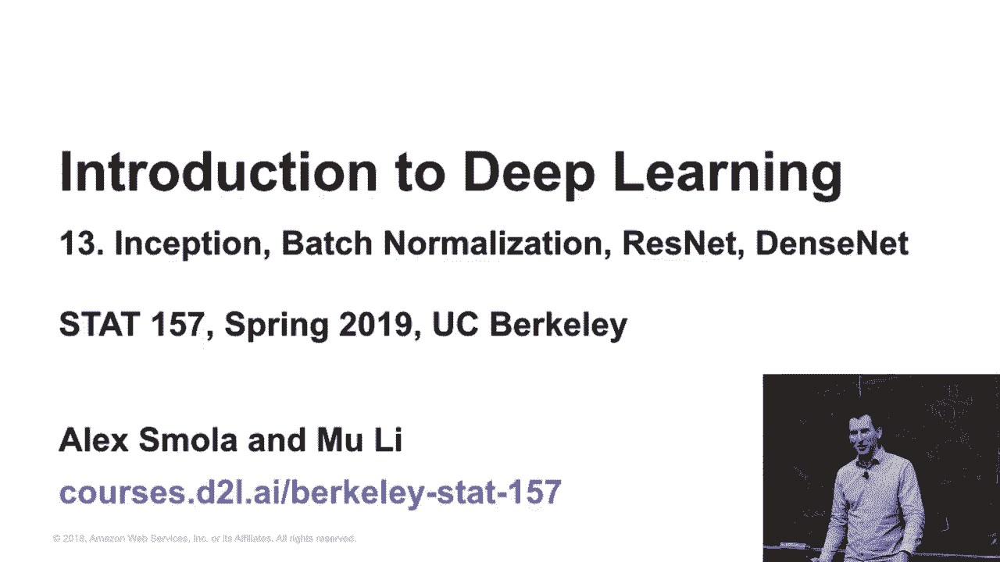

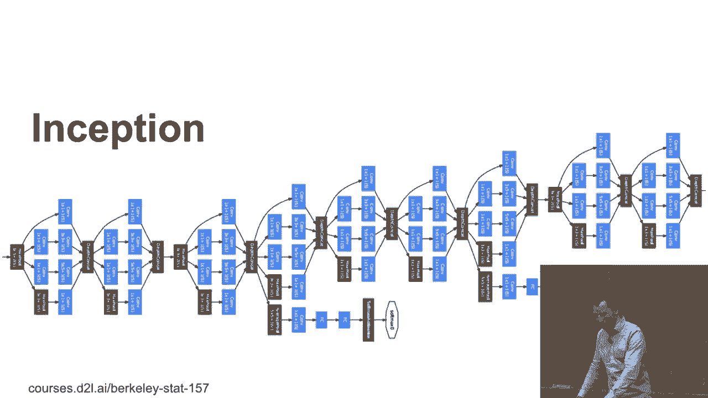

在本节课中，我们将深入学习卷积神经网络发展史上的一个重要里程碑——Inception网络（也称GoogLeNet）。我们将从它要解决的问题出发，逐步解析其核心的Inception模块设计思想、网络整体架构，以及后续的改进版本。通过本教程，你将理解如何通过巧妙的模块设计来平衡网络的表达能力和计算效率。

---

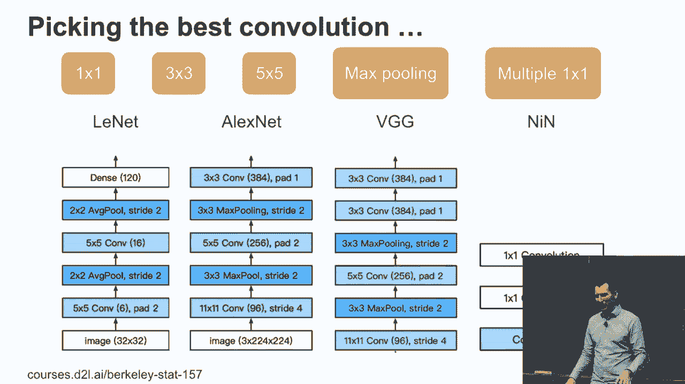

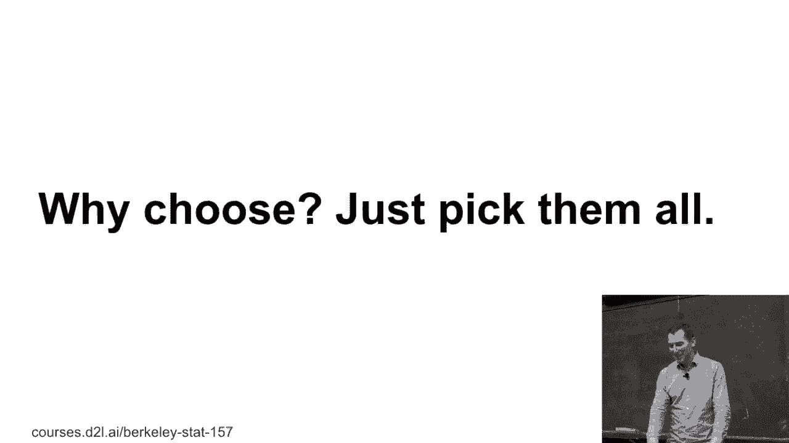

## 回顾与问题引入 🤔

上一节我们介绍了多种卷积核尺寸（如1x1, 3x3, 5x5）在不同网络（如AlexNet, VGG, NIN）中的应用。面对如此多的选择，设计者面临一个难题：**到底应该使用哪种卷积操作？**

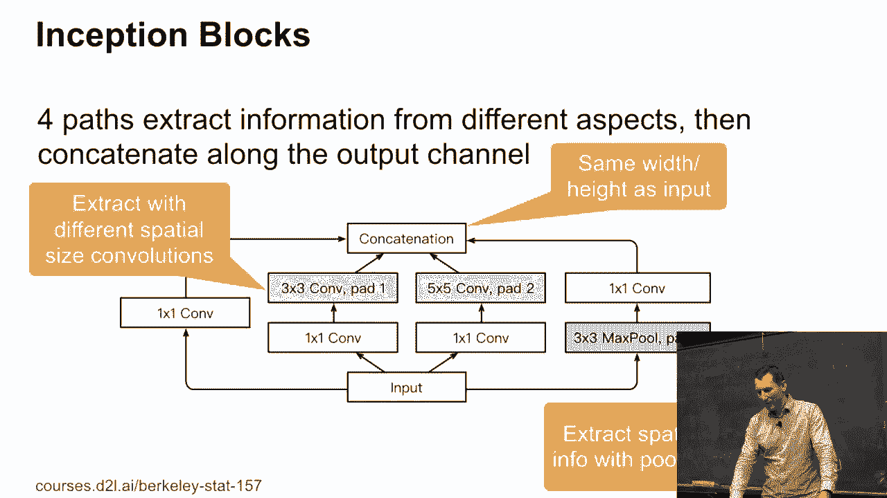

*   **大卷积核（如5x5）**：参数多，计算量大，但可能捕捉更长距离的特征。
*   **小卷积核（如1x1或3x3）**：参数少，计算高效，但表达能力可能受限。

那么，有没有一种方法可以兼得鱼与熊掌呢？

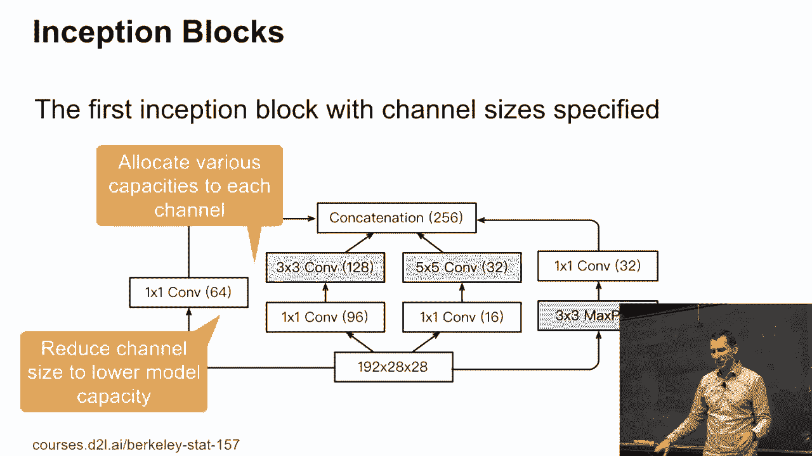

## Inception模块：小孩子才做选择，我全都要！ 🎯

Inception网络的核心思想非常简单：**既然无法决定哪种卷积最好，那就把所有可能都用上**。这个“用上所有可能”的构建块，就叫做Inception模块。

以下是Inception模块的典型结构，它并行执行四种操作：

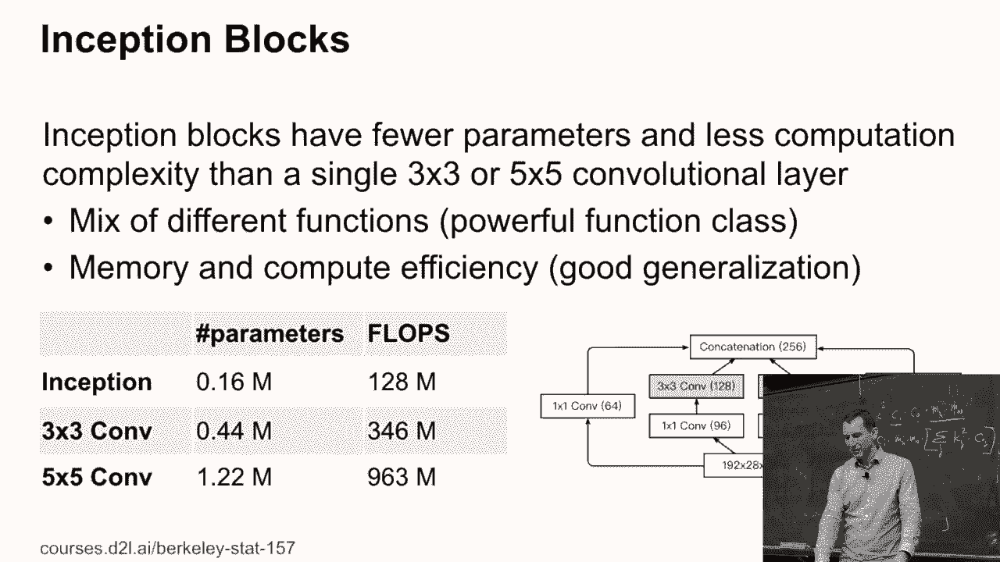

1.  **1x1卷积**：用于跨通道的信息整合与降维。
2.  **1x1卷积 + 3x3卷积**：先降维，再进行3x3的空间特征提取。
3.  **1x1卷积 + 5x5卷积**：先降维，再进行5x5的空间特征提取。
4.  **3x3最大池化 + 1x1卷积**：先进行下采样，再通过1x1卷积调整通道数。

```python
# Inception模块的简化伪代码描述
def inception_block(x):
    path1 = Conv2D(filters=64, kernel_size=1, padding='same')(x)

    path2 = Conv2D(filters=96, kernel_size=1, padding='same')(x)
    path2 = Conv2D(filters=128, kernel_size=3, padding='same')(path2)

    path3 = Conv2D(filters=16, kernel_size=1, padding='same')(x)
    path3 = Conv2D(filters=32, kernel_size=5, padding='same')(path3)

    path4 = MaxPool2D(pool_size=3, strides=1, padding='same')(x)
    path4 = Conv2D(filters=32, kernel_size=1, padding='same')(path4)

    # 在通道维度上拼接所有路径的输出
    output = concatenate([path1, path2, path3, path4], axis=-1)
    return output
```

**关键设计点**：
*   所有并行路径都使用合适的填充（`padding='same'`），确保输出特征图的空间尺寸（高和宽）与输入相同。
*   各路径的输出通道数经过精心设计（例如第一条路64通道，第二条路128通道等），最后在通道维度上进行拼接。
*   在5x5卷积前使用1x1卷积进行降维，是控制参数量的关键技巧。其参数量计算公式为：
    **`参数 ≈ (输入通道数 * 1*1 * 降维后通道数) + (降维后通道数 * 5*5 * 输出通道数)`**
    这通常远小于直接进行5x5卷积的参数量：**`输入通道数 * 5*5 * 输出通道数`**。

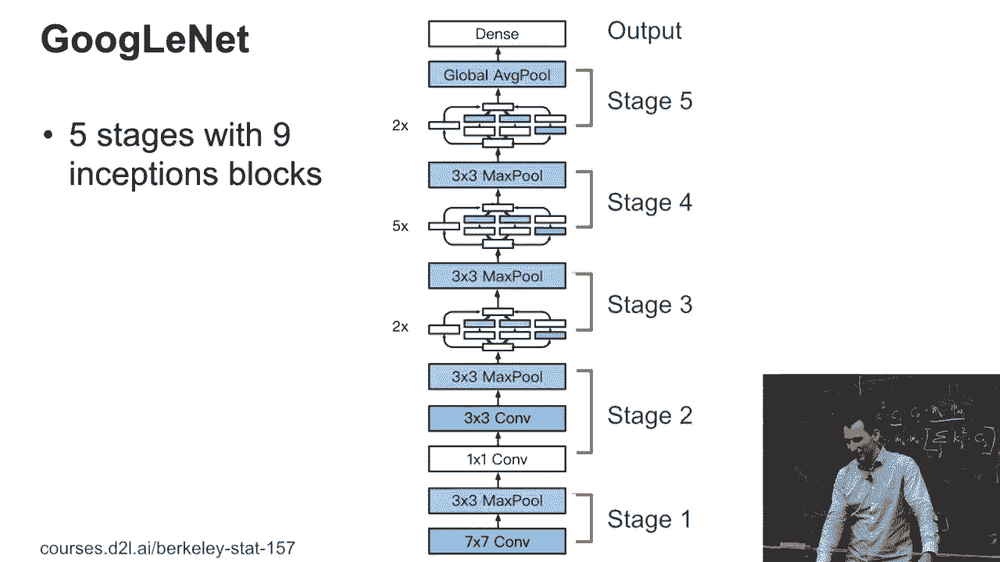

这种设计的优势在于，网络可以自动学习在哪些通道上使用哪种特征提取方式更有效，用相对较少的参数和计算量，获得了强大的特征表示能力。

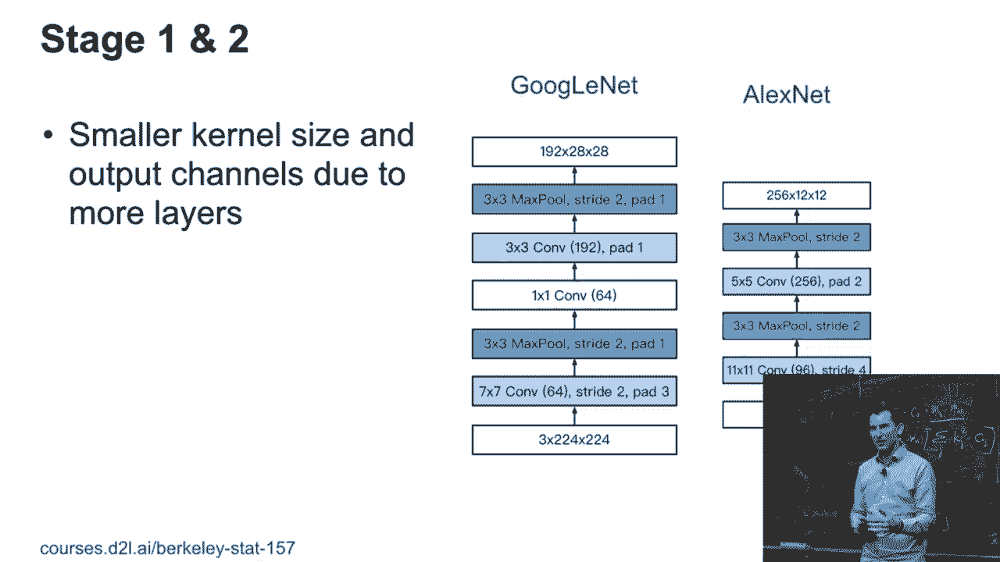

## GoogLeNet 整体架构 🏗️

理解了核心模块后，我们来看看完整的GoogLeNet网络是如何组织的。整个网络可以分为五个主要阶段。

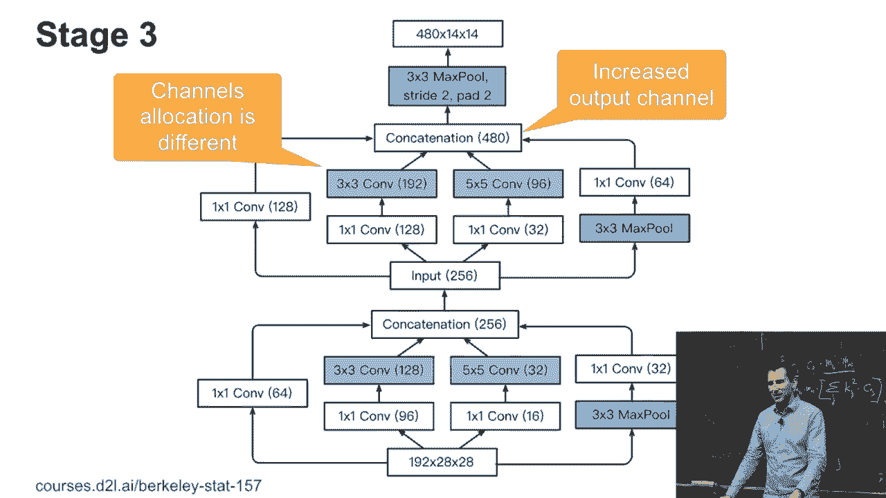

**第一阶段与第二阶段**：与传统CNN类似，以卷积和池化操作进行初步特征提取和下采样。
*   使用7x7大卷积核起步。
*   穿插1x1卷积和3x3卷积。
*   通过最大池化降低分辨率。

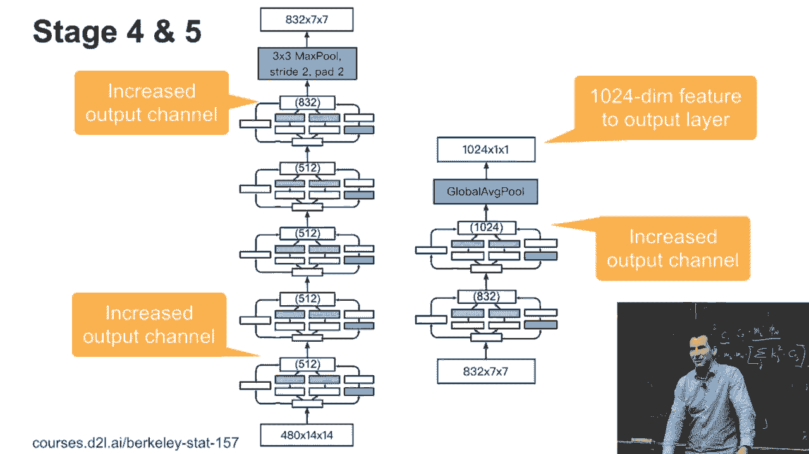

**第三、四、五阶段**：这些是网络的主体，由多个Inception模块堆叠而成。
*   在进入第三阶段前，分辨率已从224x224降至28x28。
*   每个阶段内部，先堆叠多个Inception模块增加网络深度和表达能力，然后通过一个3x3最大池化操作将分辨率减半（例如从28x28到14x14），同时通道数显著增加。
*   这种“模块堆叠 -> 下采样”的模式重复进行。

**分类头**：网络最后采用“全局平均池化层”接“全连接层”的方式输出分类结果。全局平均池化将每个通道的所有像素值取平均，大大减少了参数，并有一定抗过拟合作用。

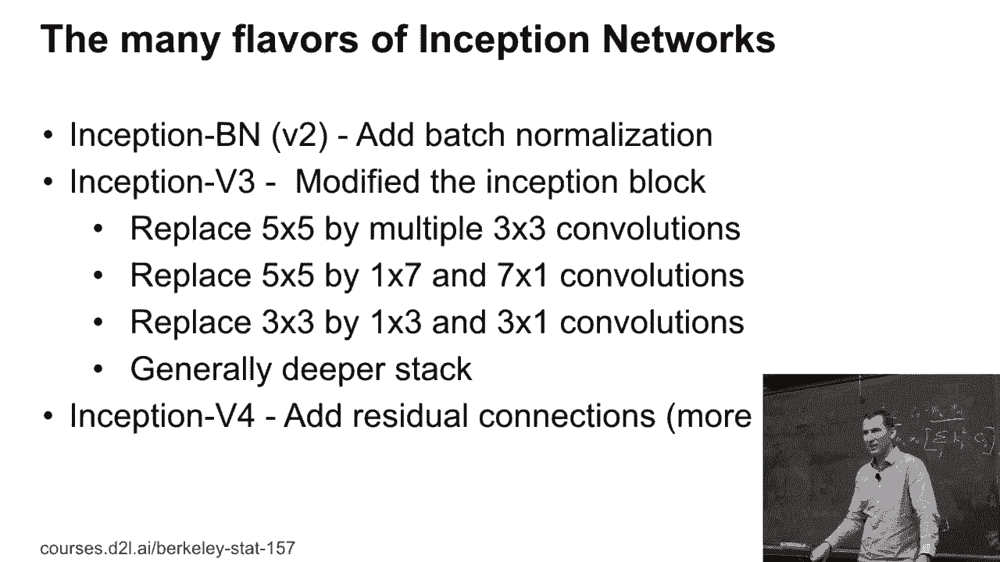

> **过渡**：原始的Inception V1（GoogLeNet）取得了巨大成功，但研究者们并未止步。接下来，我们看看后续版本如何对这个基础设计进行优化。

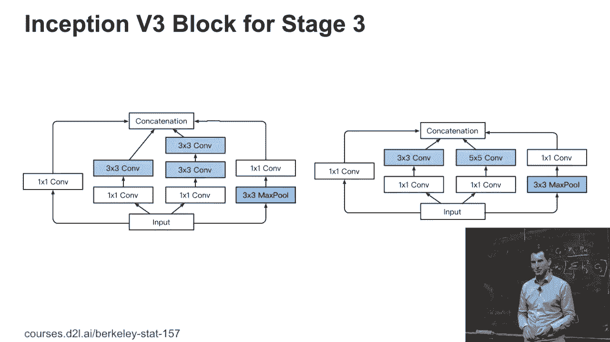

## Inception 家族的进化 🚀

**Inception V2/V3**：主要引入了两大改进。
1.  **用连续小卷积核替代大卷积核**：将5x5卷积替换为两个连续的3x3卷积。这在不增加感受野的情况下，增加了非线性，并且参数量更少（2个3x3: 9+9=18 < 1个5x5: 25）。
2.  **引入非对称卷积**：将nxn卷积拆分为1xn和nx1卷积的串联（例如将7x7拆为1x7和7x1）。这进一步减少了参数量，并可能捕捉到某些方向性更强的特征。

**Inception V4**：借鉴了ResNet（残差网络）的思想，将跳跃连接（Shortcut Connection）引入Inception模块，形成了Inception-ResNet结构，使得训练更深的网络成为可能。

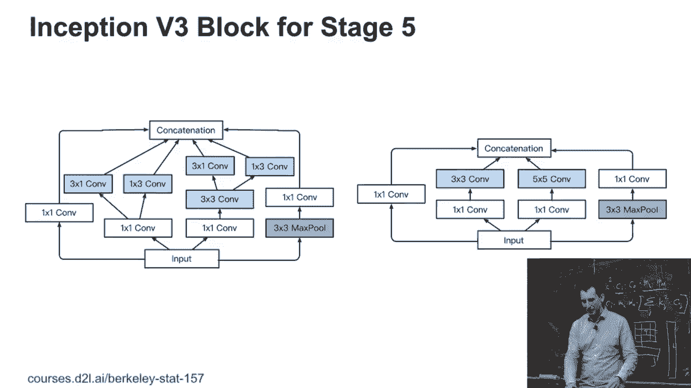

## 模型效率与部署实践 ⚙️

在实际应用中，我们不仅关心模型的准确率，也关心其**计算速度（吞吐量）**和**内存占用**。研究显示，通过以下技术可以在精度损失很小的情况下大幅提升效率：

*   **模型压缩**：如知识蒸馏。
*   **降低数值精度**：
    *   从32位浮点数（FP32）降至16位浮点数（FP16），在支持Tensor Core的GPU上可获得数倍加速。
    *   进一步降至8位整数（INT8），能再次显著提升速度，这对移动端和嵌入式部署至关重要。

在选择模型时，需要在准确率与推理速度之间进行权衡，找到最适合应用场景的平衡点。

---

## 总结 📚

本节课我们一起学习了Inception网络的核心思想与架构。

1.  **核心问题**：通过Inception模块，创造性地解决了卷积核尺寸选择困难的问题，采用“并行多路径”结构融合不同尺度的特征。
2.  **关键技巧**：大量使用1x1卷积进行降维和升维，有效控制了模块的参数量和计算复杂度。
3.  **网络结构**：GoogLeNet整体由传统的浅层特征提取器与深层的Inception模块堆叠构成，并通过阶段性池化降低分辨率。
4.  **持续进化**：后续的V2、V3、V4版本通过**分解卷积**、**引入非对称卷积**和**融合残差连接**等方式，持续提升性能与效率。
5.  **实践考量**：模型最终需要服务于实际应用，因此平衡精度、速度与资源消耗至关重要，数值精度降低是常用的部署优化手段。

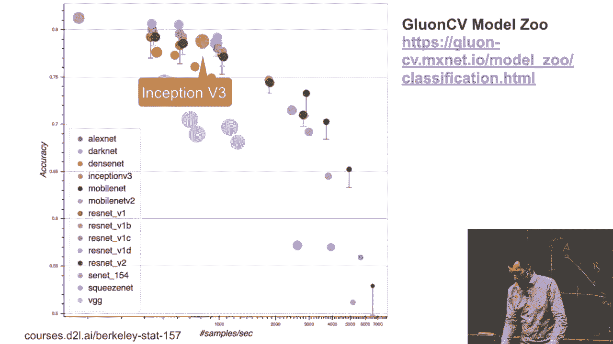

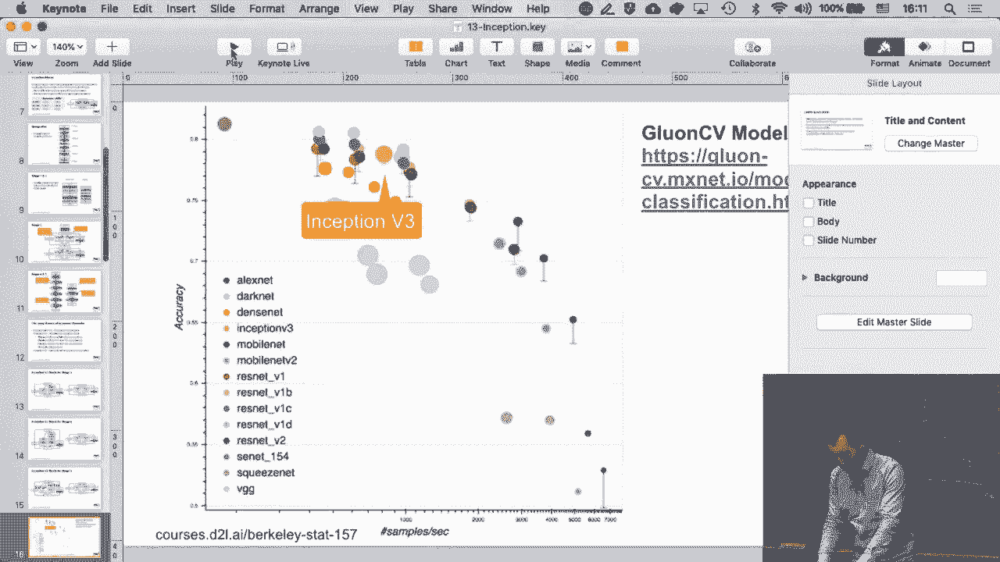

Inception网络的设计哲学对后续的神经网络架构产生了深远影响，其“网络内部结构多样化”和“高效计算”的理念至今仍被广泛借鉴。