# 69：L13_2 Python中的Inception 🧠

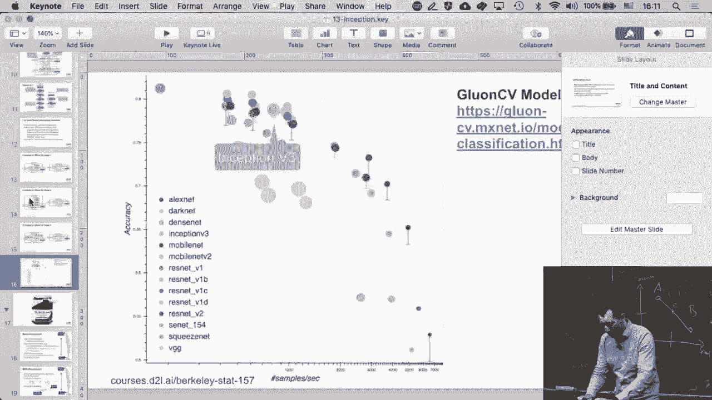

在本节课中，我们将学习如何在Python中实现一个Inception网络模块。我们将从理解Inception块的基本结构开始，逐步构建一个完整的网络，并观察其在实际数据集上的运行效果。

## 概述

Inception网络的核心思想是并行处理。与传统的顺序堆叠卷积层不同，Inception块在同一层内并行地应用多种尺寸的卷积核和池化操作，然后将结果拼接起来。这允许网络在同一层级捕获不同尺度的特征。

## 实现基础Inception块

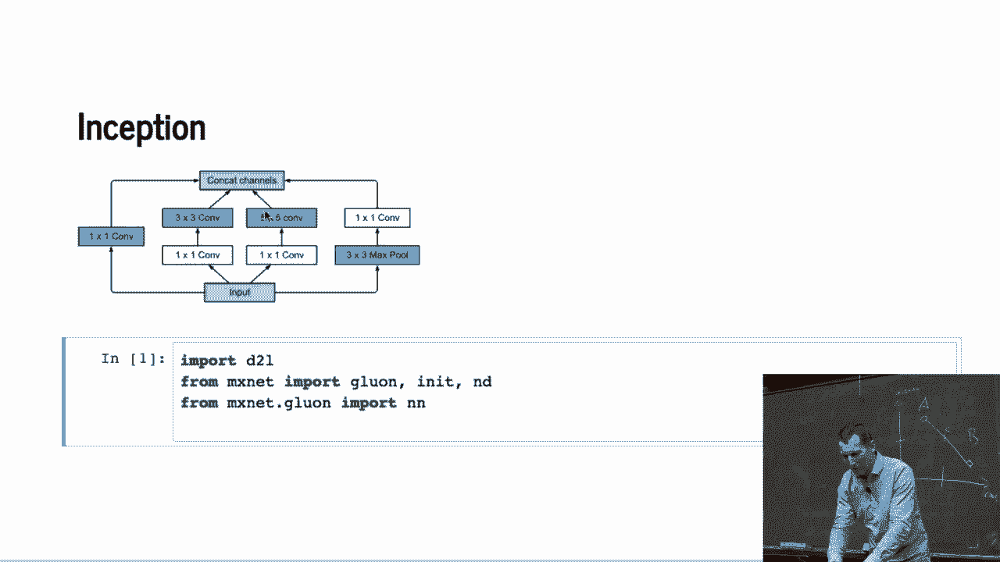

上一节我们介绍了Inception网络的概念，本节中我们来看看如何用代码实现一个基础的Inception块。

首先，我们需要初始化Inception块中的四条并行路径。每条路径负责不同尺寸的特征提取。

以下是四条路径的组件定义：

*   **路径一**：一个1×1的卷积层。
*   **路径二**：一个1×1的卷积层，后接一个3×3的卷积层。
*   **路径三**：一个1×1的卷积层，后接一个5×5的卷积层（需配合适当的填充）。
*   **路径四**：一个最大池化层，后接一个1×1的卷积层。

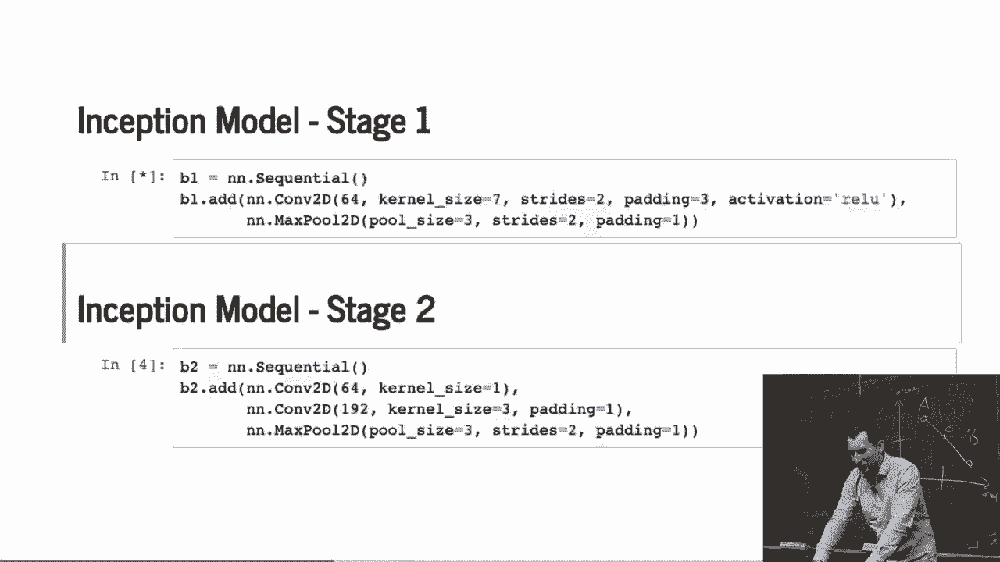

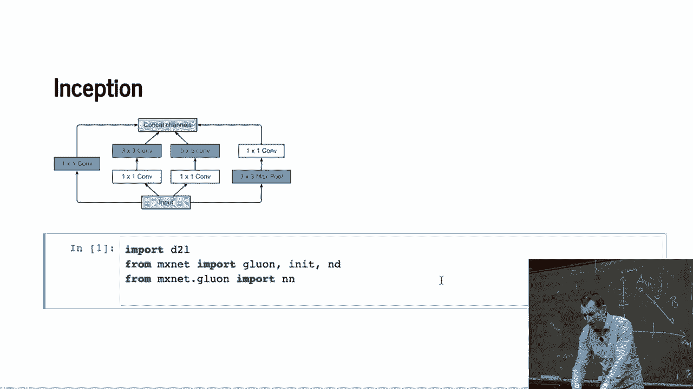

这些路径的输出通道数由参数 `c1`、`c2`、`c3`、`c4` 控制。

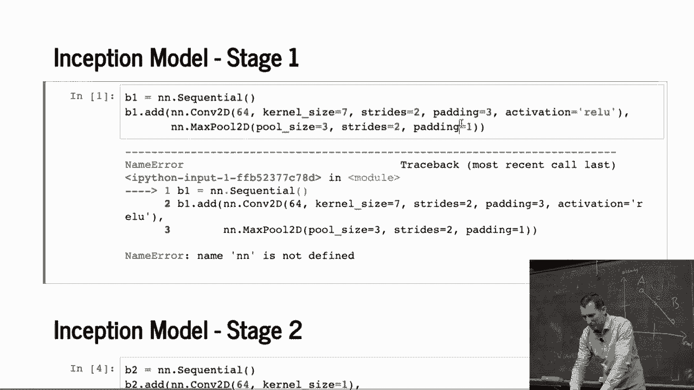

接下来，我们分别对输入数据应用这四条路径的操作。

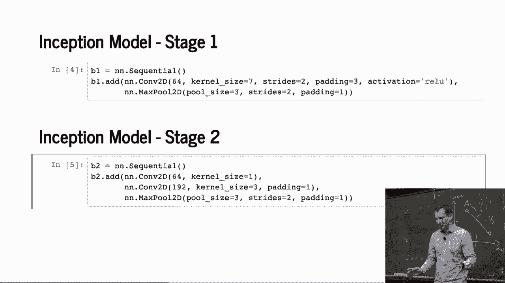

```python
# 伪代码示意
p1 = conv1x1(x)          # 路径一
p2 = conv3x3(conv1x1(x)) # 路径二
p3 = conv5x5(conv1x1(x)) # 路径三
p4 = conv1x1(maxpool(x)) # 路径四
```

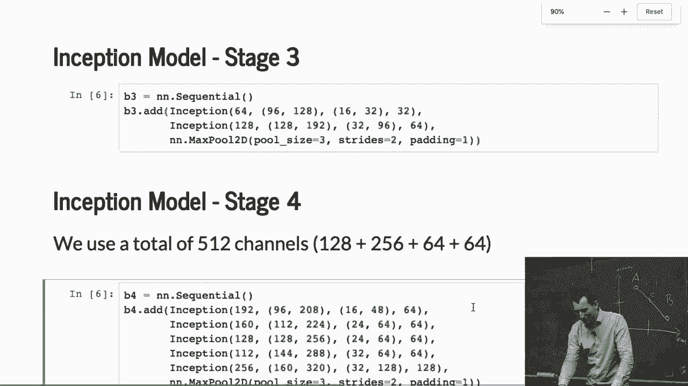

最后，我们将四条路径的输出在通道维度（dimension 1）上进行拼接。

```python
output = torch.cat([p1, p2, p3, p4], dim=1)
```

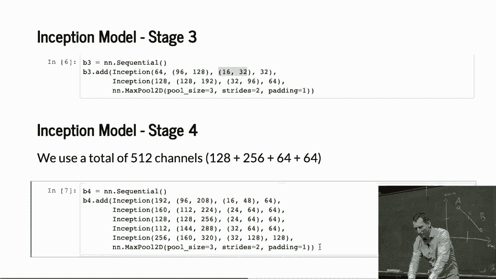

这样，我们就得到了一个基础的Inception块。修改其架构（如调整卷积核大小或通道数）也非常容易。

## 构建完整的Inception网络

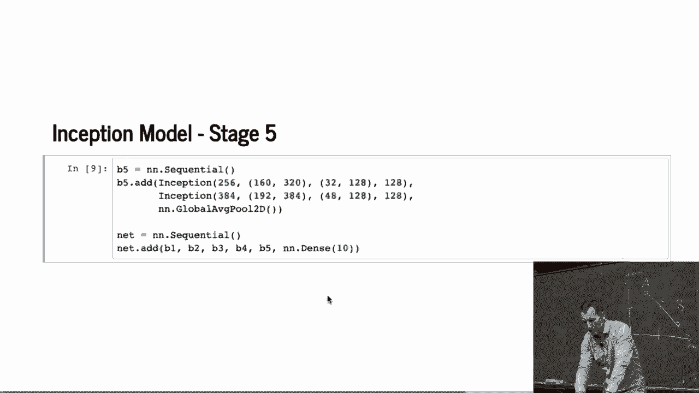

现在我们已经有了Inception块，接下来需要将它们组合成一个完整的网络。网络通常由多个阶段组成，每个阶段可能包含卷积层、Inception块和池化层。

以下是构建网络各阶段的步骤：

*   **第一阶段**：标准的卷积层和最大池化层，用于初步提取特征并降低空间维度。
*   **第二阶段**：更多的卷积层和另一个最大池化层，进一步减少维度。
*   **第三阶段**：堆叠两个Inception块，然后进行最大池化。
*   **第四阶段**：堆叠更多的Inception块，通道数会显著增加。
*   **第五阶段**：最后两个Inception块，后接全局平均池化层和一个输出维度为10（对应10个类别）的全连接层。

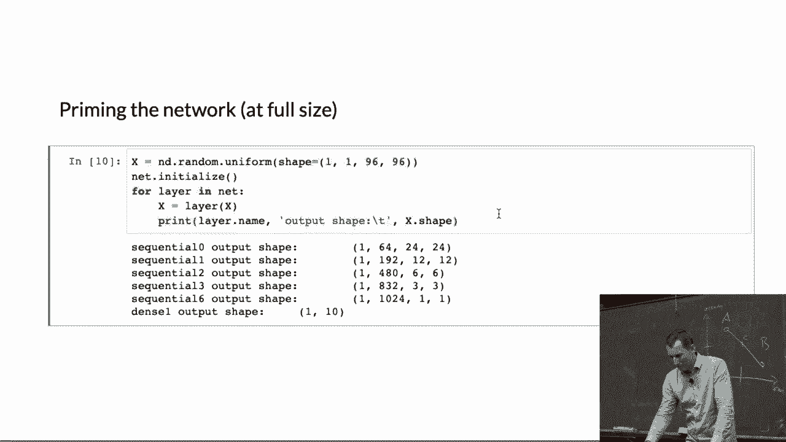

整个网络从输入图像（例如96x96像素）开始，经过层层处理，最终空间维度降至1x1，输出分类结果。

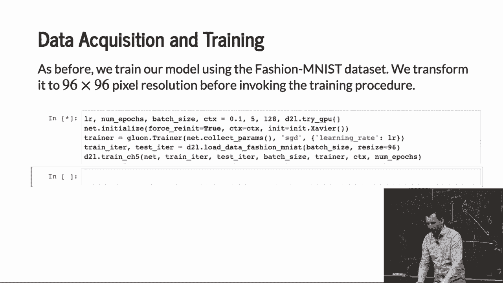

## 训练网络与注意事项

网络架构定义完成后，我们就可以开始训练了。训练代码与我们之前使用过的标准流程相同。

在开始训练前，必须对网络参数进行初始化。这里有一个重要的注意事项：使用 `reset_parameters()` 等方法重新初始化时，只会重置参数的值，而不会改变网络结构所绑定的输入维度。

这意味着，如果你的网络最初是为64x64图像设计的，重新初始化后也无法直接处理128x128的图像。要改变输入尺寸，需要重新设计并实例化整个网络架构。这是因为网络无法自动推断和重新实例化由用户定义的维度。

在本例中，我们使用Fashion-MNIST数据集（黑白图像）在GPU上进行训练。经过训练，模型可以达到约88%的准确率（约12%的错误率），这是一个不错的结果。

## 总结

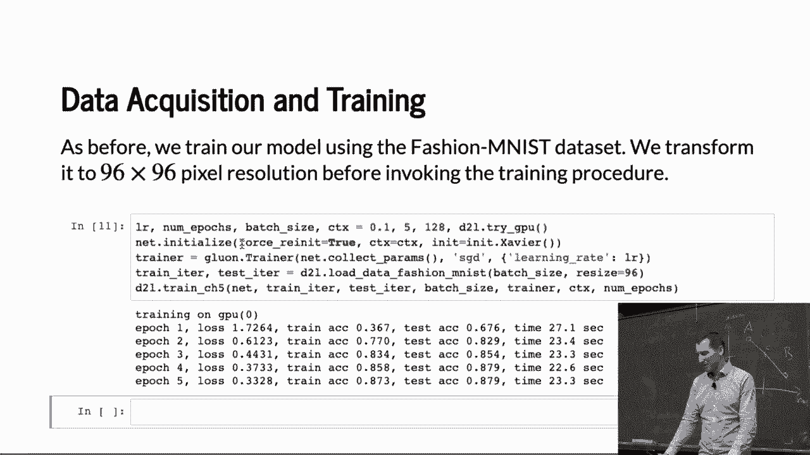

本节课中我们一起学习了如何在Python中实现Inception网络。我们从构建基础的Inception块开始，它通过并行组合不同尺寸的卷积和池化操作来丰富特征表达。接着，我们将多个Inception块与其他层结合，构建了一个完整的网络架构。最后，我们讨论了网络训练流程和一个关键的实践注意事项：参数重新初始化不会改变网络预设的输入维度。通过实际运行，我们验证了该模型在图像分类任务上的有效性。