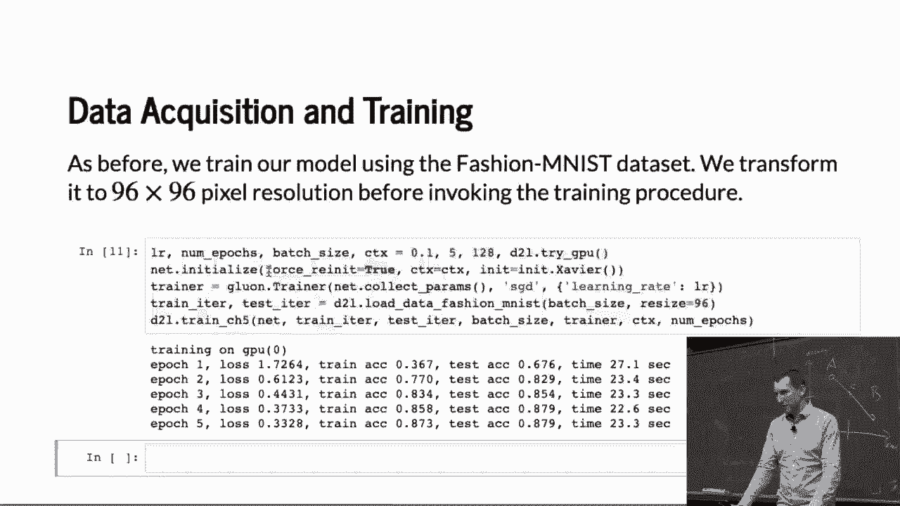
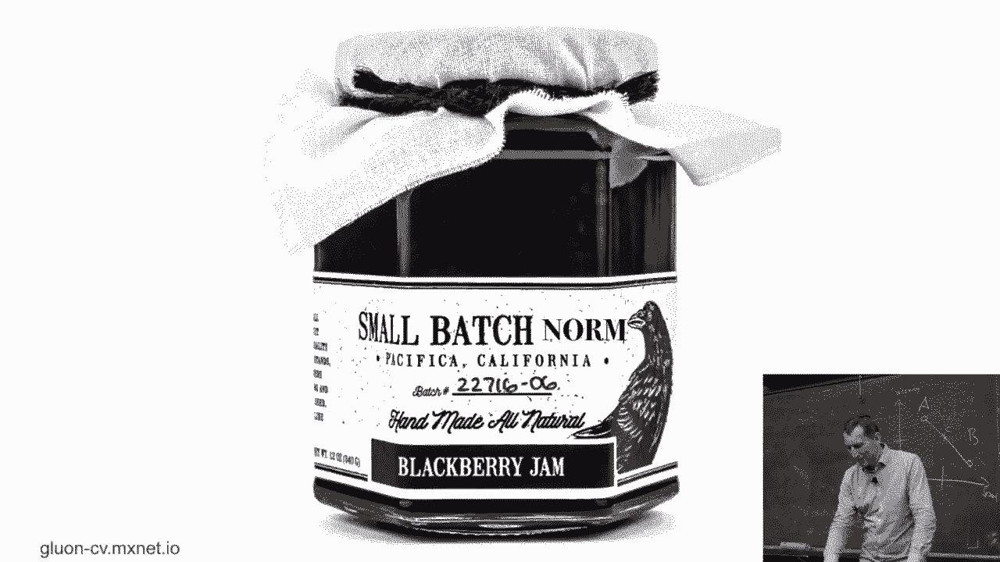
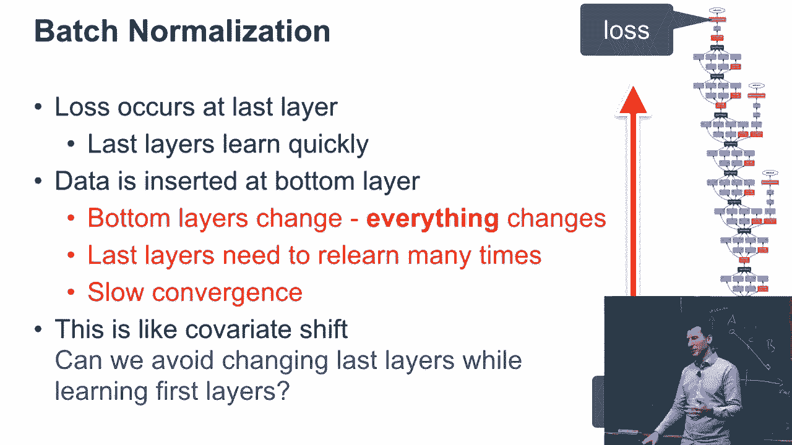
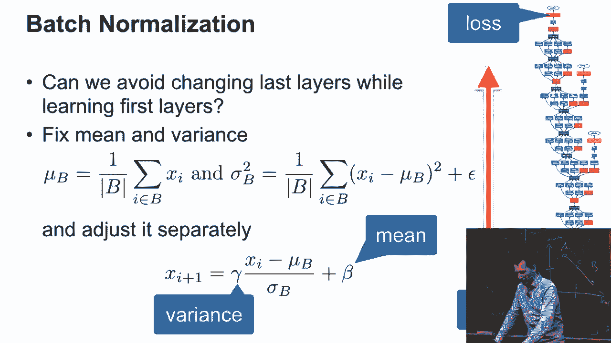
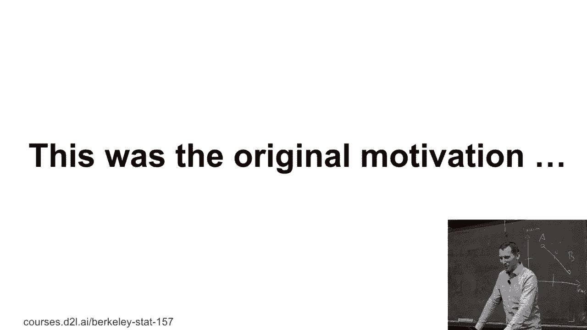
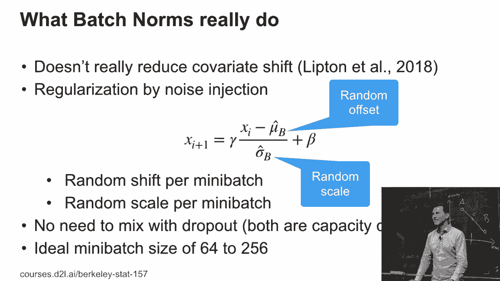
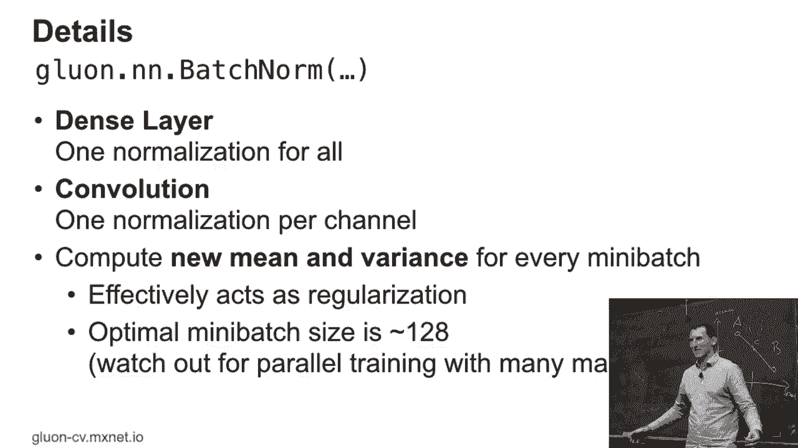
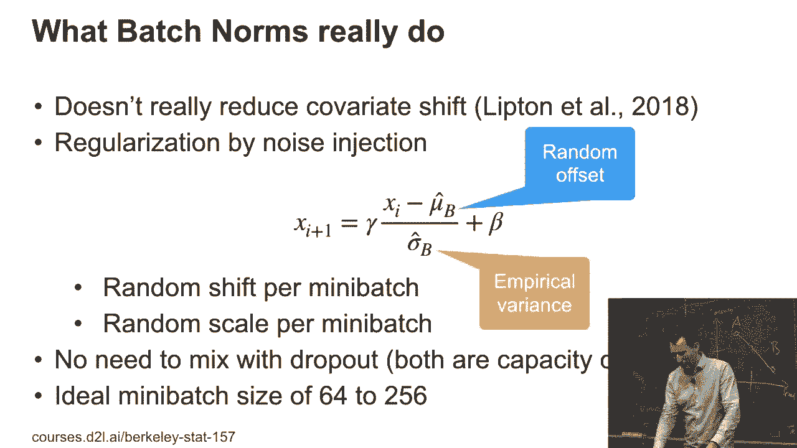
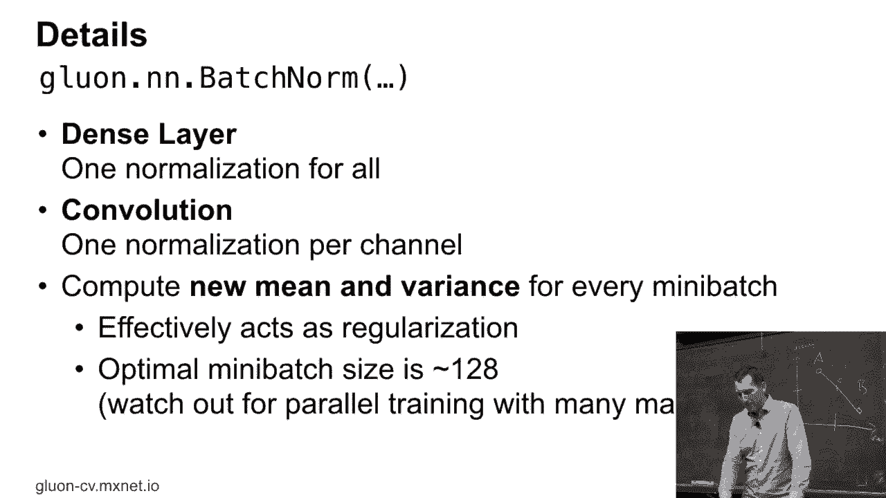

# 70：L13_3 批量归一化 🧠

在本节课中，我们将要学习深度学习中一个非常重要的技术——批量归一化。我们将了解它的原始动机、工作原理、实际效果以及实现时的关键细节。

## 概述 📋

批量归一化最初是为了解决深度神经网络训练中的“内部协变量偏移”问题而提出的。它通过对每一层的输入进行归一化处理，旨在加速网络的训练过程并提升模型的稳定性。

## 批量归一化的原始动机 🎯

上一节我们介绍了批量归一化的目标。本节中我们来看看它最初是如何被构思出来的。

在训练一个非常庞大且深的网络（如Inception网络）时，梯度需要从网络的顶层向底层反向传播。顶层会首先开始适应并拟合标签，然后其下一层也会开始适应，以此类推，形成一个级联的适应过程。

这里的问题是，当上层参数更新后，其输出的特征分布会发生变化。这意味着，对于已经适应得不错的最后一层来说，它现在必须重新适应来自上一层的新输入分布。这个过程会使得整个网络的训练变得非常缓慢。

当时的推理是，如果能稳定每一层输入的分布，让训练信号更顺畅地传播，就能帮助网络更好地收敛。这听起来与我们之前了解的某些预处理技术（如对输入数据进行归一化）有相似之处。

## 批量归一化的基本思想 💡

基于上述动机，批量归一化的核心思想是：在训练时，对每一层的输入进行修正，将其归一化到一个固定的均值和方差。但为了避免限制网络的表达能力，我们并不完全固定它，而是引入一个可学习的仿射变换。

仿射变换包含两个可学习的参数：缩放系数 **γ** 和偏移系数 **β**。具体操作如下：对于一个批次中的数据，我们计算其均值 **μ** 和方差 **σ²**，然后对每个样本 **xᵢ** 进行归一化，最后应用缩放和偏移。

以下是其核心公式：

**BN(xᵢ) = γ * ( (xᵢ - μ) / σ ) + β**

其中，**μ** 和 **σ** 是在当前训练批次上计算得到的。

## 批量归一化的实际效果与理解 🔍

上一节我们介绍了批量归一化的基本操作。本节中我们来看看它实际是如何起作用的，这与最初的设想可能有所不同。

后续的研究（如Lipnidal的论文）发现，批量归一化实际上**并没有显著减少**所谓的“内部协变量偏移”，甚至有时会使问题变得更糟。然而，它确实能极大地提升训练速度和模型性能。

那么它为什么有效呢？一个关键的理解在于：**批量归一化实际上是一种通过噪声注入实现的正则化**。

*   我们在一个小批量（例如，包含64或128个样本）上计算均值和方差。
*   这个小批量统计量（**μ̂_B** 和 **σ̂_B**）是对整体数据统计的**有噪声估计**。
*   因此，每个批次的归一化过程，都相当于为激活值添加了一个随机的偏移和缩放噪声。

这种噪声注入起到了正则化的作用，有助于防止模型过拟合。这也解释了为什么在使用批量归一化后，通常可以**减少或省略Dropout层**，因为两者在控制模型容量方面有相似的效果。

## 实现的关键细节 ⚙️

理解了原理后，我们来看看在实现批量归一化时需要注意的几个关键点。

### 小批量大小的影响

批量归一化的效果对小批量大小非常敏感。
以下是不同批量大小的影响：
*   **批量过大**：均值和方差的估计过于稳定，噪声注入不足，正则化效果减弱。
*   **批量过小**：均值和方差的估计噪声过大，可能导致训练不稳定，难以收敛。
这一点在单GPU训练中需要注意，在**多GPU分布式训练**中则更为关键，因为需要合理地将大批次分割到各个GPU上。

### 测试阶段的处理

在训练时，我们使用当前批次的统计量。但在测试或推理时，我们无法获取批次统计量。
以下是测试时的做法：
*   可学习参数 **γ** 和 **β** 直接使用训练好的固定值。
*   对于均值 **μ** 和方差 **σ²**，我们使用在整个训练集上计算得到的**运行平均值**（Moving Average）来替代。我们将在后续的代码实现中详细看到这一点。

### 应用于不同网络层

批量归一化可以应用于不同类型的网络层，但具体操作稍有不同：
*   **全连接层**：对每个神经元的**所有激活值**进行归一化。
*   **卷积层**：对每个输出通道，在其对应的**所有空间位置（高和宽）和批次样本**上计算均值和方差，即每个通道有自己独立的 **γ** 和 **β**。

## 总结 🏁

本节课中我们一起学习了批量归一化技术。我们首先了解了它为解决深度网络训练困难而提出的原始动机。然后，我们深入探讨了其基本思想，即通过可学习的仿射变换对层输入进行归一化。更重要的是，我们认识到其实际效果源于**噪声注入带来的正则化**作用。最后，我们讨论了实现中的关键细节，包括小批量大小的影响、测试阶段的处理方式以及在不同网络层中的应用方法。掌握批量归一化对于理解和构建现代深度神经网络至关重要。