# 71：Python中的批量归一化 🧠

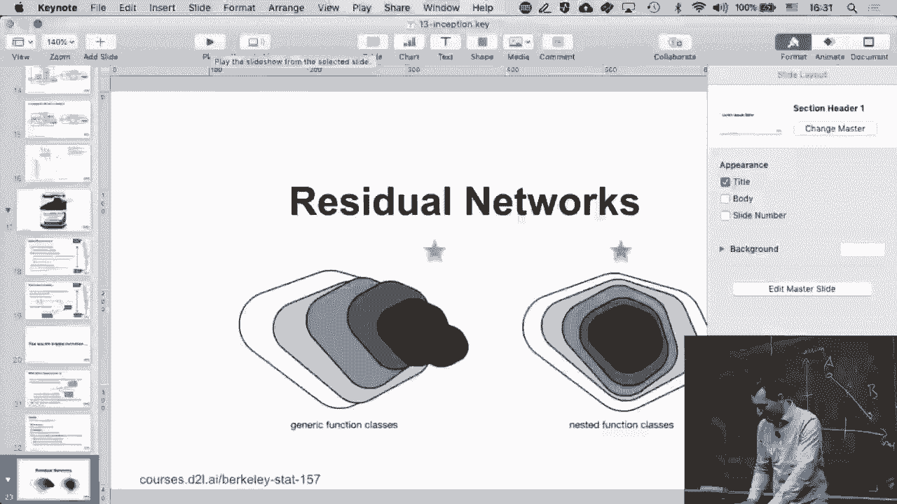

在本节课中，我们将学习如何在Python中实现批量归一化（Batch Normalization）。这是一种用于深度神经网络的技术，可以加速训练过程并提高模型性能。我们将从理解其核心概念开始，然后逐步实现一个批量归一化层，并将其集成到一个简单的神经网络中。

---

## 批量归一化的定义与原理

批量归一化的核心思想是对神经网络每一层的输入进行归一化处理，使其均值为0，方差为1。这有助于缓解训练过程中的内部协变量偏移问题，使网络更稳定、更快地收敛。

其基本公式如下：

对于给定的小批量数据 `x`，我们计算其均值 `μ` 和方差 `σ²`：

`μ = mean(x)`
`σ² = variance(x)`

然后对 `x` 进行归一化：

`x_hat = (x - μ) / sqrt(σ² + ε)`

其中 `ε` 是一个很小的常数，用于防止除以零。

最后，引入可学习的缩放参数 `γ` 和平移参数 `β`，得到输出：

`y = γ * x_hat + β`

在训练阶段，我们使用当前小批量的统计量（均值和方差）。同时，我们会计算并更新一个“移动平均”的均值和方差，这个移动平均值将在推理（测试）阶段使用。

---

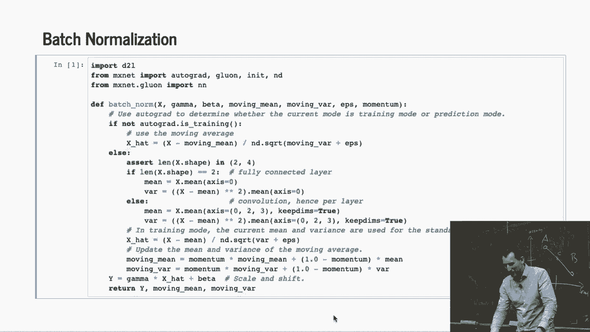

## 判断训练模式

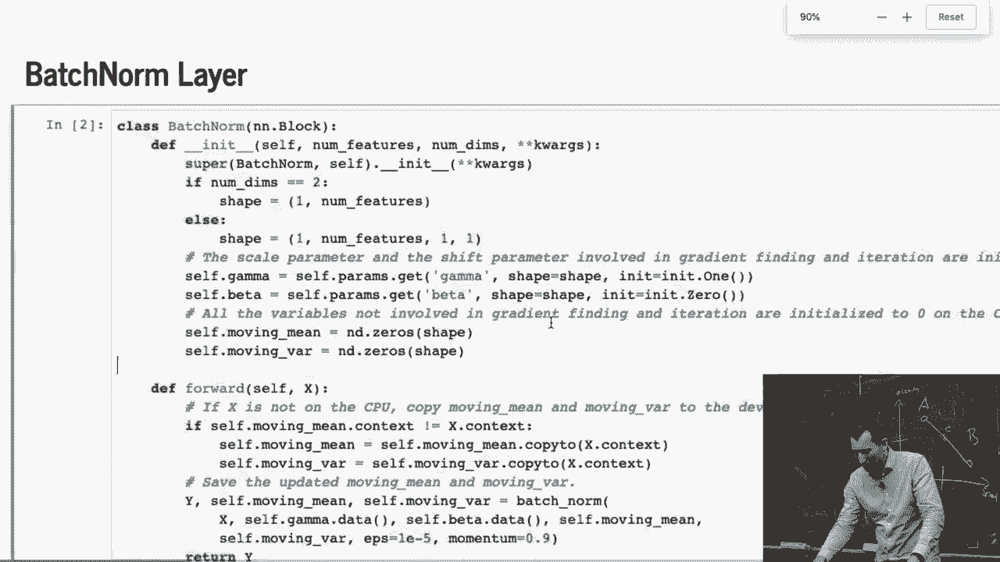

在实现批量归一化时，一个关键步骤是判断当前是处于训练模式还是推理模式。一个简单的方法是检查是否启用了自动求导（autograd），因为我们通常只在训练阶段使用它。

```python
# 判断是否在训练模式
training = torch.is_grad_enabled()
```

如果 `training` 为 `True`，则使用当前批次的统计量；如果为 `False`，则使用之前计算并存储的移动平均统计量。

---

## 处理不同网络结构

批量归一化需要适应不同的网络层，例如全连接层（MLP）和卷积层（CNN）。这两种层输入数据的维度不同。

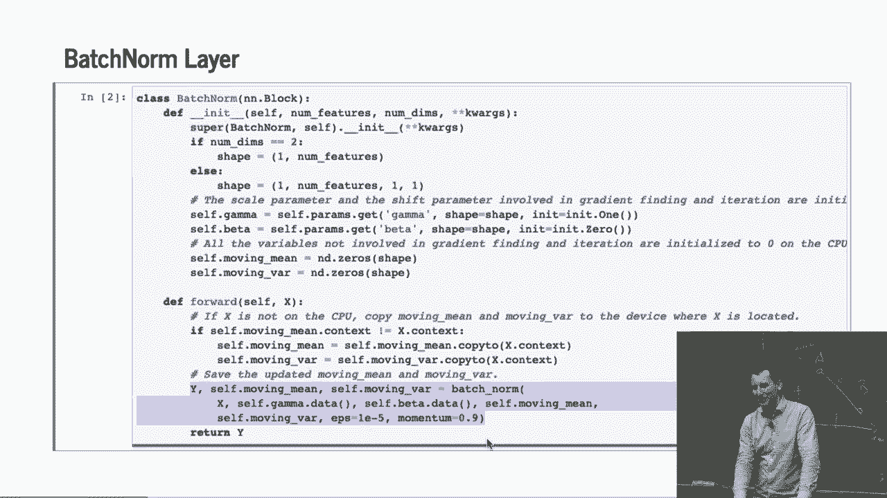

*   **对于全连接层（MLP）**：输入 `x` 的形状通常是 `[batch_size, num_features]`。我们需要在 `batch_size` 维度（即第0维）上计算均值和方差。
*   **对于卷积层（CNN）**：输入 `x` 的形状通常是 `[batch_size, channels, height, width]`。我们需要在 `batch_size`、`height` 和 `width` 维度（即第0、2、3维）上计算均值和方差，以保持通道间的独立性。

我们可以通过检查输入 `x` 的维度数量来区分这两种情况。

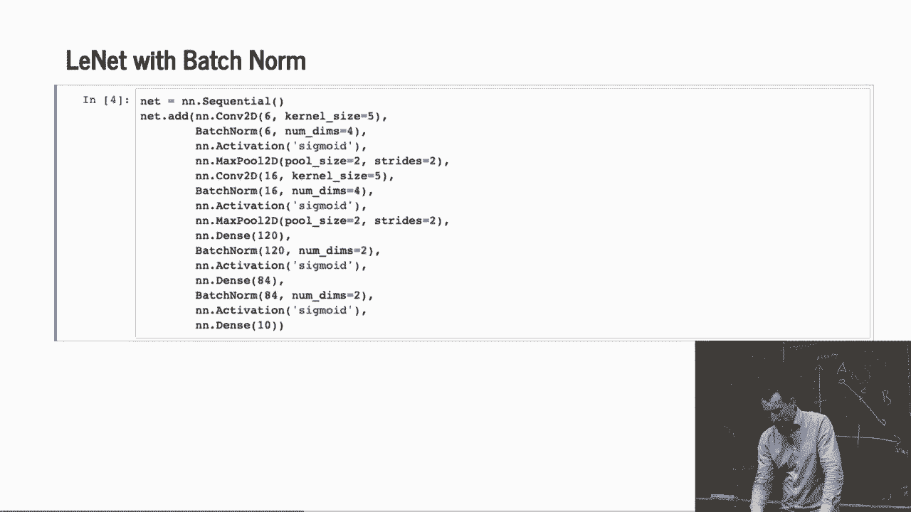

```python
if len(x.shape) == 2:  # MLP: [batch, features]
    # 在第0维计算均值和方差
    axes = 0
elif len(x.shape) == 4:  # CNN: [batch, channels, height, width]
    # 在第0, 2, 3维计算均值和方差
    axes = (0, 2, 3)
else:
    raise ValueError(f'期望输入维度为2或4，但得到了 {len(x.shape)}')
```

---

## 实现批量归一化层

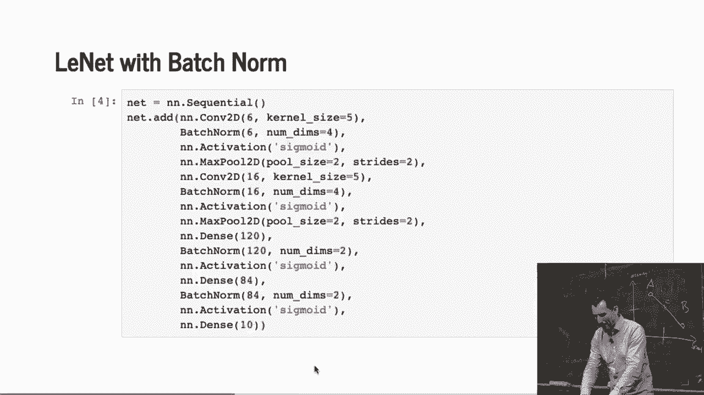

现在，我们将上述逻辑整合起来，定义一个完整的批量归一化层。

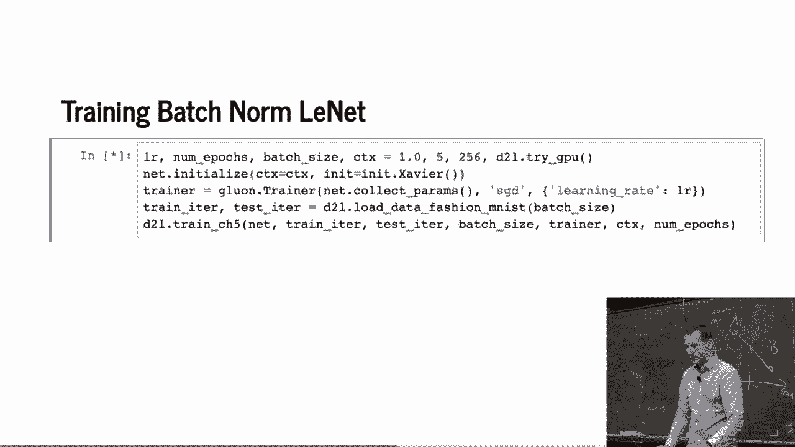

以下是实现一个批量归一化层的关键步骤：

1.  **初始化参数**：在 `__init__` 方法中，根据输入维度初始化可学习的参数 `γ`（缩放）和 `β`（平移），以及用于推理的移动平均统计量 `moving_mean` 和 `moving_var`。
2.  **前向传播**：在 `forward` 方法中，根据当前模式（训练/推理）执行不同的计算。
    *   **训练模式**：计算当前批次的均值和方差，更新移动平均，然后进行归一化和仿射变换。
    *   **推理模式**：直接使用存储的移动平均统计量进行归一化和仿射变换。

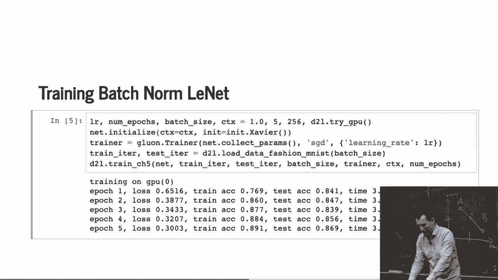

```python
import torch
from torch import nn

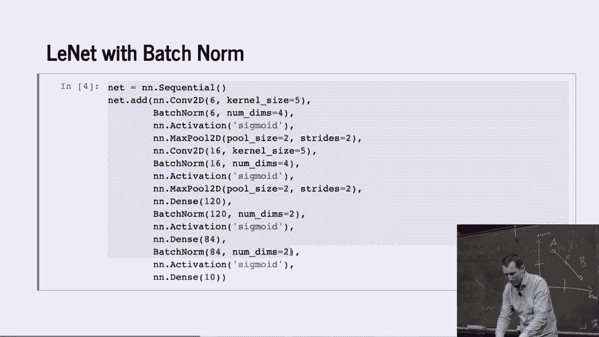

class BatchNorm(nn.Module):
    def __init__(self, num_features, num_dims):
        super().__init__()
        # 根据维度初始化参数形状
        if num_dims == 2:
            shape = (1, num_features) # MLP: [1, features]
        else:
            shape = (1, num_features, 1, 1) # CNN: [1, channels, 1, 1]

        # 可学习参数
        self.gamma = nn.Parameter(torch.ones(shape))
        self.beta = nn.Parameter(torch.zeros(shape))
        # 移动平均统计量（非可学习参数）
        self.moving_mean = torch.zeros(shape)
        self.moving_var = torch.ones(shape)

    def forward(self, x):
        # 确保参数与输入数据在同一设备上
        if self.moving_mean.device != x.device:
            self.moving_mean = self.moving_mean.to(x.device)
            self.moving_var = self.moving_var.to(x.device)

        # 判断模式
        if self.training:
            # 训练模式：计算当前批次统计量
            if x.dim() == 2: # MLP
                mean = x.mean(dim=0)
                var = ((x - mean) ** 2).mean(dim=0)
            else: # CNN
                mean = x.mean(dim=(0, 2, 3), keepdim=True)
                var = ((x - mean) ** 2).mean(dim=(0, 2, 3), keepdim=True)

            # 更新移动平均（简化版，通常使用动量）
            self.moving_mean = 0.9 * self.moving_mean + 0.1 * mean.detach()
            self.moving_var = 0.9 * self.moving_var + 0.1 * var.detach()
        else:
            # 推理模式：使用移动平均统计量
            mean = self.moving_mean
            var = self.moving_var

        # 归一化并应用仿射变换
        x_hat = (x - mean) / torch.sqrt(var + 1e-5)
        y = self.gamma * x_hat + self.beta
        return y
```

---

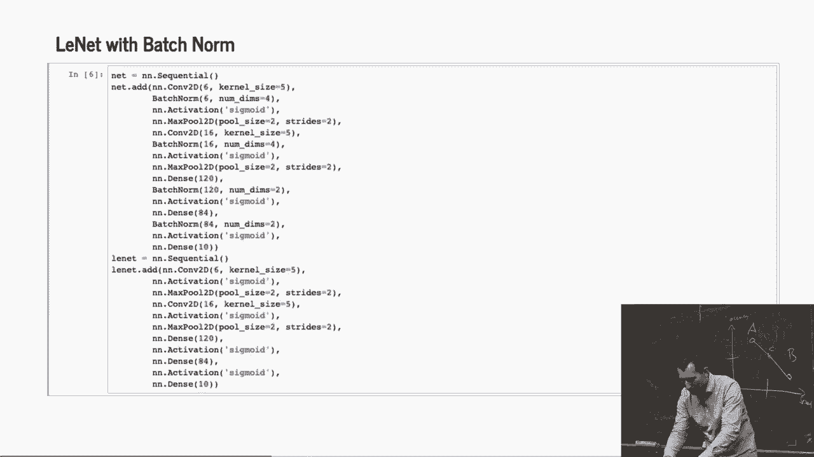

## 在神经网络中应用批量归一化

理解了批量归一化层的实现后，我们来看看如何将其应用到实际的神经网络中。通常，批量归一化层被放置在仿射变换（如线性层或卷积层）之后、激活函数之前。

我们将构建一个简单的多层感知机（MLP），并在每个隐藏层的激活函数前加入批量归一化。

```python
# 定义一个带有批量归一化的MLP
net = nn.Sequential(
    nn.Flatten(),
    nn.Linear(784, 256),
    BatchNorm(256, num_dims=2), # 添加批量归一化
    nn.ReLU(),
    nn.Linear(256, 10)
)
```

然后，我们可以像训练普通网络一样训练这个网络。实验表明，加入批量归一化后，网络通常能更快地达到更高的准确率。

---

## 与框架内置实现对比

虽然我们从零实现了批量归一化以加深理解，但在实际项目中，我们应优先使用深度学习框架（如PyTorch）提供的高效、稳定的内置实现。

PyTorch中的 `nn.BatchNorm1d`（用于MLP）和 `nn.BatchNorm2d`（用于CNN）就是为此设计的。它们会自动推断输入维度，并且经过高度优化，计算开销远小于我们的Python实现。

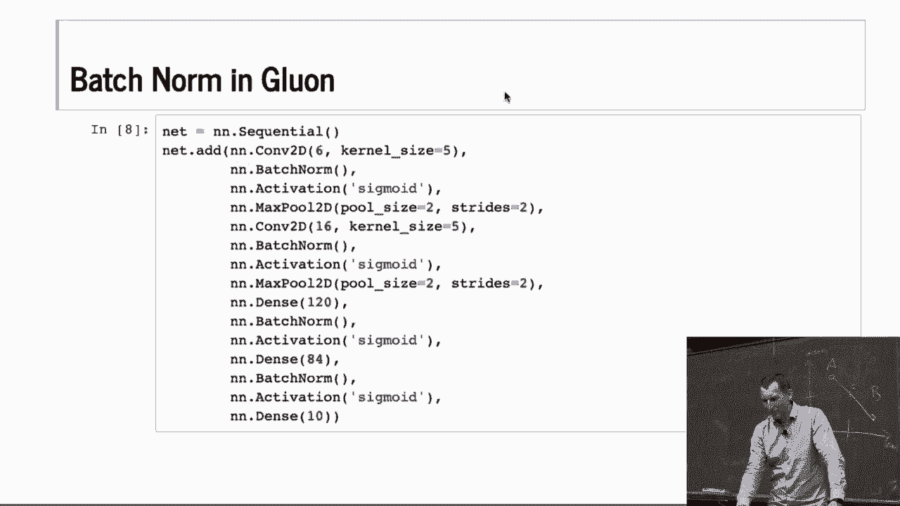

```python
# 使用PyTorch内置的批量归一化
net_builtin = nn.Sequential(
    nn.Flatten(),
    nn.Linear(784, 256),
    nn.BatchNorm1d(256), # 使用内置BatchNorm1d
    nn.ReLU(),
    nn.Linear(256, 10)
)
```

使用内置实现不仅能获得更好的性能，还能减少代码错误，是更推荐的做法。

---

## 总结

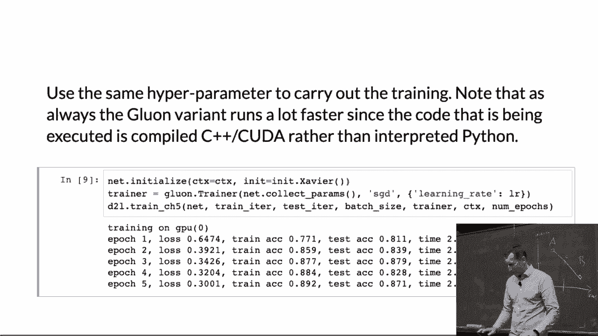

在本节课中，我们一起学习了批量归一化的原理与实现。我们首先了解了其通过归一化层输入来稳定训练的核心思想。接着，我们探讨了如何区分训练与推理模式，以及如何处理全连接层和卷积层等不同网络结构。然后，我们动手从零实现了一个批量归一化层，并将其集成到一个简单的神经网络中，观察到了其对训练速度和模型性能的积极影响。最后，我们对比了手动实现与PyTorch框架内置实现的差异，强调了在实际开发中使用高效、稳定内置模块的重要性。批量归一化是深度学习中一项基础且强大的技术，掌握它对于构建高效的神经网络至关重要。