# 72：L13_5 ResNet（残差网络）🚀

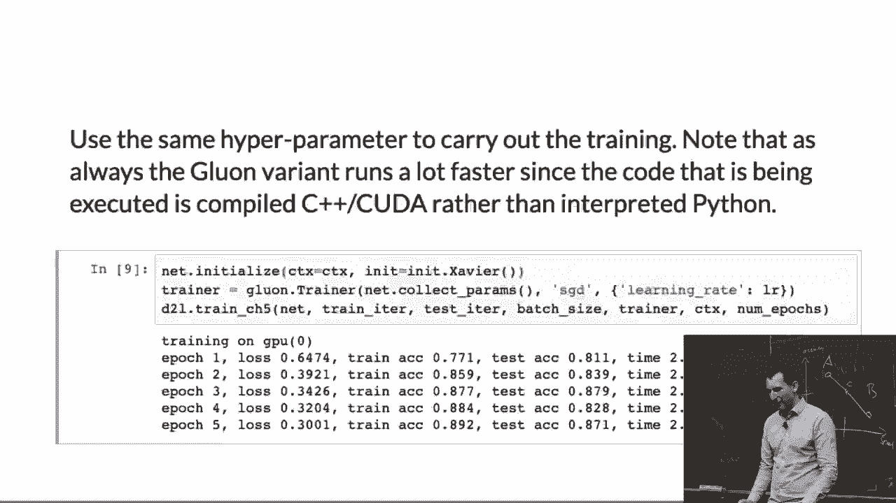

在本节课中，我们将要学习深度学习中一个里程碑式的架构——残差网络（ResNet）。我们将探讨它被提出的原因、其核心设计思想、具体实现方式以及后续的改进版本。

## 概述

ResNet 是一种非常成功的深度神经网络架构。如果你需要一个无需担忧、性能出色的现成网络，ResNet 通常是推荐选择之一。它之所以表现显著更好，源于一个巧妙的设计，解决了深度网络训练中的关键难题。

## 为什么需要 ResNet？🤔

假设我们有一个深度网络。为了让其能力更强，一个自然的想法是增加网络层数，使其更深。每增加一层，网络的函数表示能力（函数类）就会变得更大、更强大，但同时也与前一个函数类有所不同。

想象一下，我们的目标是逼近一个代表“真实情况”的蓝色星星。随着网络层数增加（函数类变大），我们可能先逐渐接近这个目标。但继续增加层数后，我们可能会再次远离目标，甚至无法保证最终能回到最佳逼近点。这使得我们难以通过工程化的方式决定网络应该有多深、多复杂。

理想的情况是拥有**嵌套的函数类**，即更大的函数类完全包含较小的函数类。这样，随着网络加深（函数类变大），我们至少能保证不丢失之前学到的较好解，从而稳定地逼近目标。然而，标准的深度网络通常不具备这种嵌套特性。ResNet 的核心目标，就是让深度网络的函数类更接近这种理想的嵌套结构。

## ResNet 的核心思想💡

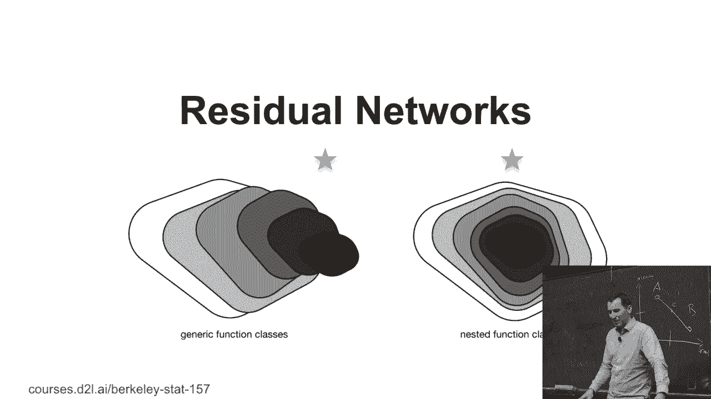

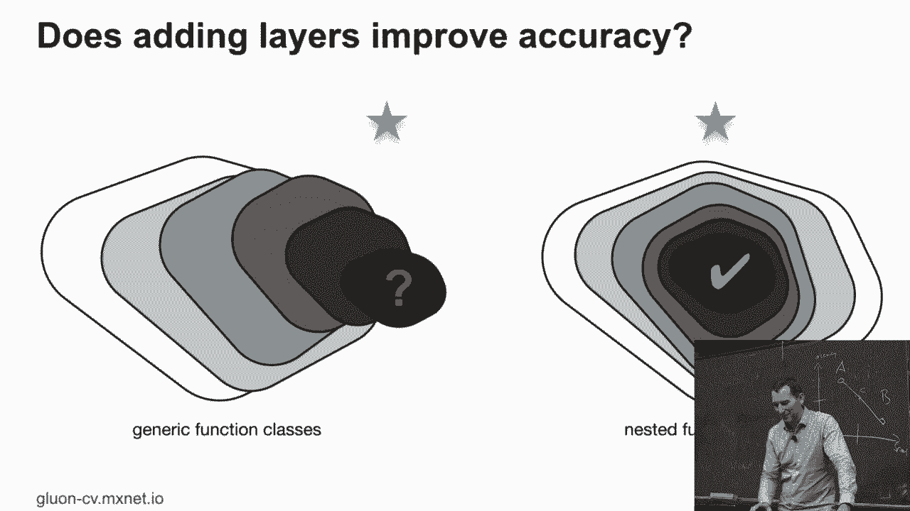

ResNet 在2015年提出了一个巧妙的构思。传统网络层学习的是从输入 `x` 到输出 `f(x)` 的映射。ResNet 则改变了学习目标：它让网络层学习**残差**。

具体来说，ResNet 块不再直接学习 `H(x)`，而是学习残差函数 `F(x) = H(x) - x`。这样，原始映射就变成了 `H(x) = F(x) + x`。

**公式表示：**
`输出 = F(x, {W_i}) + x`

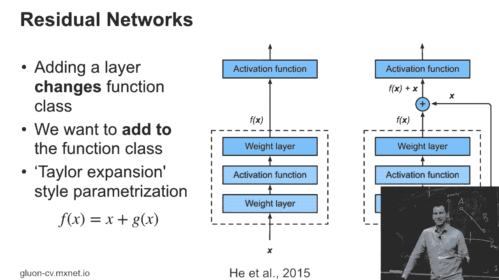

这里，`F(x, {W_i})` 代表需要学习的残差映射，`x` 是恒等映射（输入）。如果残差 `F(x)` 为0，那么输出就等于输入 `x`，即实现了恒等函数。

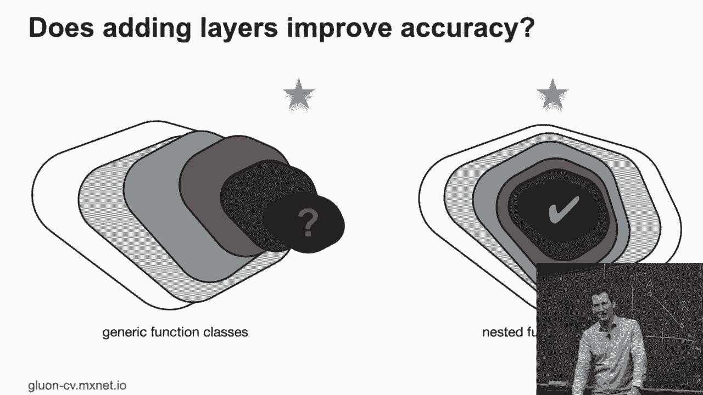

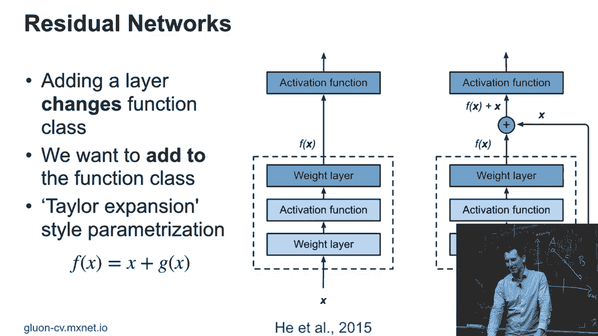

这种设计的精妙之处在于：
1.  **将恒等函数作为基线**：网络无需从零开始学习恒等映射，这降低了学习难度。
2.  **促进嵌套函数类**：即使添加新的层，前一层的有效输出（通过恒等连接）也能无损地传递到后面，这在一定程度上模拟了嵌套函数类的行为。
3.  **缓解梯度消失**：梯度可以通过恒等连接（捷径）直接反向传播，有助于训练极深的网络。

## ResNet 块的结构🔧

一个基础的 ResNet 块（或称残差块）结构如下：

以下是 ResNet 块的前向传播代码逻辑描述：

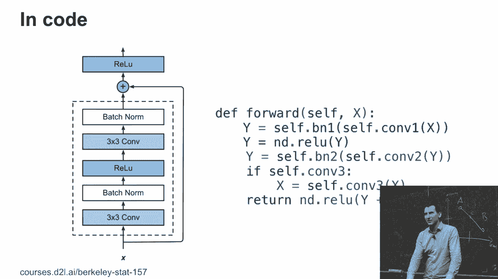

```python
def forward(x):
    # 主路径
    y = BatchNorm(Conv2d(x))  # 卷积层1 + 批量归一化
    y = ReLU(y)
    y = BatchNorm(Conv2d(y))  # 卷积层2 + 批量归一化

    # 捷径连接：如果输入x的维度与y匹配，直接相加
    # 如果不匹配（例如下采样时），需要对x进行1x1卷积调整维度
    if x.shape != y.shape:
        shortcut = Conv2d_1x1(x)  # 1x1卷积调整通道或尺寸
    else:
        shortcut = x

    # 残差连接：主路径输出 + 捷径
    output = y + shortcut
    output = ReLU(output)  # 通常在相加后应用激活函数
    return output
```

**结构说明：**
*   **主路径**：通常包含两个 `卷积层` -> `批量归一化层` -> `ReLU激活函数` 的组合。
*   **残差连接（捷径）**：将块的输入 `x` 直接加到主路径的输出上。
*   **维度匹配**：当输入和输出的维度（通道数、高、宽）不一致时（例如进行下采样），捷径部分需要使用一个 `1x1` 卷积层来调整 `x` 的维度，使其能与主路径输出相加。

研究人员尝试过批量归一化、加法和ReLU的不同排列顺序，某些顺序在特定任务上可能表现更好。这体现了深度学习实践中“炼丹”的一面，但当前图示的结构是经过验证且广泛使用的标准形式。

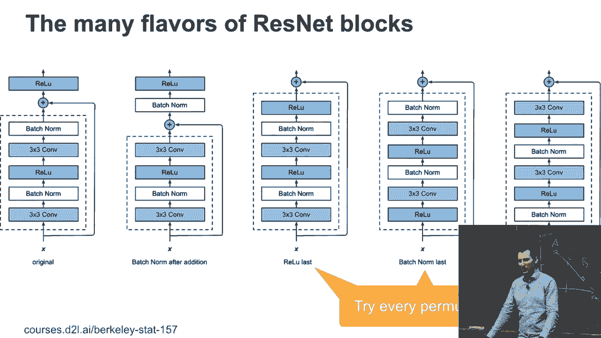

## 从模块到完整网络🌉

上一节我们介绍了ResNet的核心构建块，本节中我们来看看如何用这些块搭建完整的ResNet网络。

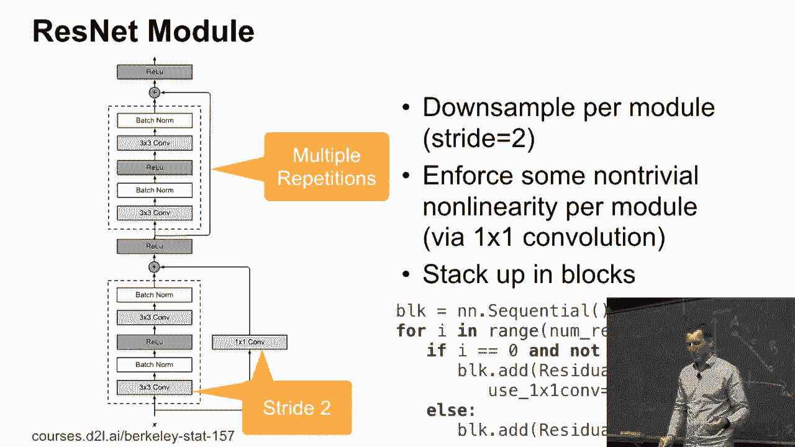

完整的ResNet网络架构通常如下：
1.  **起始部分**：一个普通的卷积层，接着是批量归一化、ReLU和最大池化层，对输入进行初步的特征提取和下采样。
2.  **主体部分**：由多个“阶段”组成，每个阶段包含若干个堆叠的ResNet块。通常，每个新阶段的第一个ResNet块会进行下采样（步幅为2），以降低特征图的空间尺寸并增加通道数。
3.  **结尾部分**：全局平均池化层，将特征图转换为特征向量，最后接一个全连接层进行分类。

根据堆叠的ResNet块数量不同，产生了不同深度的变体，如 **ResNet-18, ResNet-34, ResNet-50, ResNet-101, ResNet-152** 等。数字代表网络的层数。更深的网络（如ResNet-152）通常能获得更高的精度，但计算成本也更高。

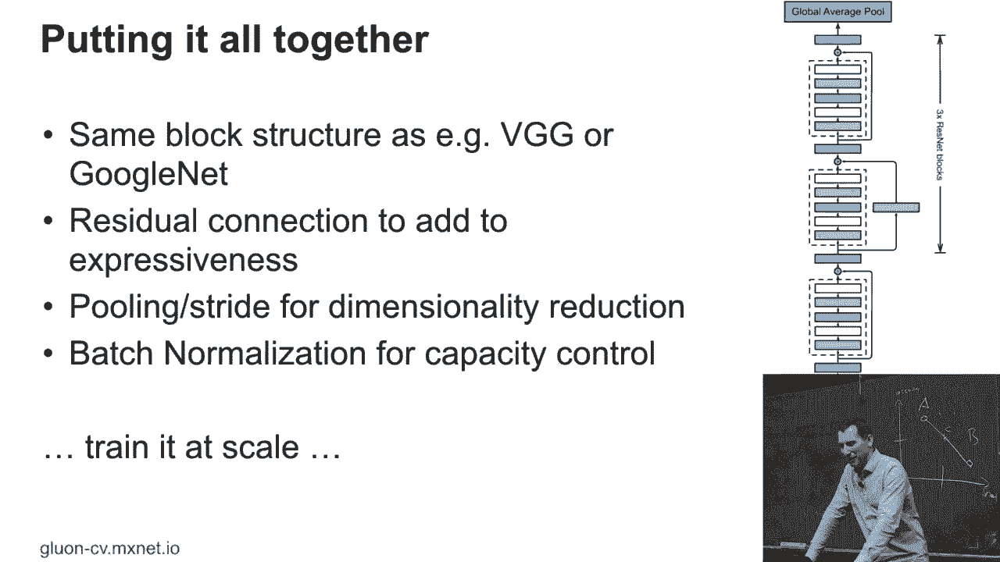

## ResNet的演进：ResNeXt🚀

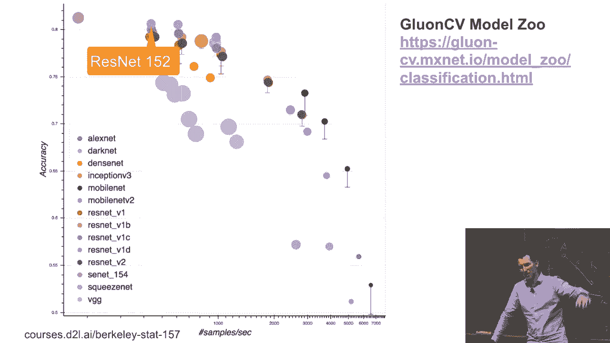

ResNet的成功启发了许多改进工作，ResNeXt是其中重要的一种。它基于一个简单的观察：在标准的ResNet块中，所有通道都在一个大的变换空间中交互。

ResNeXt引入了“分组卷积”和“基数”的概念。其核心思想是：**在单个ResNet块内部，采用并行且结构相同的多条路径（称为“基数”），每条路径的变换在更小的分组通道内进行，最后将所有路径的结果合并。**

**公式/概念：**
`输出 = Σ_{i=1 to C} T_i(x)`
其中 `C` 是基数（路径数量），`T_i` 是第 `i` 条路径上的相同变换（一个小的全连接或卷积网络）。

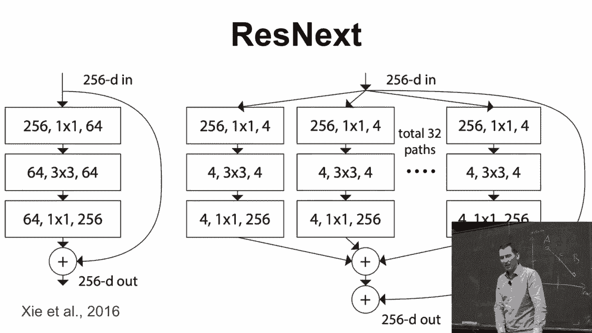

**代码实现关键：**
在PyTorch的二维卷积 (`nn.Conv2d`) 中，可以通过设置 `groups` 参数来实现分组卷积，从而轻松构建ResNeXt块。

```python
# 例如，将输入通道分为32组进行卷积
conv = nn.Conv2d(in_channels=256, out_channels=256, kernel_size=3, groups=32)
```

与原始ResNet相比，在相近的计算预算和参数量下，ResNeXt通过这种“分裂-变换-合并”的策略，通常能获得更好的性能，因为它增加了网络宽度方向的容量，同时保持了计算效率。

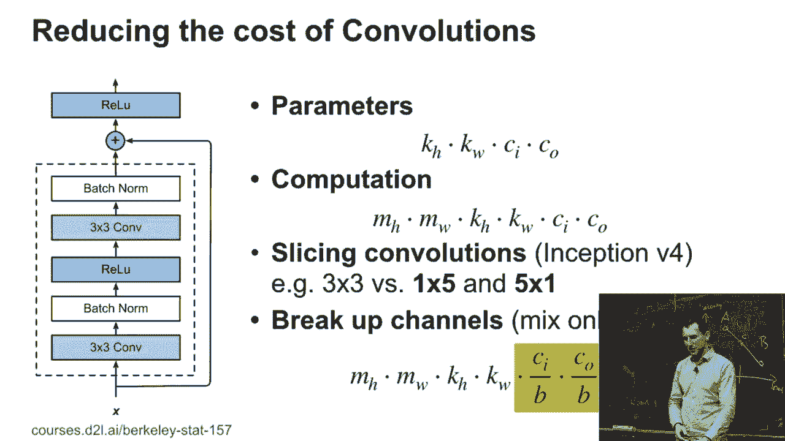

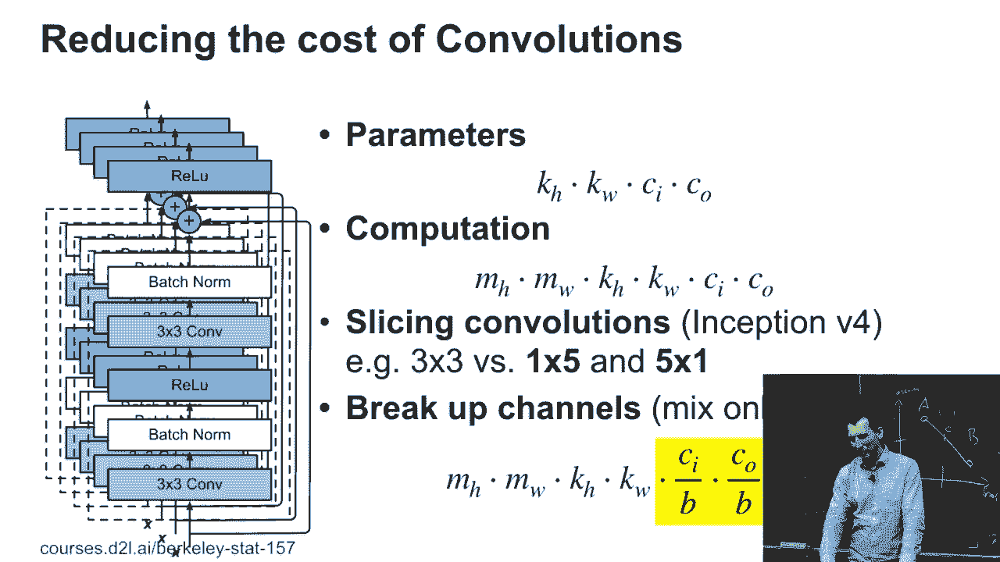

## 总结📚

本节课中我们一起学习了残差网络（ResNet）。

1.  **动机**：为了解决深度网络难以训练和性能退化的问题，使网络函数类更接近理想的嵌套结构。
2.  **核心**：引入了**残差学习**和**恒等捷径连接**，让网络层学习输入与输出之间的残差 `F(x) = H(x) - x`，极大缓解了梯度消失问题，使得训练成百上千层的网络成为可能。
3.  **结构**：基础构建块是ResNet块，包含主路径和残差连接。完整的网络由多个这样的块堆叠而成，形成不同深度的变体（如ResNet-50）。
4.  **发展**：ResNeXt作为重要改进，在块内引入了**分组卷积**和更高的**基数**，以更高效的方式增加网络容量，在相似计算成本下提升了性能。

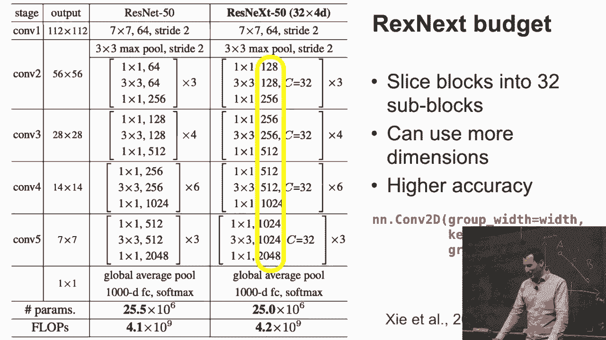

ResNet的设计思想深刻影响了后续的神经网络架构，其残差连接已成为构建深度模型的常用技术。