# 73：L13_6 使用 Python 实现 ResNet 🧠

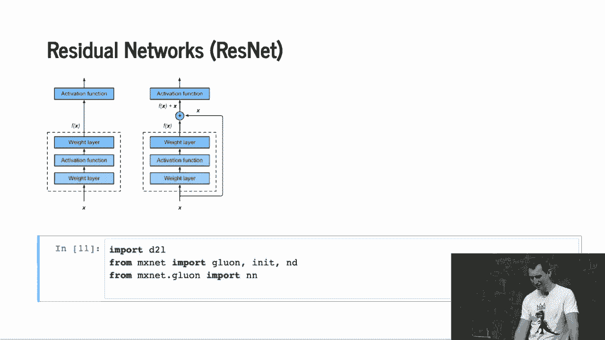

在本节课中，我们将学习如何使用 Python 和 PyTorch 框架来实现残差网络（ResNet）。我们将从核心的残差块构建开始，逐步组合成完整的网络，并理解其数据流和设计原理。

## 概述

ResNet 的核心思想是通过引入“残差连接”或“跳跃连接”来解决深度神经网络中的梯度消失和网络退化问题。本节课我们将动手实现这一结构。

## 1. 导入必要的库

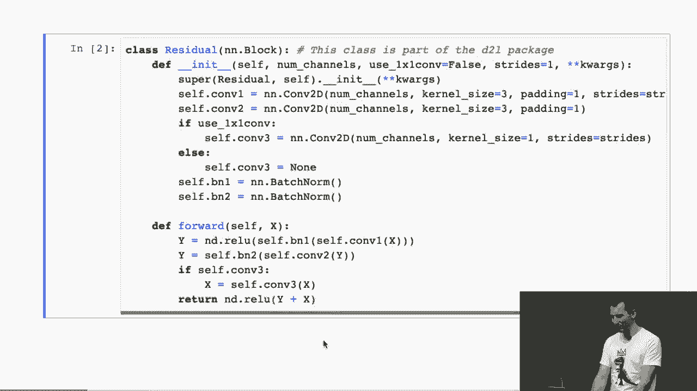

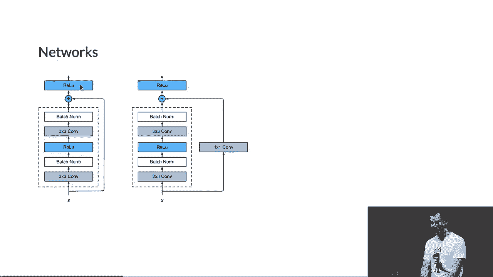

第一步是导入所有构建和运行网络所需的库。

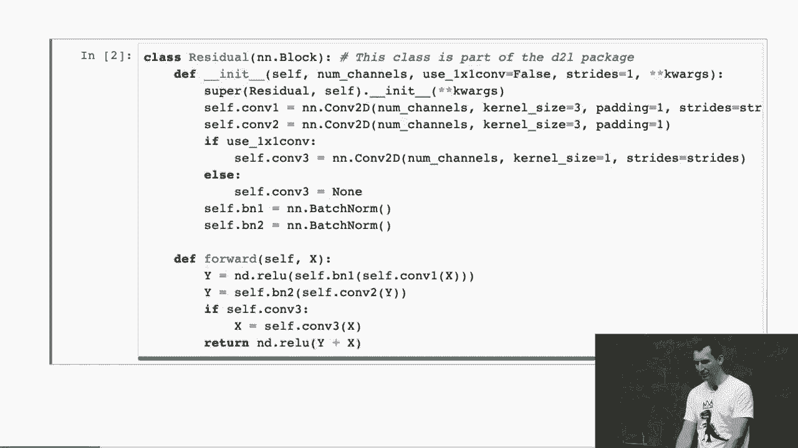

```python
import torch
import torch.nn as nn
import torch.nn.functional as F
```

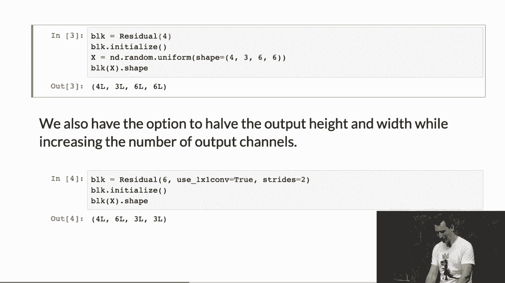

## 2. 实现残差块

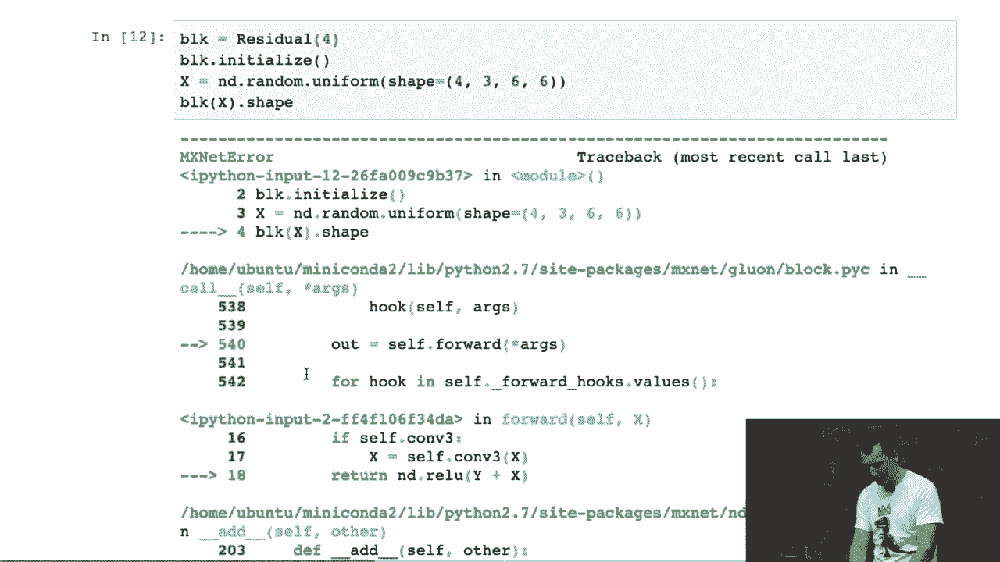

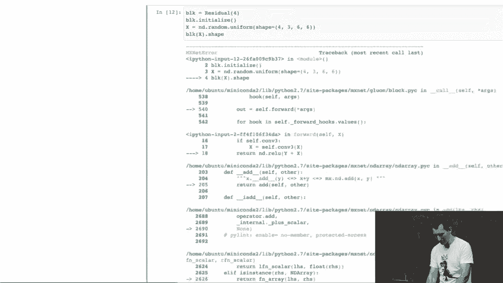

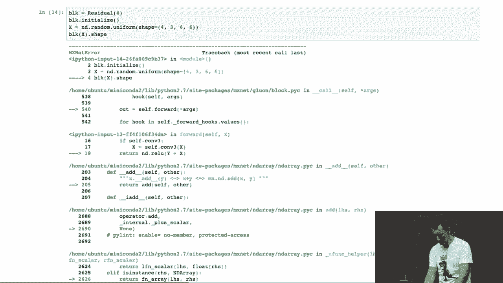

上一节我们介绍了 ResNet 的核心思想，本节中我们来看看如何用代码实现其基本单元——残差块。

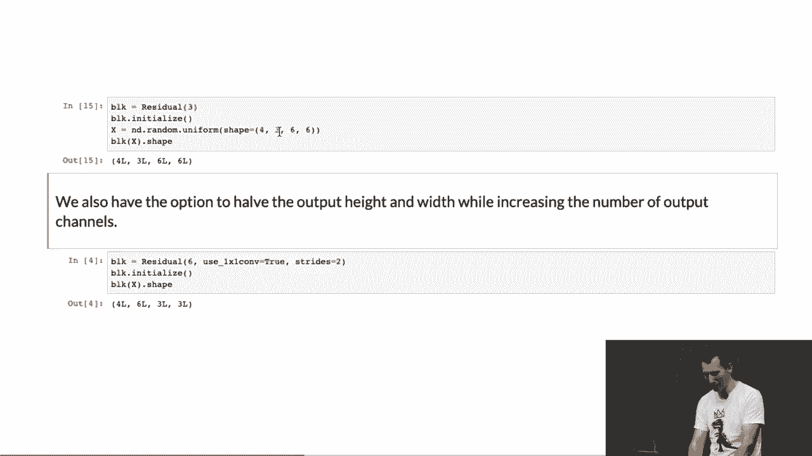

残差块的结构遵循我们之前看到的图示。它包含两个主要的卷积层，中间可能插入批量归一化（BatchNorm）和激活函数。此外，它还有一个可选的旁路卷积（1x1卷积）用于调整维度。

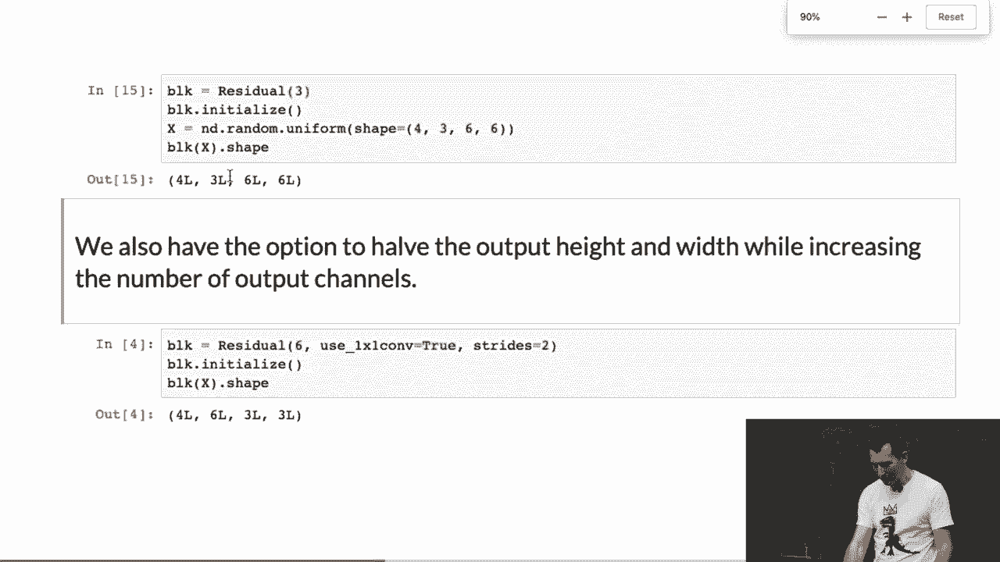

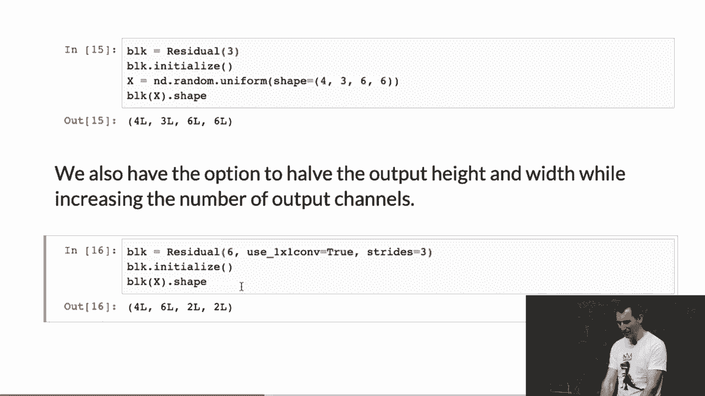

以下是残差块 `Residual` 类的实现代码：

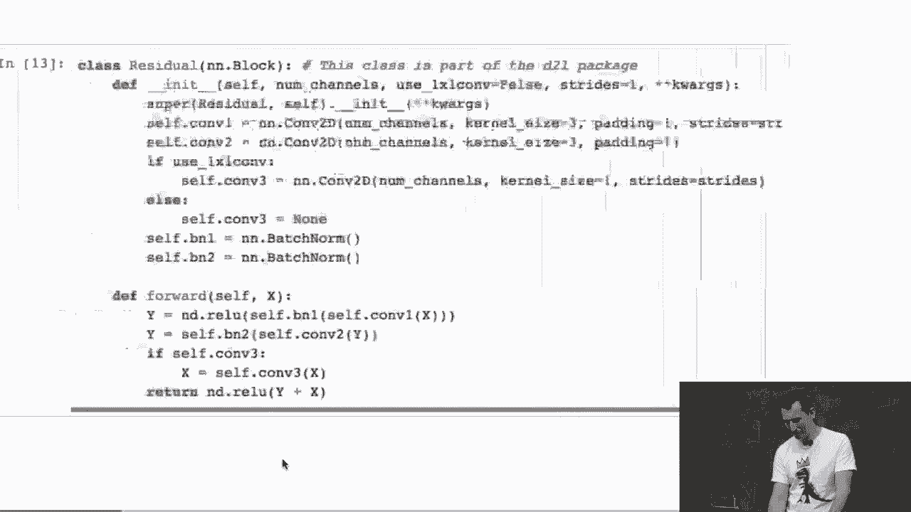

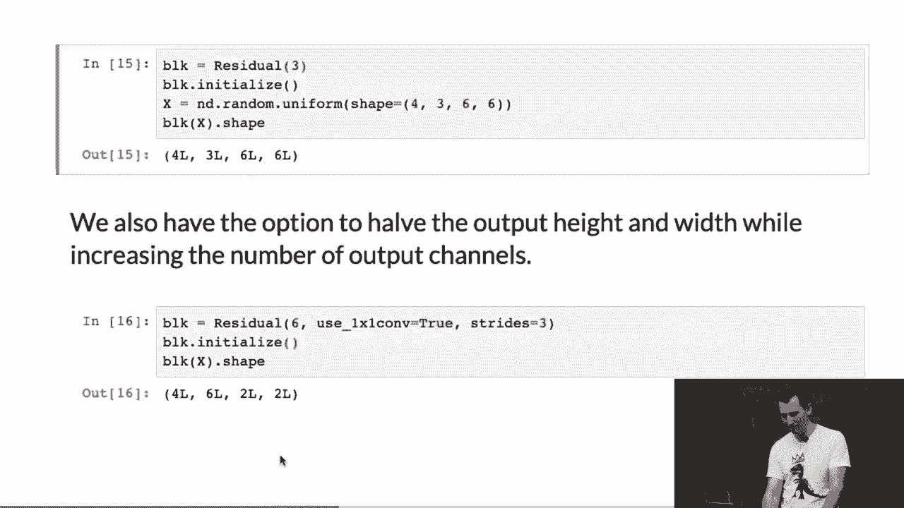

```python
class Residual(nn.Module):
    def __init__(self, input_channels, num_channels, use_1x1conv=False, strides=1):
        super().__init__()
        # 主路径上的两个卷积层
        self.conv1 = nn.Conv2d(input_channels, num_channels, kernel_size=3, padding=1, stride=strides)
        self.conv2 = nn.Conv2d(num_channels, num_channels, kernel_size=3, padding=1)
        # 对应的批量归一化层
        self.bn1 = nn.BatchNorm2d(num_channels)
        self.bn2 = nn.BatchNorm2d(num_channels)
        # 可选的旁路1x1卷积，用于调整通道数和空间尺寸
        if use_1x1conv:
            self.conv3 = nn.Conv2d(input_channels, num_channels, kernel_size=1, stride=strides)
        else:
            self.conv3 = None

    def forward(self, X):
        # 主路径前向传播
        Y = F.relu(self.bn1(self.conv1(X)))
        Y = self.bn2(self.conv2(Y))
        # 处理旁路
        if self.conv3:
            X = self.conv3(X)
        # 残差连接：主路径输出 + 旁路输入
        Y += X
        return F.relu(Y)
```

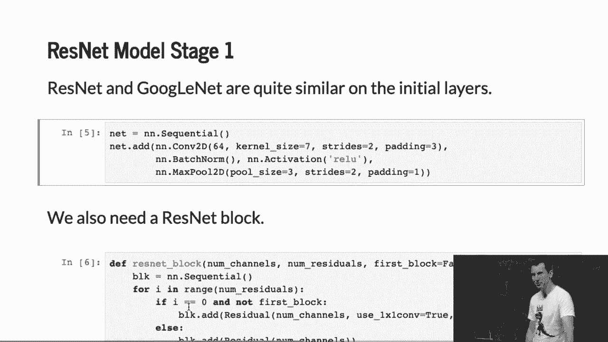

**核心概念解析**：
*   **残差连接**：公式为 `输出 = F(输入) + 输入`。这里的 `F(输入)` 是主路径上两个卷积等操作的结果。
*   **1x1卷积 (`conv3`)**：当主路径改变了输入的通道数或空间尺寸（通过 `strides>1` 实现下采样）时，需要使用1x1卷积将旁路的输入 `X` 变换到与主路径输出 `Y` 相同的形状，以便进行加法运算。

## 3. 构建 ResNet 网络

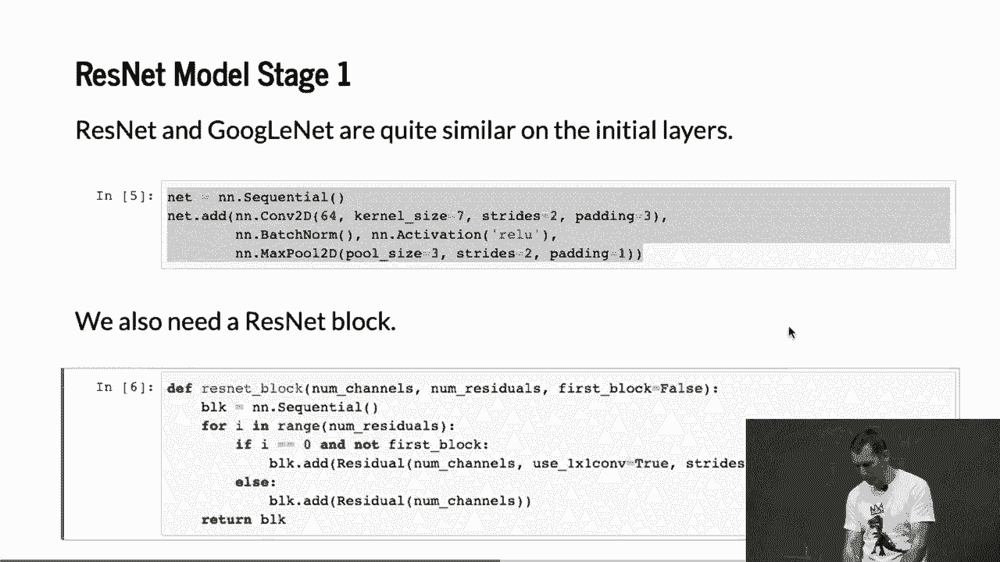

有了基础的残差块，我们现在可以将它们组合起来，构建完整的 ResNet 网络。ResNet 通常由多个阶段（Stage）组成，每个阶段包含若干个残差块，并且通道数会逐阶段翻倍。

以下是构建 ResNet-18 的代码。它首先是一个基础的卷积和池化层，然后是四个由残差块堆叠而成的阶段。

```python
def resnet_block(input_channels, num_channels, num_residuals, first_block=False):
    blk = []
    for i in range(num_residuals):
        # 每个阶段（Stage）的第一个块可能需要下采样和调整通道
        if i == 0 and not first_block:
            blk.append(Residual(input_channels, num_channels, use_1x1conv=True, strides=2))
        else:
            # 后续块以及整个网络的第一个阶段不需要下采样
            blk.append(Residual(num_channels, num_channels))
    return blk

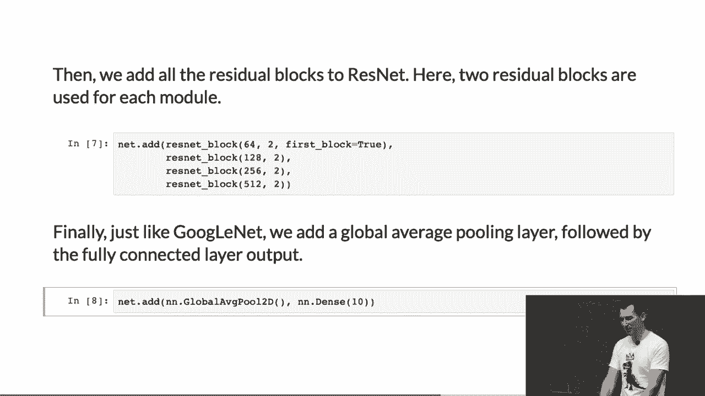

class ResNet18(nn.Module):
    def __init__(self, num_classes=10):
        super().__init__()
        # 初始层：7x7卷积 + 批量归一化 + ReLU + 最大池化
        self.b1 = nn.Sequential(
            nn.Conv2d(1, 64, kernel_size=7, stride=2, padding=3),
            nn.BatchNorm2d(64),
            nn.ReLU(),
            nn.MaxPool2d(kernel_size=3, stride=2, padding=1)
        )
        # 四个阶段
        self.b2 = nn.Sequential(*resnet_block(64, 64, 2, first_block=True))
        self.b3 = nn.Sequential(*resnet_block(64, 128, 2))
        self.b4 = nn.Sequential(*resnet_block(128, 256, 2))
        self.b5 = nn.Sequential(*resnet_block(256, 512, 2))
        # 结尾层：全局平均池化 + 全连接层
        self.avgpool = nn.AdaptiveAvgPool2d((1, 1))
        self.fc = nn.Linear(512, num_classes)

    def forward(self, X):
        X = self.b1(X)
        X = self.b2(X)
        X = self.b3(X)
        X = self.b4(X)
        X = self.b5(X)
        X = self.avgpool(X)
        X = torch.flatten(X, 1)
        X = self.fc(X)
        return X
```

**网络结构说明**：
*   **`b1`**：处理输入图像，进行初步的特征提取和下采样。
*   **`b2` 到 `b5`**：四个阶段，每个阶段由多个残差块组成。除了 `b2`，每个阶段的第一个残差块都会将特征图尺寸减半（`strides=2`），并将通道数翻倍（通过 `use_1x1conv=True` 实现）。
*   **结尾**：使用全局平均池化将每个通道的特征图降为1x1，然后通过一个全连接层输出分类结果。

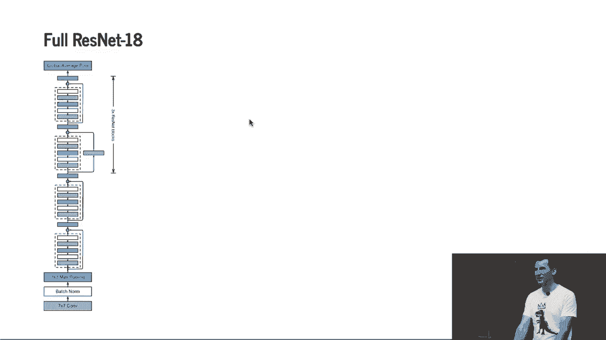

## 4. 测试与运行

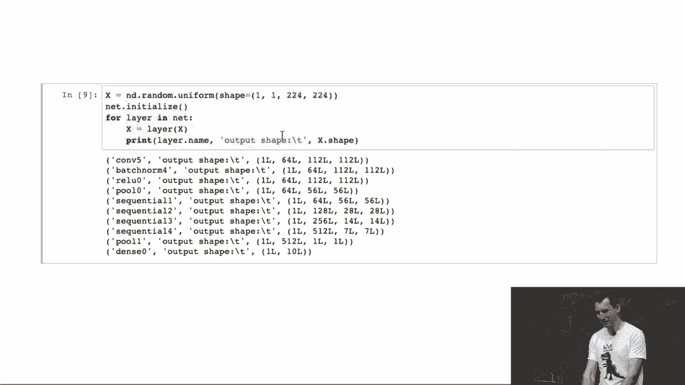

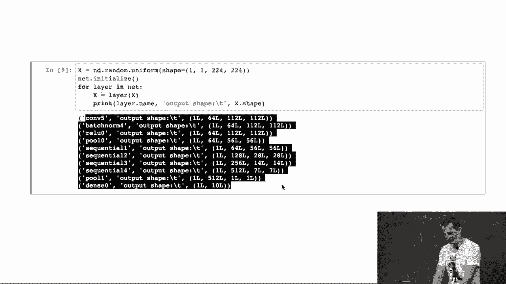

现在，我们可以实例化网络并进行简单的测试，观察数据维度的变化。

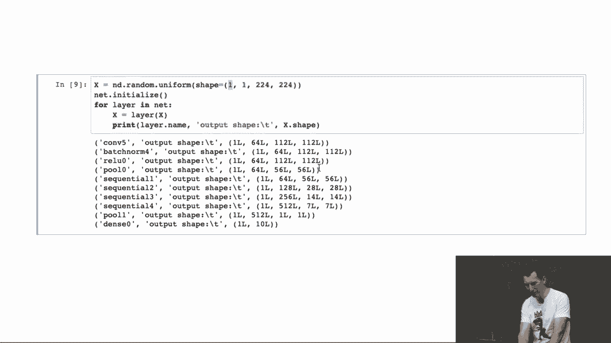

```python
# 实例化网络
net = ResNet18()
print(net)

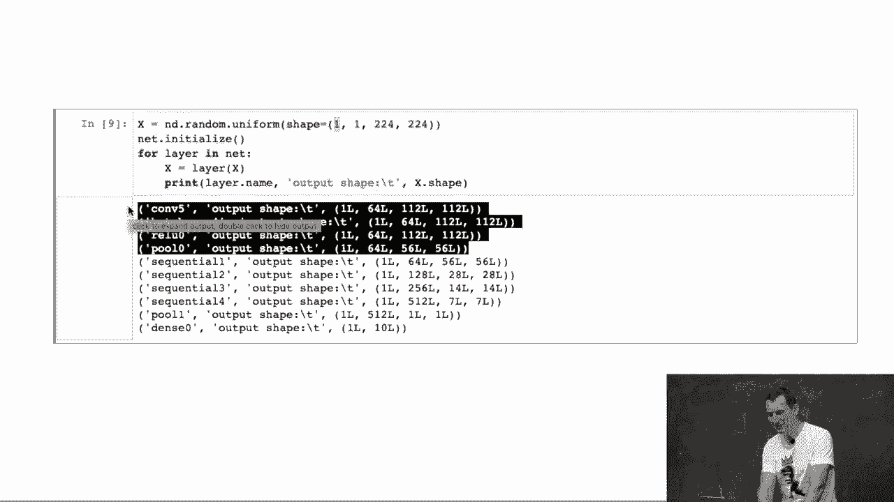

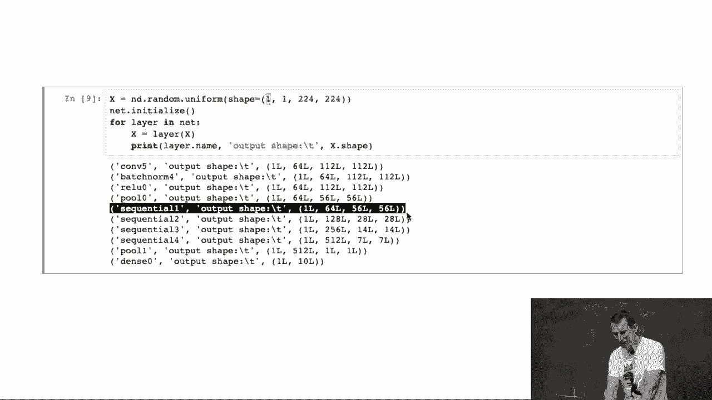

# 创建一个模拟输入（批量大小=1， 通道=1， 图像尺寸=224x224）
X = torch.rand(size=(1, 1, 224, 224))

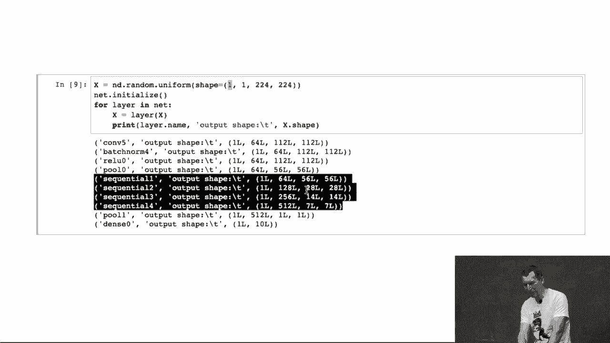

# 逐阶段查看输出形状
for layer in [net.b1, net.b2, net.b3, net.b4, net.b5]:
    X = layer(X)
    print(layer.__class__.__name__, 'output shape:\t', X.shape)

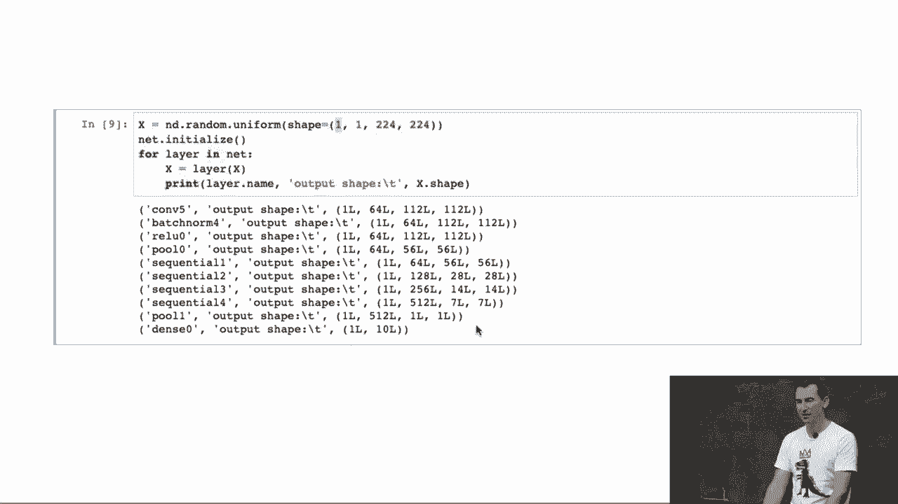

# 经过全局池化和全连接层
X = net.avgpool(X)
X = torch.flatten(X, 1)
print('After avgpool shape:\t', X.shape)
X = net.fc(X)
print('Final output shape:\t', X.shape)
```

运行上述代码，你将看到数据从 `[1, 1, 224, 224]` 开始，经过每个阶段后，空间尺寸逐渐减小，通道数逐渐增加，最终变为 `[1, 10]` 的分类得分向量。

## 5. 关于正则化的讨论

在构建网络时，你可能会注意到我们没有显式地使用 Dropout 等正则化方法。这里有一个重要的原因：

*   **批量归一化作为隐式正则化**：批量归一化在训练时会对每个批次的数据进行归一化（减去均值，除以标准差）。由于每个批次的统计量是随机的，这相当于向网络的激活值中注入了噪声。这种噪声具有尺度不变性，是一种非常有效的正则化手段，在卷积网络中常常可以替代 Dropout。
*   **其他正则化选项**：你仍然可以在最后的全连接层使用权重衰减（Weight Decay）或 Dropout。对于更深的网络或特定任务，组合使用多种正则化策略可能带来微小的性能提升。

## 6. ResNet 的应用范围

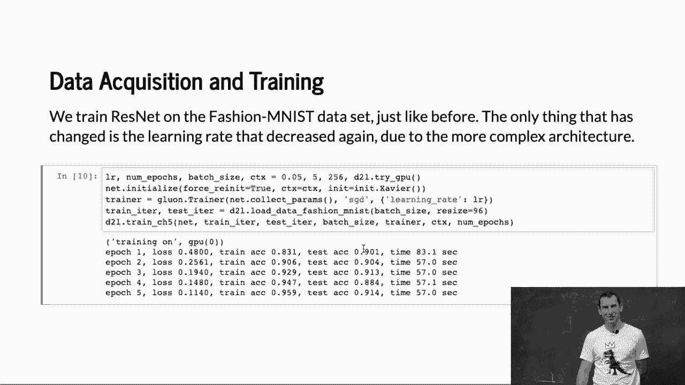

ResNet 不仅限于图像分类。其残差连接的思想具有普适性：

*   **图像回归**：如图像超分辨率、深度估计等。
*   **非视觉数据**：在自然语言处理、语音识别等领域的序列模型中也广泛采用了残差连接，因为它能有效缓解深层网络中的优化困难。

## 总结

本节课中我们一起学习了如何使用 Python 实现 ResNet。
1.  我们首先实现了**残差块**，理解了其包含主路径和跳跃连接的核心结构，以及如何使用1x1卷积处理维度不匹配。
2.  接着，我们通过堆叠残差块构建了 **ResNet-18** 网络，明确了其多阶段设计、通道数翻倍和下采样的规律。
3.  我们测试了网络的数据流，并讨论了**批量归一化所起的正则化作用**。
4.  最后，我们了解了残差思想的**广泛应用性**，它已成为构建深层神经网络的重要模块。

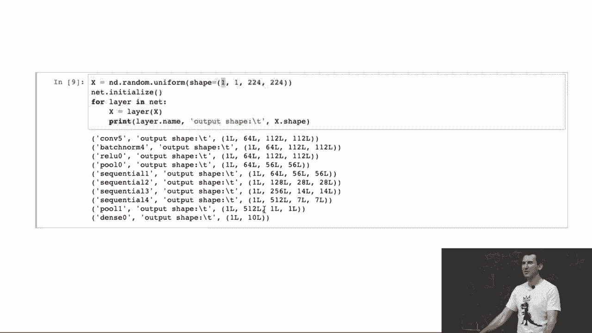

通过本教程，你应该能够掌握 ResNet 的基本实现原理，并可以将其应用到自己的项目中。