# 74：超越ResNet 🚀

在本节课中，我们将学习ResNet之后的一些重要神经网络架构变体。我们将探讨ResNeXt、DenseNet、SENet和ShuffleNet等模型的核心思想，了解它们如何通过改进网络结构来提升性能或效率。

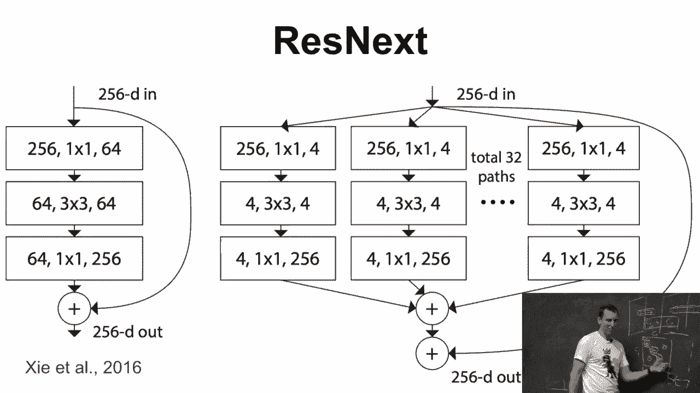

---

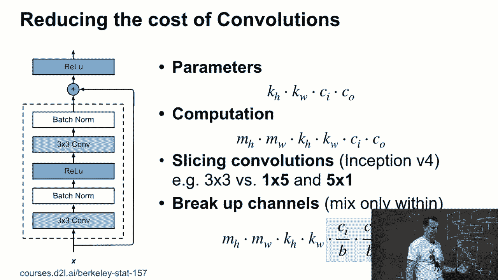

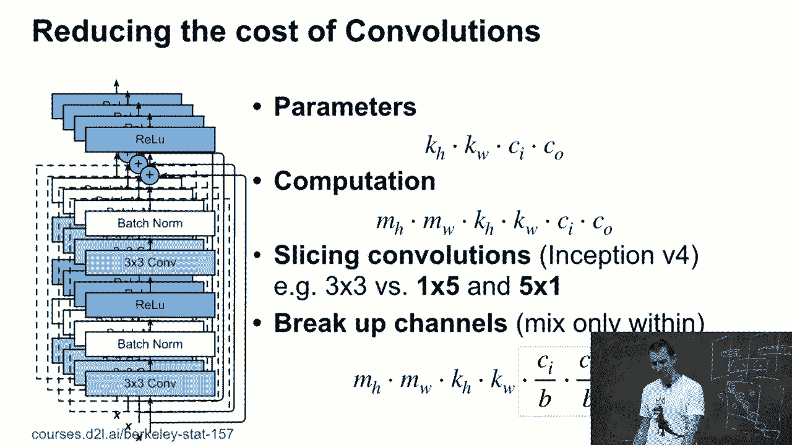

## ResNeXt：分组卷积的威力 🔄

上一节我们介绍了ResNet的基本思想。本节中我们来看看它的一个重要变体——ResNeXt。ResNeXt的核心思想是将标准的卷积操作分解为多个并行的“组”或“路径”。

在ResNet中，一个卷积层通常将输入通道 `C_i` 转换为输出通道 `C_o`，这涉及一个大小为 `C_i × C_o` 的密集矩阵运算，计算成本较高。ResNeXt通过引入“分组卷积”来分离参数数量和输出维度之间的依赖关系。

具体来说，ResNeXt不是使用一个大的密集矩阵，而是使用一个**块对角矩阵**来近似它。每个块内部是稠密的，但块与块之间是独立的。这带来了两个好处：
1.  可以增加输出通道数（通过增加块的数量），而不显著增加参数总量。
2.  参数数量减少了，因为每个块只处理输入通道的一个子集。

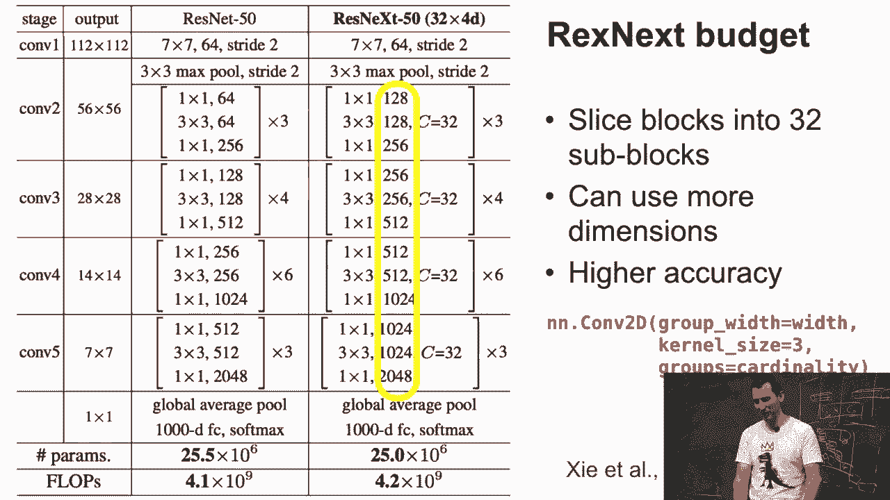

其核心操作可以视为一种特殊的稀疏卷积。与通用稀疏矩阵不同，这种预定义的块稀疏结构在GPU上能更高效地执行，避免了指针查找带来的开销。

---

## DenseNet：密集连接的网络 🌳

既然ResNet通过残差连接取得了成功，一个自然的想法是：为什么不进行更密集的连接呢？这就是DenseNet的出发点。

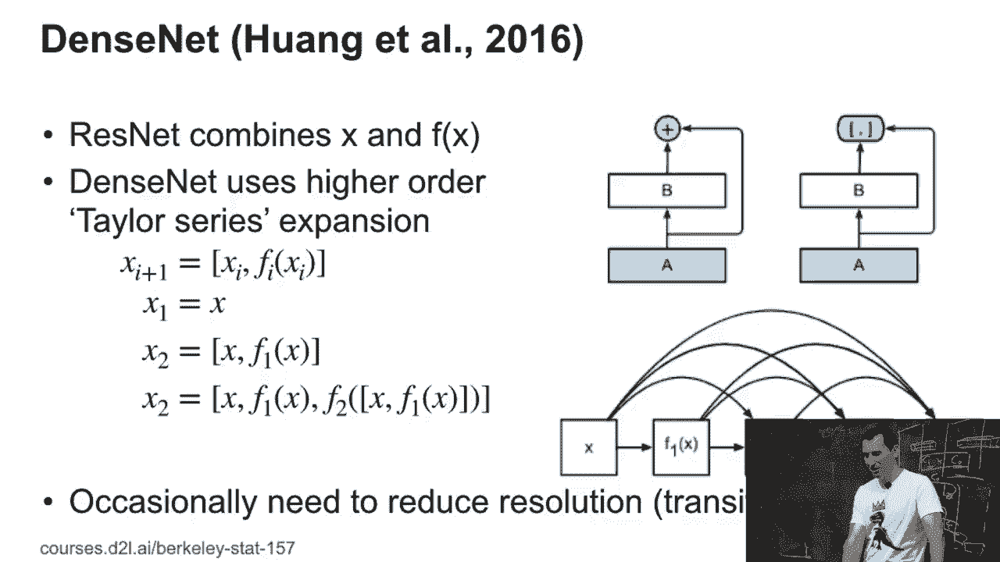

DenseNet将每一层的输出与所有后续层的输入进行连接。如果用公式表示，第 `l` 层的输出 `x_l` 是前面所有层输出的拼接：
`x_l = H_l([x_0, x_1, ..., x_{l-1}])`
其中 `[·]` 表示拼接操作，`H_l` 是一个复合函数（如BN-ReLU-Conv）。

这类似于构建了一个高阶的泰勒展开式，使得网络能够重用所有先前层的特征。理论上，这应该能增强特征传播、鼓励特征重用并减少参数数量。然而，在实践中，一个训练良好的标准ResNet的性能往往能与DenseNet媲美甚至超越，这说明**训练技巧和实现细节**有时比网络结构本身更为关键。

---

## SENet：通道注意力机制 🎯

DenseNet试图通过增加连接来改善信息流。但信息在卷积网络中传递的速度可能仍然较慢，因为一个像素的信息需要经过多层卷积才能影响到远处的像素。SENet（Squeeze-and-Excitation Networks）引入了一种轻量级的“注意力”机制来快速传递全局信息。

SENet的核心思想是：让网络学会动态地调整各通道的重要性。它通过一个额外的、计算量很小的分支来实现：
1.  **压缩（Squeeze）**：对每个通道的空间维度（高和宽）进行全局平均池化，将一个通道的所有像素信息压缩成一个标量。这得到了一个长度为 `C`（通道数）的向量。
2.  **激励（Excitation）**：将这个向量输入一个小型的两层全连接网络（通常带有一个瓶颈层），学习出每个通道的权重（一个0到1之间的值）。这个过程可以表示为：
    `s = σ(W_2 δ(W_1 z))`
    其中 `z` 是压缩后的向量，`W_1` 和 `W_2` 是可学习的权重矩阵，`δ` 是ReLU激活函数，`σ` 是Sigmoid函数。
3.  **重加权（Reweight）**：将学习到的通道权重 `s` 与原始的输入特征图进行逐通道的乘法，从而增强重要通道，抑制不重要通道。

这个机制允许网络利用图像的全局上下文信息，快速调整各通道的响应，从而在不显著增加计算成本的前提下提升模型性能。

---

## ShuffleNet：分组卷积后的通道混合 🃏

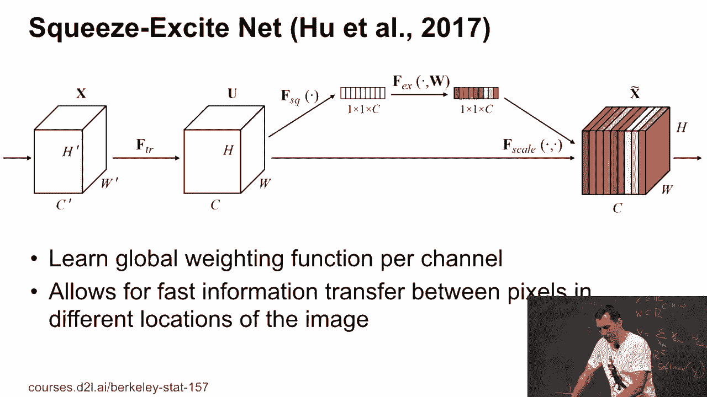

ResNeXt使用了分组卷积来提升效率，但这可能导致不同组（或“路径”）之间的信息无法交流。ShuffleNet在ResNeXt的基础上增加了一个巧妙的操作来解决这个问题：**通道洗牌（Channel Shuffle）**。

以下是ShuffleNet单元的基本步骤：
1.  首先，对输入特征图进行分组卷积（类似ResNeXt）。
2.  然后，在进入下一层之前，对分组卷积输出的通道进行**重新排列**。例如，将不同组的输出通道交错混合。
3.  这种洗牌操作可以通过一个高效的、无需学习的固定索引重排来实现。

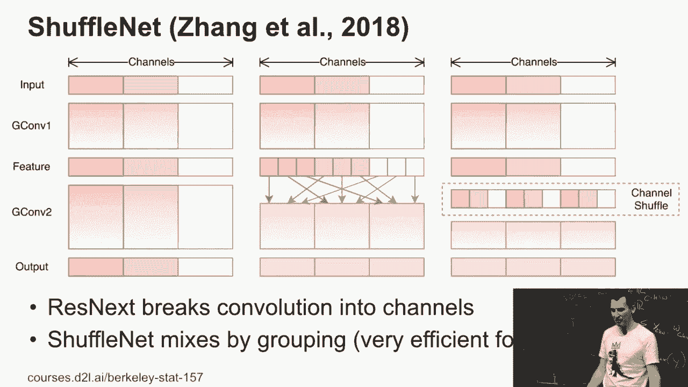

通过引入通道洗牌，ShuffleNet确保了不同组之间的信息能够有效混合，从而在保持高效计算的同时，获得了比普通分组卷积更好的性能。它特别适合移动端等计算资源受限的场景。

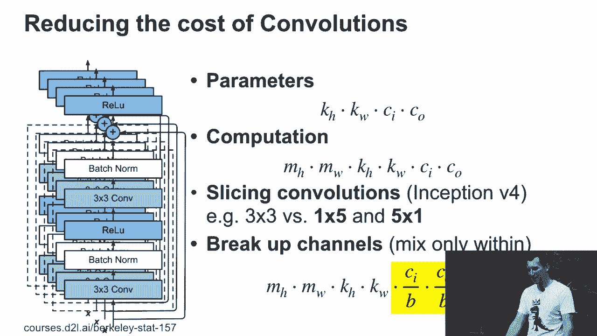

---

## 其他技巧与总结 📚

除了上述主要架构，还有一些相关的有效技巧：
*   **深度可分离卷积**：这是MobileNet的核心，也是分组卷积的一种极端形式（每组只有一个通道）。它将标准卷积分解为**深度卷积**（逐通道的空间卷积）和**点卷积**（1x1卷积，用于组合通道），极大地减少了计算量和参数量。

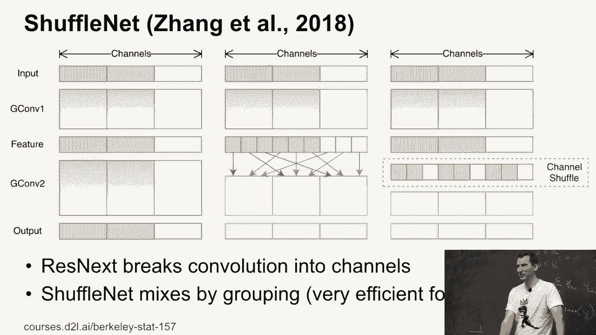

本节课中我们一起学习了ResNet之后几种重要的网络架构演进。我们来总结一下关键点：

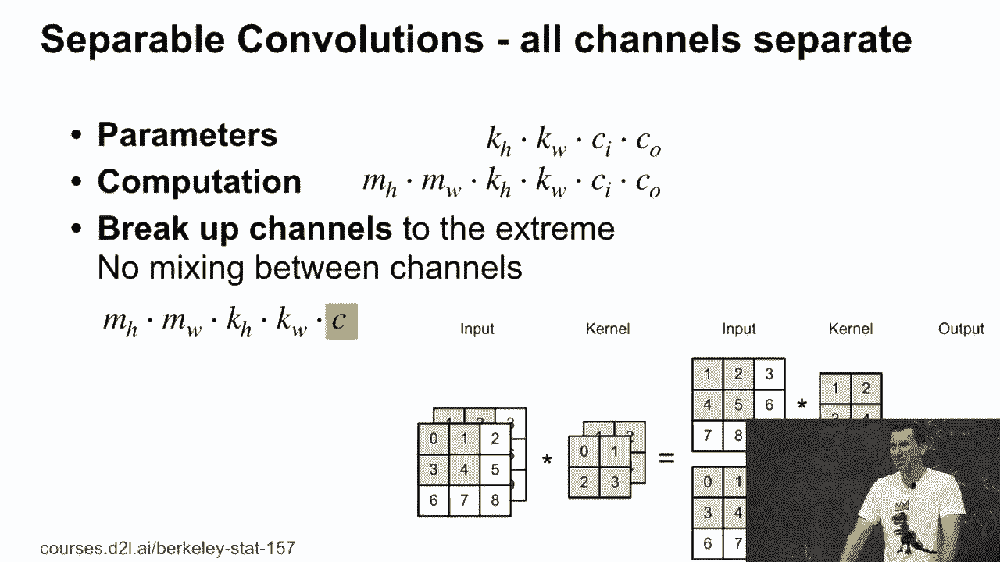

*   **ResNeXt**：通过**分组卷积**和**块对角稀疏化**，在控制参数量的同时增加了网络的宽度（基数）。
*   **DenseNet**：通过**密集连接**所有层，促进特征重用，但其优势高度依赖于训练实现。
*   **SENet**：引入了轻量的**通道注意力机制**，让网络能自适应地校准通道特征响应，有效提升精度。
*   **ShuffleNet**：在分组卷积的基础上加入**通道洗牌**操作，促进了组间信息交流，兼顾了效率与性能。
*   **深度可分离卷积**：作为高效的卷积分解方式，是许多轻量级网络（如MobileNet）的基石。

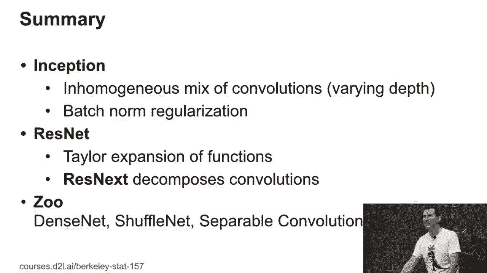

这些工作展示了神经网络设计中的核心思路：通过更**高效的结构化稀疏**、更**灵活的特征重用**以及引入**轻量的自适应机制**，来不断突破模型性能与效率的边界。理解这些思想，有助于我们设计或选择适合特定任务的网络架构。