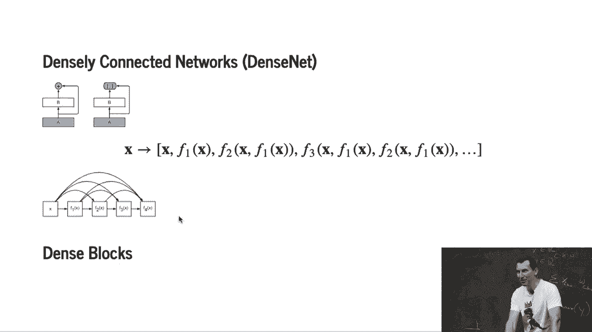
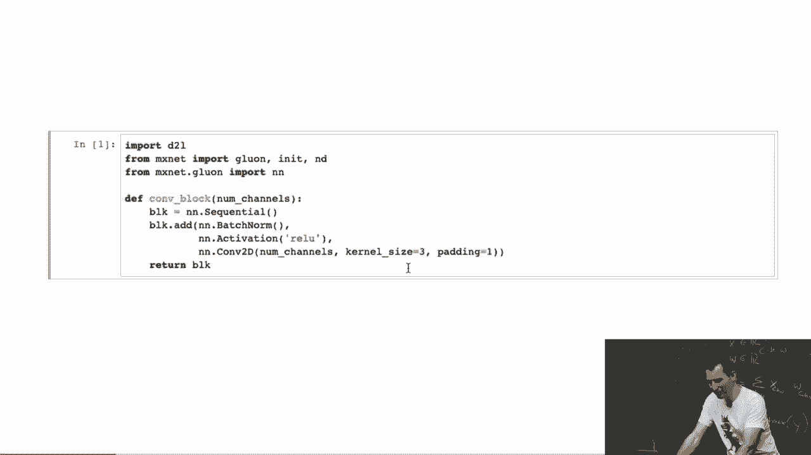
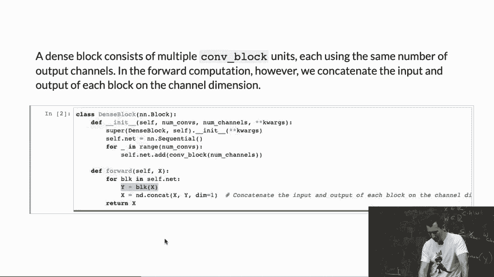
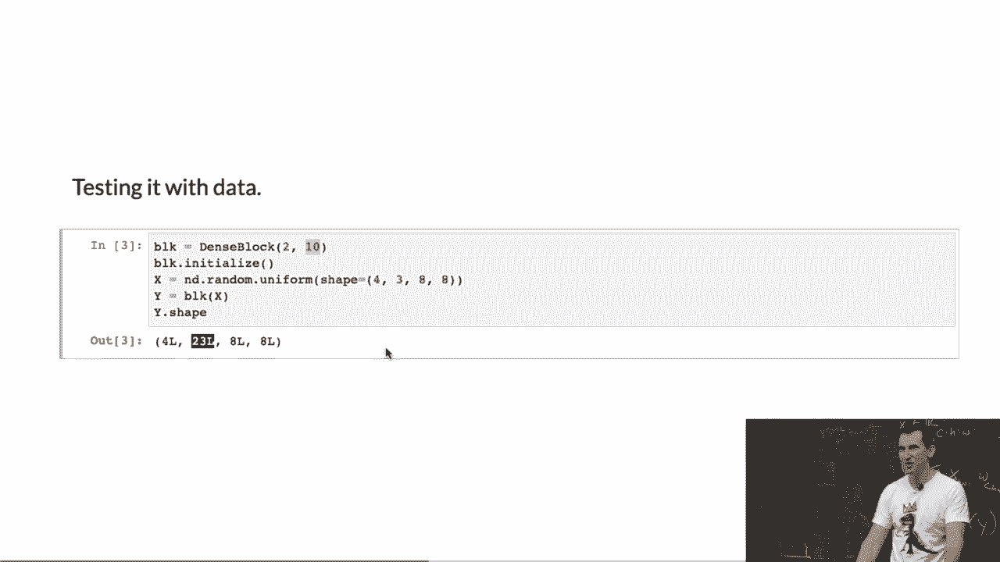
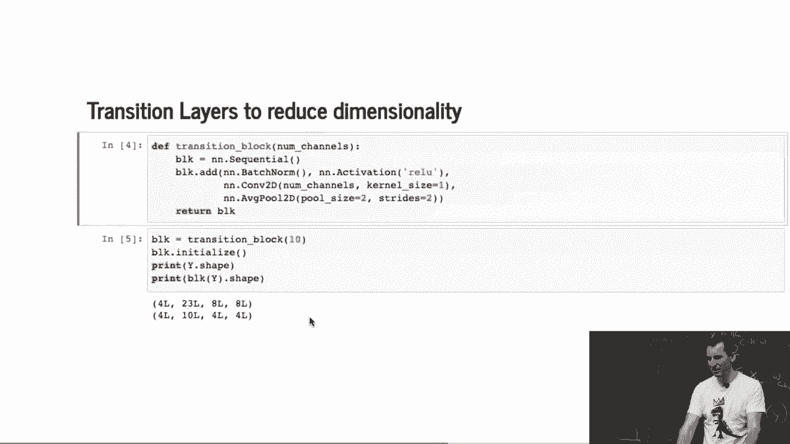
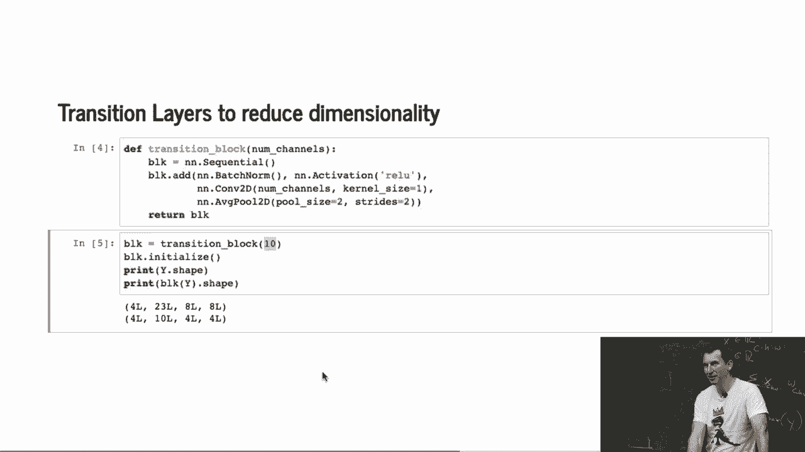
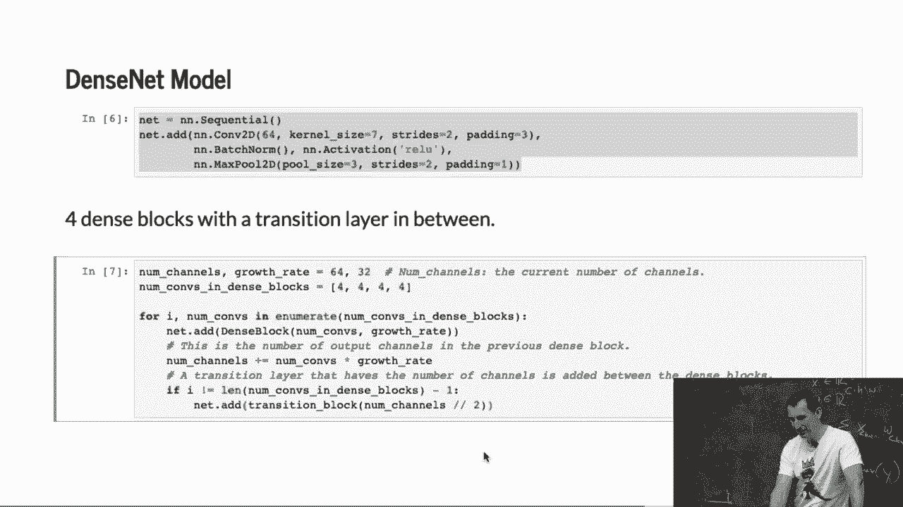
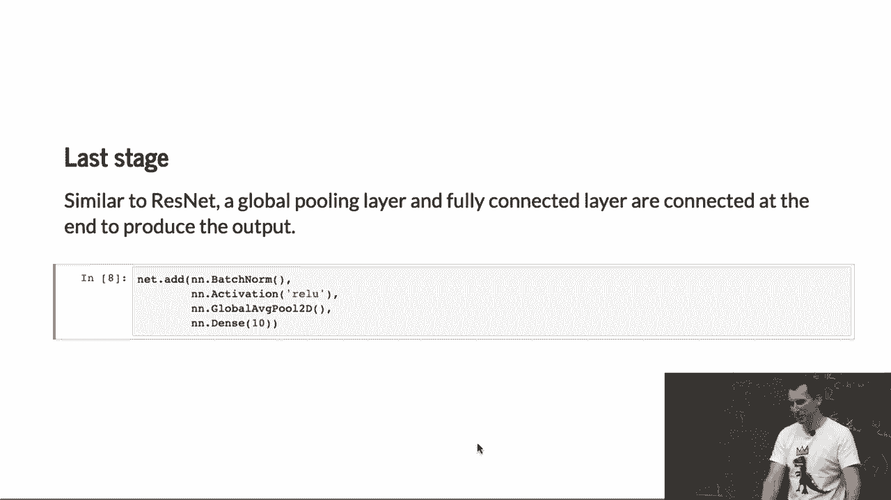
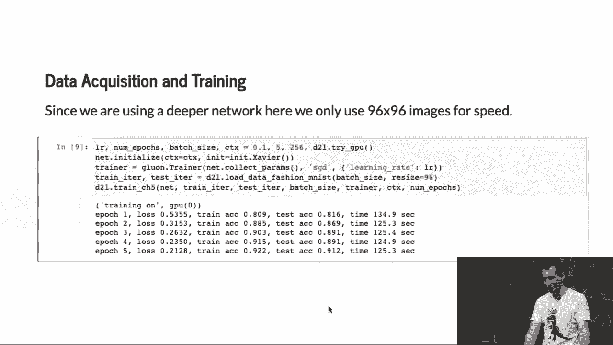
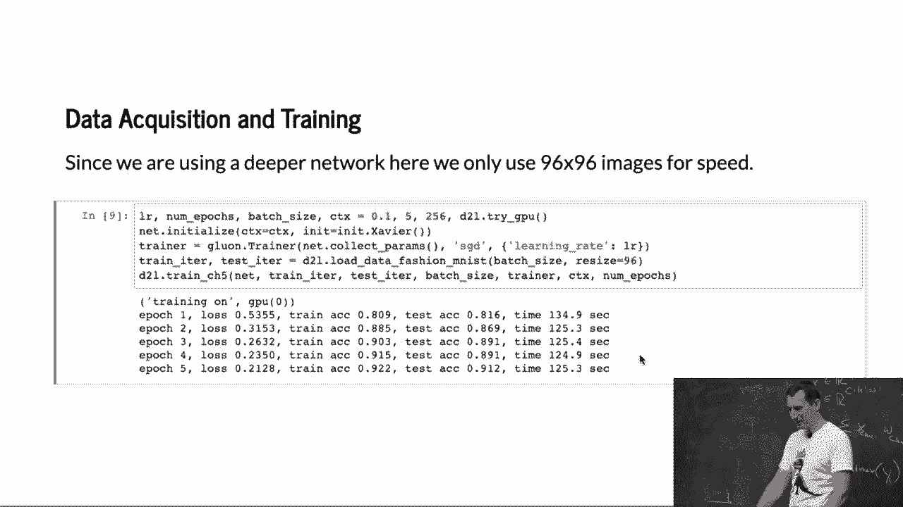

# 75：DenseNet在Python中的实现 🧱

在本节课中，我们将学习如何在Python中实现DenseNet网络。我们将从理解其核心概念开始，逐步构建卷积块、密集块和过渡块，最终组装成一个完整的DenseNet模型。本教程旨在让初学者能够清晰地理解每一步的实现细节。



---

## 概述



DenseNet的核心思想是**密集连接**，即每一层的输入都来自前面所有层的输出。这种设计促进了特征重用，并缓解了梯度消失问题。我们将通过代码来具体实现这一思想。

---



## 1. 卷积块

首先，我们实现一个基础的卷积块。这个块是网络的基本构建单元，它依次执行批量归一化、激活函数（如ReLU）和2D卷积操作。



以下是卷积块的代码实现：



```python
class ConvBlock(nn.Module):
    def __init__(self, in_channels, out_channels):
        super(ConvBlock, self).__init__()
        self.conv = nn.Sequential(
            nn.BatchNorm2d(in_channels),
            nn.ReLU(inplace=True),
            nn.Conv2d(in_channels, out_channels, kernel_size=3, padding=1)
        )
    
    def forward(self, x):
        return self.conv(x)
```

这个简单的对象封装了卷积操作的标准流程。

---

## 2. 密集块

上一节我们介绍了基础的卷积块，本节中我们来看看如何构建密集块。密集块是DenseNet的核心，它通过连接（concatenate）前面所有层的输出特征图来构建更丰富的特征表示。



密集块会堆叠多个卷积块，每个卷积块输出的通道数可以不同。关键步骤是将当前卷积块的输入与之前所有层的输出在通道维度上进行连接。

以下是密集块的代码实现：

```python
class DenseBlock(nn.Module):
    def __init__(self, num_layers, in_channels, growth_rate):
        super(DenseBlock, self).__init__()
        self.layers = nn.ModuleList()
        for i in range(num_layers):
            # 每个卷积块的输入通道数是：初始通道 + 已生成通道数
            layer_in_channels = in_channels + i * growth_rate
            self.layers.append(ConvBlock(layer_in_channels, growth_rate))
    
    def forward(self, x):
        features = [x]
        for layer in self.layers:
            # 将当前输入与之前所有特征图连接
            new_feature = layer(torch.cat(features, dim=1))
            features.append(new_feature)
        # 将块内所有层的输出连接起来，作为整个密集块的输出
        return torch.cat(features, dim=1)
```



随着网络加深，输入到每个卷积块的通道数会越来越大，这意味着计算的高阶项会涉及更多参数。

**示例**：假设输入有3个通道，密集块包含2个卷积层，每层输出10个通道（`growth_rate=10`）。那么：
*   第一层输入：3通道，输出：10通道。
*   第二层输入：3 + 10 = 13通道，输出：10通道。
*   最终输出通道数：3 + 10 + 10 = 23通道。



---



## 3. 过渡块

如果持续使用密集块，特征图的通道数会无限增长，导致计算量剧增。因此，我们需要一种机制来压缩特征图。这就是过渡块的作用。

过渡块通常位于密集块之后，用于降低特征图的分辨率和通道数，从而控制模型的复杂度。其设计原则是：先构建丰富的特征，再进行压缩，以避免过早丢失信息。

以下是过渡块的代码实现，它包含批量归一化、ReLU激活、1x1卷积（用于降维）和平均池化：

```python
class TransitionBlock(nn.Module):
    def __init__(self, in_channels, out_channels):
        super(TransitionBlock, self).__init__()
        self.transition = nn.Sequential(
            nn.BatchNorm2d(in_channels),
            nn.ReLU(inplace=True),
            nn.Conv2d(in_channels, out_channels, kernel_size=1), # 1x1卷积压缩通道
            nn.AvgPool2d(kernel_size=2, stride=2) # 降低空间分辨率
        )
    
    def forward(self, x):
        return self.transition(x)
```

**示例**：如果过渡块输入为23个通道，通过1x1卷积将其压缩到10个通道，并使用2x2平均池化将特征图尺寸减半。

---

## 4. 构建完整的DenseNet模型

现在，我们将前面定义的各个模块组合起来，构建一个完整的DenseNet模型。一个典型的DenseNet结构遵循“初始卷积 -> 密集块 -> 过渡块 -> ... -> 全局平均池化 -> 全连接层”的模式。

以下是DenseNet的一个简化实现示例：

```python
class DenseNet(nn.Module):
    def __init__(self, num_blocks, growth_rate=12, compression_factor=0.5, num_classes=10):
        super(DenseNet, self).__init__()
        # 初始卷积层
        self.initial_conv = nn.Conv2d(3, 2*growth_rate, kernel_size=3, padding=1)
        
        self.dense_blocks = nn.ModuleList()
        self.transition_blocks = nn.ModuleList()
        
        in_channels = 2 * growth_rate
        for i in range(len(num_blocks)):
            # 添加密集块
            self.dense_blocks.append(DenseBlock(num_blocks[i], in_channels, growth_rate))
            in_channels += num_blocks[i] * growth_rate
            
            # 如果不是最后一个块，添加过渡块
            if i != len(num_blocks) - 1:
                out_channels = int(in_channels * compression_factor)
                self.transition_blocks.append(TransitionBlock(in_channels, out_channels))
                in_channels = out_channels
        
        # 最终分类层
        self.final_bn = nn.BatchNorm2d(in_channels)
        self.global_pool = nn.AdaptiveAvgPool2d((1, 1))
        self.fc = nn.Linear(in_channels, num_classes)
    
    def forward(self, x):
        x = self.initial_conv(x)
        for i in range(len(self.dense_blocks)):
            x = self.dense_blocks[i](x)
            if i < len(self.transition_blocks):
                x = self.transition_blocks[i](x)
        x = self.final_bn(x)
        x = self.global_pool(x)
        x = x.view(x.size(0), -1)
        x = self.fc(x)
        return x
```

**参数说明**：
*   `num_blocks`: 一个列表，指定每个密集块中包含的卷积层数量（例如 `[4, 4, 4]`）。
*   `growth_rate`: 每个卷积层输出的通道数（k）。
*   `compression_factor`: 过渡块中通道压缩的比例（θ，通常为0.5）。

这种设计模式使得深度网络的结构变得相对可预测和统一。

---

## 5. 模型特点与讨论

DenseNet通过密集连接实现了强大的特征复用能力，但其代价是可能产生非常大的中间特征表示，导致前向和反向传播的计算量都很大。与ResNet等网络相比，DenseNet在参数量控制方面可能不那么直接。

**关于效率**：虽然DenseNet理论上有其优势，但在固定的计算预算下，像ResNet或ShuffleNet这样结构更简洁的网络可能更具实践效率。DenseNet的密集连接使得特征图通道数快速增长，计算成本较高。

**关于迁移学习**：更大的中间表示是否对迁移学习有益？这并不绝对。迁移学习的成功很大程度上取决于源领域和目标领域的相似性。例如，在ImageNet（自然图像）上预训练的模型，直接应用于卫星图像可能效果不佳。

**后续发展**：DenseNet的思想启发了后续研究，例如尝试连接特定层而非所有层，或设计动态推理网络（根据输入难度调整计算量）。然而，这些理论改进往往伴随着额外的实现开销，并不总是能在实践中带来净收益。

---

## 总结



本节课中我们一起学习了DenseNet在Python中的完整实现。我们从基础的**卷积块**开始，构建了实现密集连接的**密集块**，然后引入了控制复杂度的**过渡块**，最后将这些组件组装成完整的**DenseNet模型**。我们了解到，尽管DenseNet的设计促进了特征重用，但其计算开销也相对较大。在实际应用中，需要根据具体任务和计算资源在模型性能和效率之间进行权衡。