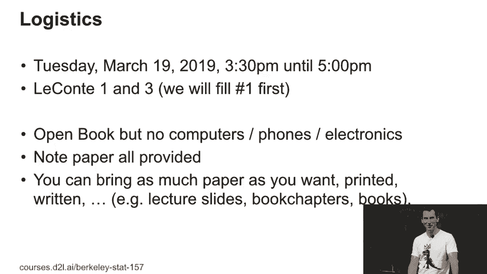
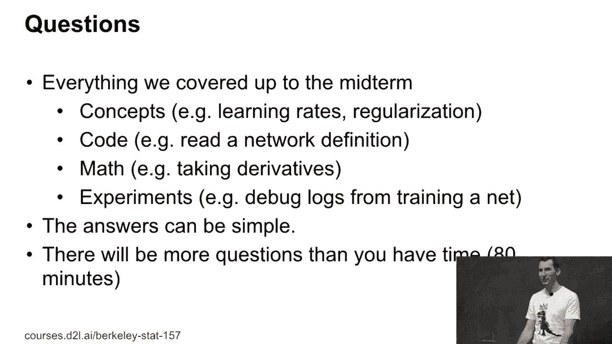

# 76：期中考试后勤安排与备考指南 📝

在本节课中，我们将详细介绍期中考试的后勤安排、考试范围、题型以及备考建议。请仔细阅读，为即将到来的考试做好准备。

---

## 🗓️ 考试时间与地点安排

下周二是期中考试日，因此当天没有家庭作业，以便大家专心准备。

考试将从下午3:30持续到5:00。我们可能会在3:00开始准备，因为需要组织大家进入考场。

由于考生人数较多，我们将使用两个教室：**LeCant 1** 和 **LeCant 3**。我们会优先安排考生进入 LeCant 1。如果 LeCant 1 坐满，后续的考生将前往 LeCant 3 参加考试。

---

## 📵 考试规则与物品要求

考试期间**不允许使用任何电子设备**，包括电脑和手机。这是为了确保考试的公平性，防止通过通讯工具获取外部帮助。

考试纸张将由考场统一提供，考生**不应携带自己的纸张进入考场**。你可以打印复习资料带入考场，但需要自己管理好这些材料。携带过多纸张不一定有助于考试，关键在于你能否快速找到所需信息。

---

## 📚 考试范围与内容

考试将涵盖截至本周四课程结束前所讲授的全部内容。

以下是考试可能涉及的主要方面：

**1. 核心概念理解**
考试会考察你对课程核心概念的理解。例如：
*   学习率 (Learning Rate)
*   正则化 (Regularization)
*   过拟合 (Overfitting)
*   协变量漂移 (Covariate Shift)

你需要能够解释、理解并识别这些概念。

**2. 代码阅读理解**
由于不能运行代码，考试会侧重考察阅读和理解代码的能力。你可能会看到一些网络定义或其他代码片段，并被要求理解其逻辑。

**3. 基础数学知识**
作为一门统计学课程，考试会包含必要的数学问题。例如：
*   卷积操作
*   求导
*   链式法则

**4. 实验分析与诊断**
本课程实践性较强，因此考试可能会展示一些实验场景或结果，要求你分析其中可能出现的问题。认真完成并复盘作业中的实验将对此有很大帮助。

---

## 📝 考试题型与策略

答案通常简洁明了，无需长篇大论。

考试题目数量会**多于大多数学生能完成的数量**，这是故意设计的。其目的是：如果你在某道题上卡住，可以果断跳过，继续解答下一道题，从而更合理地分配时间。

每个问题都会附有预估的完成时间，帮助你判断问题的难易程度，并调整答题节奏。

---

## ❓ 常见问题与备考建议

**问：应该如何备考？**
*   **回顾课程内容**：复习至今为止的所有课程幻灯片。
*   **阅读教材章节**：教材的对应章节可能比幻灯片更易于系统理解。
*   **重温课程视频**：可以重新观看教学视频以加深理解。
*   **研究作业解答**：作业的参考解答能提供重要提示，尤其是关于实验操作和问题诊断的部分。如果你作业完成得很好，这一步可能不是必须的。

**问：考试问题会和作业一样吗？**
考试问题会尽量与作业相关，但由于考试形式（纸上作答）与作业形式（上机编程）不同，问题不会完全一致。

**问：有多少道题？**
目前计划大约有10道题，但各题长度和耗时不同，请以现场标注的预估时间为准。

---

## 📊 评分与公平性

考试结束后，我们会根据分数分布情况评定成绩，并尽力保证评分过程的公平性。

---

## 🎯 总结

本节课我们一起学习了期中考试的后勤安排与备考指南。关键点包括：考试禁止使用电子设备、涵盖所有已学概念、题型包含概念、代码、数学和实验分析，以及采用“题目总量多于可完成量”的策略来帮助大家管理时间。请根据建议认真复习，祝大家考试顺利！