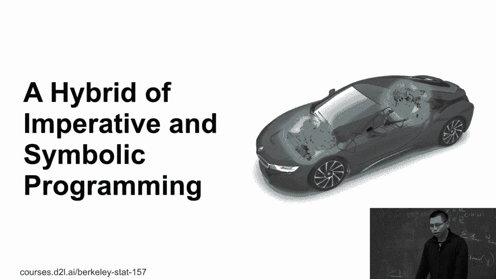
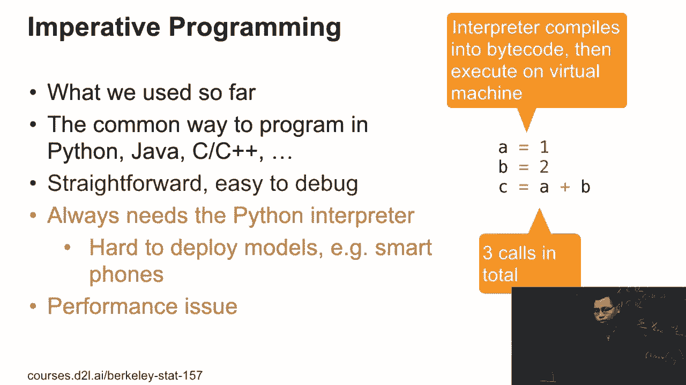
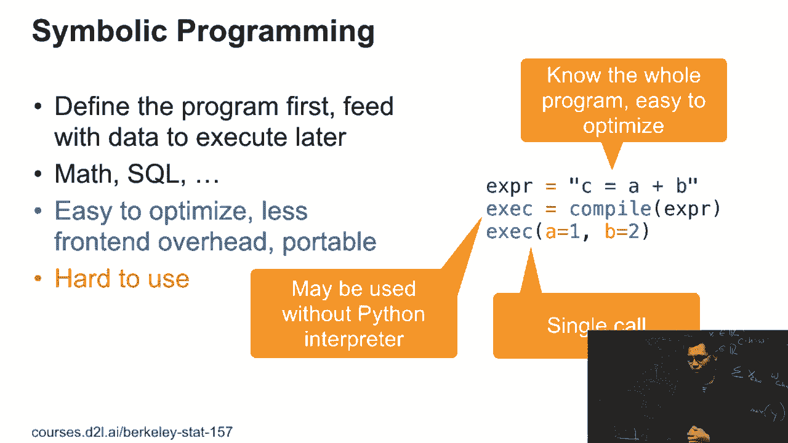
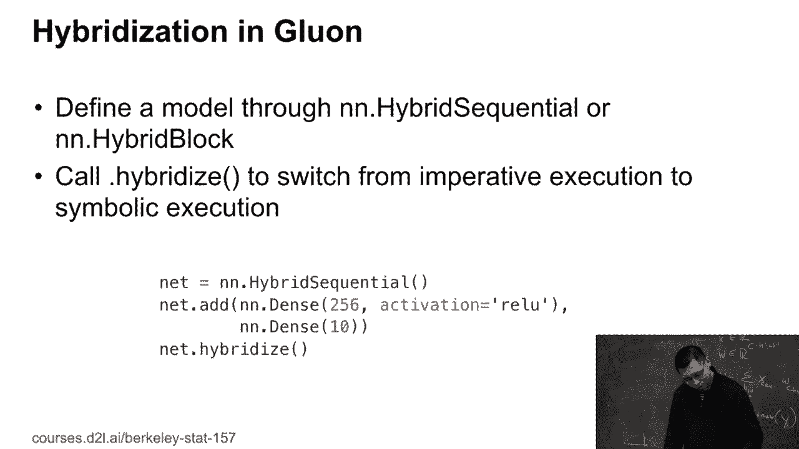

# 77：混合化（即时编译）🚀

在本节课中，我们将学习如何通过“混合化”技术，将命令式编程的灵活性与符号式编程的高性能结合起来，以加速深度学习模型的训练过程。我们将探讨这两种编程模式的核心概念、优缺点，并学习如何在实践中应用混合化。

---

## 两种编程模式：命令式 vs. 符号式

上一节我们介绍了课程的目标。本节中，我们来看看深度学习编程的两种主要模式：命令式编程和符号式编程。

### 命令式编程（Imperative Programming）



到目前为止，我们主要使用的是命令式编程。这是最直观的编程方式，代码按顺序一步步执行。

以下是命令式编程的一个简单示例：

```python
a = 1
b = 2
c = a + b
```

**优点**：
*   **易于调试**：可以随时打印中间变量（如 `print(b)`）来检查状态。
*   **直观灵活**：代码执行流程与书写顺序一致。

**缺点**：
*   **性能开销**：Python解释器需要将代码编译为字节码并在虚拟机上运行，每次执行操作都有调用开销。
*   **可移植性差**：程序依赖Python环境，难以在手机等没有Python的设备上直接运行。

### 符号式编程（Symbolic Programming）

另一方面，符号式编程要求我们先定义完整的计算流程（即“符号”或计算图），然后再将数据输入执行。

以下是符号式编程的一个概念性示例：

```python
# 1. 定义计算（符号）
program = “c = a + b”
# 2. 编译为可执行对象
compiled_prog = compile(program)
# 3. 提供输入数据并执行
result = compiled_prog.run(a=1, b=2)
```



**优点**：
*   **高性能**：编译器在编译时能看到整个程序，可以进行深度优化（如内存复用、死代码消除）。
*   **单次调用**：无论程序多长，对编译后的程序只需一次函数调用。
*   **可移植性好**：编译后的程序可以脱离Python环境（例如用C++）运行。

**缺点**：
*   **难以调试**：由于执行与定义分离，难以插入`print`语句进行调试。
*   **不够灵活**：程序结构需要预先静态定义。

---

## 混合化：结合两者优势

我们已经了解了两种编程模式各自的优缺点。本节中，我们来看看如何通过“混合化”将两者结合起来，实现既灵活又高效的编程。

混合化的核心思想是：**使用命令式的方式定义和开发模型，然后将其转换为符号式程序进行高性能训练和部署**。

在MXNet/Gluon中，这通过 `HybridBlock` 和 `hybridize()` 方法实现。

以下是如何实现混合化的具体步骤：

首先，我们像往常一样使用 `nn.HybridBlock` 或 `nn.HybridSequential` 来定义网络。

```python
from mxnet.gluon import nn

# 定义一个混合序贯模型
net = nn.HybridSequential()
net.add(nn.Dense(256, activation=‘relu’))
net.add(nn.Dense(128, activation=‘relu’))
net.add(nn.Dense(10))
```

定义完成后，我们只需调用 `hybridize()` 方法，即可将网络从命令式执行模式切换到符号式执行模式。

```python
net.hybridize()  # 开启混合化（即时编译）
```



调用 `hybridize()` 后，网络的前向传播将被编译和优化，从而获得显著的性能提升，同时保留了命令式编程的易用性。

---

## 总结

本节课中，我们一起学习了深度学习中的混合化技术。

*   我们首先回顾了**命令式编程**的直观与灵活，以及它在性能和可移植性上的局限。
*   接着，我们探讨了**符号式编程**的高效与可优化性，并了解了它调试困难的缺点。
*   最后，我们学习了**混合化**如何取两者之长：用命令式的方式轻松构建和调试模型，再通过 `hybridize()` 一键转换为符号式程序，以获得更快的执行速度和更好的部署能力。



掌握混合化技术，能帮助你在保持开发效率的同时，充分挖掘硬件性能，是训练复杂深度学习模型时的一项重要技能。