# 78：Python 中的混合化 🚀

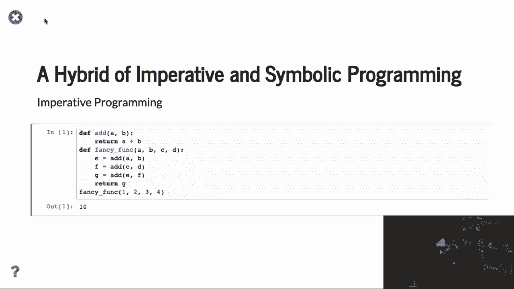

在本节课中，我们将学习深度学习框架中的“混合化”概念。我们将了解命令式编程与符号式编程的区别，并学习如何在 Python 中利用混合化技术来提升模型执行效率，同时保持代码的易用性。

---

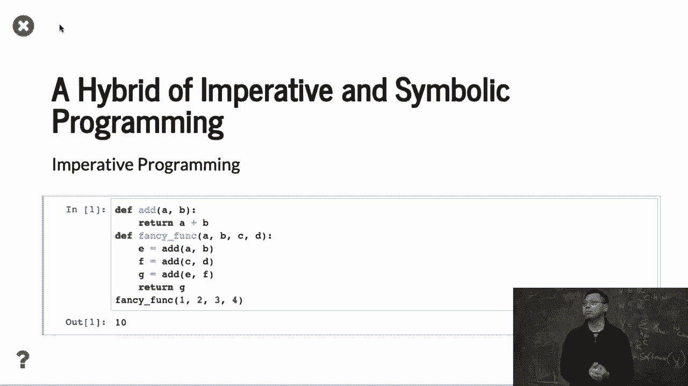

## 命令式编程与符号式编程 🔄

上一节我们介绍了混合化的概念，本节中我们来看看这两种编程范式在 Python 中的具体表现。

### 命令式编程

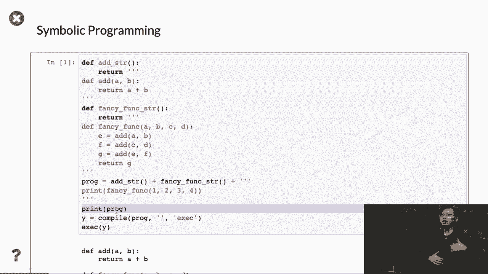

命令式编程是我们最熟悉的编程方式。代码按顺序执行，并立即计算结果。

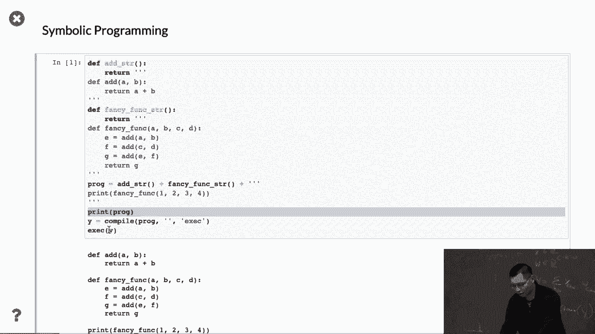

以下是命令式编程的一个简单例子：

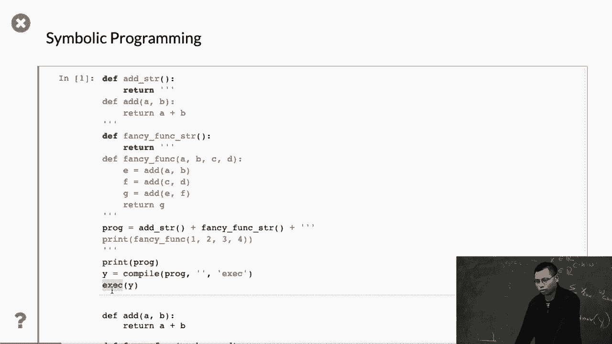

```python
def add(a, b):
    return a + b

def fancy(a, b, c, d):
    e = add(a, b)
    f = add(c, d)
    g = add(e, f)
    return g

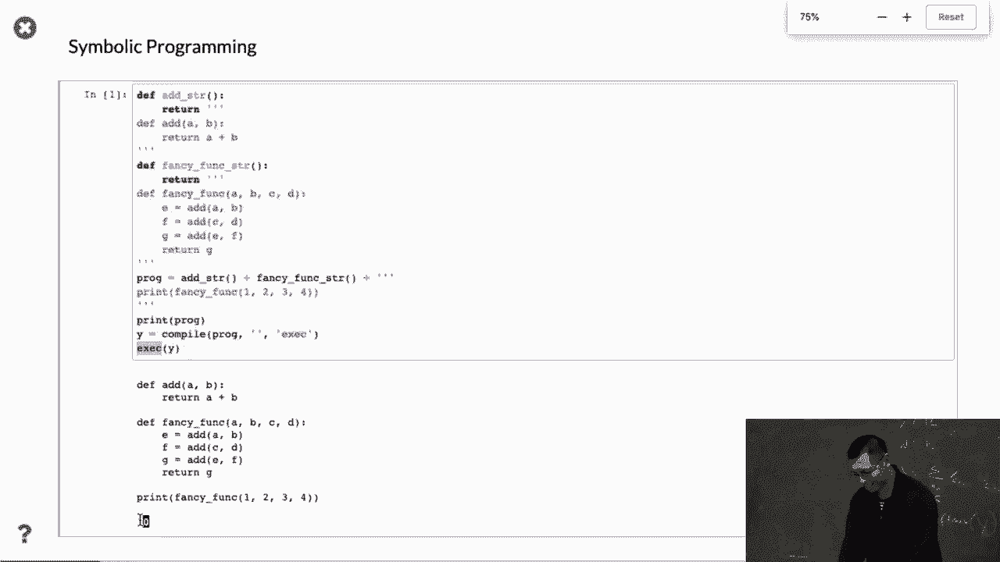

result = fancy(1, 2, 3, 4)
print(result)  # 输出：10
```
这段代码定义了函数并立即执行计算，得到结果 `10`。

### 符号式编程

符号式编程则不同。它首先定义计算流程（一个“符号图”），而不立即执行。只有在最后调用“编译”和“运行”时，才根据输入数据执行整个计算图。

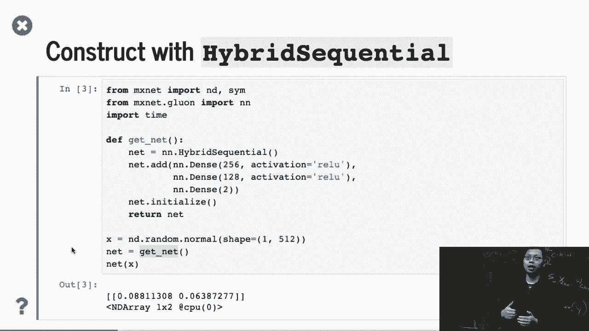

以下是符号式编程的例子：

```python
# 定义一个符号化的加法“函数”，它不计算，只描述操作
def add_sym(a, b):
    # 这里返回一个描述“加法”的符号对象
    return f"add({a}, {b})"

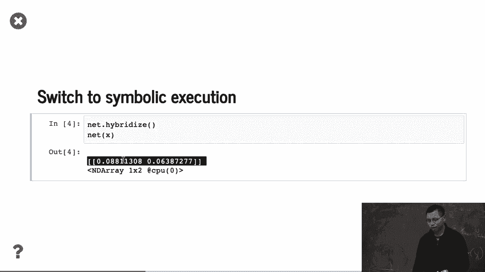

def fancy_sym(a, b, c, d):
    e = add_sym(a, b)
    f = add_sym(c, d)
    g = add_sym(e, f)
    return g

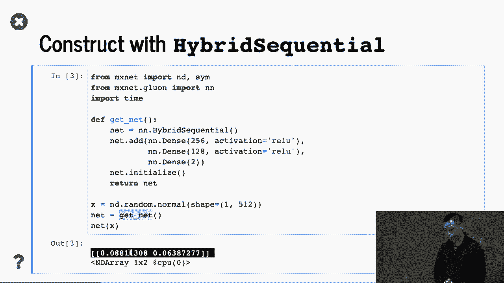

# 此时只是构建了计算图，没有实际计算
program = fancy_sym('data_a', 'data_b', 'data_c', 'data_d')
print(program)  # 输出类似：add(add(data_a, data_b), add(data_c, data_d))

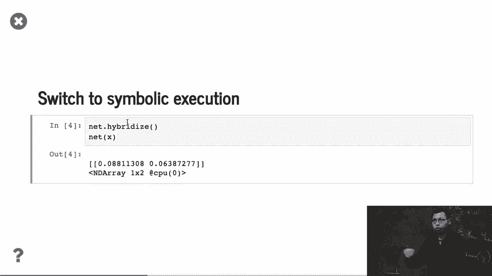

# 后续需要“编译器”将符号程序与真实数据结合，才能得到结果
# result = compile_and_run(program, data)
```
符号编程更高效，但编写和调试更复杂。

---

## 在神经网络中应用混合化 🧠

理解了基础概念后，我们来看看如何在深度学习框架中应用混合化。

### 命令式网络定义

首先，我们以命令式方式定义一个简单的多层感知机。

```python
from mxnet.gluon import nn

# 定义一个顺序网络
net = nn.Sequential()
net.add(nn.Dense(256, activation='relu'),
        nn.Dense(128, activation='relu'),
        nn.Dense(10))

# 初始化网络参数
net.initialize()

# 创建随机输入数据
import mxnet as mx
x = mx.nd.random.normal(shape=(1, 20))

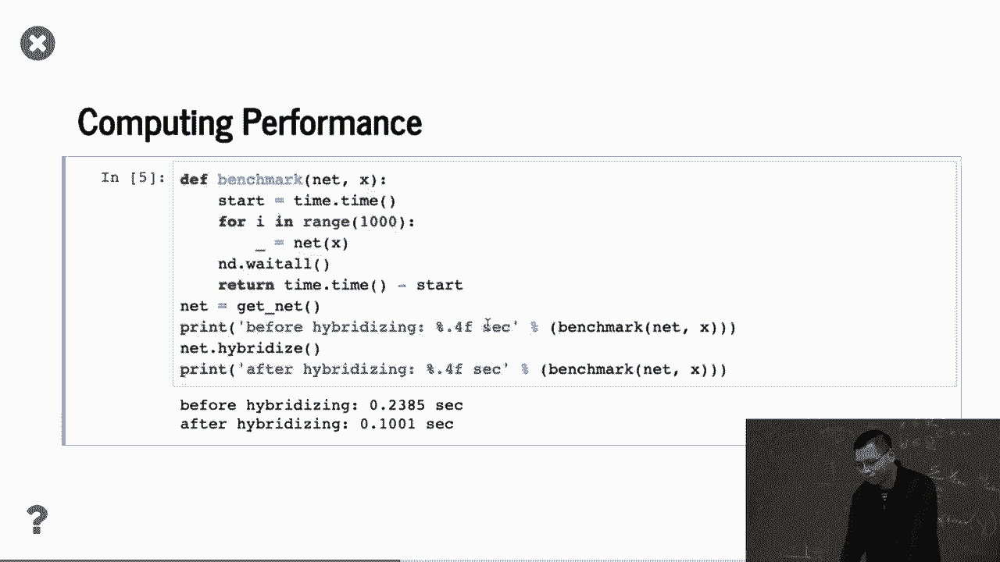

# 执行前向传播（命令式）
output = net(x)
print(output)
```
这段代码按层顺序执行计算，易于理解和调试。

### 启用混合化

现在，我们启用混合化。只需将网络类改为 `HybridSequential` 并调用 `.hybridize()` 方法。

```python
from mxnet.gluon import nn

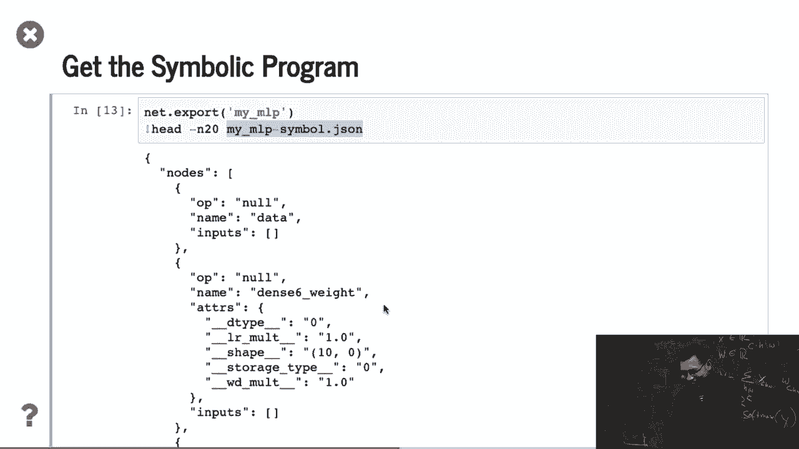

# 使用 HybridSequential
net = nn.HybridSequential()
net.add(nn.Dense(256, activation='relu'),
        nn.Dense(128, activation='relu'),
        nn.Dense(10))

net.initialize()
# 启用混合化
net.hybridize()

# 同样的输入，得到同样的结果
x = mx.nd.random.normal(shape=(1, 20))
output = net(x)
print(output)
```
表面上看，代码和结果没有变化。但内部执行机制已从命令式转为符号式。

---

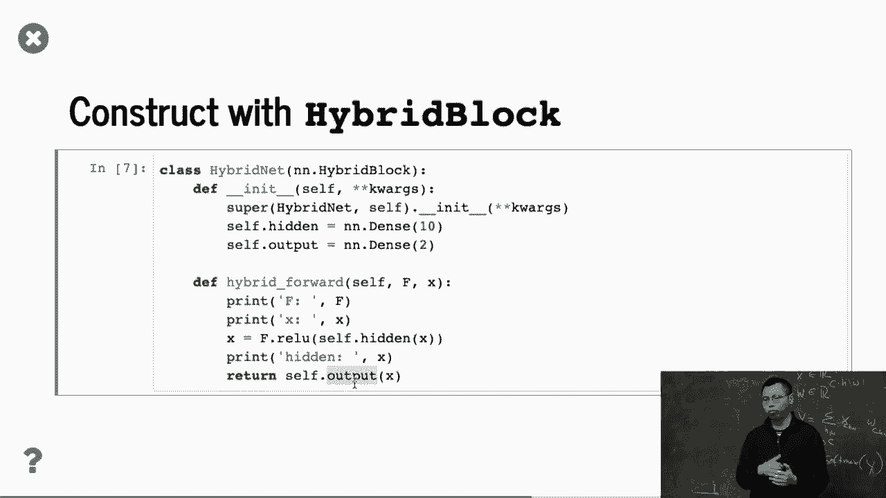

## 性能对比与原理 ⚡

上一节我们启用了混合化，本节中我们通过基准测试来看看它的性能优势，并探讨其工作原理。

### 性能基准测试

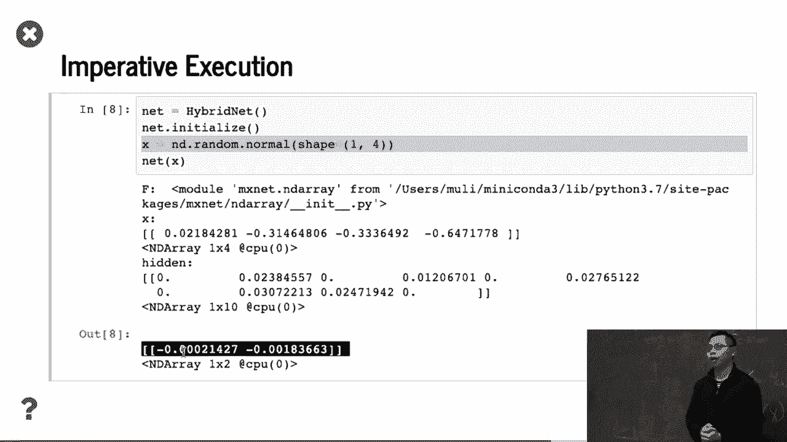

以下是测试网络前向传播 1000 次所需时间的函数：

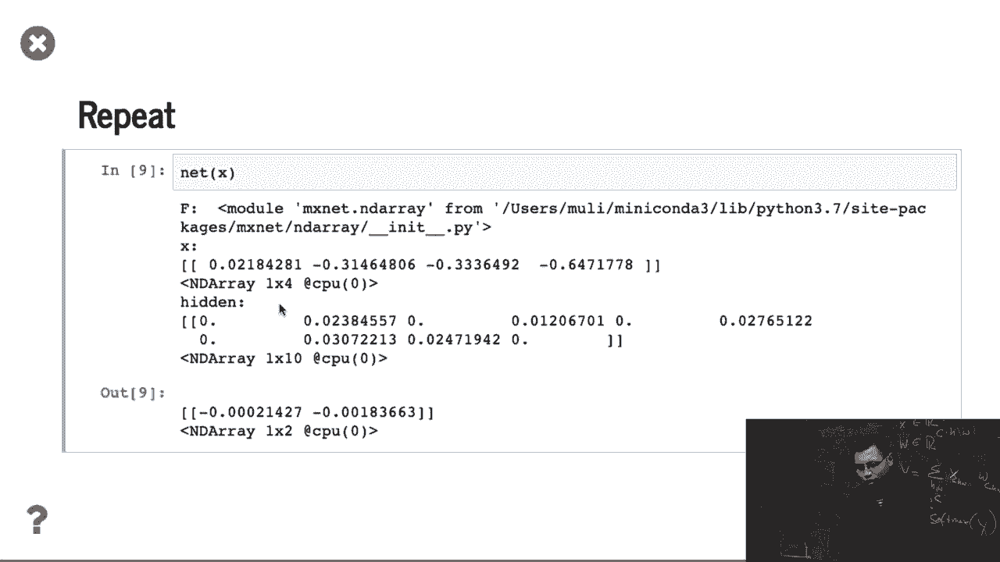

```python
import time
from mxnet import autograd

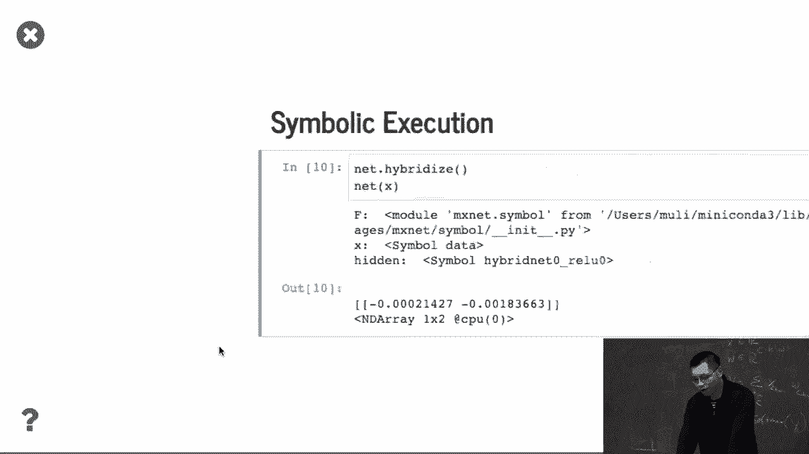

def benchmark(net, x):
    # 等待所有计算完成，确保计时准确
    mx.nd.waitall()
    start = time.time()
    for i in range(1000):
        y = net(x)
        y.wait_to_read() # 确保计算完成
    mx.nd.waitall()
    end = time.time()
    return end - start

# 测试未混合化的网络
net_imperative = nn.Sequential() # ... 添加层
print(f"命令式时间: {benchmark(net_imperative, x):.4f} 秒")

# 测试混合化的网络
net_hybrid = nn.HybridSequential() # ... 添加层
net_hybrid.hybridize()
print(f"混合式时间: {benchmark(net_hybrid, x):.4f} 秒")
```
**典型结果**：混合化后的网络执行速度通常快 2 倍或更多。对于计算量小但调用频繁的操作，节省的 Python 解释器开销尤为明显。


### 混合化如何工作

混合化的核心是 **“首次执行时构建，后续直接调用”**。

1.  当你第一次调用 `net(x)` 时（在 `hybridize()` 之后），系统会：
    *   跟踪执行流程。
    *   构建一个符号计算图。
    *   将该图编译为高效的低级代码（如 C++）并缓存。
2.  后续再次调用 `net(x)` 时，系统将直接运行缓存的编译后代码，绕过 Python 层的解释和执行。

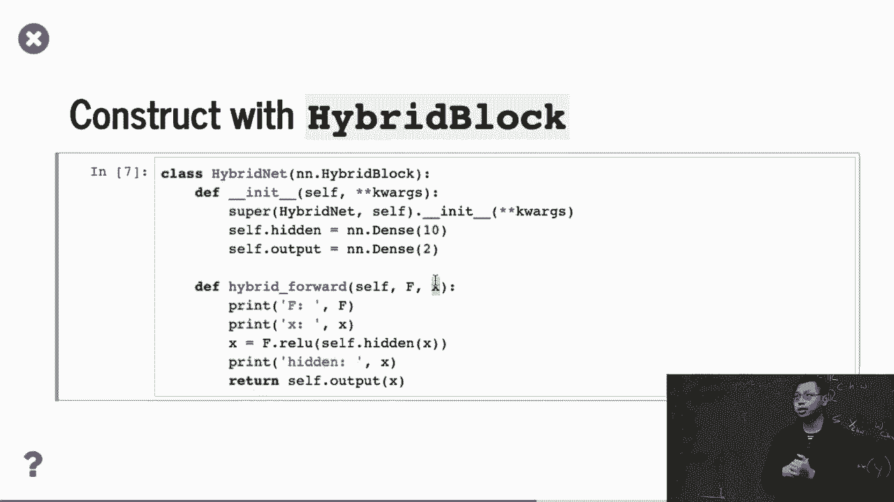

这意味着，网络前向传播中的 Python 代码（如循环、条件判断）只在第一次构建图时运行一次。这消除了 Python 的运行时开销，提升了性能。

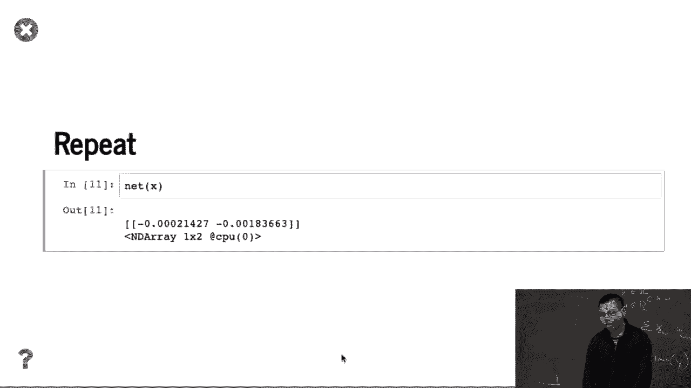

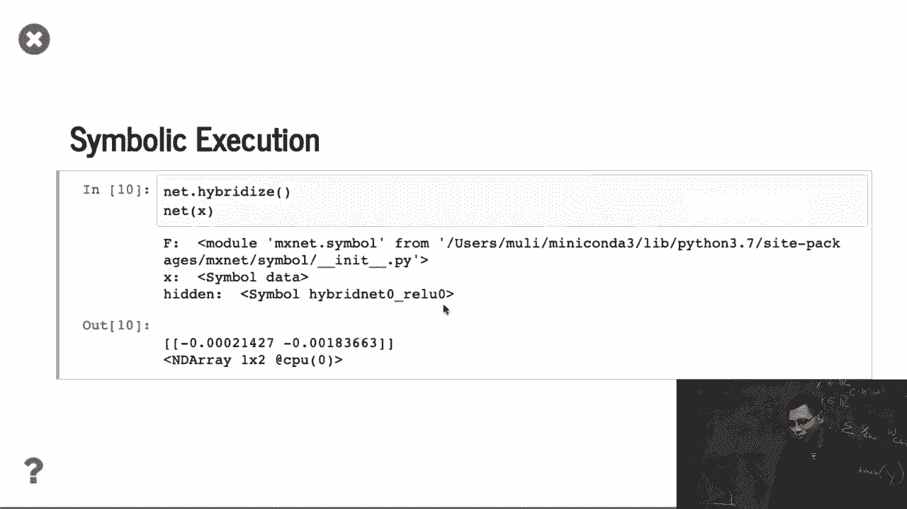

---

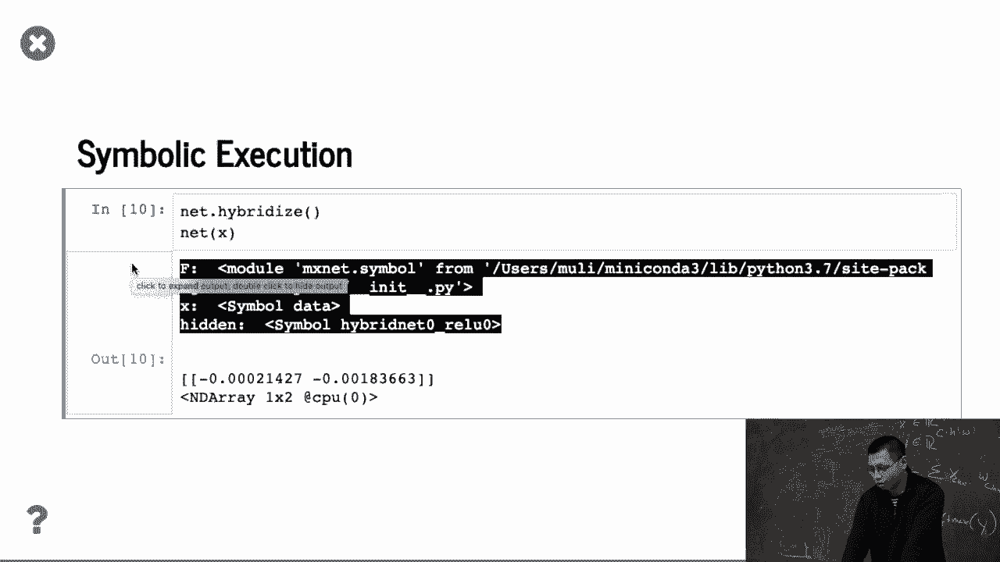

## 导出与部署 📦

混合化的另一个关键优势是便于模型部署。

### 导出符号图

你可以将混合化后的网络导出为与语言无关的中间表示（IR）。

```python
# 假设 net 是一个已混合化并运行过的 HybridSequential 网络
net.export('my_model')

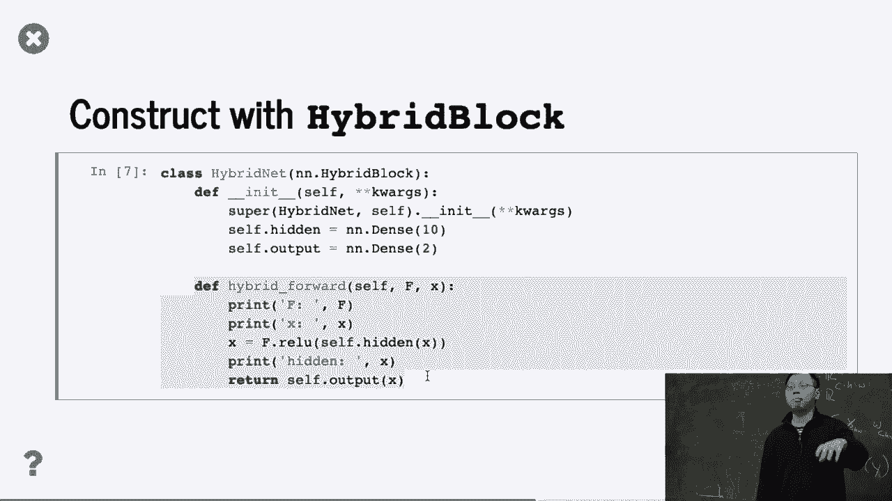

# 这会生成两个文件：
# - my_model-symbol.json (计算图定义)
# - my_model-0000.params (模型参数)
```
`my_model-symbol.json` 文件以 JSON 格式描述了整个计算图。它不依赖于 Python，可以被 C++、Java、JavaScript 等后端加载和执行。

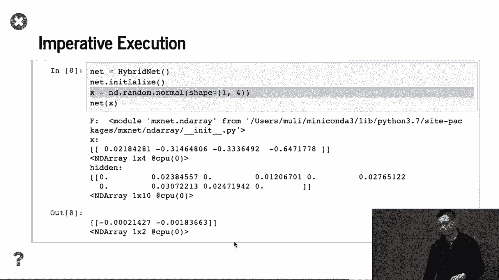

### 调试注意事项

在混合化模式下，调试方式有所不同：

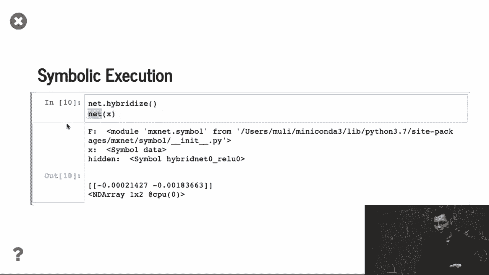

```python
class DebugNet(nn.HybridBlock):
    def __init__(self):
        super().__init__()
        self.hidden = nn.Dense(256)
        self.output = nn.Dense(10)

    def hybrid_forward(self, F, x):
        # F 是命名空间，在命令式下是 nd，在符号式下是 sym
        print(f"F 是: {F}")
        print(f"x 是: {x}")
        h = self.hidden(x)
        print(f"隐藏层输出是: {h}")
        return self.output(h)

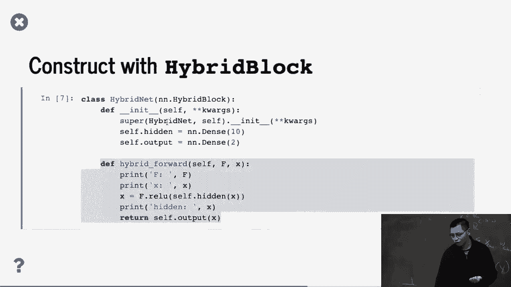

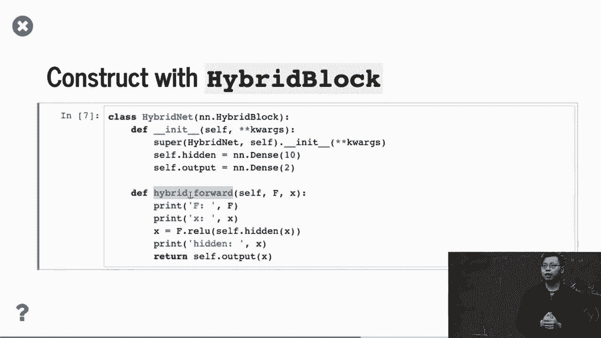

net = DebugNet()
net.initialize()
x = mx.nd.random.normal(shape=(1, 20))

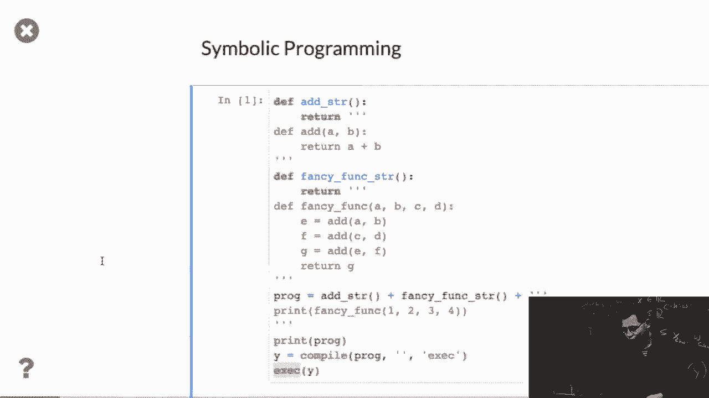

print("--- 第一次运行（构建图阶段）---")
output = net(x) # 此时会打印信息

print("\n--- 启用混合化后运行 ---")
net.hybridize()
output = net(x) # 第一次调用会打印
output = net(x) # 第二次调用不会打印，因为直接运行编译后的代码
```
**关键点**：`hybrid_forward` 中的 `print` 语句只在**第一次构建计算图时**执行。一旦图被编译缓存，后续调用将不再执行这些 Python 代码。因此，生产环境中的调试需要使用框架提供的专用符号式调试工具。

---

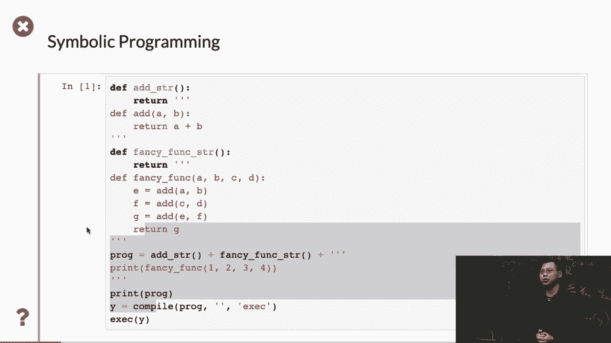

## 总结 🎯

本节课中我们一起学习了深度学习中混合化编程的核心内容：

1.  **概念对比**：理解了**命令式编程**（即时执行，易调试）与**符号式编程**（先构图后执行，高效便携）的根本区别。
2.  **混合化实践**：学会了使用 `HybridSequential` 和 `.hybridize()` 方法，轻松将命令式代码转换为混合模式，兼顾开发效率与运行性能。
3.  **性能提升**：通过基准测试验证了混合化能显著减少 Python 解释器开销，尤其适合小型、频繁调用的运算。
4.  **工作原理**：掌握了混合化“首次构建、后续缓存”的执行机制，它只在第一次运行时构建和编译符号图。
5.  **部署与调试**：学会了如何通过 `export` 导出模型为通用格式以便跨平台部署，并了解了在混合化模式下调试代码的特殊性（如 `print` 语句只在首次生效）。

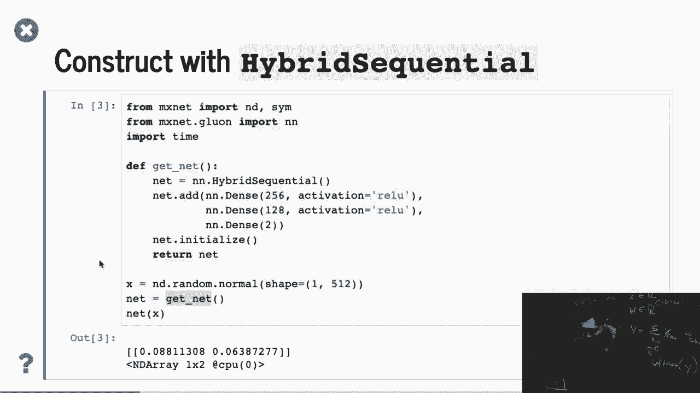

**核心建议**：在模型**开发、调试阶段使用命令式编程**，利用其交互性好、易调试的优点。在模型**训练和部署阶段启用混合化**，以获得最佳性能并实现轻松部署。