# 79：Python 中的多 GPU 训练 🚀

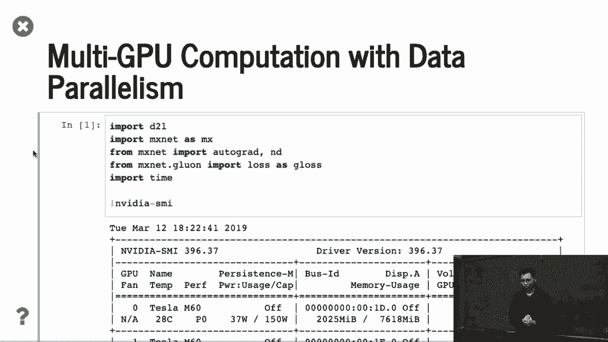

在本节课中，我们将学习如何在 Python 中利用多个 GPU 来加速深度学习模型的训练过程。我们将从基础概念开始，逐步讲解如何将数据和模型参数分配到不同的 GPU 上，以及如何同步梯度以实现并行计算。

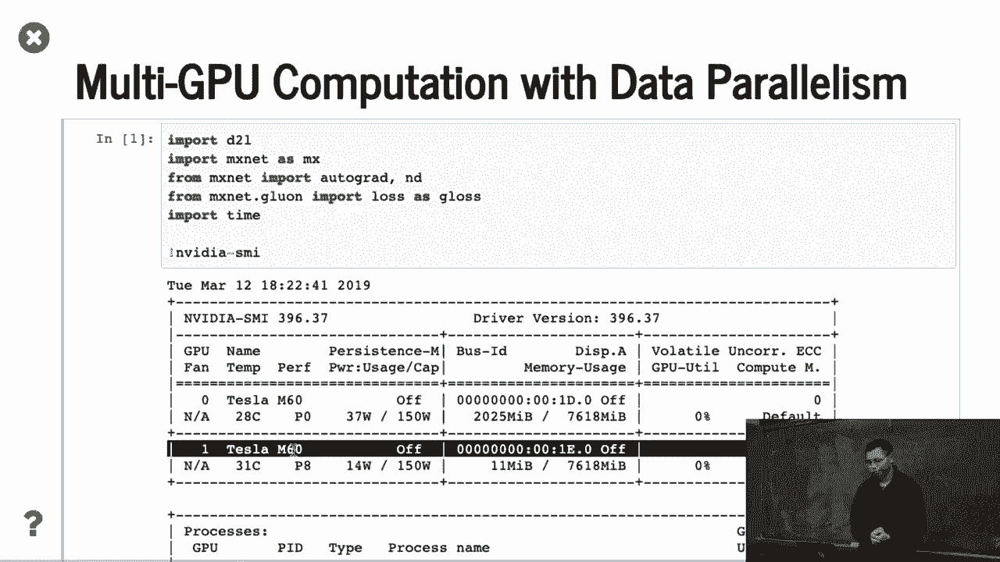

---

## 1. 准备工作与环境检查 🔍

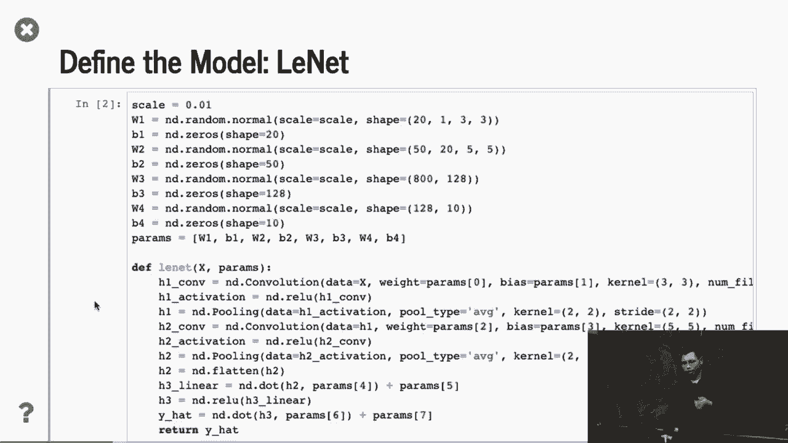

进行多 GPU 训练前，首先需要确保你的系统拥有多个 GPU。例如，本教程示例中使用了两个 GPU，其中一块是较旧的 M60 GPU。


确认硬件环境后，我们就可以开始构建训练流程了。

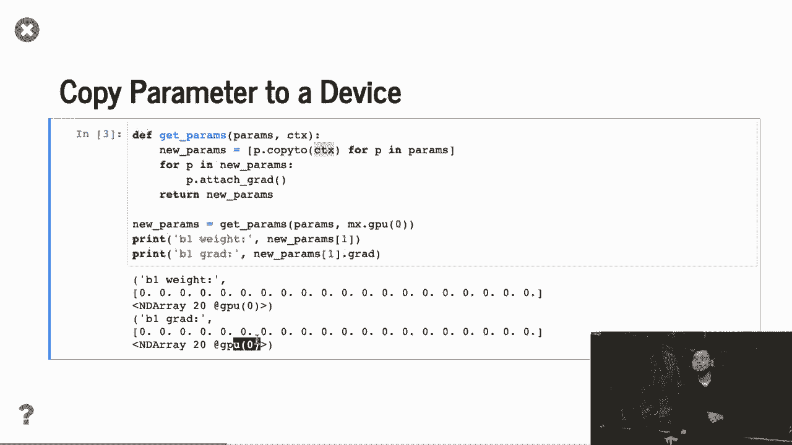

---

## 2. 参数初始化与设备分配 ⚙️

我们首先需要定义模型参数。默认情况下，参数初始化在 CPU 上。为了进行 GPU 训练，我们需要将这些参数复制到各个 GPU 设备上。

我们定义一个函数来完成这个操作：它接收 CPU 上的参数和一个目标 GPU 上下文，然后将每个参数复制到该 GPU 上，并为其分配梯度计算所需的空间。

```python
def copy_params_to_gpu(params, ctx):
    # 将参数复制到指定 GPU 上下文
    new_params = [param.copyto(ctx) for param in params]
    # 为梯度计算分配空间
    for param in new_params:
        param.attach_grad()
    return new_params
```

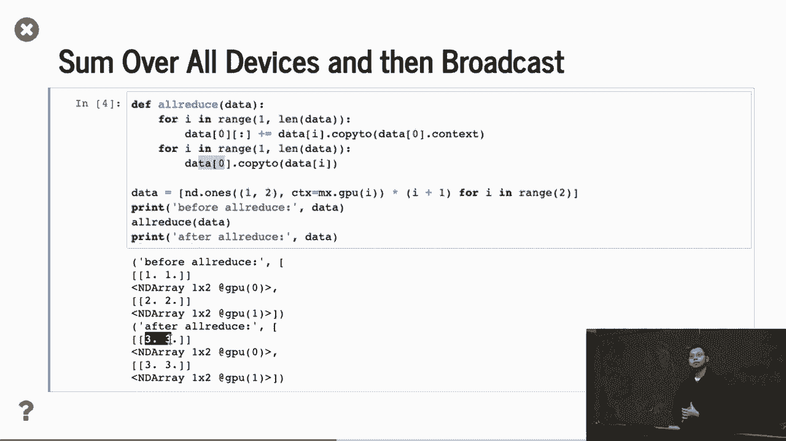

例如，将参数复制到 GPU 0 后，第一个权重和偏置参数都将位于 GPU 0 上。


---

## 3. 梯度同步与归约操作 🔄

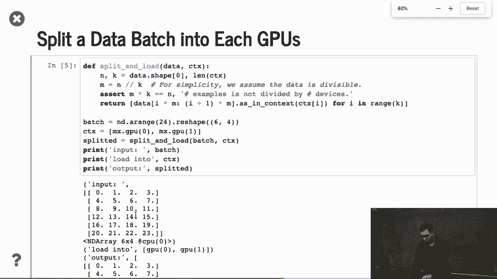

上一节我们介绍了如何将参数分配到不同 GPU。本节中我们来看看如何在不同 GPU 之间同步计算得到的梯度，这是多 GPU 训练的核心。

梯度同步通常采用“归约”（Reduce）操作，将分散在各个 GPU 上的梯度汇总。我们采用一种简单的方法：将所有 GPU 上的梯度相加，然后将结果复制回每个 GPU。

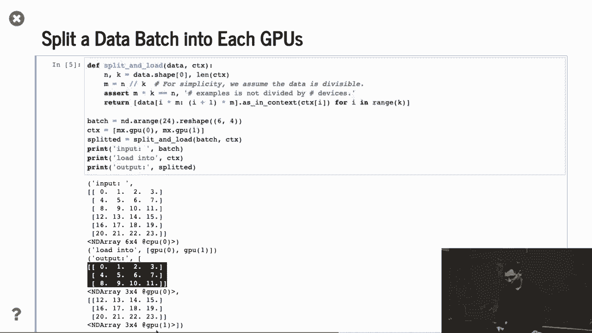

以下是实现梯度归约的关键步骤：

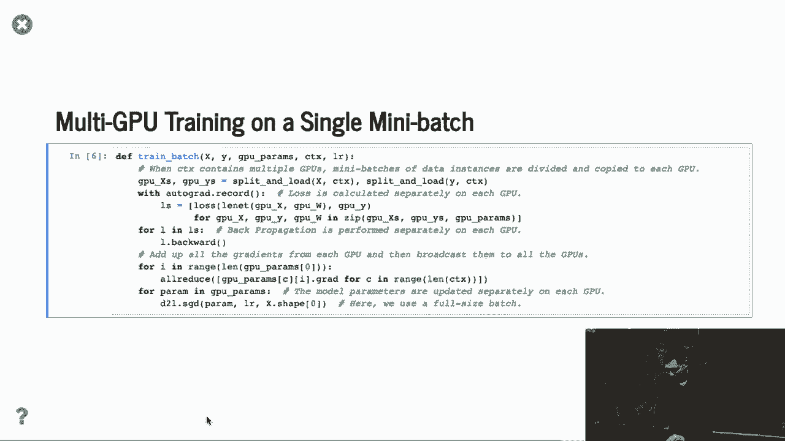

1.  收集所有 GPU 上的梯度数据。
2.  将所有梯度相加（通常在主 GPU，如 GPU 0 上进行）。
3.  将求和后的梯度广播回所有 GPU。

```python
def sync_gradients(grad_list):
    # grad_list 是一个列表，包含各个 GPU 上的梯度
    # 假设我们在 GPU 0 上进行归约
    for i in range(1, len(grad_list)):
        grad_list[0][:] += grad_list[i].copyto(grad_list[0].context)
    # 将归约后的梯度复制回其他 GPU
    for i in range(1, len(grad_list)):
        grad_list[i][:] = grad_list[0].copyto(grad_list[i].context)
```

例如，假设 GPU 0 和 GPU 1 上各有一个值为 2 的梯度张量，归约后，每个 GPU 上的梯度都会变为 4（2+2）。


---

## 4. 数据划分与分发 📊

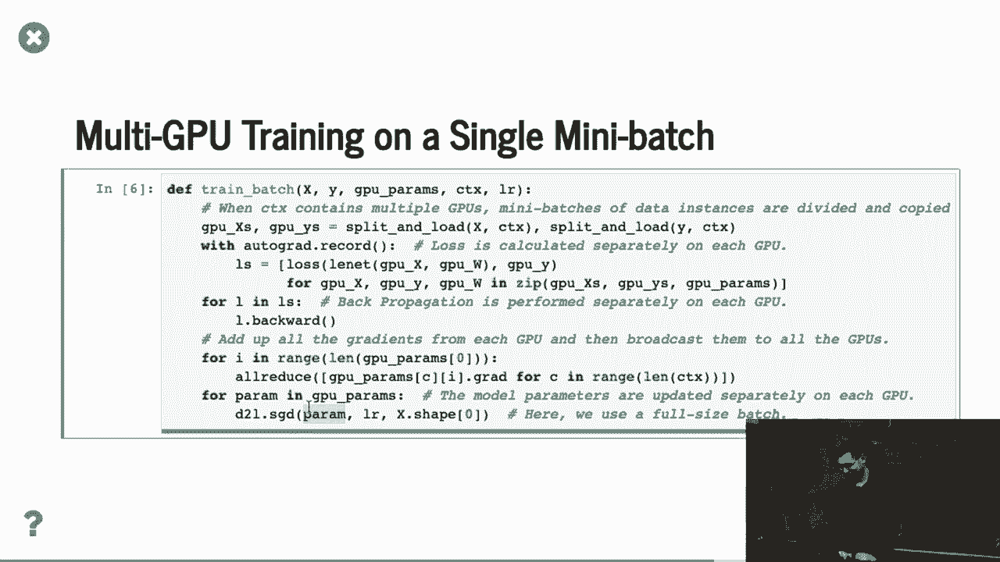

现在，我们需要将训练数据的一个批次（Batch）划分成多个部分，并分发到不同的 GPU 上。

假设我们有 K 个 GPU，一个包含 N 个样本的数据批次。理想情况下，N 能被 K 整除，这样每个 GPU 将获得 N/K 个样本。

以下是数据划分与分发的步骤：

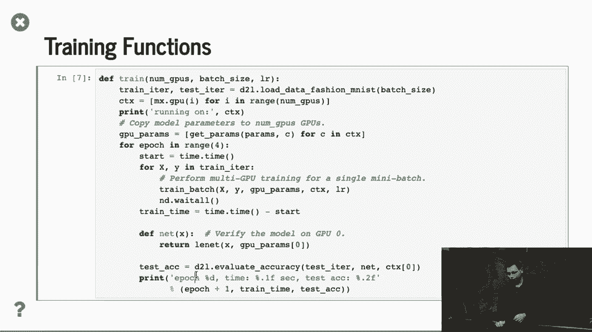

1.  计算每个 GPU 应获得的样本数 `m = N // K`。
2.  将数据批次在样本维度上均匀切分成 K 份。
3.  将每一份数据复制到对应的 GPU 上。

```python
def split_and_load_batch(data, ctx_list):
    # data: 一个批次的训练数据
    # ctx_list: GPU 上下文列表
    k = len(ctx_list)
    # 假设数据样本维度为0，且可被k整除
    split_size = data.shape[0] // k
    splits = []
    for i, ctx in enumerate(ctx_list):
        # 切分数据
        part = data[i * split_size: (i+1) * split_size]
        # 复制到指定 GPU
        splits.append(part.copyto(ctx))
    return splits
```

例如，一个在 CPU 上包含 6 个样本的批次，分发给 2 个 GPU 后，前 3 个样本会分配到 GPU 0，后 3 个样本会分配到 GPU 1。


---

## 5. 单批次多 GPU 训练流程 🏃‍♂️

理解了数据分发和梯度同步后，我们可以将它们组合起来，构建一个完整的单批次多 GPU 训练流程。

这个流程的核心思想是：**数据并行**。每个 GPU 持有相同的模型参数副本，但处理不同的数据子集，最后同步梯度来更新模型。

以下是单批次训练的关键步骤：

1.  **数据分发**：将输入 `X` 和标签 `Y` 划分并加载到各个 GPU。
2.  **并行前向与反向传播**：在每个 GPU 上，使用其分配到的数据和参数副本，独立计算损失并进行反向传播以获取梯度。
3.  **梯度同步**：将所有 GPU 计算出的梯度进行归约（如求和平均）。
4.  **参数更新**：使用同步后的梯度，在每个 GPU 上更新其参数副本（由于梯度相同，更新后的参数也保持一致）。

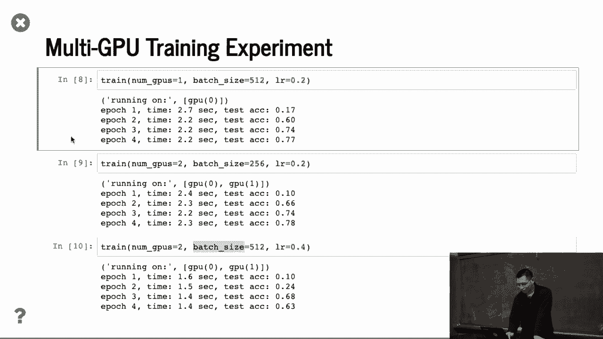

```python
def train_batch_multi_gpu(X, Y, param_list, ctx_list):
    # 1. 拆分数据
    X_splits = split_and_load_batch(X, ctx_list)
    Y_splits = split_and_load_batch(Y, ctx_list)

    losses = []
    # 2. 在每个GPU上并行计算损失和梯度
    with autograd.record():
        for i, (x, y, params) in enumerate(zip(X_splits, Y_splits, param_list)):
            # 在每个GPU上进行前向传播
            loss = model_forward(params, x, y)
            losses.append(loss)
    # 反向传播在每个GPU上自动并行执行
    for loss in losses:
        loss.backward()

    # 3. 同步所有GPU上的梯度
    grad_list = [params.grad for params in param_list]
    sync_gradients(grad_list)

    # 4. 更新每个GPU上的参数
    for params in param_list:
        update_parameters(params) # 例如: params[:] -= lr * params.grad
```

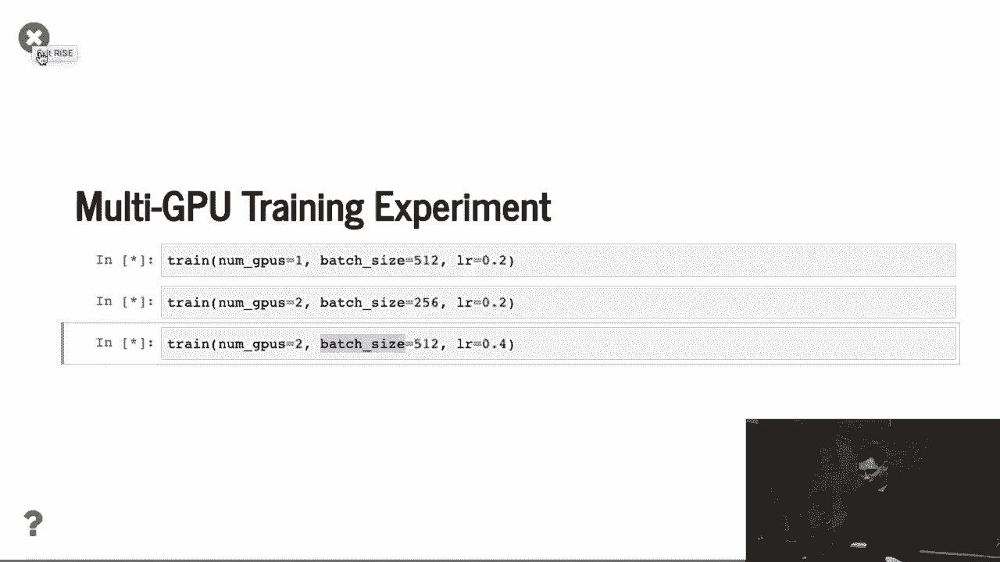

通过自动并行化机制，系统会尽可能地并行执行数据复制、前向计算和反向传播等操作。

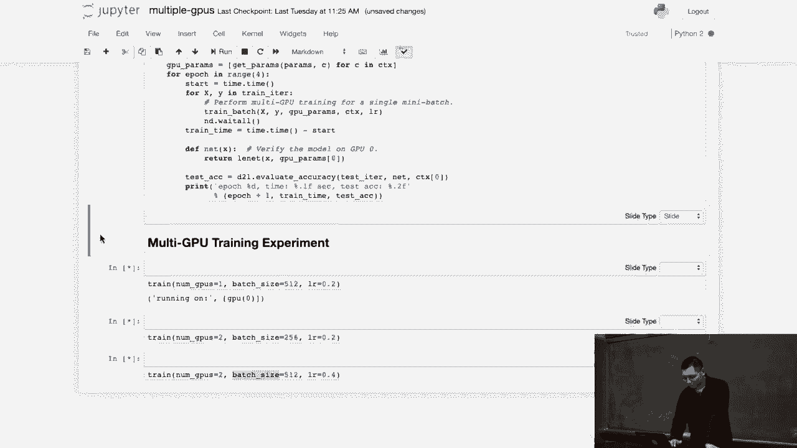

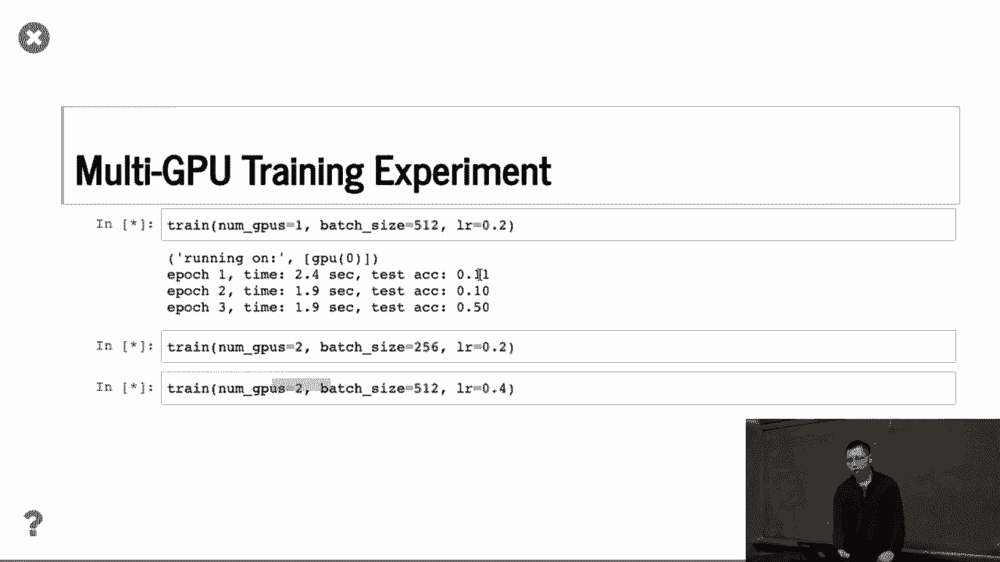


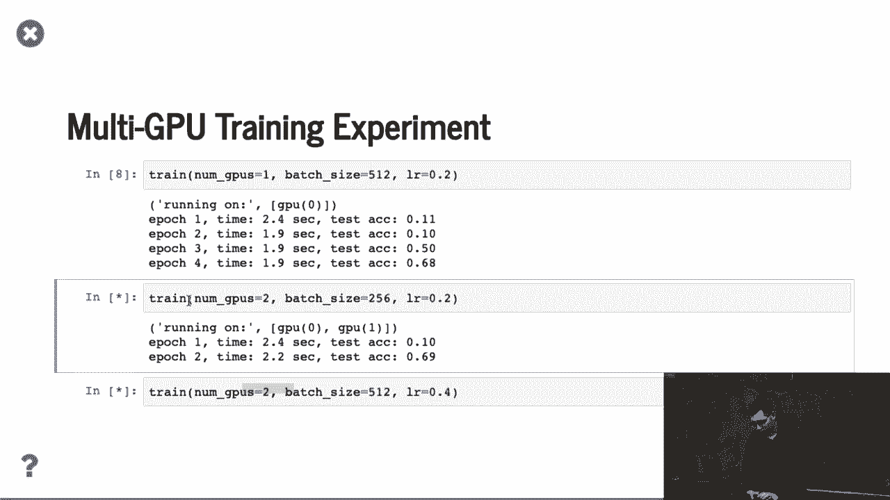

---

## 6. 完整训练循环与性能分析 📈

将单批次训练流程嵌入完整的训练循环中，就构成了多 GPU 训练程序。训练函数的结构与单 GPU 训练相似，主要区别在于需要管理多个 GPU 上下文和数据划分。

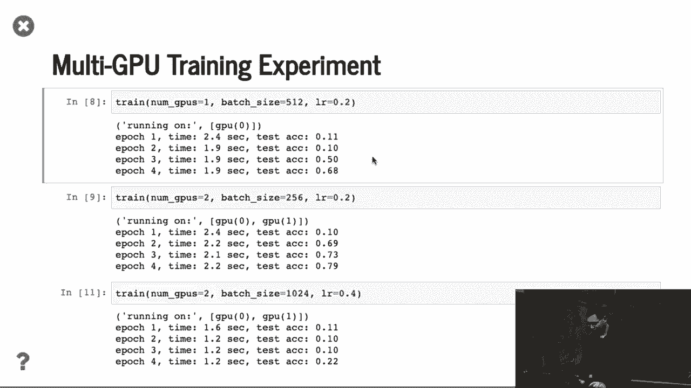

```python
def train_multi_gpu(num_gpus, batch_size, lr, num_epochs):
    # 创建GPU上下文列表
    ctx_list = [gpu(i) for i in range(num_gpus)]
    # 初始化参数并复制到各个GPU
    initial_params = init_params()
    param_list = [copy_params_to_gpu(initial_params, ctx) for ctx in ctx_list]

    for epoch in range(num_epochs):
        for X_batch, Y_batch in data_iter(batch_size):
            # 在多个GPU上训练一个批次
            train_batch_multi_gpu(X_batch, Y_batch, param_list, ctx_list)
        # ... 打印日志，评估模型等 ...
```

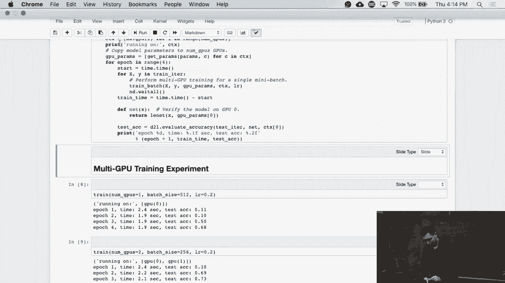

**性能分析**：
单纯增加 GPU 数量不一定能线性提升训练速度。例如，将 GPU 从 1 个增加到 2 个，但保持总批次大小（Batch Size）不变，那么每个 GPU 处理的子批次大小会减半，这可能无法充分利用 GPU 的计算能力，同时通信开销会显得相对更大。

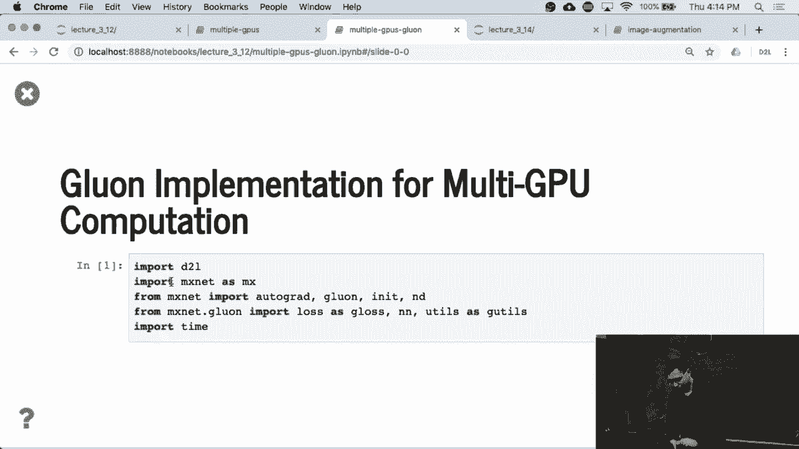

为了获得更好的加速比，常见的做法是：
*   **增大总批次大小**：例如，使用 2 个 GPU 时，将总批次大小翻倍，这样每个 GPU 处理的子批次大小与单 GPU 时相同。
*   **调整学习率**：增大批次大小后，通常需要适当增大学习率或调整学习率调度策略。

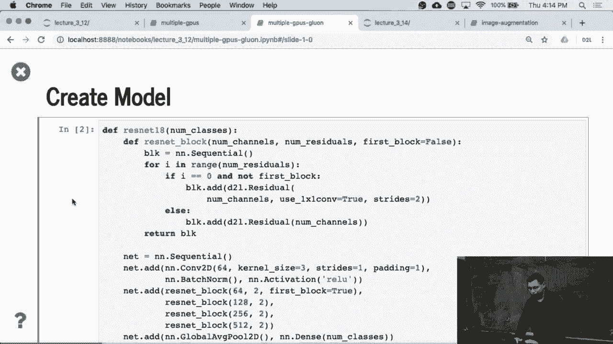

需要注意的是，批次大小受 GPU 内存限制，并且过大的批次大小可能影响模型的收敛速度和最终精度。


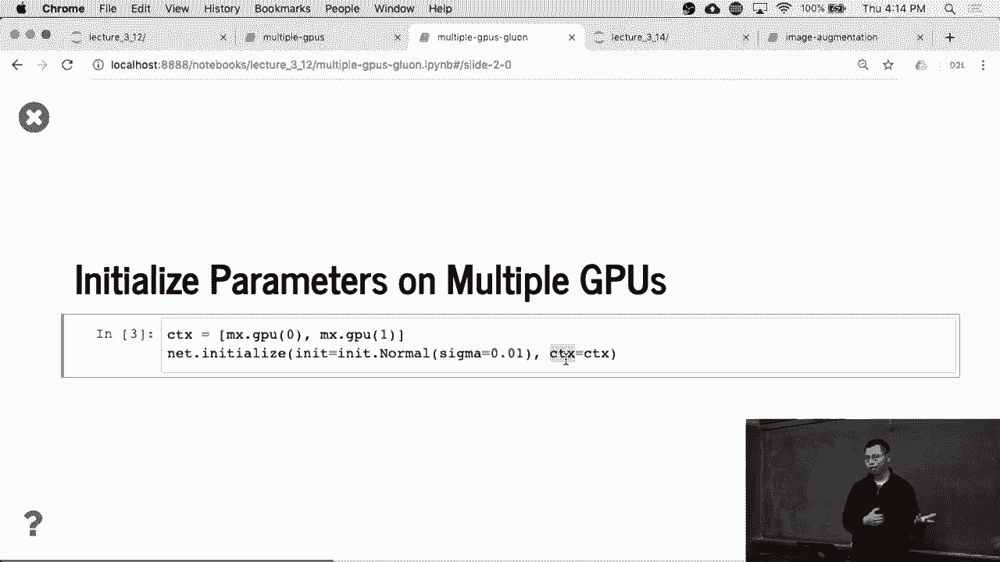

---

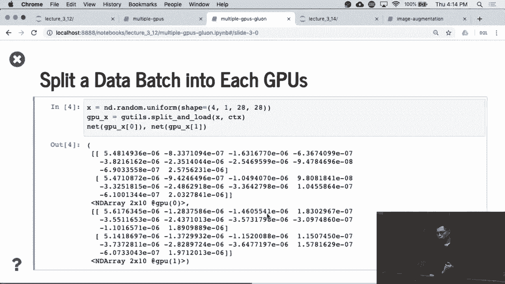

## 7. 使用高级框架简化操作 🛠️

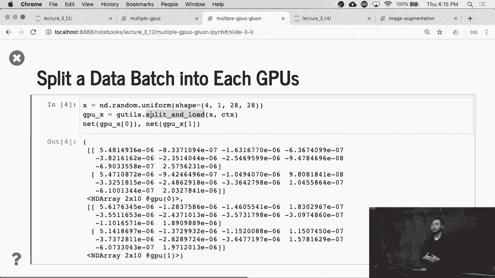

在实际应用中，我们可以使用深度学习框架（如 PyTorch, TensorFlow, MXNet 等）内置的多 GPU 支持来极大简化上述过程。

这些框架通常提供高级 API，只需指定设备列表，它们会自动处理参数复制、数据分发和梯度同步。

例如，在 PyTorch 中，可以使用 `nn.DataParallel` 包装模型：

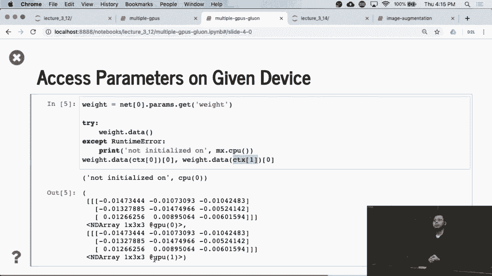

```python
import torch.nn as nn
model = MyModel()
if torch.cuda.device_count() > 1:
    model = nn.DataParallel(model) # 包装模型，实现数据并行
model.to('cuda')
```

在训练时，框架会自动将每个批次的数据划分并送到不同 GPU，收集梯度并更新参数。你只需要像单 GPU 训练一样编写前向和反向传播代码即可。


---

## 总结 🎯

本节课中我们一起学习了 Python 多 GPU 训练的核心概念与实现步骤：

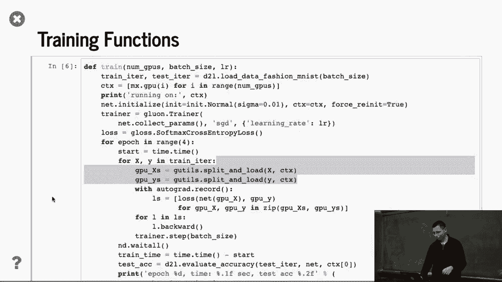

1.  **环境准备**：确认拥有多个 GPU 设备。
2.  **参数分配**：将模型参数从 CPU 复制到各个 GPU。
3.  **数据并行**：将每个训练批次的数据划分并分发到不同 GPU。
4.  **梯度同步**：通过归约操作（如求和）同步所有 GPU 计算出的梯度，这是保证模型一致性的关键。
5.  **训练流程**：在每个 GPU 上并行执行前向和反向传播，然后同步梯度并更新参数。
6.  **性能调优**：通过增加总批次大小等方式来更好地利用多 GPU 的计算能力，同时注意通信开销和收敛性。
7.  **框架应用**：利用现代深度学习框架的高级 API 可以大幅简化多 GPU 编程的复杂性。

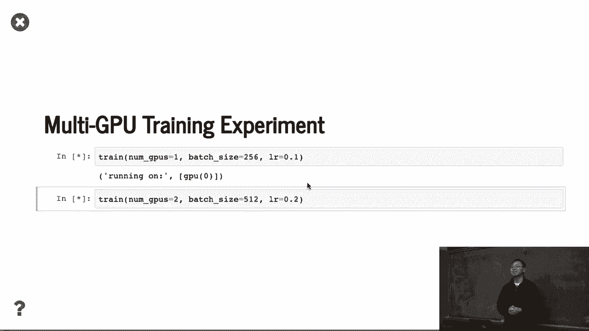

多 GPU 训练是扩展深度学习模型训练规模、缩短实验周期的重要手段。理解其底层原理有助于你更有效地使用高级框架并调试相关问题。