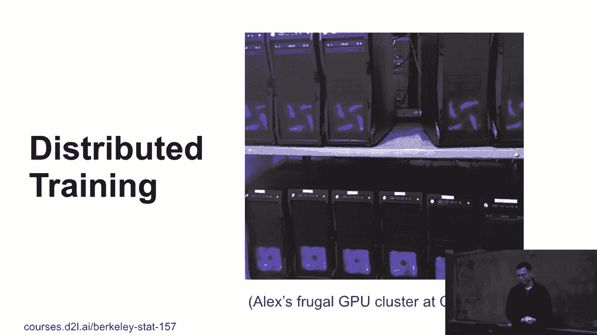
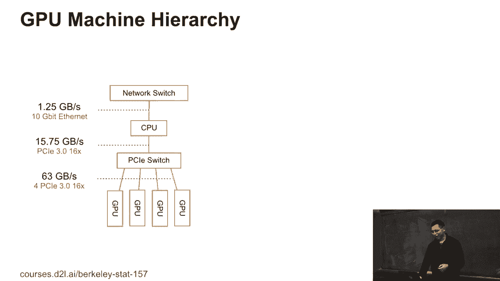
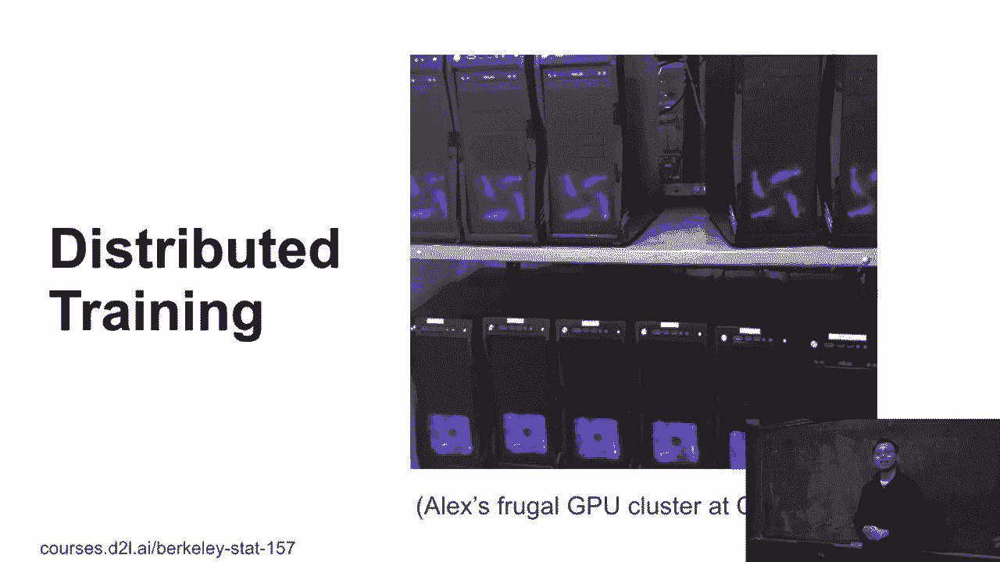
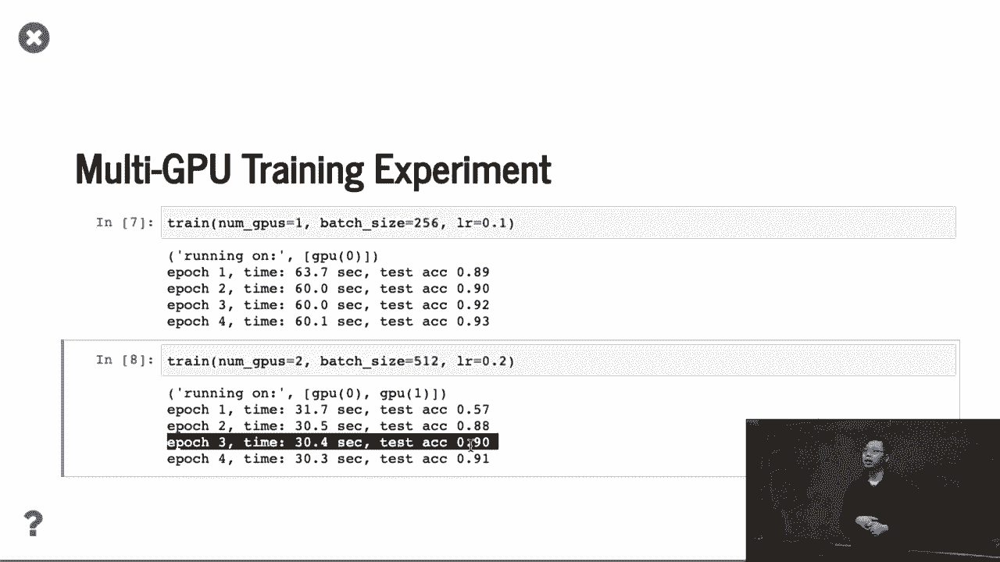

# 80：多机训练 🚀

在本节课中，我们将学习如何从单机多GPU训练扩展到多机多GPU训练。我们将探讨其架构、通信开销、性能考量以及实际应用中的注意事项。

---

## 从单机到多机：架构概述

上一节我们介绍了单机多GPU训练，本节中我们来看看多机多GPU的架构。

假设数据位于分布式文件系统中，可供所有机器访问。我们有多台机器，每台机器上配备多个GPU。模型参数不再集中于单机，而是分布在多台机器上。例如，一个50层的ResNet模型可以分配到4台机器上，每台机器处理约12层。数据通过网络读取，梯度通过网络发送和更新。

这种架构与单机多GPU训练类似，但存在通信层次。GPU与同机CPU的通信（通过PCIe）速度较快，而机器间的网络通信速度较慢。我们需要关注这种层次结构带来的性能影响。

---

## 硬件成本与可靠性 💸

构建一个多机GPU集群可以控制成本。例如，四年前可以通过购买二手数据中心CPU和廉价主板搭建一个包含16台机器的集群，总成本约2万美元。

然而，硬件可靠性是一个重要问题。GPU功耗高，在密集计算下容易过热或故障，尤其是消费级GPU。系统后端需要处理各种故障。一个有效的策略是频繁保存检查点（例如每两分钟），以便在故障发生时能从最新状态恢复训练。

---

## 多机训练流程 🔄

以下是多机训练中一个批次的处理流程。

假设有两个工作节点，一个批次有100个样本。流程如下：
1.  每台机器获得50个样本。
2.  每台机器将其数据进一步分配到本机的各个GPU上（例如，2个GPU各得25个样本）。
3.  参数服务器将参数复制到每台机器，每台机器再复制到其每个GPU。
4.  每个GPU计算其分配数据的梯度。
5.  单台机器内，汇总所有本地GPU的梯度。
6.  每台机器将汇总后的梯度推送到远程参数服务器进行全局更新。
7.  参数服务器更新参数，并开始下一轮循环。

这个流程的关键在于**两级聚合**：先在单机内聚合GPU梯度，再在机器间进行全局聚合。这样做是为了减少网络通信量。

---

## 同步随机梯度下降与性能 ⚡

在多机多GPU环境下，我们通常使用**同步随机梯度下降**。这意味着每个GPU处理等量的工作负载，并且所有GPU必须同步完成梯度计算后才能进行参数更新。

在理想情况下，使用 `n` 个GPU应能达到近 `n` 倍的训练加速。性能主要由两个时间因素决定：
*   **T1**：单个GPU计算其分配数据梯度的时间。
*   **T2**：在网络中发送和接收梯度数据的时间。

实际每批次的耗时是 **`max(T1, T2)`**。为了隐藏通信开销（T2），我们可以增加每个GPU的批次大小（B）或使用更多GPU（N），从而使T1增大。当T1 > T2时，通信开销就被计算时间“掩盖”了，从而获得更好的加速比。

然而，批次大小并非越大越好。过大的批次大小可能会影响模型收敛的最终精度，需要在系统性能和统计效率之间做出权衡。

---

## 多机训练实用建议 📋

成功进行多机训练需要考虑多个方面，以下是关键建议：

**1. 数据集与任务**
确保数据集足够大，任务计算量足够重。如果单GPU训练一个批次只需几秒钟，那么多机通信开销将占主导，难以获得有效加速。

**2. 硬件选择**
选择GPU间和机器间通信带宽高的硬件。如果自建集群，需要注意主板对多GPU的支持以及交换机网络的性能。云服务通常已优化此类配置。

**3. 避免CPU瓶颈**
当一台机器上挂载多个GPU时，负责数据加载和预处理的CPU可能成为瓶颈。需要监控数据吞吐量，确保CPU能及时为GPU供给数据。

**4. 模型选择**
选择**计算开销与通信开销比值高**的模型。通信开销大致等于模型参数量。例如，SqueezeNet参数量小（~10MB），计算量大，比值高；而AlexNet因包含大量全连接层，参数量大（~700MB），该比值较低，在多机训练中效率不佳。

**5. 优化策略**
使用更大的批次大小来提升系统效率，并配合学习率预热等技巧来保证模型在超大批次下的收敛性能。

---

## 性能示例 📊

以ResNet在CIFAR-10数据集上的训练为例：
*   使用单GPU，调整至合适的批次大小和线性学习率，每个epoch耗时约60秒，达到一定准确率。
*   切换到两个GPU，批次大小加倍，学习率相应调整。每个epoch时间几乎减半，实现了近线性加速，且最终测试准确率基本保持一致。

这表明对于计算量适中的任务和数据集，多GPU训练可以带来显著的效率提升。

---

## 总结

本节课中我们一起学习了多机多GPU训练。
我们了解了其分布式架构、两级通信流程以及同步梯度下降的原理。
我们认识到性能受计算时间T1和通信时间T2的制约，并通过增大批次大小来优化。
最后，我们探讨了从数据集、硬件、模型到优化策略的一系列实用建议，以帮助在实际应用中有效实施和调试多机训练。