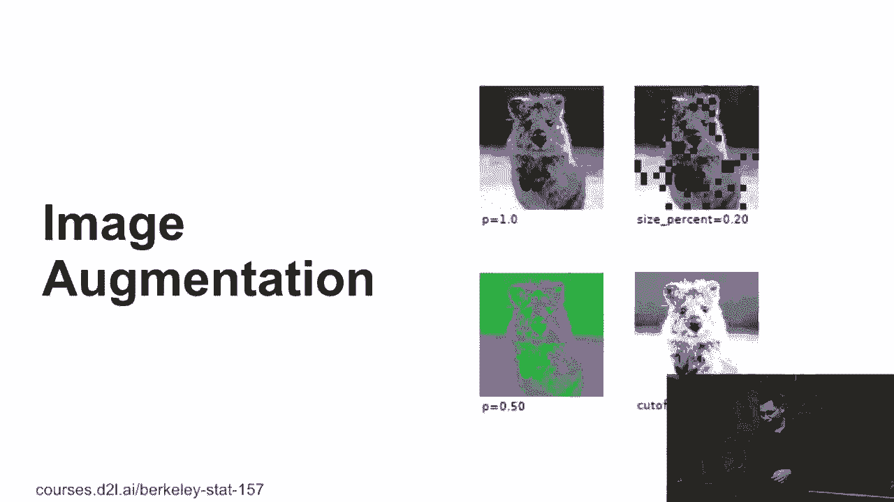
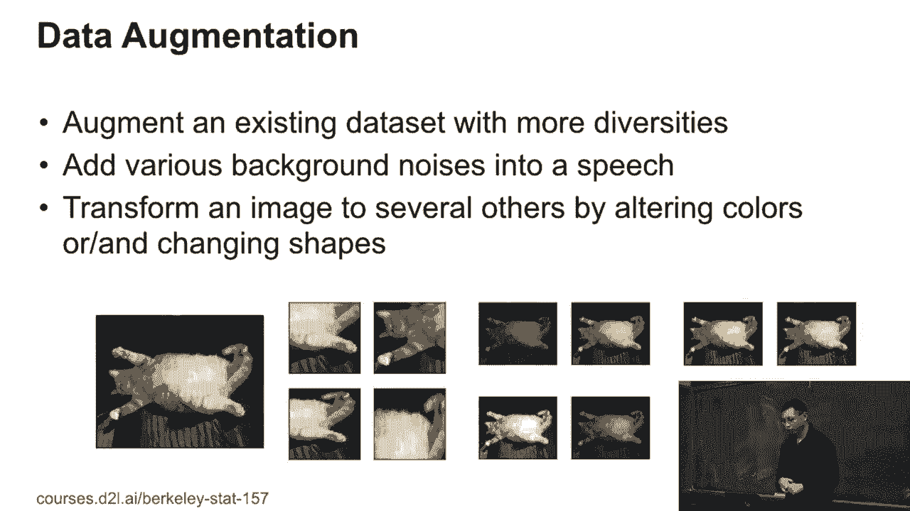
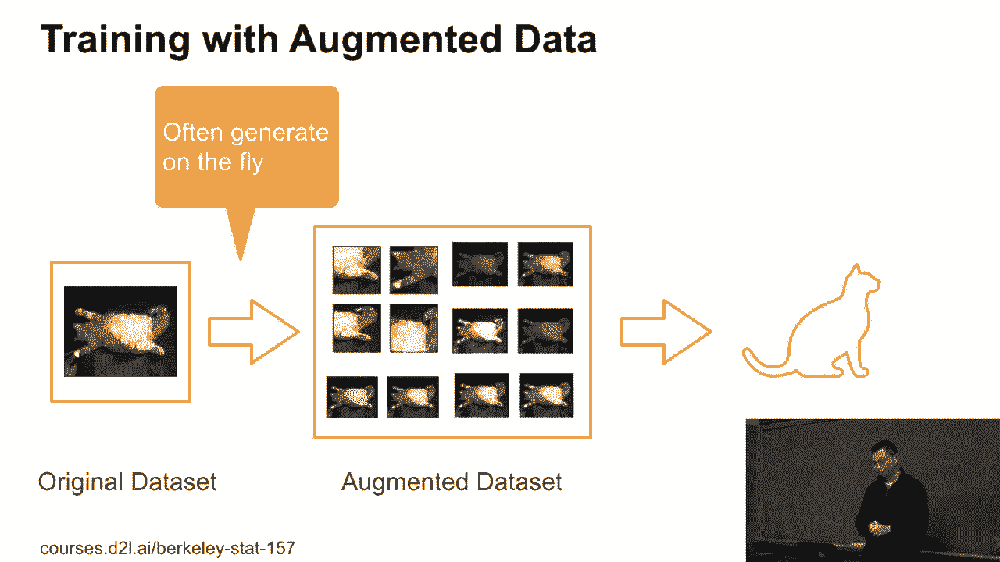
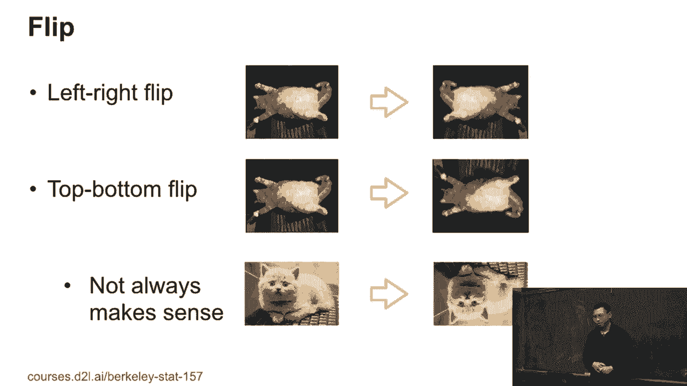
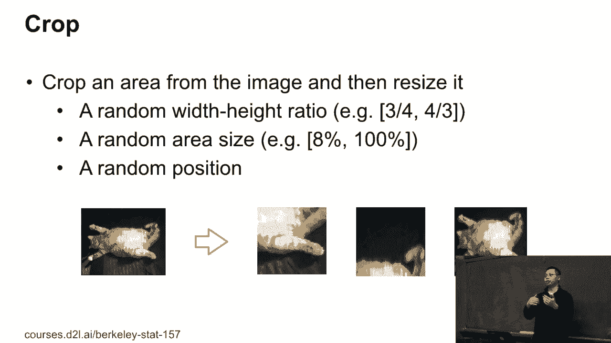
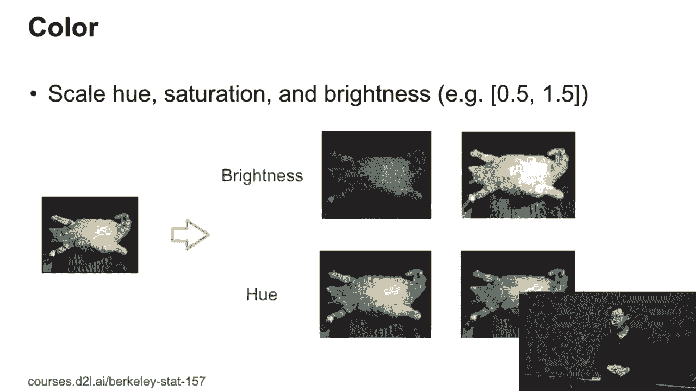
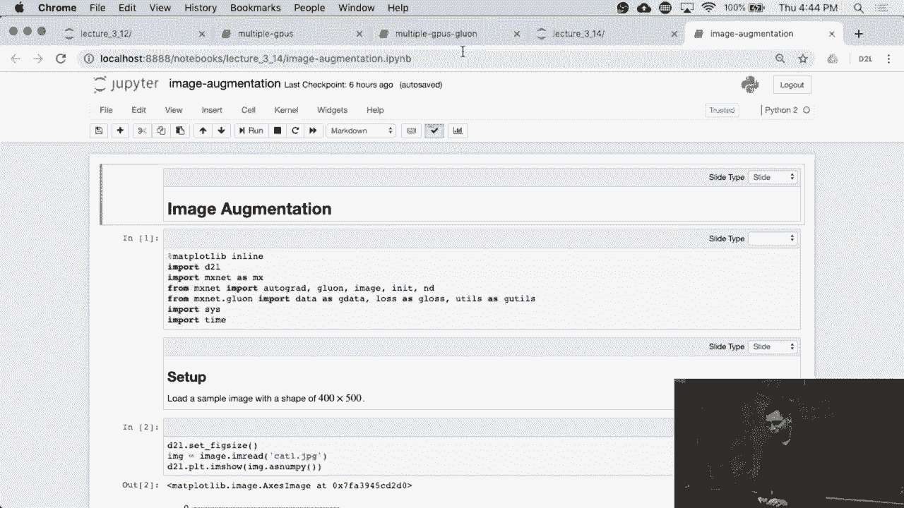

# 81：图像增强技术详解 🖼️



在本节课中，我们将学习图像增强技术。这项技术通过人为地改变图像的外观，来增加训练数据的多样性，从而帮助机器学习模型更好地适应现实世界中复杂多变的环境。

## 📖 概述

图像增强是解决模型在实验室表现良好，但在实际部署中因环境变化（如光线、角度、背景）而性能下降问题的关键技术。我们将通过一个真实案例引入，并详细介绍几种核心的图像增强方法及其实现。

## 🎯 一个真实案例：自动售货机的识别难题

大约两个月前，一家初创公司在消费电子展上展示了一款小型自动售货机。该机器通过摄像头识别用户拿取的饮料瓶。

在实验室环境中，识别准确率高达99%。然而，在展会现场，系统却无法正常工作。

经过调试，他们发现了两个主要原因：

1.  展厅的夜间色温与实验室不同，导致图像整体偏黄。
2.  展台上放置的盒子造成了桌面光线反射，而实验室没有这种情况。

为了解决这个问题，工程师们通宵工作：
*   调整光线设置，使其与展厅环境匹配。
*   采集并标注了大量新环境下的数据，重新训练模型。
*   用桌布覆盖桌面，以消除光线反射。

这个案例非常典型。无论是面部识别、语音识别还是其他感知任务，环境变化（如室内外光线、背景噪音、设备差异）都会严重影响模型性能。图像增强技术正是为了应对这一挑战而生。

## 🔧 图像增强的核心原理

图像增强的工作原理是：我们拥有一个原始数据集（例如一张猫的图片），然后通过一系列变换生成一个增强数据集。这个增强数据集包含了原始图像的多种变体，从而形成了一个规模更大、内容更多样化的数据集用于模型训练。

**核心公式**：
`增强数据集 = 原始数据集 + 变换操作（翻转、裁剪、调色等）`



在实际操作中，我们通常不会预先生成并存储所有增强图像，而是在训练过程中实时生成。每次读取一批图像时，都会随机应用增强操作，然后送入模型训练。

## 🛠️ 常用图像增强技术

接下来，我们来看看几种常用且有效的图像增强技术。

### 1. 翻转



翻转操作包括水平翻转和垂直翻转。水平翻转（左右翻转）通常很有效，因为它符合许多物体的自然对称性。垂直翻转（上下翻转）则需谨慎使用，因为很多场景（如天空在上、地面在下）不符合物理规律。

**代码示例（伪代码）**：
```python
# 随机水平翻转
if random() > 0.5:
    image = flip_left_right(image)
# 随机垂直翻转（谨慎使用）
if random() > 0.5:
    image = flip_up_down(image)
```

### 2. 裁剪



裁剪操作首先在图像中随机选择一个矩形区域，然后将该区域调整到统一的尺寸。这有助于处理不同尺寸的输入图像，并让模型关注物体的局部特征。

以下是裁剪步骤：
*   随机选择宽高比（例如在3/4到4/3之间）。
*   随机选择区域大小（例如占原图的8%到100%）。
*   随机确定区域位置。
*   将裁剪出的区域调整为模型所需的固定尺寸。

### 3. 颜色变换

颜色变换通过调整图像的色调、饱和度和亮度来模拟不同的光照和拍摄条件。例如，可以将亮度降低或提高一定比例。

**代码示例（伪代码）**：
```python
# 随机调整亮度
brightness_factor = random.uniform(0.5, 1.5) # 在50%到150%之间随机
image = adjust_brightness(image, brightness_factor)
# 类似地可以调整饱和度和对比度
```



### 4. 其他高级增强技术

除了上述基础方法，还存在约50种不同的增强技术，例如：
*   添加噪声
*   调整锐度
*   应用模糊
*   模拟透视变换（不同角度、距离拍摄的效果）



这就像使用程序对图像进行自动化的“Photoshop”处理，以创造出尽可能多样的训练样本。

## 💻 实践与应用

在Python中，我们可以利用诸如`torchvision.transforms`、`albumentations`或`imgaug`等库轻松实现上述图像增强操作。通过将这些增强流程集成到数据加载器中，我们就能在训练过程中实时地丰富数据集。

## 📝 总结

本节课我们一起学习了图像增强技术。我们从实际部署问题出发，理解了增强技术的重要性。随后，我们深入探讨了其核心原理，即通过对原始图像施加随机变换来生成多样化的训练数据。最后，我们详细介绍了翻转、裁剪、颜色变换等几种核心的增强方法及其实现逻辑。



掌握图像增强，能有效提升模型的鲁棒性和泛化能力，是构建实用计算机视觉系统不可或缺的一环。