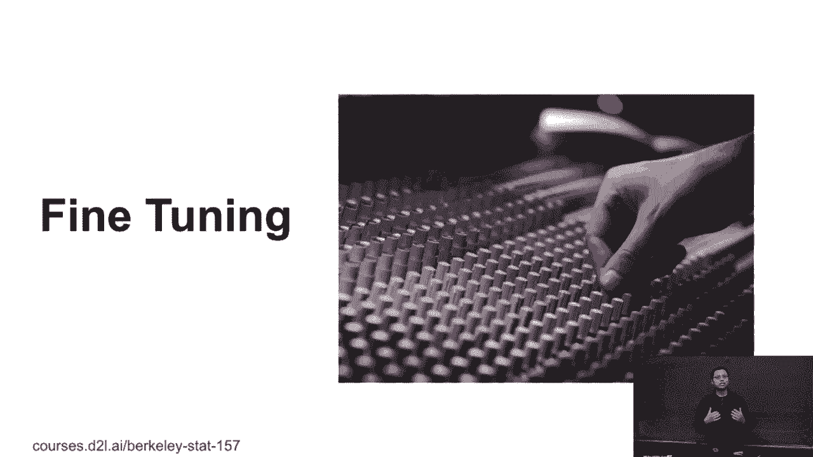
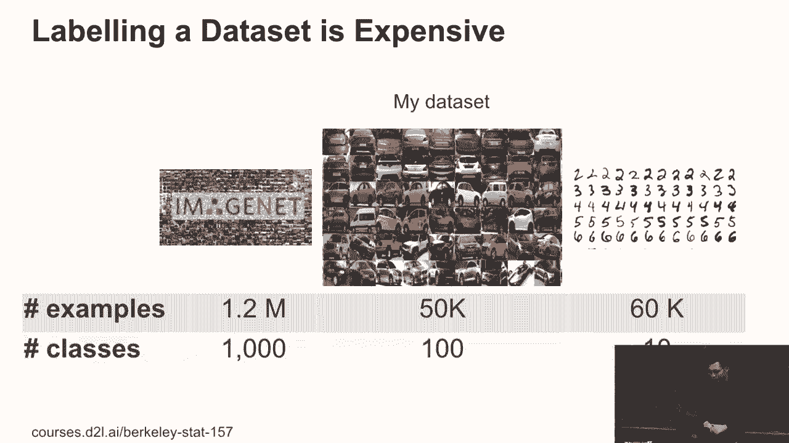
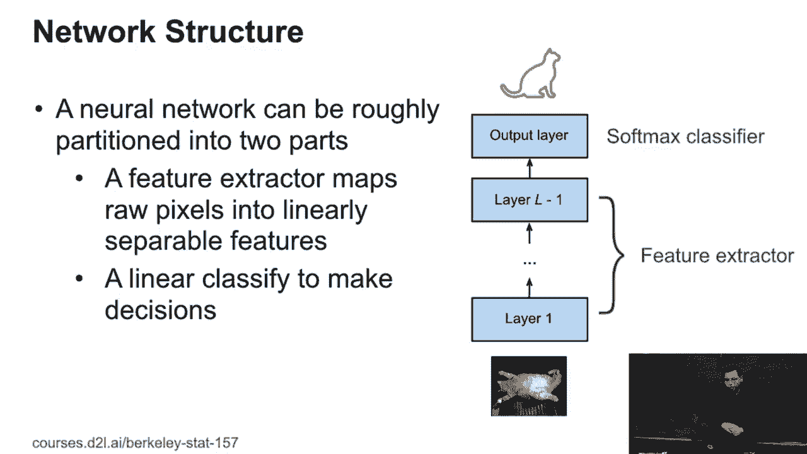
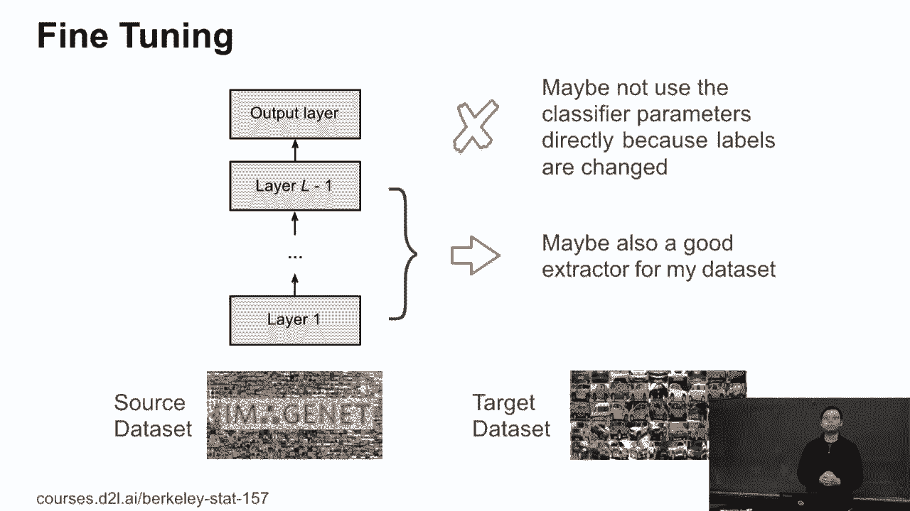
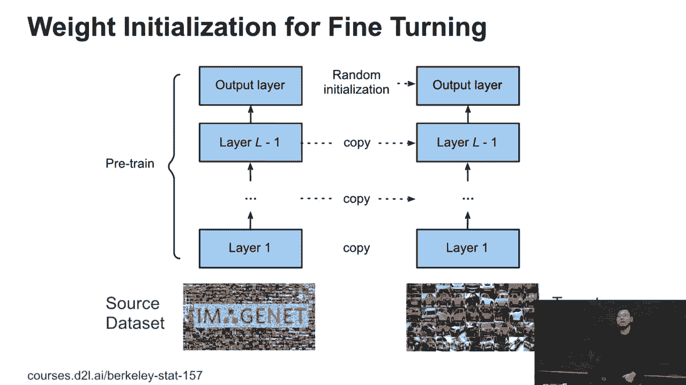
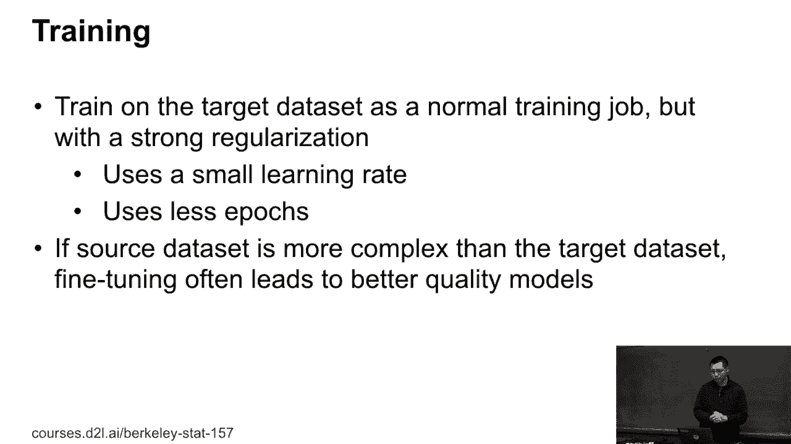
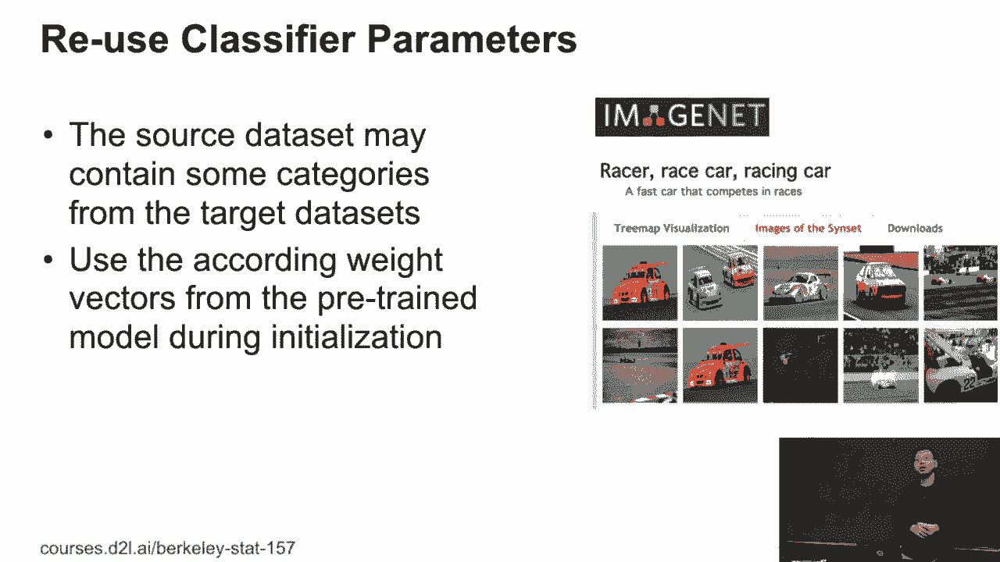
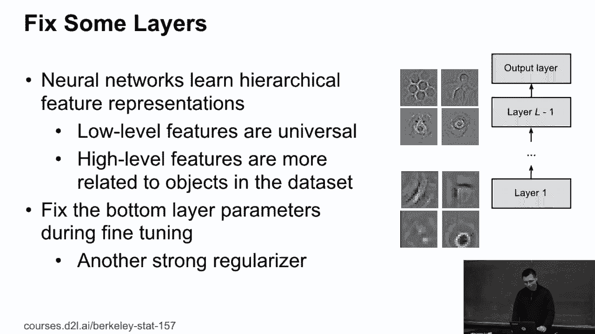

# 82：微调（Fine-Tuning）详解 🎯



在本节课中，我们将学习深度学习中的一个核心技巧——微调。微调是计算机视觉乃至许多深度学习应用领域最重要的技术之一。它允许我们利用在大规模数据集（如ImageNet）上预训练好的强大模型，来高效地解决我们自己的、数据量可能较小的特定任务。

---

## 微调的必要性 🤔

上一节我们介绍了模型训练的基本概念，本节中我们来看看为什么需要微调。在计算机视觉中，我们常遇到两类数据集：小型数据集（如MNIST）和大型数据集（如ImageNet）。

*   MNIST数据集包含10个类别，每个类别约6000张图片。在30年前它是较大的数据集，但如今已非常小。
*   ImageNet数据集包含1000个类别，约120万张图片，至今仍是一个大型基准数据集。

然而，在实际产品开发中，我们通常需要构建自己的数据集。例如，要构建一个识别100种车型的系统，若每种车型收集500张图片，总数据量为5万张。这个数据量是ImageNet的十分之一，但仍远大于MNIST。构建这样的数据集是现实可行的。

以下是构建自定义数据集可能面临的挑战：
*   数据标注耗时：即使高效标注，处理数万张图片也可能需要数十小时。
*   模型能力受限：如果仅使用自己的数据从头训练，模型性能上限受限于该数据集的规模和质量。
*   资源与时间成本高：要构建ImageNet级别的数据集需要巨大的时间和金钱投入，这在产品快速迭代中不现实。

同时，现有的顶尖模型（如各种ResNet、Inception网络）都是针对ImageNet数据集设计和优化的。如果直接将如此复杂的模型应用于我们较小的自定义数据集，很可能因为模型过于复杂而导致**过拟合**。

因此，我们需要一种方法，既能利用在大数据集上训练好的强大模型的知识，又能使其适应我们特定的、数据量较小的任务。这就是微调要解决的问题。



---

## 微调的核心思想 💡

上一节我们了解了面临的挑战，本节我们来探讨解决方案的核心思想。一个深度卷积神经网络通常可以分为两部分：



1.  **特征提取器（Feature Extractor）**：由网络的大部分层（尤其是卷积层）组成。其作用是将原始像素输入，逐层转换和抽象，最终输出一个**高度可分离的特征表示**。公式可以简化为：
    `特征 = 特征提取器(原始图像)`
2.  **分类器（Classifier）**：通常是网络的最后几层（如全连接层）。其作用是基于提取出的特征，通过一个线性或非线性函数，映射到最终的类别标签。公式可以简化为：
    `预测标签 = 分类器(特征)`

微调的基本假设是：在ImageNet等大型通用数据集上预训练得到的**特征提取器**，其学到的底层视觉特征（如边缘、纹理、形状）具有通用性，可以迁移到其他图像任务中。然而，最后的**分类器**是高度任务特定的，与ImageNet的1000个类别紧密绑定，无法直接用于我们的新任务。

因此，微调的思路是：
*   **重用**：获取一个在ImageNet上预训练好的模型，将其**特征提取器部分**的权重复制过来，作为我们新模型的初始化。
*   **替换与初始化**：移除或替换原模型的**分类器部分**（因为类别数不同），并为其**随机初始化**新的权重。

通过这种方式，我们相当于站在了“巨人的肩膀”上，从一个非常优秀的起点开始训练，而非从零开始。



---

## 微调的实施步骤 🔧

理解了核心思想后，本节我们来看看如何具体实施微调。整个过程可以概括为以下几个步骤：

以下是微调的关键步骤：
1.  **获取预训练模型**：选择一个在大型源数据集（如ImageNet）上训练好的模型。
2.  **模型架构调整**：修改网络输出层，使其输出节点数与我们目标数据集的类别数一致。
3.  **参数初始化**：
    *   将预训练模型中**特征提取器部分**的权重参数复制到新模型的对应部分。
    *   对新模型的**分类器部分**（特别是新增或修改的层）进行随机初始化。
4.  **训练策略调整**：由于起点较好且为避免在小数据集上过拟合，训练时需要调整超参数：
    *   **使用更小的学习率**：因为参数已经接近一个较优解，大步幅更新可能导致震荡或跳出最优区域。
    *   **减少训练轮数（Epochs）**：可能只需要训练10个轮次，而不是从头训练所需的100个轮次。
    *   **考虑更强的正则化**：如Dropout、权重衰减等，以控制模型复杂度。

在实践中，如果源数据集（如ImageNet）比目标数据集更复杂、更通用，那么微调几乎总是比从头训练效果更好，且收敛速度更快。



---

## 微调的高级技巧与考量 🧠

上一节我们介绍了标准的微调流程，本节中我们进一步探讨一些可以提升微调效果的技巧和需要注意的方面。



### 1. 标签空间的关联性
理想情况下，如果源数据集的标签集（如ImageNet的“赛车”类别）与目标数据集（如“汽车”识别）的标签有重叠或语义关联，那么迁移效果会更好。我们可以利用这种关联性，例如，将源模型中对“赛车”类别敏感的权重，有选择地初始化到目标模型对应的“汽车”类别中。但通常这种完美对应并不常见，不过源模型学到的通用物体表征依然极具价值。

### 2. 分层冻结训练
深度神经网络的不同层学习到的特征层次不同：
*   **底层**（靠近输入）：学习通用、底层的视觉特征，如边缘、角点、纹理、颜色。这些特征对于大多数图像任务都是通用的。
*   **高层**（靠近输出）：学习与特定任务高度相关的抽象特征和语义概念，如“狗头”、“车轮”。

基于此，一个常见的技巧是**冻结（固定）底层网络的参数**，只训练高层网络。例如，在一个50层的ResNet中，可以冻结底部30层的权重，只微调顶部20层。这样做有两大好处：
*   **防止过拟合**：大幅减少可训练参数量，降低了模型在小数据集上的过拟合风险。
*   **保留通用知识**：确保模型保留那些宝贵的、通用的底层视觉特征。

在代码中，这通常通过设置参数的 `requires_grad` 属性来实现：
```python
# 假设 model 是预训练模型，我们想冻结前30层（示例）
for param in list(model.parameters())[:30]:
    param.requires_grad = False
# 只对剩余层的参数计算梯度并更新
```



### 3. 关于特征可视化的说明
在讨论网络层次时，有时会提到通过可视化来理解不同层激活的模式。这通常是指对某个卷积层的单个输出通道进行可视化，以观察该通道对输入图像的哪类模式（如特定纹理或形状）敏感。这有助于直观理解网络不同层所扮演的角色，但并非微调的必要步骤。

---

## 总结 📝

本节课中，我们一起深入学习了**微调（Fine-Tuning）** 这一强大的迁移学习技术。我们首先分析了在自定义数据集上从头训练模型面临的挑战，从而引出了微调的必要性。接着，我们剖析了网络结构，将其分为**特征提取器**和**分类器**两部分，并理解了微调**重用特征提取器，重置分类器**的核心思想。

我们详细介绍了微调的实施步骤：获取预训练模型、调整输出层、初始化参数以及采用更谨慎的训练策略（如更小的学习率）。最后，我们还探讨了标签关联性和**分层冻结训练**等高级技巧，这些都能帮助我们在特定任务上获得更好的微调效果。



记住，当你有一个中等规模或小规模的目标数据集时，从一个在大规模通用数据集上预训练好的模型开始进行微调，是提升性能、加速收敛的首选策略。