# 83：Python中的微调 🐕🔧

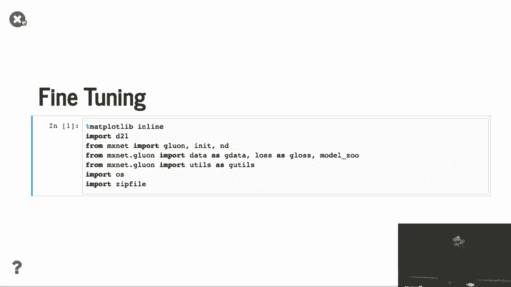

在本节课中，我们将学习如何在Python中实际进行深度学习模型的微调。微调是一种利用预训练模型，通过少量新数据快速适应新任务的关键技术。我们将通过一个“热狗识别”的具体例子，一步步展示从数据准备、模型加载到训练微调的完整流程。

---

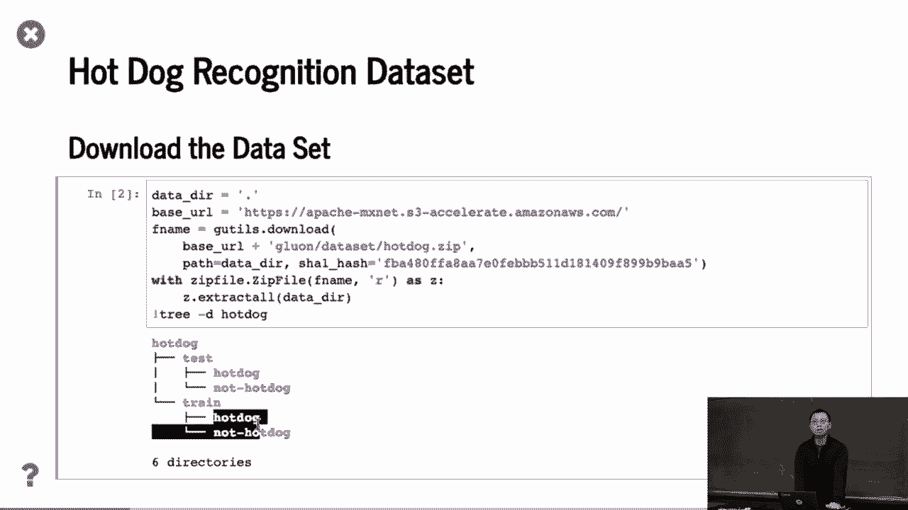

## 数据准备 📂

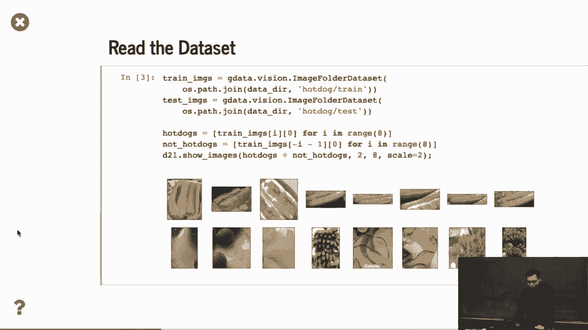

上一节我们介绍了微调的概念，本节中我们来看看如何准备用于微调的数据集。

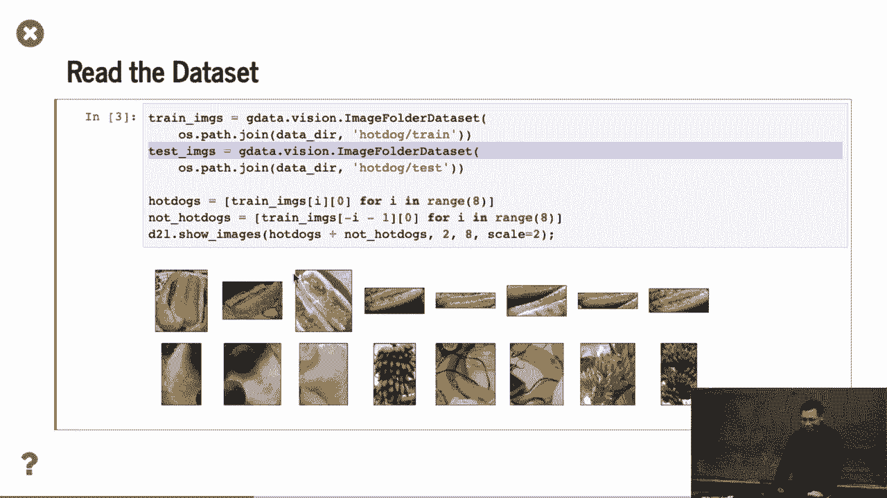

我们准备了一个名为“Harddog识别”的小型数据集。这个数据集可以通过网络搜索“Harddog”及相关图片轻松获得，大约花费一个下午的时间即可收集完成。

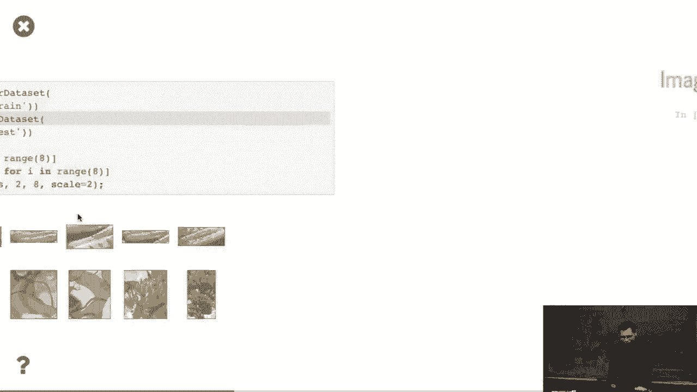

以下是数据集的目录结构：
*   数据集包含一个`train`（训练）文件夹和一个`test`（测试）文件夹。
*   `train`文件夹下有两个子文件夹：`harddog`和`not harddog`，分别存放对应类别的图片。
*   `test`文件夹下也存放了用于测试的JPEG图像。

我们可以加载并可视化这些图像。结果显示，第一行是“热狗”图片，第二行是“非热狗”图片，它们在外观上可能十分相似。

---

## 图像增强与预处理 🖼️➡️🔢

准备好数据后，我们需要对图像进行增强和预处理，以提高模型的泛化能力并匹配预训练模型的输入要求。

我们主要进行以下操作：
*   **标准化RGB通道**：使用来自ImageNet数据集的均值和标准差对图像进行归一化。公式如下：
    `normalized_image = (image - mean) / std`
    这是因为预训练模型是基于这些统计值训练的，保持一致性很重要。
*   **训练集变换**：包括随机调整大小、随机裁剪（例如到224x224像素）、随机水平翻转，最后转换为张量并进行上述标准化。
*   **测试集变换**：为了获得可靠的评估结果，我们仅进行中心裁剪和相同的标准化操作，避免引入随机性。

一个常见的问题是：如果目标物体（如热狗）不在图片中心怎么办？在图像分类任务中，我们通常假设主要物体位于图像中心区域。对于目标不在中心的情况，这属于目标检测任务的范畴。在训练中，随机裁剪可能会产生不含目标的“噪声”图像，但神经网络通常足够鲁棒，能够处理一定程度的噪声数据。

---

## 加载与修改预训练模型 🤖

预处理完成后，接下来我们加载并修改预训练模型以适应新任务。

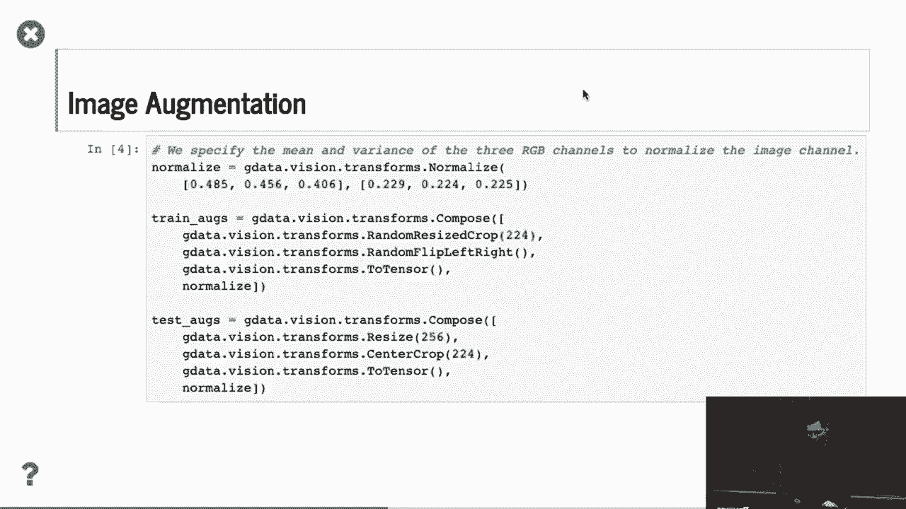

我们从模型库中下载ResNet-18的预训练模型。这个模型包含特征提取器（主干网络）和最后的分类输出层。

由于我们的新任务只有“热狗”和“非热狗”两个类别，我们需要修改模型：
1.  我们实例化一个全新的ResNet-18模型，但将其输出类别数设置为2。
2.  然后，我们将预训练模型中除最后一层外的所有权重复制到这个新模型中。
3.  对于新的分类层（最后一层），我们保持其随机初始化的状态。

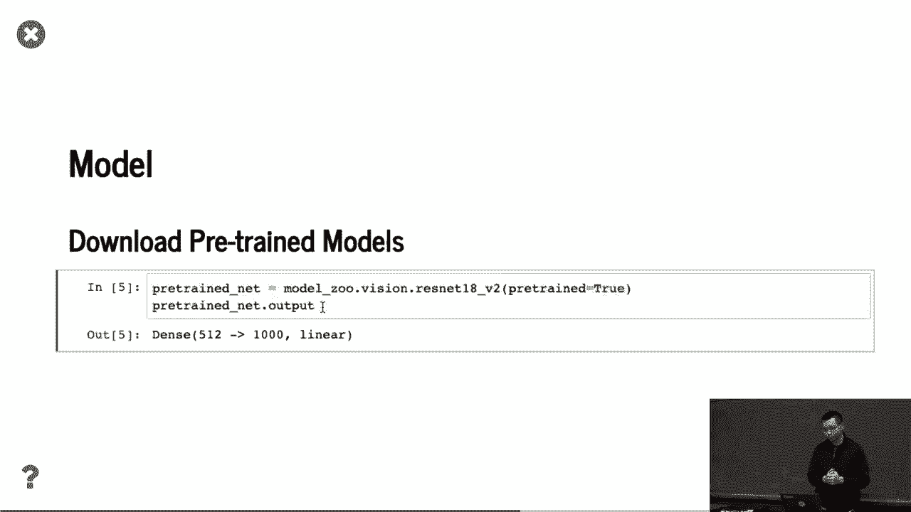

一个关键技巧是，在训练时，我们为最后一层设置更大的学习率（例如10倍）。这是因为特征提取器的权重已经训练得很好，我们只希望微调它们；而新分类层的权重是随机初始化的，需要更快地更新以快速收敛。在代码中，这通常通过为不同层设置不同的学习率来实现。

---

## 执行微调训练 ⚙️

现在，我们可以开始微调训练了。

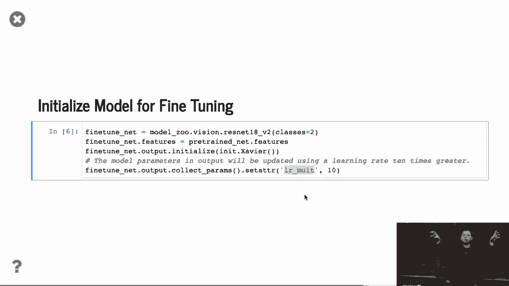

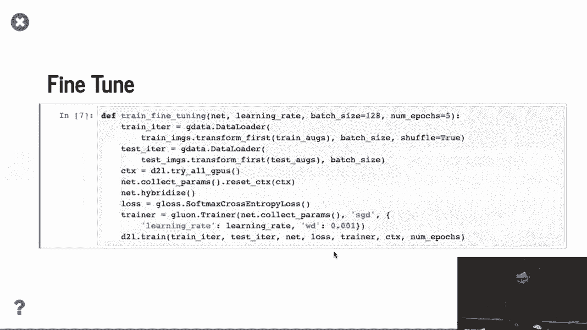

微调的训练过程与常规训练没有本质区别。我们设置数据加载器、定义损失函数（如交叉熵损失）、选择优化器（如SGD或Adam），并开始迭代训练。

在训练中，我们使用较小的学习率（例如0.01）开始微调，以防止破坏预训练好的特征。作为对比，如果是从头开始训练同一个模型，我们可能需要使用更大的初始学习率（例如0.1）。

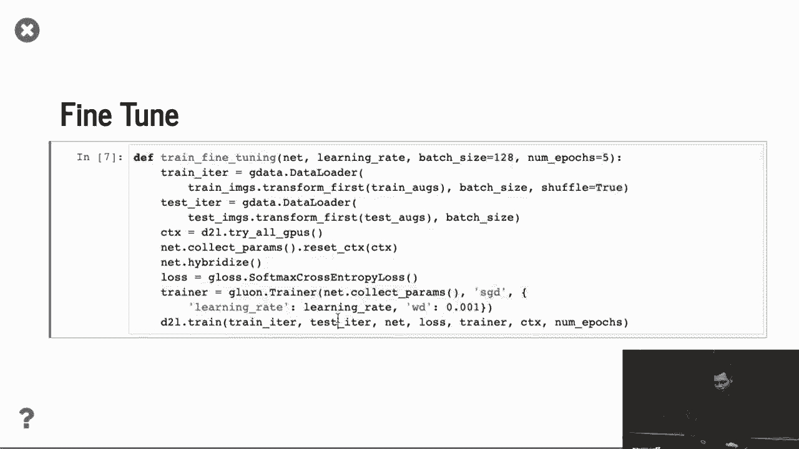

结果通常会显示，微调模型比从零开始训练的模型收敛更快，并且最终在测试集上能达到更高的准确率。这是因为微调从一个更好的初始点开始优化。

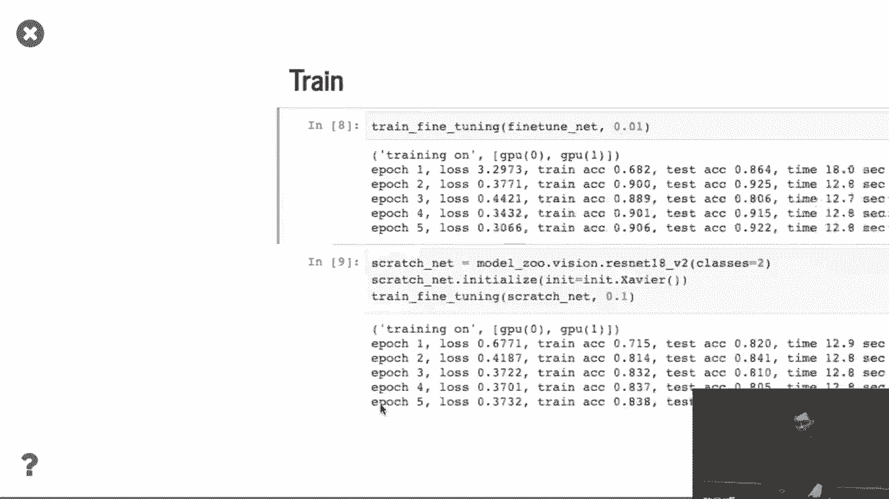

---

## 总结 📝

本节课中我们一起学习了深度学习模型微调的完整流程：
1.  **准备数据**：收集并组织特定任务的小型数据集。
2.  **预处理**：对图像进行标准化和增强，以匹配预训练模型并提升鲁棒性。
3.  **修改模型**：加载预训练模型，替换其输出层以适应新任务的类别数，并复制主干网络权重。
4.  **设置训练**：为新分类层设置更高的学习率，以加速其收敛。
5.  **开始训练**：使用较小的学习率微调整个网络，观察其快速收敛并达到良好性能。

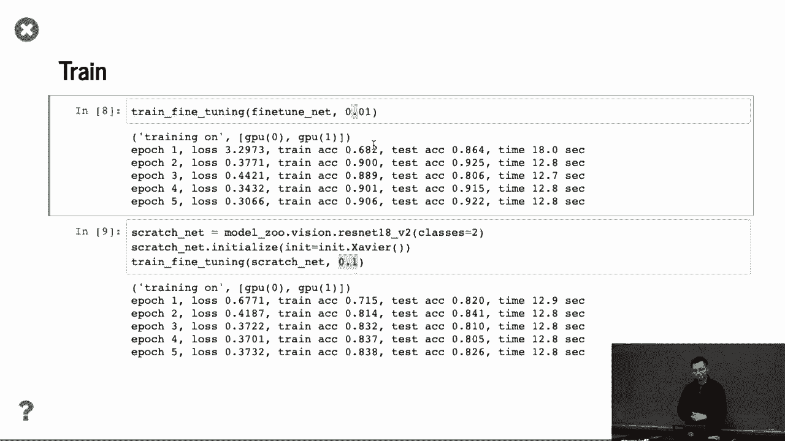

微调是一种强大而高效的技术，能够让我们利用在大规模数据集上训练好的模型，快速解决新的、数据量有限的实际问题。