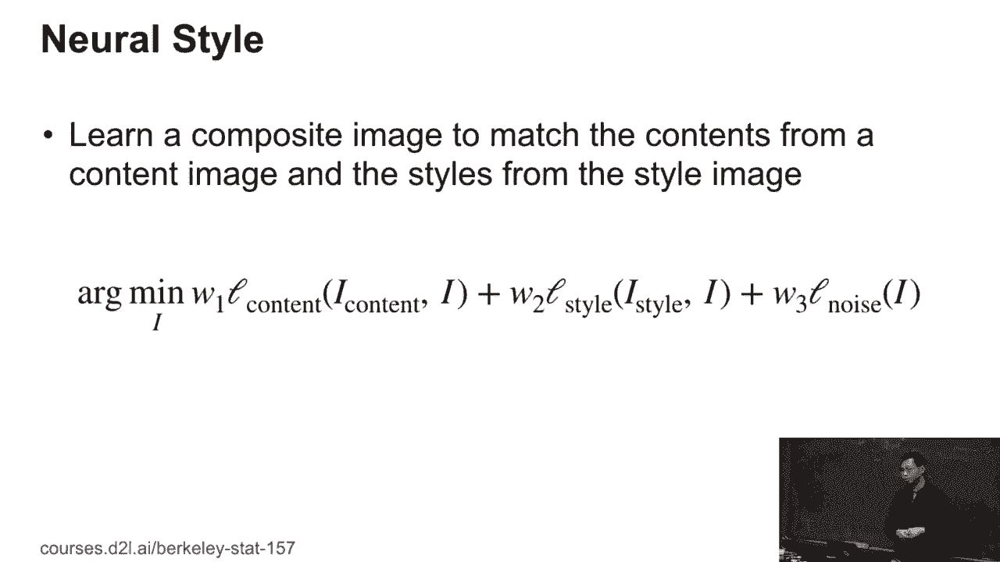
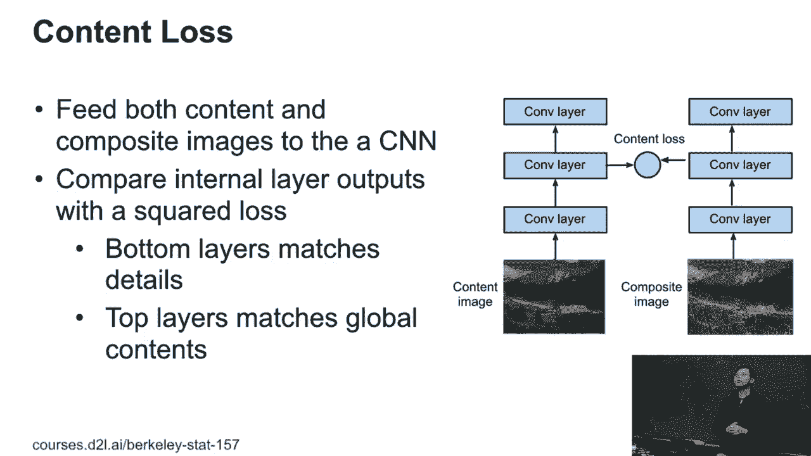
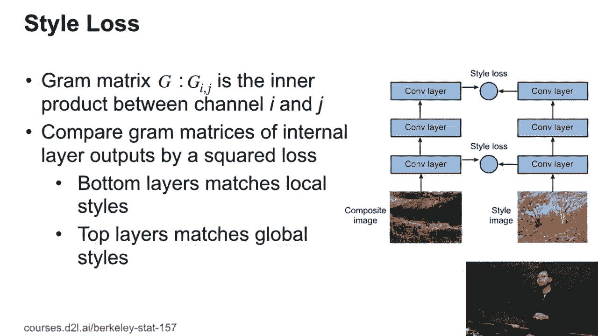
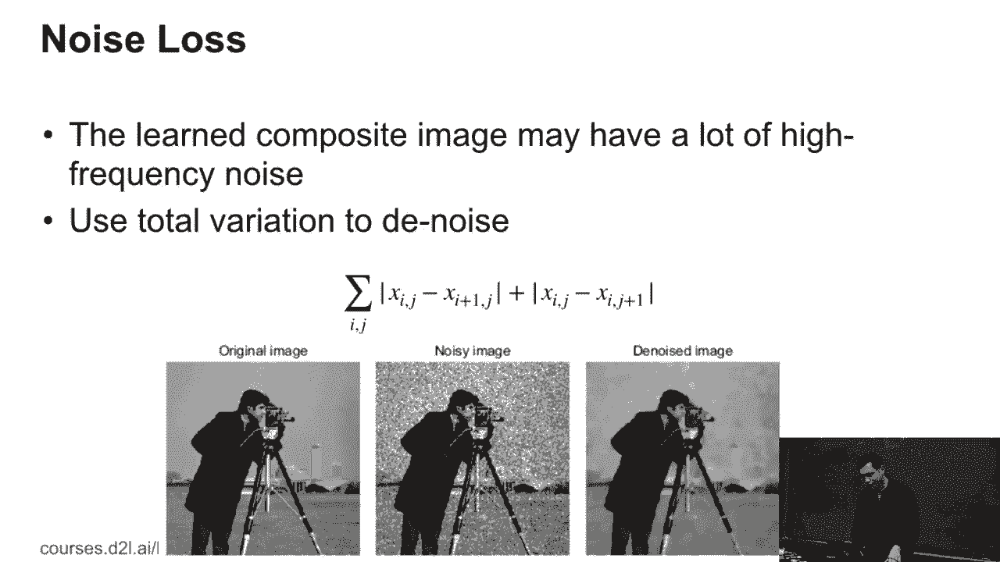
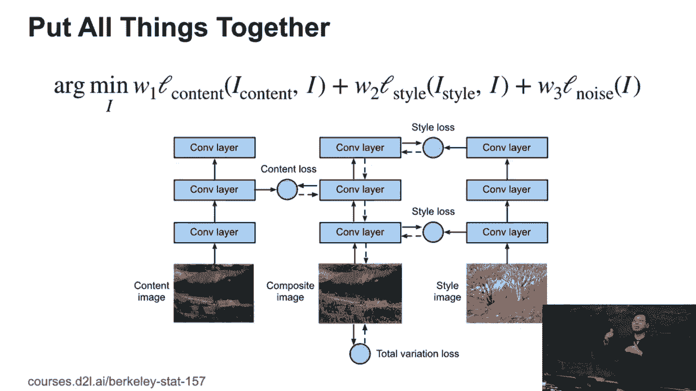

# 84：风格迁移 🎨

在本节课中，我们将学习风格迁移的基本概念、数学原理和实现方法。风格迁移是一种将一张图片的内容与另一张图片的风格相结合，生成全新合成图像的技术。

---

## 概述

风格迁移的核心目标是：给定一张**内容图像**和一张**风格图像**，生成一张**合成图像**。这张合成图像需要保留内容图像的主体结构和内容，同时具备风格图像的艺术风格与纹理特征。

---

## 核心思想与数学公式

风格迁移通过优化一个损失函数来实现。该损失函数由三部分组成：**内容损失**、**风格损失**和**噪声（总变差）损失**。我们需要学习的合成图像 `i` 通过最小化以下总损失函数得到：

**总损失公式：**
`总损失 = w1 * 内容损失(i, 内容图像) + w2 * 风格损失(i, 风格图像) + w3 * 总变差损失(i)`

其中，`w1`, `w2`, `w3` 是用于平衡各项损失的权重参数。

---

## 内容损失

上一节我们介绍了总损失函数的构成，本节中我们来看看**内容损失**的具体计算方式。

我们并不直接比较合成图像与内容图像的原始像素。相反，我们利用一个预训练的卷积神经网络（例如VGG），提取图像的深层特征。内容损失通过比较合成图像与内容图像在神经网络**某一中间层**的特征表示来计算。

**内容损失公式（L2损失）：**
`内容损失 = || F_content(内容图像) - F_content(合成图像) ||^2`

这里的 `F_content(·)` 代表从选定中间卷积层提取的特征图。

*   **选择底层卷积层**：特征更关注局部细节和纹理，可能导致合成图像过于拘泥于原图的像素级信息。
*   **选择顶层卷积层**：特征更关注全局形状和物体，可能丢失过多细节。
*   **选择中间层**：这是一个折中方案，能在保留主要内容结构的同时，为风格融合留出空间。

下图展示了内容匹配的过程：

---

## 风格损失

理解了如何保留内容后，我们来看看如何为图像注入新的艺术风格，这通过**风格损失**来实现。

风格的定义比内容更抽象。一个广泛使用的有效方法是计算特征的 **Gram矩阵**，它捕获了不同特征通道之间的相关性，可以理解为图像纹理风格的统计表示。

**Gram矩阵计算：**
给定一个特征图（形状为 `[C, H, W]`），我们首先将其重塑为 `[C, H*W]` 的矩阵 `F`。Gram矩阵 `G` 通过下式计算：
`G = F · F^T`
即，`G[i, j]` 表示第 `i` 个特征通道与第 `j` 个特征通道的内积，反映了它们之间的协方差。

**风格损失公式：**
风格损失是合成图像与风格图像在**多个选定层**的Gram矩阵之间的L2损失之和。
`风格损失 = Σ_l || Gram(F_style^l(风格图像)) - Gram(F_style^l(合成图像)) ||^2`

*   **使用底层**：匹配局部、小范围的纹理风格。
*   **使用顶层**：匹配全局、大范围的构图与色彩风格。
*   **组合使用多层**：可以更全面地捕捉和迁移风格图像从局部到全局的风格特征。

下图说明了风格匹配的过程：

---

## 总变差损失（噪声平滑）

为了确保生成的合成图像视觉上平滑、自然，避免出现高频噪声或过于突兀的像素点，我们引入了**总变差损失**。

总变差损失鼓励图像在空间上保持平滑，其计算方式是惩罚相邻像素（水平和垂直方向）之间的强度差异。

**总变差损失公式：**
`总变差损失 = Σ_i, j |像素(i, j) - 像素(i+1, j)| + |像素(i, j) - 像素(i, j+1)|`

这个损失函数的作用类似于一个平滑滤波器，能够有效减少图像中的不规则噪点，使最终结果更加悦目。

下图展示了总变差损失的作用：

---

## 优化过程

我们将上述三个损失函数按照公式组合起来，形成最终的目标函数。

优化过程通常从一个**随机噪声图像**或**内容图像的副本**开始。我们不是训练神经网络的权重，而是将**合成图像本身**作为可优化变量，通过梯度下降法（如Adam优化器）迭代更新图像的像素值，以最小化总损失。

以下是迭代优化过程的简要步骤：
1.  初始化合成图像（例如，填充随机噪声）。
2.  将内容图像、风格图像和当前合成图像输入预训练网络，提取指定层的特征。
3.  计算内容损失、风格损失和总变差损失。
4.  计算总损失相对于合成图像像素的梯度。
5.  使用梯度更新合成图像的像素值。
6.  重复步骤2-5，直到损失收敛或达到预定迭代次数。

随着迭代进行，合成图像会逐渐呈现出内容图像的结构与风格图像的纹理。下图展示了从随机噪声开始，图像逐渐演变的示例：

---

## 总结

本节课中我们一起学习了风格迁移技术：
1.  **目标**：将内容图像的结构与风格图像的纹理融合，生成新图像。
2.  **方法**：通过优化一个组合损失函数来实现，该函数包含**内容损失**、**风格损失**和**总变差损失**。
3.  **内容损失**：在预训练网络的中间层比较特征，以保留主要内容。
4.  **风格损失**：通过比较多层Gram矩阵来匹配纹理风格。
5.  **总变差损失**：用于平滑图像，减少噪声。
6.  **过程**：将合成图像作为可优化变量，通过梯度下降迭代更新其像素值，最小化总损失。

这项技术的优势在于，你无需预先定义任何滤镜，只需提供你喜欢的内容和风格图片，算法就能自动完成创作。