# 85：在Python中实现风格迁移 🎨

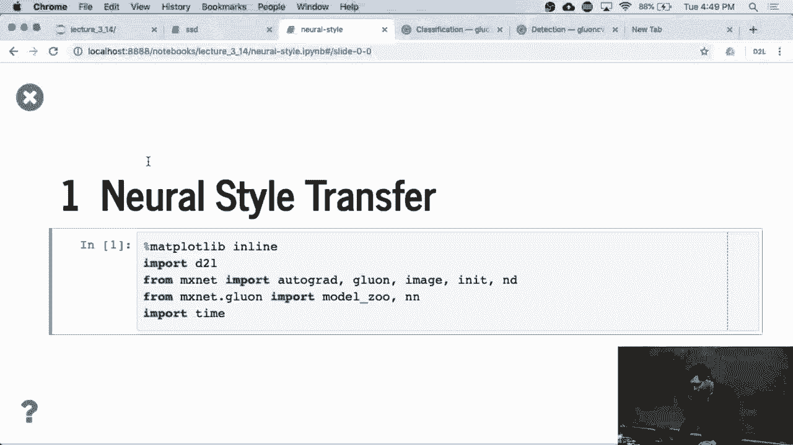

在本节课中，我们将学习如何使用Python实现神经风格迁移。我们将通过代码，一步步理解如何将一张图片的内容与另一张图片的艺术风格相结合，生成全新的图像。

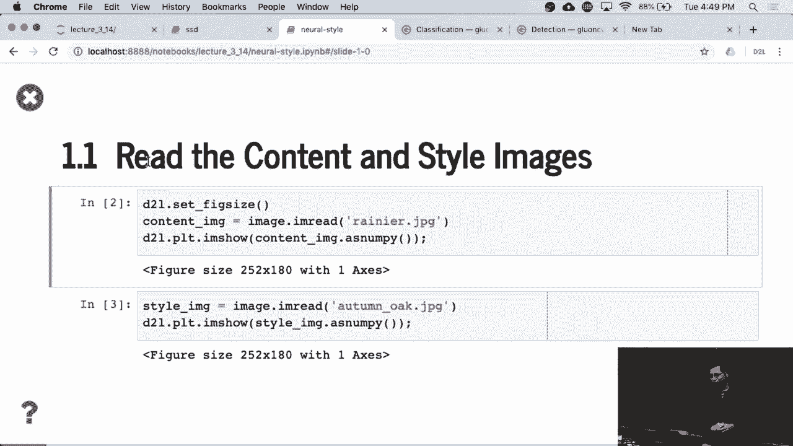

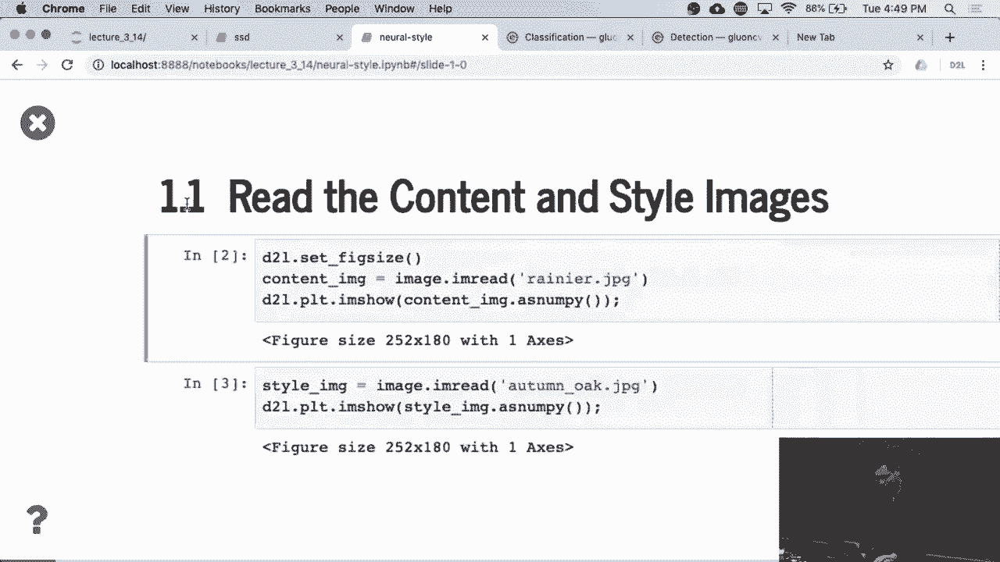

---

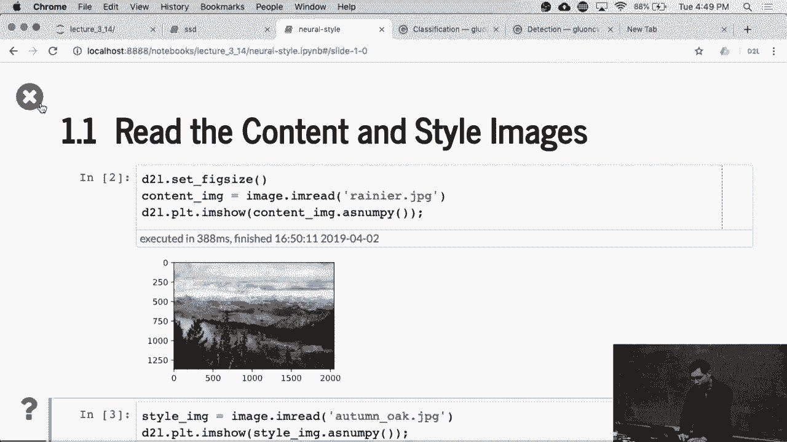

## 1. 图像读取与预处理 📸

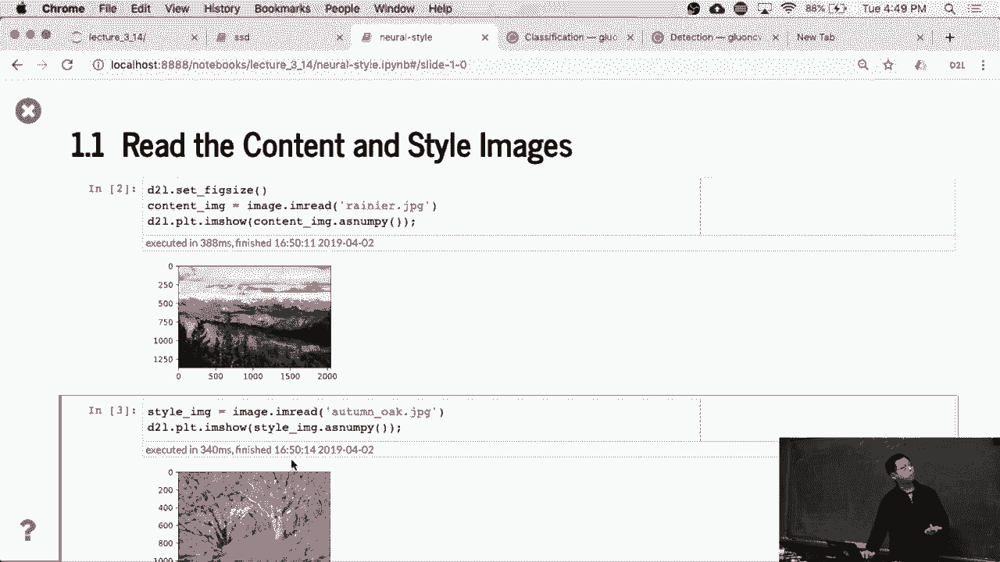

首先，我们需要读取内容图像和风格图像。

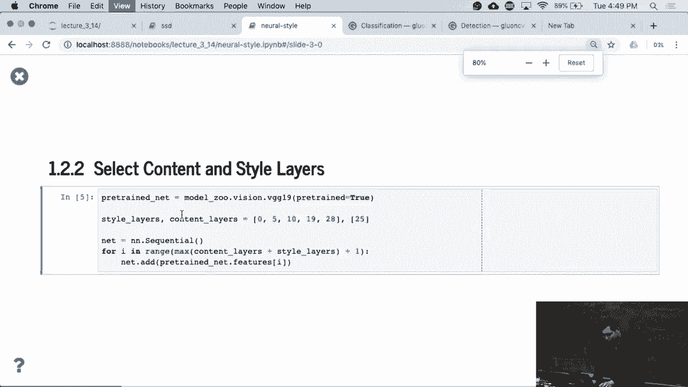

```python
# 示例：读取图像
content_image = read_image('corner_image.jpg')
style_image = read_image('star_image.jpg')
```

图像预处理是一个标准步骤，通常包括将像素值归一化到0到1之间，或者进行减均值、除以标准差的操作。

```python
# 常见的预处理：减去最小值并除以标准差
preprocessed_image = (image - image.min()) / image.std()
```

## 2. 使用预训练VGG网络作为特征提取器 🧠

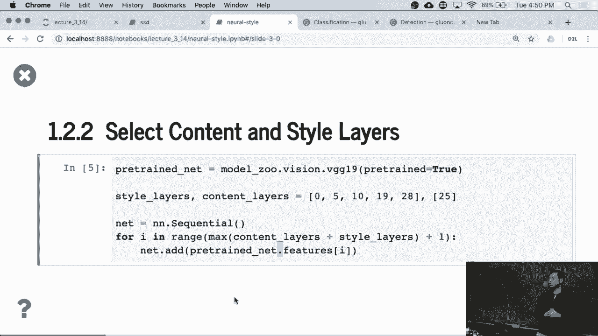

上一节我们介绍了图像预处理，本节中我们来看看如何提取图像特征。我们将使用预训练的VGG19网络作为基础特征提取器。

VGG网络包含五个卷积块。在风格迁移中，我们通常选择每个块的第一层作为风格特征层，并选择靠后的某一层（如第四个块的最后一层）作为内容特征层。

```python
# 选择VGG19中特定的层用于特征提取
style_layers = ['block1_conv1', 'block2_conv1', 'block3_conv1', 'block4_conv1', 'block5_conv1']
content_layer = 'block4_conv2'
```

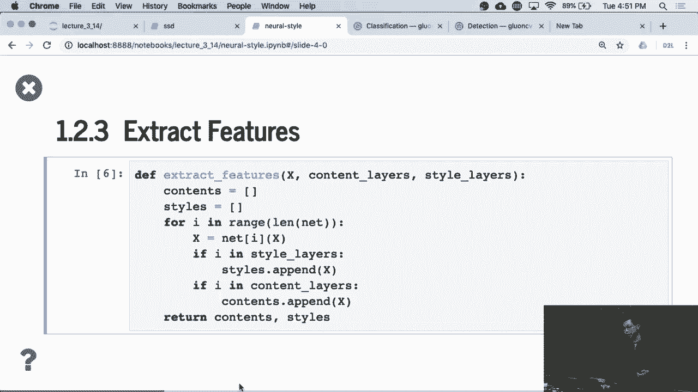

我们加载预训练的VGG权重。由于我们只进行特征提取而不训练网络，因此可以冻结这些权重。

## 3. 提取内容与风格特征 🔍

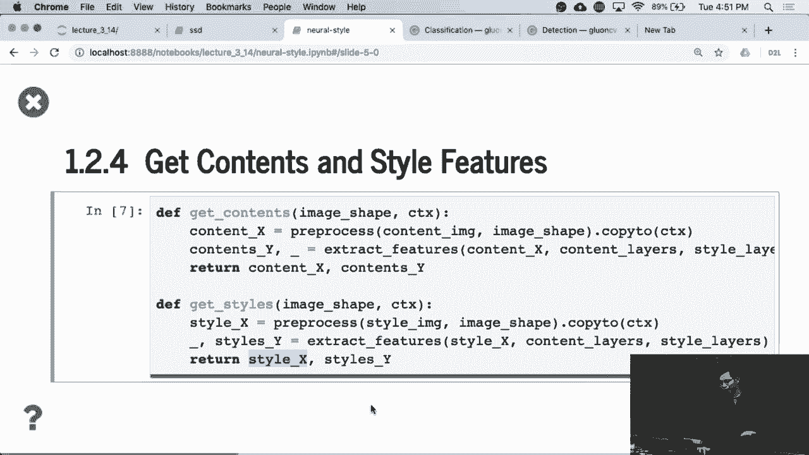

以下是提取特征的关键步骤：

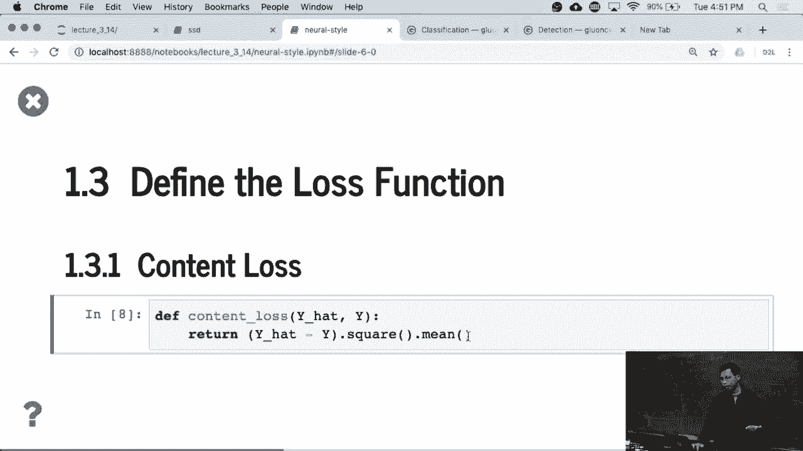

给定内容图像和风格图像，我们将其输入VGG网络，并获取在指定层上的输出。

```python
def extract_features(model, image, layers):
    """提取指定层的特征"""
    outputs = []
    for layer in layers:
        output = model.get_layer(layer).output
        outputs.append(output)
    feature_extractor = Model(inputs=model.input, outputs=outputs)
    return feature_extractor(image)
```

对于内容图像，我们提取内容层的特征。对于风格图像，我们提取所有风格层的特征。这些特征将分别用于计算内容损失和风格损失。

## 4. 定义损失函数 ⚖️

现在我们已经获得了特征，接下来需要定义损失函数来指导图像的生成。

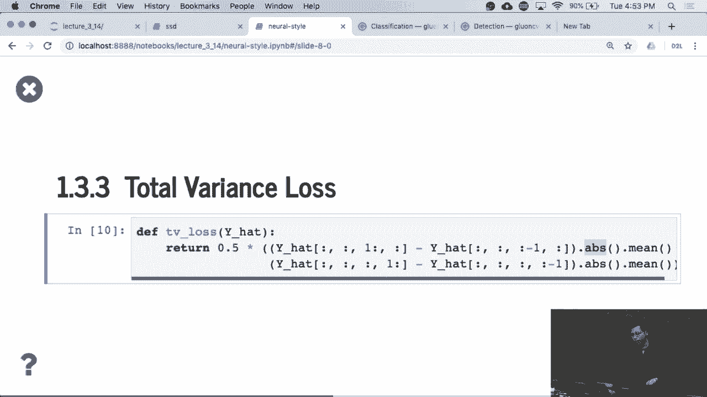

**内容损失** 衡量生成图像与内容图像在内容特征上的差异。我们通常使用均方误差（MSE）。

```python
def content_loss(content_features, generated_features):
    return tf.reduce_mean(tf.square(content_features - generated_features))
```

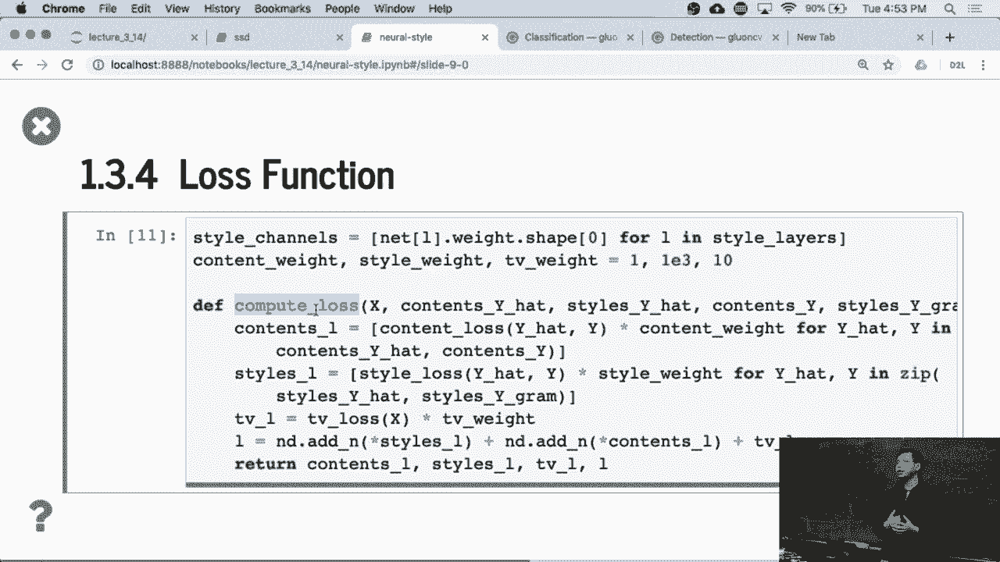

**风格损失** 则更为复杂。它通过计算特征图的Gram矩阵（即协方差矩阵的一种近似）来捕捉纹理信息，然后比较生成图像与风格图像Gram矩阵的差异。

```python
def gram_matrix(x):
    # x的形状为 (batch, height, width, channels)
    batch, height, width, channels = x.shape
    features = tf.reshape(x, (batch, height * width, channels))
    gram = tf.matmul(features, features, transpose_a=True)
    return gram / tf.cast(height * width * channels, tf.float32)

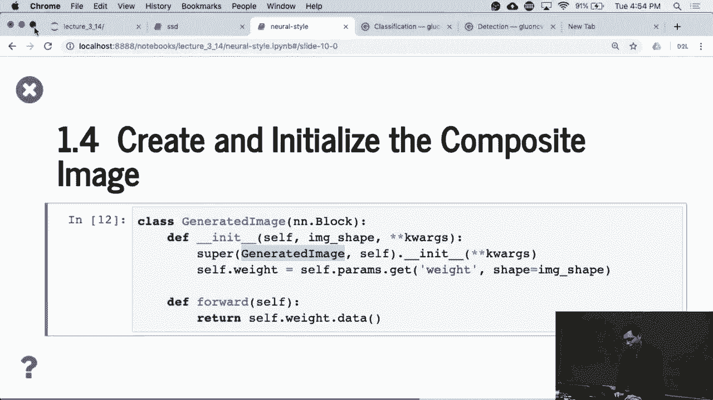

def style_loss(style_features, generated_features):
    loss = 0
    for style_feat, gen_feat in zip(style_features, generated_features):
        style_gram = gram_matrix(style_feat)
        gen_gram = gram_matrix(gen_feat)
        loss += tf.reduce_mean(tf.square(style_gram - gen_gram))
    return loss
```

此外，我们还会加入**总变差（TV）损失**，它有助于使生成的图像更加平滑，减少噪声。

```python
def total_variation_loss(image):
    # 计算相邻像素差的绝对值之和
    dx = image[:, 1:, :, :] - image[:, :-1, :, :]
    dy = image[:, :, 1:, :] - image[:, :, :-1, :]
    return tf.reduce_sum(tf.abs(dx)) + tf.reduce_sum(tf.abs(dy))
```

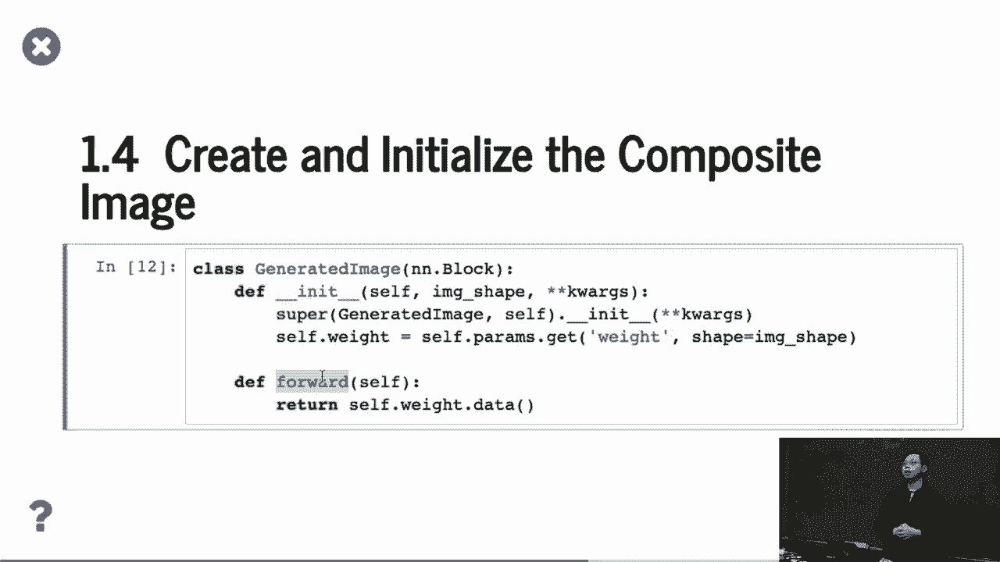

## 5. 组合损失与优化目标 🎯

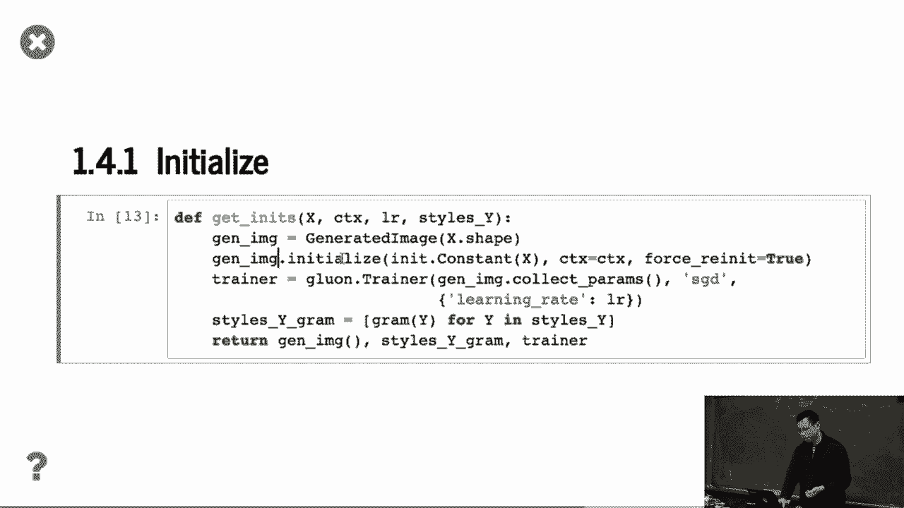

我们将三个损失函数按不同的权重组合起来，形成总损失。

```python
# 设置权重
content_weight = 1e4
style_weight = 1e-2
tv_weight = 30

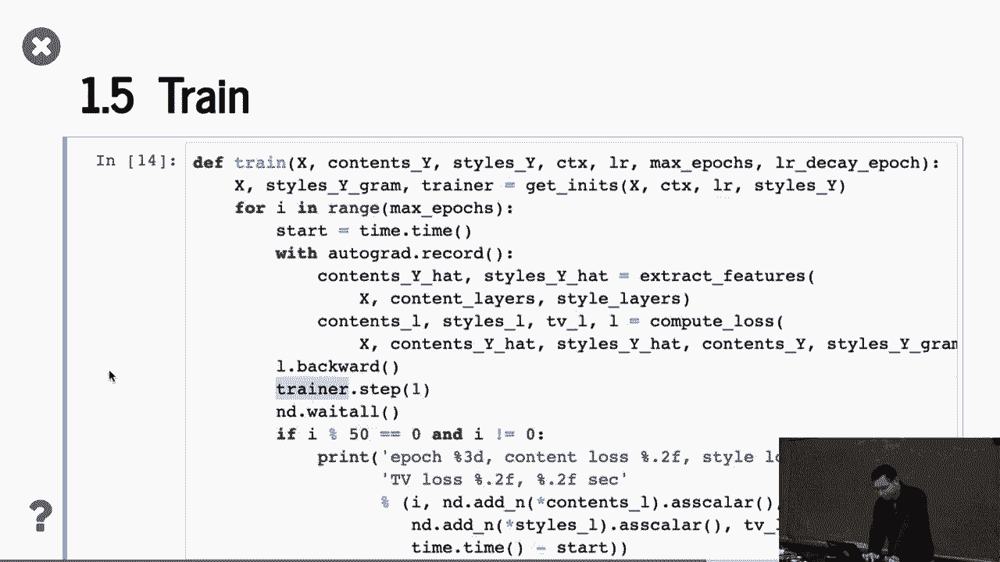

total_loss = content_weight * content_loss + style_weight * style_loss + tv_weight * tv_loss
```

与训练神经网络不同，在风格迁移中，我们**不更新网络权重**，而是**更新输入图像本身的像素值**。因此，我们的优化变量就是这张待生成的图像。

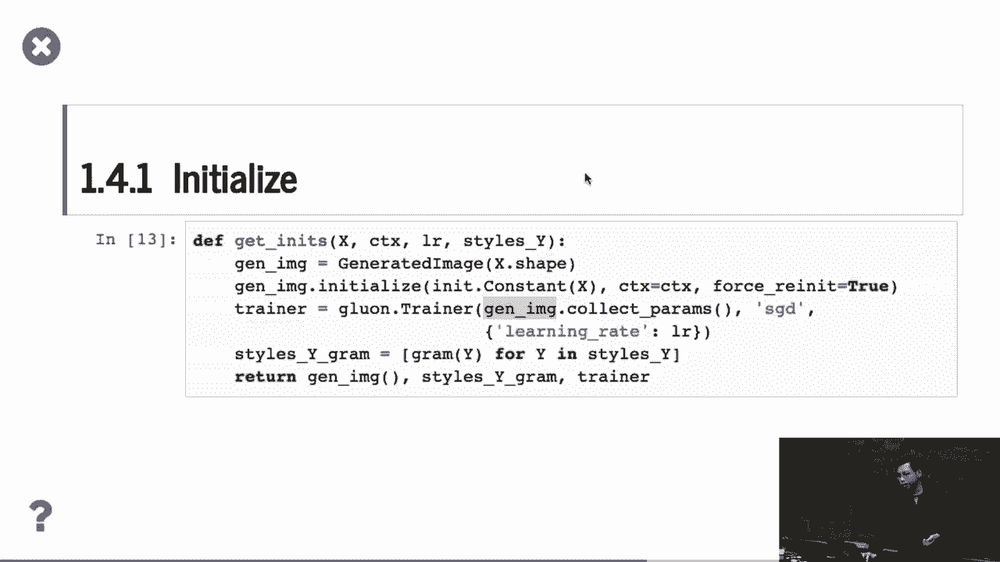

```python
# 初始化一张随机图像或内容图像的副本作为起点
generated_image = tf.Variable(content_image)

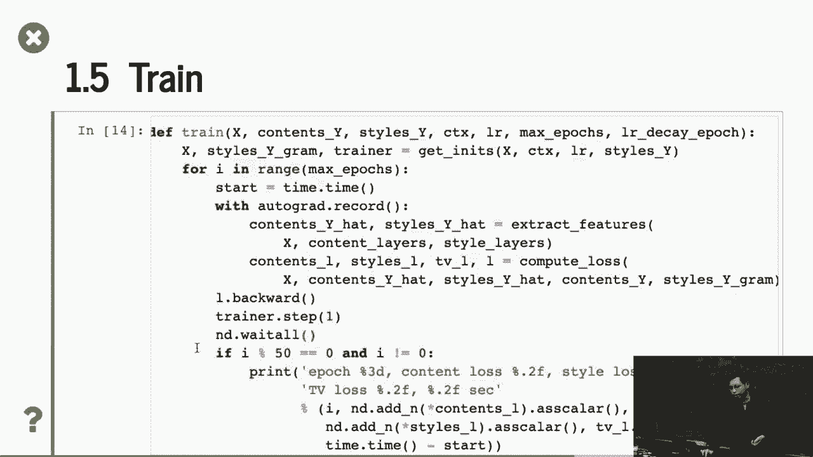

# 定义优化器（如Adam）
optimizer = tf.optimizers.Adam(learning_rate=0.02)
```

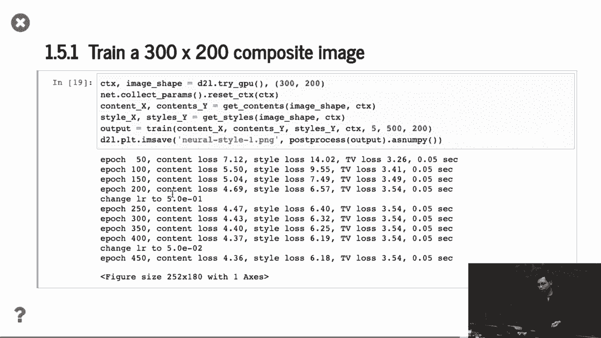

## 6. 训练过程：从粗到精 🚀

训练过程的核心是迭代地计算损失，并通过反向传播更新生成图像的像素。

以下是训练循环的关键步骤：

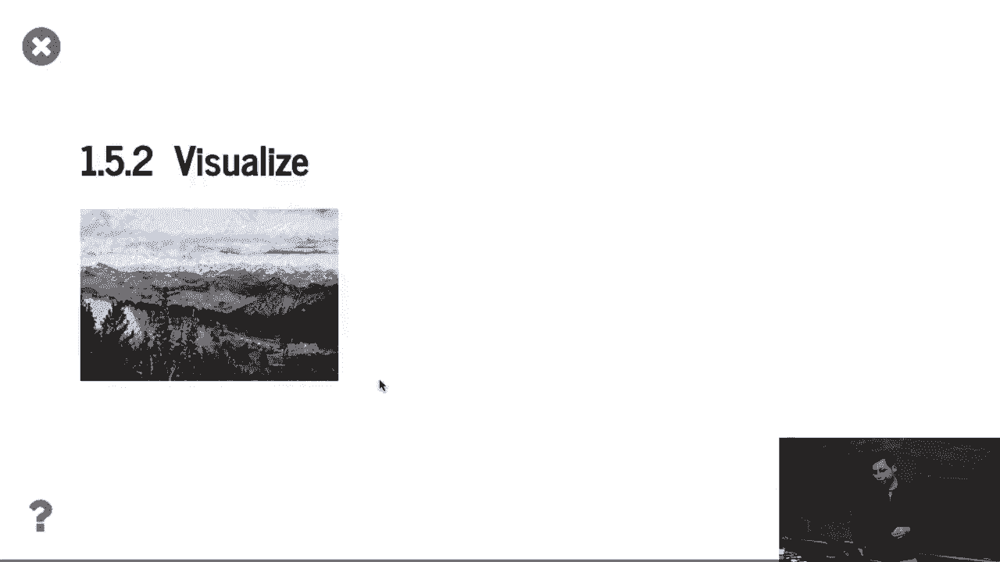

1.  使用特征提取器获取当前生成图像的特征。
2.  分别计算内容损失、风格损失和TV损失。
3.  计算总损失关于生成图像的梯度。
4.  使用优化器更新生成图像。

一个实用的技巧是**从低分辨率图像开始训练**，这样可以快速捕捉整体风格和布局。然后，将训练好的低分辨率图像**上采样**，作为更高分辨率图像的初始值，继续进行训练。这种方法可以加速训练并提升最终效果。

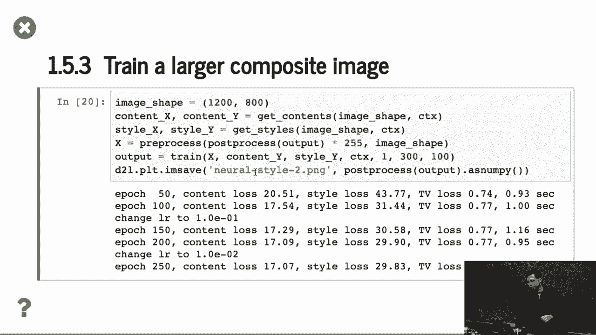

```python
# 伪代码：从低分辨率到高分辨率的训练策略
low_res_image = train_style_transfer(content_image_small, style_image_small, iterations=500)
high_res_init = upsample(low_res_image)
final_image = train_style_transfer(content_image_large, style_image_large, init_image=high_res_init, iterations=1000)
```

通过这种方式，我们可以生成既保留内容图像结构，又具备风格图像艺术纹理的高质量合成图像。

---

## 总结 📝

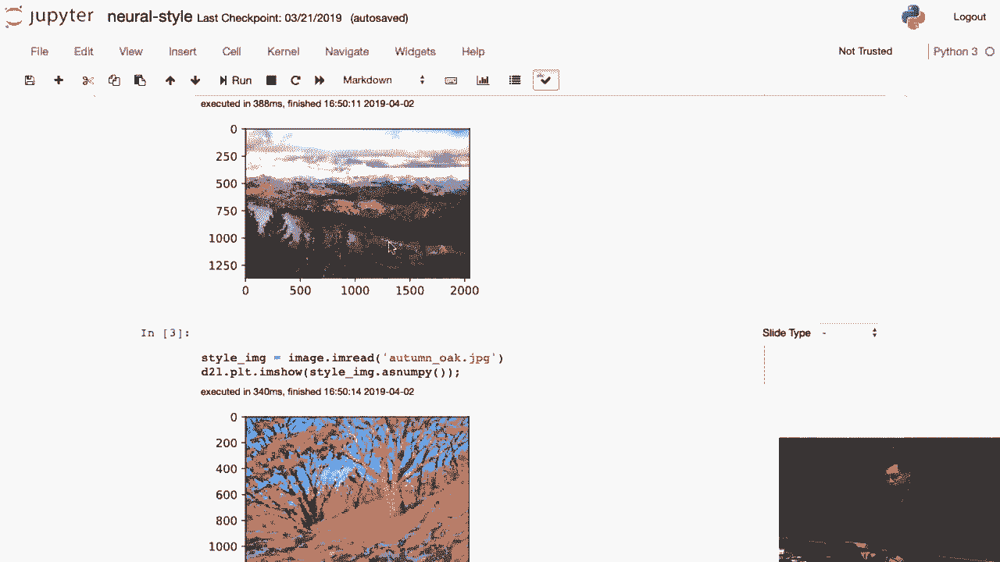

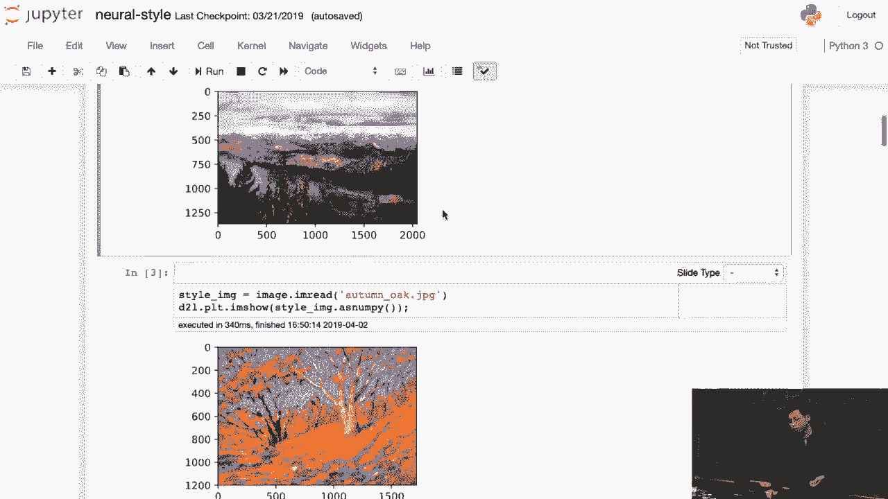

本节课中我们一起学习了神经风格迁移在Python中的完整实现流程。我们回顾一下关键步骤：

1.  **预处理**：读取并归一化内容图像与风格图像。
2.  **特征提取**：利用预训练的VGG网络，从特定层提取内容特征和风格特征。
3.  **定义损失**：构建了内容损失、风格损失（基于Gram矩阵）和总变差损失。
4.  **优化图像**：将待生成的图像本身作为可训练变量，通过梯度下降法优化其像素值，以最小化组合后的总损失。
5.  **训练策略**：采用了从低分辨率到高分辨率的“从粗到精”训练策略，以提高效率和质量。

通过组合这些技术，我们能够创造出融合两种图像特点的全新艺术作品。