# 86：物体检测基础概念 🎯

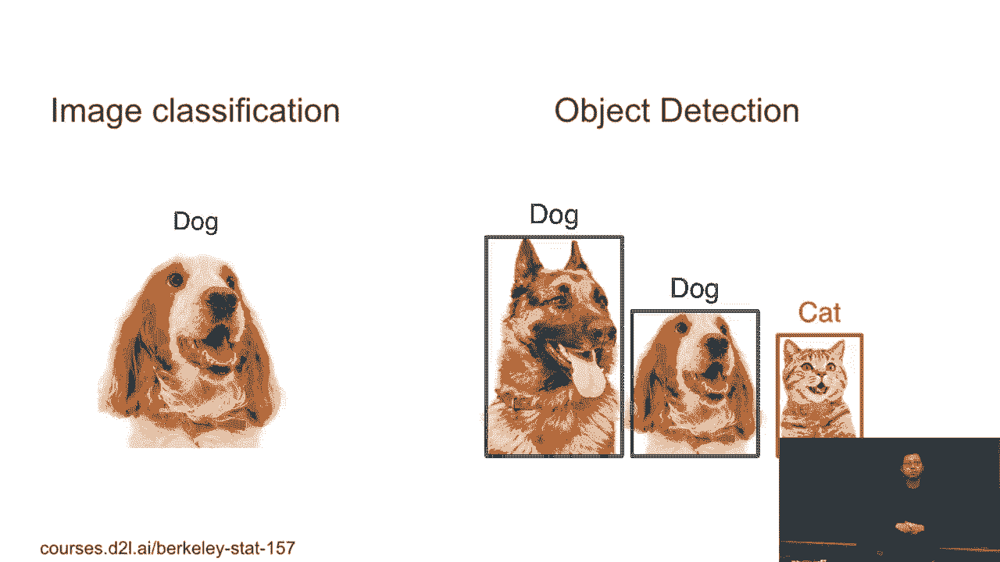

在本节课中，我们将学习物体检测的基本概念。与图像分类不同，物体检测旨在识别图像中的多个物体，并确定它们的位置。我们将介绍边界框、锚框、交并比（IoU）以及非极大值抑制（NMS）等核心概念。

## 物体检测与图像分类的区别

上一节我们介绍了图像分类，它通常假设图像中只有一个主要物体。本节中我们来看看物体检测的不同之处。

在图像分类中，我们试图识别图像中的主要物体。通常我们假设这张图像只包含一个物体，一个大的物体。但对于物体检测，我们尝试在一张图像中抓取所有这些有趣的物体。我们不仅知道有什么物体，还想知道这些物体的位置。

这里我们使用矩形框来定义物体的位置，它被称为**边界框**。

物体检测对自动驾驶等领域非常有用。例如，我们想拍摄街道的照片并尝试识别所有的汽车、行人、自行车和交通灯。这相当困难，因为有些物体（如交通灯或卡车后面的汽车）并不容易识别。

## 数据标注的挑战

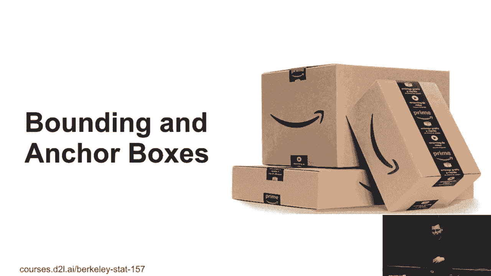

标注物体检测数据集比图像分类更困难。以下是标注过程中的主要挑战：

*   你需要为图像中的每个物体标注其类别和边界框。
*   图像中可能包含许多小物体，标注起来非常耗时。
*   在视频流（如自动驾驶场景）中进行实时标注和检测更具挑战性。

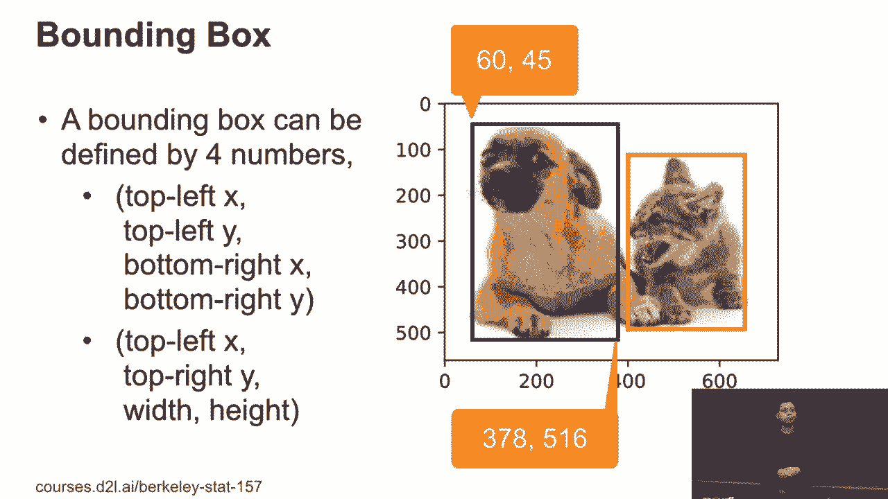

此外，在现实应用（如车载系统）中，还需要考虑计算效率。强大的GPU会产生大量热量和能耗，这在实际部署中是一个重要约束。因此，物体检测算法需要非常关注推理速度。

## 边界框与锚框

接下来，我们从图像分类中得到的新概念开始：边界框和锚框。

### 边界框的定义

边界框可以通过矩形定义。通常用四个数字来定义：
*   方法一：左上角x坐标、左上角y坐标、右下角x坐标、右下角y坐标 `(x1, y1, x2, y2)`。
*   方法二：左上角x坐标、左上角y坐标、框的宽度、框的高度 `(x, y, w, h)`。

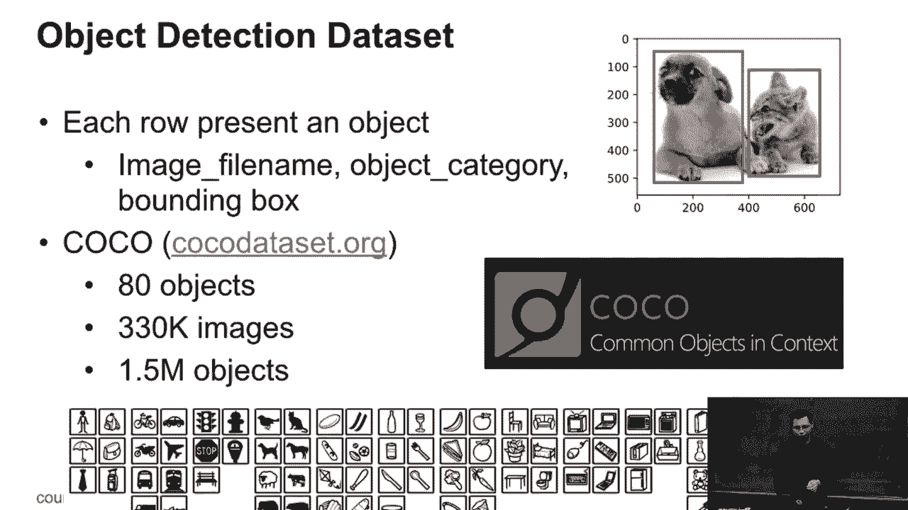

例如，在原点位于左上角的图片中，一个框可以用 `(60, 45, 220, 150)` 来定义。

### 锚框的概念

锚框是检测算法提出的多个预定义区域。以下是锚框的工作原理：

*   算法首先生成多个不同大小和宽高比的锚框。
*   对于每个锚框，预测它是否包含物体（还是背景）。
*   如果包含物体，则预测一个偏移量，将这个锚框调整到真实物体的边界框。

因此，我们预测四个数字的偏移量，将锚框映射到边界框。不同的检测算法（如SSD或R-CNN系列）提出锚框的方式不同，但核心思想一致。

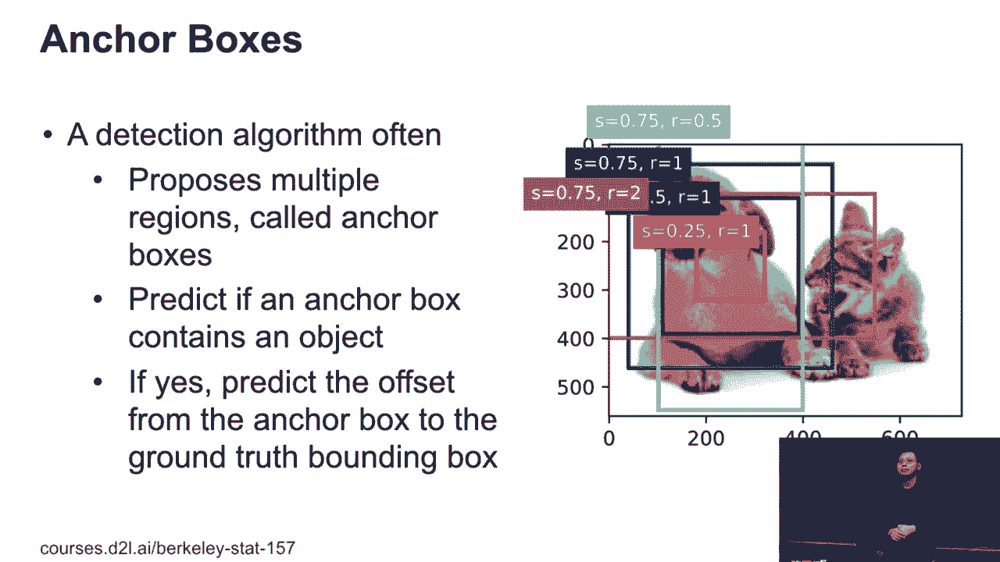

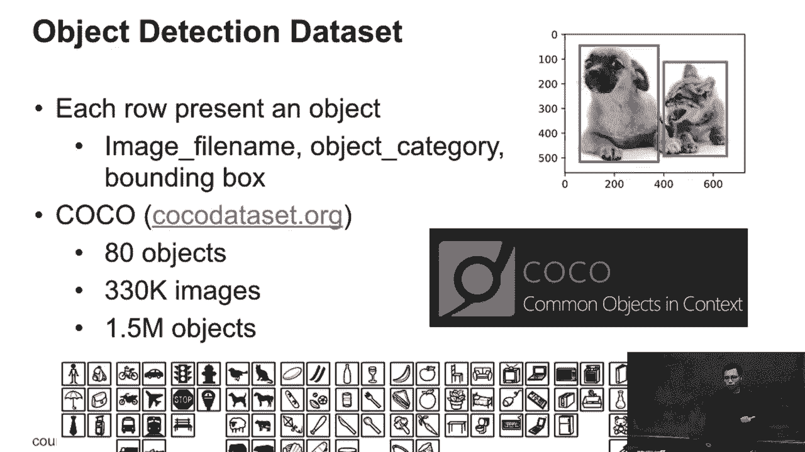

## 数据集与标注格式

在物体检测中，数据标注格式与分类不同。以下是典型的数据格式：

每一行对应图像中的一个物体。例如，你可以指定图片文件名、对象类别以及对象的边界框坐标。这意味着如果你的数据集中图片数量较少，但每张图片包含多个物体，那么你的训练样本（物体实例）数量可能远多于图片数量。

例如，著名的COCO数据集包含80个日常物体类别，约有33万张图片，但平均每张图片有4个物体，总共约有150万个物体实例。一百万大小的数据集通常足以训练一个合理的深度学习模型。

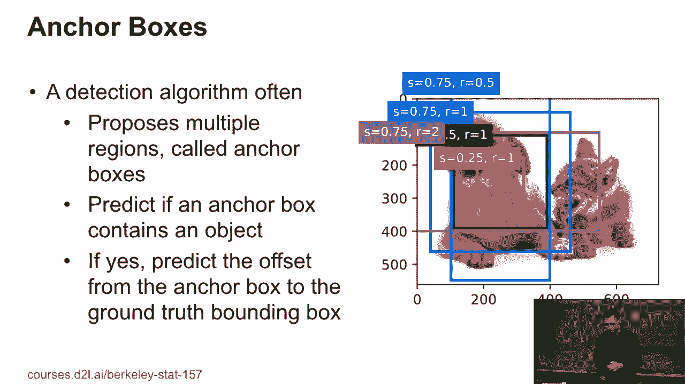

## 交并比（IoU）

如何衡量两个边界框之间的相似度？在分类中，我们判断对错。但对于框，我们使用**交并比**。

IoU的原理是计算两个边界框的交集面积，除以它们的并集面积。公式如下：

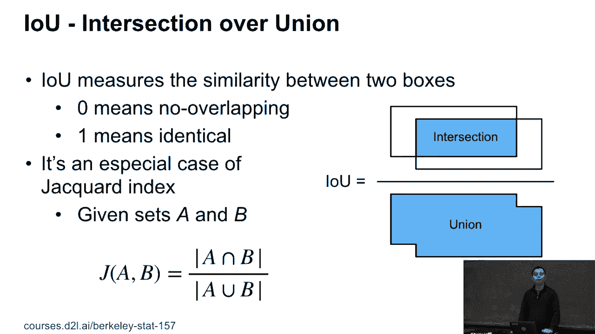

`IoU = Area of Intersection / Area of Union`

IoU的值介于0到1之间：
*   `0` 表示两个框完全不重叠。
*   `1` 表示两个框完全重合。

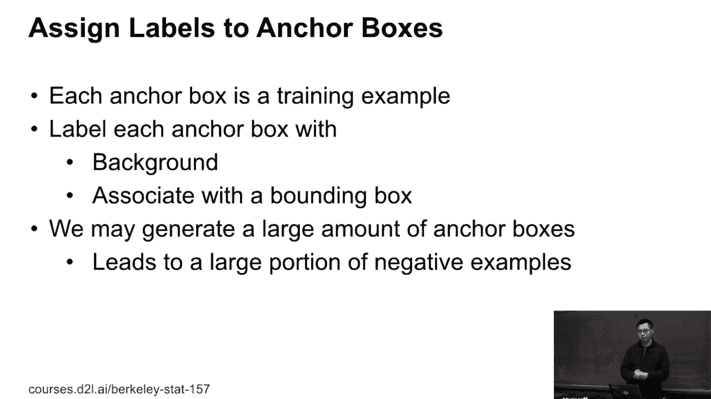

IoU越高，两个框越相似。它是Jaccard指数在边界框上的一个特例。

## 锚框与真实框的匹配

在训练过程中，算法提出一堆锚框，我们需要为它们分配标签（与哪个真实物体关联，或是背景）。以下是典型的匹配方法：

1.  计算每个锚框与每个真实边界框之间的IoU，形成一个IoU矩阵。
2.  找到矩阵中最大的IoU值，将该真实框分配给对应的锚框。
3.  移除已分配的真实框和锚框所在的行和列。
4.  重复步骤2和3，直到所有真实框都被分配。
5.  剩余未被分配的锚框则标记为“背景”。

这是一个不平衡的分类问题，因为背景锚框的数量远多于包含物体的锚框，这使得训练颇具挑战性。

## 非极大值抑制（NMS）

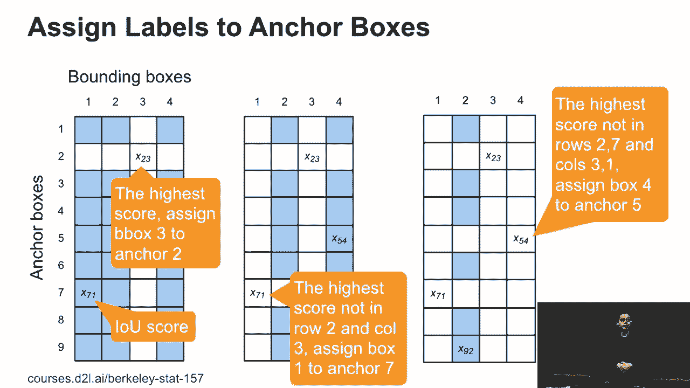

在预测时，每个锚框都会生成一个边界框预测。这可能导致对同一个物体产生多个非常相似的预测框。为了减少重复，我们使用**非极大值抑制**。

以下是NMS的算法步骤：

1.  选择所有预测框中置信度得分最高的一个。
2.  计算该框与所有其他框的IoU。
3.  移除那些IoU超过某个阈值（例如0.5）的其他框（即抑制它们）。
4.  在剩下的框中，重复步骤1-3，直到没有更多的框被处理。

最终，每个物体通常只保留一个最可靠的预测框。

## 总结

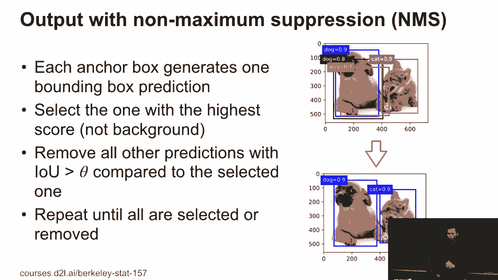

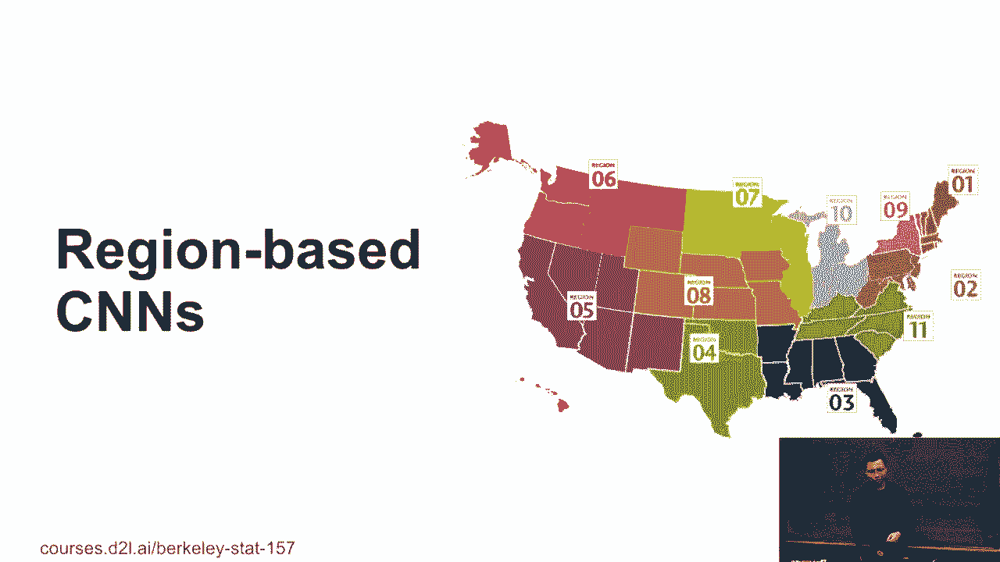

本节课中我们一起学习了物体检测的核心基础。我们了解了物体检测与图像分类的目标差异，即同时识别物体类别和位置。我们学习了用边界框定义位置，以及算法如何通过锚框机制来提出候选区域。关键的评价指标交并比（IoU）用于衡量框的相似度。在训练中，我们需要将锚框与真实标注框进行匹配。最后，在预测阶段，非极大值抑制（NMS）被用来消除冗余的检测框，得到清晰的结果。这些概念是理解现代物体检测模型的基石。