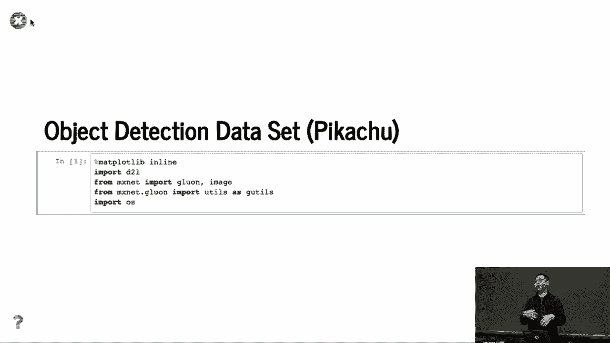
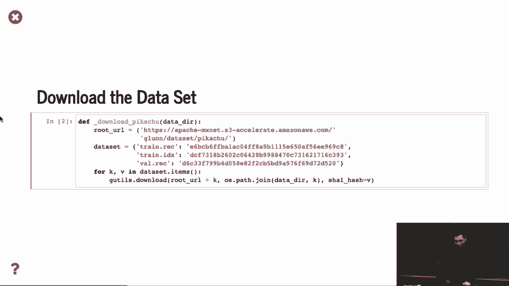
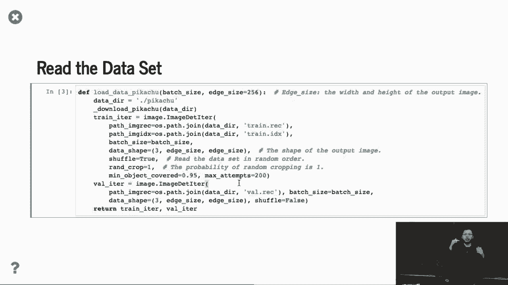
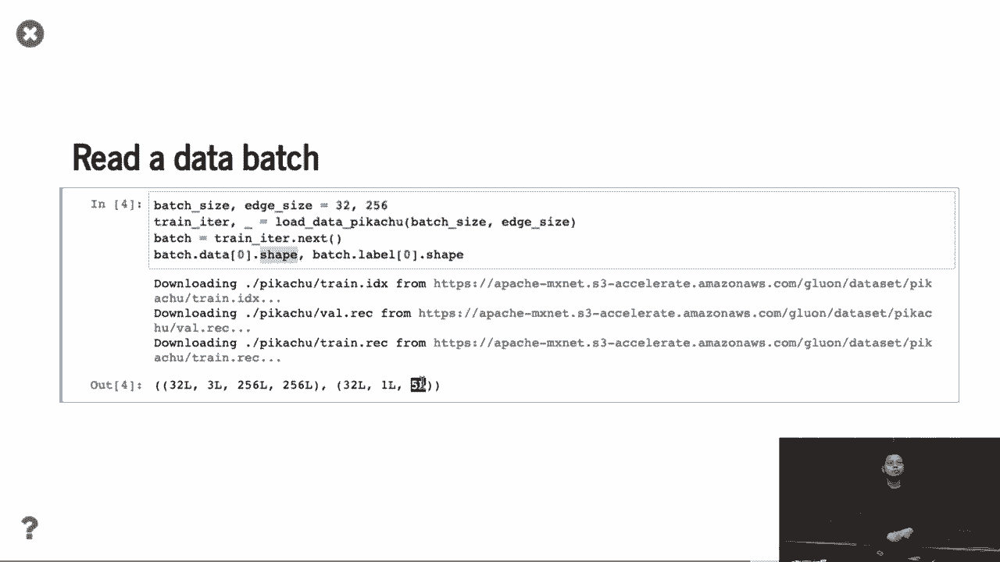

# 88：物体检测数据集 🖼️

在本节课中，我们将学习如何为物体检测任务准备和处理数据集。与图像分类不同，物体检测需要更复杂的数据格式和预处理步骤。我们将通过一个合成数据集的例子，了解数据迭代器、数据标注格式以及如何可视化数据。

## 概述

与图像分类不同，目前没有小规模的物体检测数据集可供直接使用。这意味着无法像某些课程那样获得现成的“C文件”来尝试。因此，本节课程将展示如何制作一个用于物体检测的合成数据集。

## 数据集的获取与处理

我们实际上是从网上下载了数据集。这里，我们使用了与图像分类不同的数据迭代器。

用户数据集通常是一个文件记录，它将所有图像信息整合在一起。然后，所有图像会被切割成单独的二进制文件。这种做法通常能使训练更高效，读取速度更快，因为你不需要读取大量小文件，而是读取整合后的大数据块。

## 数据预处理：随机裁剪

我们告知数据迭代器数据的形状，并进行随机洗牌和随机裁剪。这里有一个关键的不同点：在物体检测中，随机裁剪可能会裁剪到只剩下背景的部分。

因此，这里的策略是：确保随机裁剪出的图像块至少包含目标物体的一部分。具体来说，我们要求裁剪区域覆盖原始物体边界框的至少90%，并且物体在裁剪后图像中的面积至少达到原面积的95%。如果不满足条件，就丢弃这次裁剪并重复尝试，最多重复200次。这与图像分类中的随机裁剪有所不同，在图像分类中，我们通常假设裁剪不会对标签产生太大影响。

## 数据批次的格式

接下来，我们跳过数据集加载的具体代码，直接看一个数据批次。数据的零形状与图像相同，批次大小（batch size）为32。数据的维度依次是：RGB通道数、图像高度、图像宽度。

对于标注（label），其形状为 `[32, 1, 10]`。这里的32是批次大小，1可能代表一个维度（在某些框架中用于统一格式），10代表每张图像中最多包含的物体数量。在这个简单的例子中，每张图像只包含一个物体，但数据格式预留了最多10个物体的空间。

标注数据的最后四个值是边界框（bounding box）的坐标。与仅进行图像分类相比，如果你只做分类，就不会使用 `32×1×10` 这样的标注格式。但是对于物体检测，你需要使用这种包含物体类别ID和边界框信息的标注。

## 合成数据集示例

我们展示的效果如何呢？效果很好。我们制作数据集的方法是：下载一个3D皮卡丘模型，对其进行旋转并渲染，生成一系列图像。然后，我们将这些皮卡丘图像合成到自然背景图像中。

因为我们知道皮卡丘被放置的位置，所以我们始终知道其边界框的坐标。这就是一个我们可以轻松获取标注的合成数据集。

你可以看到效果很好。一个简单的方法是查看RGB颜色直方图。由于皮卡丘是黄色的，我们可以通过分析颜色直方图来进行简单的物体检测，而不需要复杂的模型。我们计算了许多图像块的颜色直方图来演示这一点，这展示了如何尝试进行物体检测。

当然，我们可以做更高级的事情。实际上，使用更接近真实场景的图像会更好。

## 总结

本节课中，我们一起学习了物体检测数据集的特点。我们了解到物体检测需要包含边界框信息的标注格式，并看到了一个通过合成3D模型来创建数据集的实例。我们还比较了物体检测与图像分类在数据预处理（如随机裁剪）和数据批次格式上的不同之处。