# 89：基于区域的卷积神经网络（R-CNN）家族详解 🧠

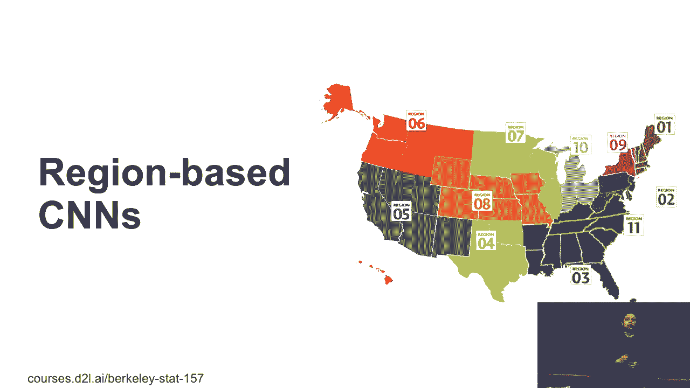

在本节课中，我们将学习目标检测领域的一个重要算法家族——基于区域的卷积神经网络（R-CNN）。我们将从最早的R-CNN开始，逐步了解其演进过程，包括Fast R-CNN、Faster R-CNN以及Mask R-CNN，并分析它们的设计思想、改进之处以及性能对比。

---

## 📜 概述：R-CNN家族

R-CNN是基于深度学习的物体检测算法中最早获得成功的系列之一。其核心思想是：首先从图像中生成一系列可能包含物体的候选区域（锚框），然后对每个区域进行特征提取和分类，最终预测物体的类别和精确边界框。

---

## 🔍 R-CNN：最初的尝试

R-CNN是这一系列的开创性工作。它的流程非常直观。


给定一张包含猫和狗的图片，算法首先使用一种启发式方法（如选择性搜索）生成大量候选锚框。这个过程可以看作一个黑箱：输入图片，输出许多可能包含物体的区域。

对于每个锚框，算法执行以下步骤：
1.  将锚框对应的图像区域裁剪出来。
2.  使用一个预训练的网络（如VGG）提取该区域的特征，得到一个固定长度的特征向量（例如1000维）。
3.  使用支持向量机（SVM）根据特征对区域内的物体进行分类。
4.  同时，训练一个线性回归模型来预测边界框的偏移量，以微调锚框的位置。

**核心问题**：这种方法计算成本极高。如果每张图片生成100个锚框，一个有100万张图片的数据集就会产生1亿个区域。对每个区域独立进行CNN前向传播来提取特征，需要巨大的计算资源。

**解决方案**：在实际训练中，通常会预先计算所有区域的特征并保存到磁盘，然后在后续阶段使用这些特征进行SVM和回归器的训练，这比实时计算要高效得多。

---

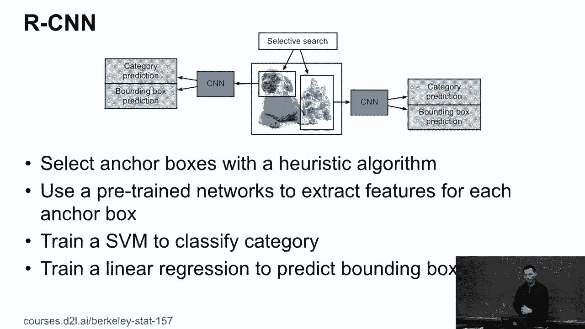

## ⚡ Fast R-CNN：效率的飞跃

上一节我们介绍了R-CNN，但其计算瓶颈明显。Fast R-CNN的核心改进在于大幅提升了特征提取的效率。


### 关键概念：感兴趣区域池化（RoI Pooling）

在介绍Fast R-CNN之前，需要理解一个关键操作：**感兴趣区域池化（RoI Pooling）**。

给定一个特征图和一个锚框（即感兴趣区域），RoI Pooling的目标是**为任意形状的锚框生成一个固定尺寸的特征表示**。


例如，进行一个2x2的RoI Pooling：
1.  将锚框在特征图上对应的区域划分为2x2的子区域。
2.  对每个子区域执行最大池化操作。
3.  最终，无论原始锚框是何种尺寸，我们都能得到一个2x2的固定输出。

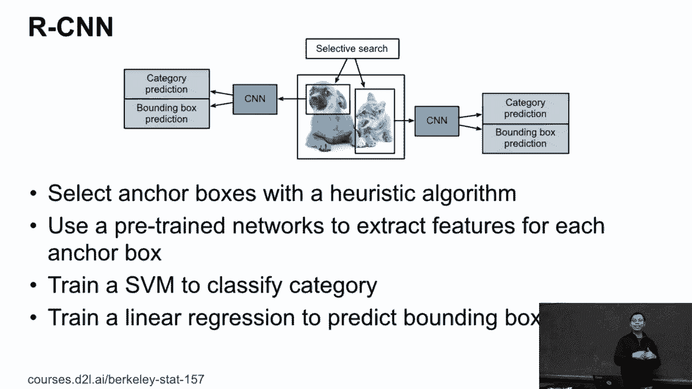

**代码描述**：
```python
# 伪代码示意 RoI Pooling 的核心思想
output = roi_pooling(feature_map, rois, output_size=(2, 2))
# 对于每个roi，output的形状都是固定的 (2, 2, channels)
```

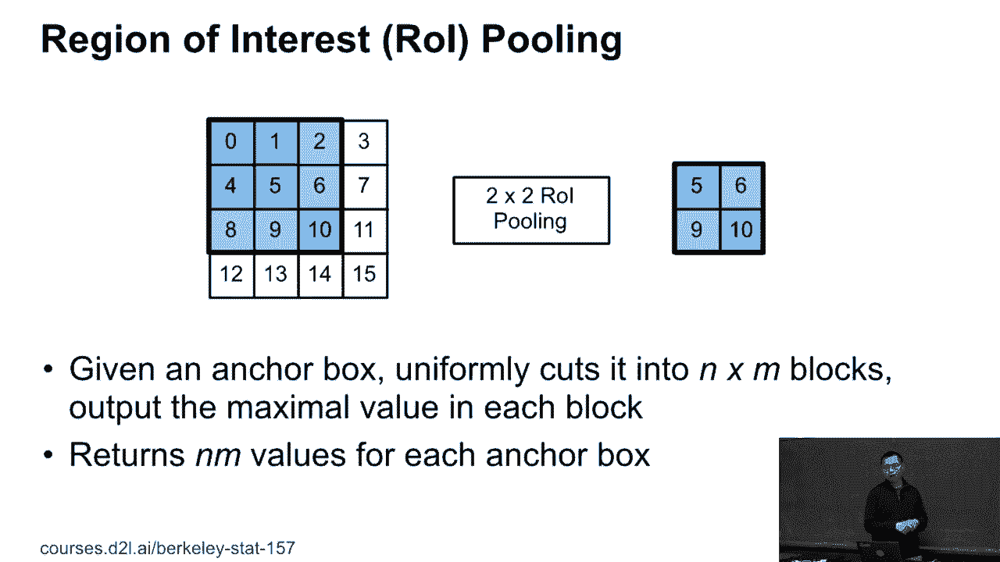

这个操作的好处是，我们可以用统一的方式处理不同大小和长宽比的锚框。

### Fast R-CNN 的流程


Fast R-CNN的流程优化如下：
1.  **共享特征提取**：不再将每个锚框裁剪后的图像单独输入CNN。而是将**整张图片**一次性输入CNN，得到一个共享的特征图。
2.  **应用锚框**：在共享的特征图上，根据原始图像中的锚框位置，映射到对应的特征图区域。
3.  **RoI Pooling**：对每个映射后的区域执行RoI Pooling，得到固定尺寸的特征。
4.  **预测**：将这些固定特征输入全连接层，同时完成**分类**（用Softmax替代SVM）和**边界框回归**。

**核心改进**：通过共享计算，整个网络只需对整图做一次前向传播，而不是对成千上万个区域重复计算。这使速度提升了约10倍，并且将分类和回归任务整合进一个统一的网络中进行端到端训练。

---

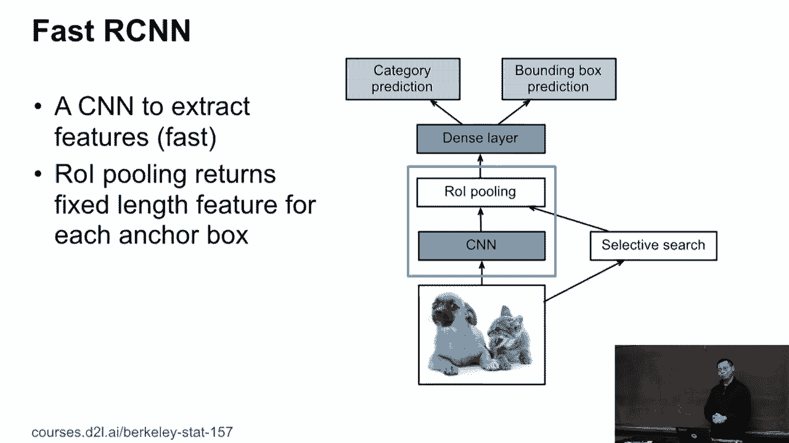

## 🚀 Faster R-CNN：引入区域提议网络

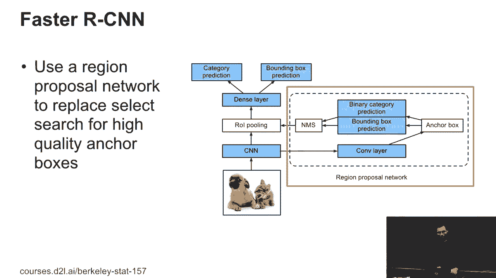

Fast R-CNN虽然更快，但其候选区域（锚框）的生成仍然依赖外部算法（如选择性搜索），这本身较慢且是性能瓶颈。Faster R-CNN的关键创新是**将区域生成步骤也整合进神经网络**。

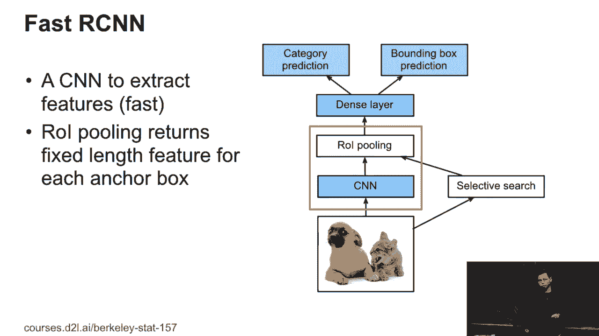


### 区域提议网络（RPN）

Faster R-CNN在共享的特征图后，接入了一个小型神经网络——**区域提议网络（Region Proposal Network, RPN）**。


RPN的工作流程如下：
1.  在特征图上滑动一个小的窗口（如3x3卷积）。
2.  在每个窗口中心，预设多种尺度和长宽比的“锚点”（anchor）。
3.  对每个锚点，RPN同时输出两个预测：
    *   **物体性得分**：判断该锚点是否包含物体（二分类：是物体/背景）。
    *   **边界框偏移量**：预测如何调整锚框以更好地匹配物体。
4.  根据物体性得分筛选出高质量的候选区域，并利用预测的偏移量进行初步调整。


这些由RPN生成的、质量更高的候选区域，随后被送入Fast R-CNN模块（RoI Pooling + 分类/回归）进行最终检测。

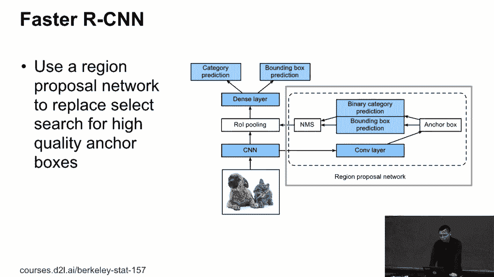

**核心优势**：
*   **速度**：RPN是一个轻量的卷积网络，与主网络共享特征，计算代价很小，替代了耗时的外部区域提议算法。
*   **质量**：RPN通过训练学习如何生成更好的提议，提高了候选区域的质量，从而提升了整体检测精度。
*   **端到端**：整个系统（特征提取、区域提议、分类回归）可以联合训练。

---

## 🎭 Mask R-CNN：扩展到实例分割

Faster R-CNN专注于边界框检测。但当数据集中包含更精细的像素级标注（例如，每个像素属于哪个物体实例）时，我们可以做得更多。Mask R-CNN在Faster R-CNN的基础上，增加了一个**像素级掩码预测**的分支。


### 主要改进

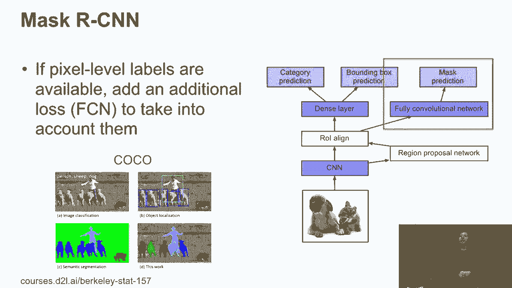

1.  **RoI Align**：为了解决RoI Pooling在量化操作中导致的特征图与原始区域不对齐问题（这对像素级任务至关重要），Mask R-CNN引入了 **RoI Align**。它使用双线性插值来更精确地计算每个区域的特征，保持了空间位置的准确性。
2.  **掩码预测分支**：在原有的分类和边界框回归分支之外，新增一个全卷积网络（FCN）分支。对于每个候选区域，这个分支会输出一个小的二进制掩码（例如28x28），预测该区域内物体的精确像素级形状。

**公式描述**：
总损失函数在Faster R-CNN的基础上增加了掩码损失：
`L = L_cls + L_box + L_mask`
其中 `L_mask` 通常使用逐像素的二元交叉熵损失。

**核心贡献**：Mask R-CNN实现了**实例分割**——不仅能框出物体，还能精确勾勒出物体的轮廓。额外的掩码监督信息也有助于提升边界框预测的准确性。这项工作获得了CVPR 2017的最佳论文奖。

---

## 📊 性能对比与总结

最后，我们来对比一下R-CNN家族与其他主流检测模型的性能。评估指标通常是准确度（mAP）和速度（FPS，每秒处理帧数）。


上图展示了三种模型的对比（注意横轴速度为对数刻度）：
*   **R-CNN系列（蓝色）**：准确度最高，但速度最慢。即使是Faster R-CNN，相比其他现代模型（如YOLO v3）也可能慢一个数量级。
*   **SSD（黄色）与 YOLO v3（绿色）**：属于单阶段检测器，速度更快，但早期版本在精度上可能有所妥协。

**选择建议**：
*   如果对**精度要求极高**且不计较计算成本（例如某些自动驾驶场景），Faster R-CNN或Mask R-CNN仍是重要选择。
*   如果需要在**精度和速度间取得平衡**，更现代的单阶段检测器（如YOLO系列及其变体）是更实用的选择。

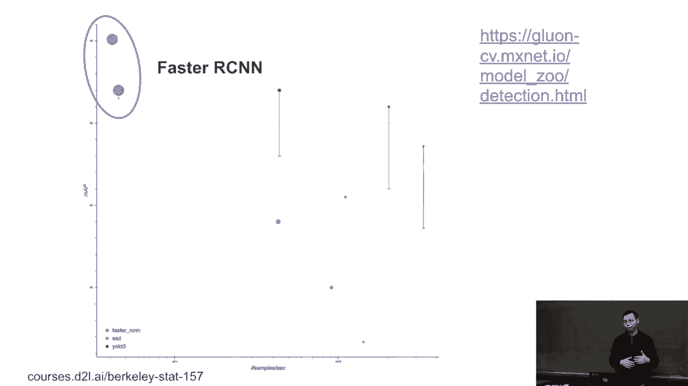


目标检测领域发展迅速，每年都有新模型涌现。R-CNN家族因其开创性的两阶段（提议+检测）思想和模块化设计，奠定了深厚的基础，其核心概念（如锚框、边界框回归、RoI操作）至今仍深刻影响着后续的研究。

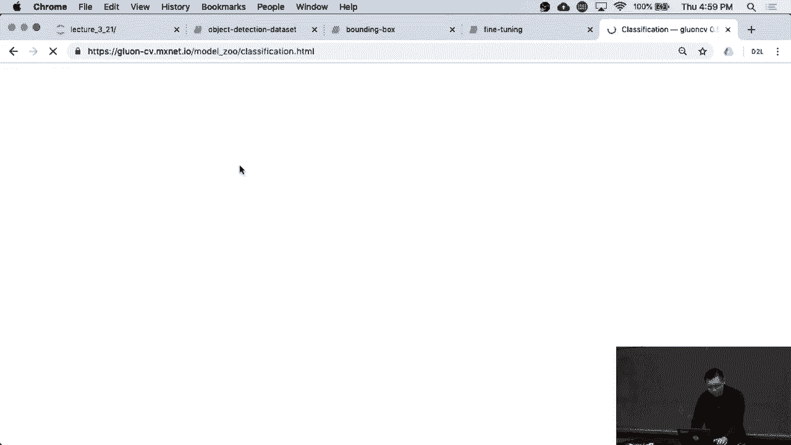

---

## 🎯 本节课总结

在本节课中，我们一起学习了基于区域的卷积神经网络（R-CNN）家族：
1.  **R-CNN**：开创了使用CNN特征进行目标检测的先河，但计算效率低下。
2.  **Fast R-CNN**：通过引入**RoI Pooling**和共享特征提取，大幅提升了训练和测试效率。
3.  **Faster R-CNN**：创新性地提出**区域提议网络（RPN）**，将区域生成过程也纳入网络，实现了端到端训练，在速度和精度上取得更好平衡。
4.  **Mask R-CNN**：在Faster R-CNN基础上增加**掩码预测分支**和**RoI Align**，实现了实例分割，并进一步提升了检测性能。

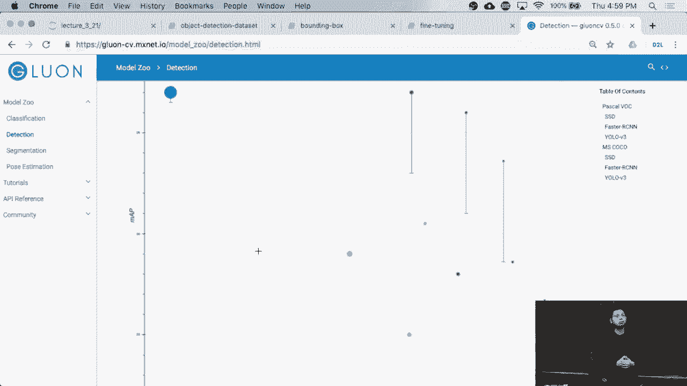

这个系列模型清晰地展示了目标检测算法如何通过结构创新，逐步解决计算瓶颈、提升精度并扩展任务能力。理解R-CNN家族的演进，是掌握现代目标检测技术的重要基石。