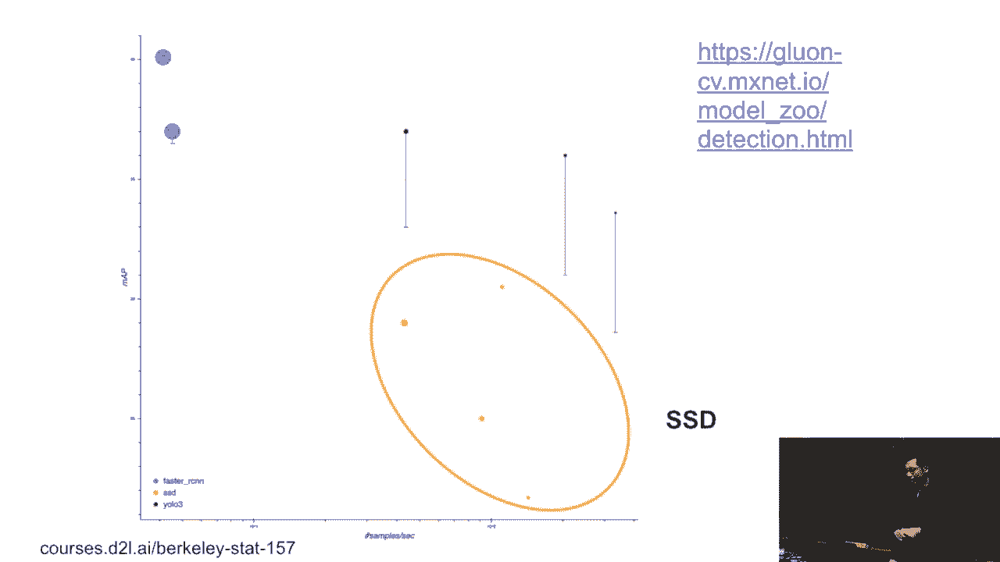
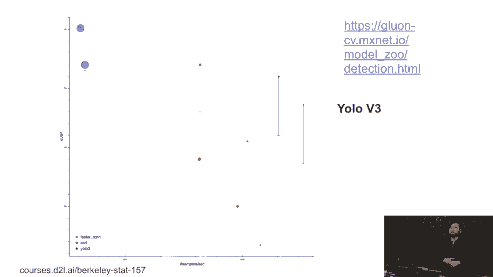

# 90：目标检测入门：SSD与YOLO 🎯

在本节课中，我们将学习两种经典的单阶段目标检测算法：SSD（Single Shot MultiBox Detector）和YOLO（You Only Look Once）。我们将重点理解它们的基本思想、核心区别以及各自的优缺点。

---

## SSD：单次多框检测器 🧩

上一节我们介绍了目标检测的背景，本节中我们来看看SSD算法。SSD被称为“单次多框检测器”，其核心概念相对简单。SSD与RCNN系列算法的主要区别在于**边界框（Bounding Box）的生成方式**。

在RCNN系列中，通常使用复杂的算法（如Selective Search）来生成候选区域（Region Proposals），以期尽可能覆盖图像中的物体。而SSD的做法则要简单得多。

### SSD的核心思想

在SSD中，对于特征图上的**每一个像素点**，我们都会以其为中心，生成多个不同大小和形状的边界框，这些预定义的框被称为**锚框（Anchor Boxes）**。

以下是生成锚框的关键参数：
*   **大小（Size）**：相对于原始图像的比例，例如 `S1, S2, ..., SN`。
*   **比例（Aspect Ratio）**：框的宽高比，例如 `R1, R2, ..., RM`。

生成锚框的数量并非简单的 `N * M`，而是 `N + M - 1`。具体生成方式如下：
1.  首先，固定第一个比例 `R1`，然后遍历所有大小 `S1` 到 `SN`，生成前 `N` 个锚框。
2.  接着，固定第一个大小 `S1`，然后遍历所有比例 `R2` 到 `RM`（`R1` 已生成过），生成剩余的 `M-1` 个锚框。

**公式**：`锚框总数 = N + (M - 1)`

之所以不生成 `N * M` 个锚框，是为了避免数量过多导致计算和内存负担过重。例如，若 `N=10`, `M=10`，每个像素点将产生100个锚框。对于一张100x100的图像，将产生多达100万个锚框，这是不现实的。因此，SSD通过调整大小和比例的线性组合来取得平衡。

### SSD的网络结构与多尺度检测

SSD的整个模型流程如下：
1.  **输入图像**：将图片输入网络。
2.  **基础网络（Backbone）**：使用一个卷积神经网络（如VGG、ResNet）进行特征提取，输出一个较小的特征图（例如32x32）。
3.  **生成锚框与预测**：在该特征图的每个位置上，为每个预定义的锚框进行两项预测：
    *   **类别预测**：判断框内物体的类别。
    *   **边界框回归**：微调锚框的位置和大小，使其更贴合真实物体。
4.  **多尺度特征图**：SSD的一个重要特点是**多尺度检测**。基础网络输出的深层特征图尺寸较小，感受野大，适合检测大物体。网络还会从中间层引出一些较浅的特征图，这些特征图尺寸较大，感受野小，适合检测小物体。在每一层特征图上，都会生成一组特定尺度的锚框并进行预测。

这样，SSD就不再需要像RCNN那样显式地学习如何生成候选区域。它只需预先定义好不同尺度和比例的锚框，就能覆盖图像中各种可能的物体形状和大小。这些尺度和比例就是需要手动设置的**超参数**。

### SSD的性能表现

我们可以通过准确率与速度的权衡来评估检测算法。在性能图表中：
*   **X轴**：吞吐量（FPS，每秒检测帧数），代表速度。
*   **Y轴**：准确度（如mAP，平均精度均值），代表精度。

理想的目标是位于图表的**右上角**（高精度、高速度）。SSD作为两三年前的算法，在当时实现了速度上的显著突破，比Fast R-CNN等两阶段方法快很多，虽然牺牲了一些精度，但在需要快速推理的场景中非常实用。

---

## YOLO：你只看一次 🚀

上一节我们介绍了SSD，本节中我们来看看另一种著名的单阶段检测器——YOLO。YOLO的基本思想与SSD有相似之处，但在锚框的处理上有所不同。

### YOLO的核心思想

SSD为每个像素点生成大量高度重叠的锚框。而YOLO（以v1版本为例）的思路更直接：
1.  将输入图像（或特征图）均匀划分为 `S x S` 个网格（Grid Cell）。
2.  每个网格负责预测**固定数量**（例如B个）的边界框。
3.  每个边界框预测包含：框的位置、大小以及该框包含物体的置信度。同时，每个网格还会预测一组**类别概率**。

**关键区别**：在YOLO v1中，每个网格预测的边界框在初始阶段**不重叠**（由不同网格负责不同区域），这大大减少了冗余的锚框数量，使得检测速度极快。“You Only Look Once”正体现了其一次性完成分类和定位的简洁特性。

### YOLO的演进

YOLO算法本身也在不断进化：
*   **YOLO v2**：吸收了SSD等算法的思想，引入了锚框（Anchor Box）机制，性能与SSD等算法更为接近。
*   **YOLO v3及以后**：在v2的基础上，引入了更优的基础网络、多尺度预测等改进，在速度和精度上取得了更好的平衡。

从性能图表上看，YOLO系列（如图中的绿色点）通常能实现比小型SSD更快的速度（例如快1.5倍），同时保持良好的精度，因此在实时检测领域应用非常广泛。

---

## 总结 📝

本节课中我们一起学习了两种主流的单阶段目标检测算法：
1.  **SSD**：通过在不同尺度的特征图上，为每个位置预定义多种大小和比例的**锚框**，实现多尺度目标检测。它在速度和精度间取得了良好平衡。
2.  **YOLO**：最初通过将图像划分为网格，每个网格直接预测边界框和类别，实现了极高的速度。后续版本借鉴了锚框等思想，持续优化性能。

它们的共同点是**将“区域提议”和“分类回归”合并在一个网络中进行**，因此速度远快于RCNN系列的两阶段方法。理解锚框、多尺度预测以及网格划分这些核心概念，是掌握现代目标检测模型的基础。