# 91：CNN训练技巧集锦 🧠


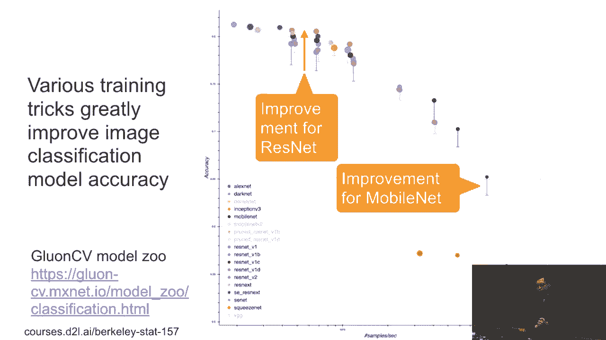

在本节课中，我们将学习一系列能够显著提升卷积神经网络（CNN）训练效果和最终性能的实用技巧。这些技巧虽然看似微小，但在复现论文结果或提升模型性能时至关重要。

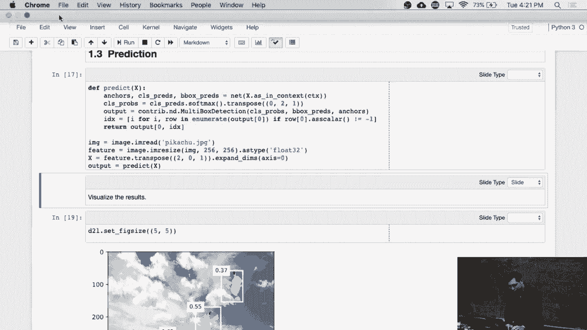

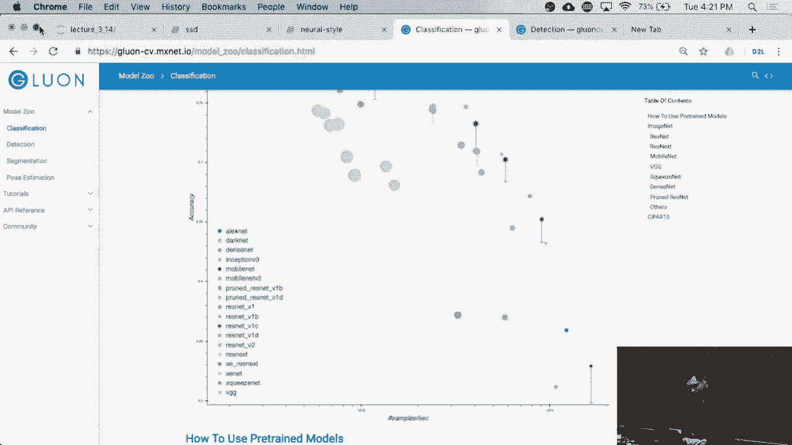

---

## 📊 概述：为什么需要训练技巧？

在前面的课程中，我们讨论了构建和训练网络的基本思路。然而，如果仅仅按照常规步骤操作，通常难以复现学术论文中报告的高性能结果。阅读论文时，你会发现其中包含了许多实验细节和“小技巧”。实际上，这些细节对于达到最佳性能至关重要。

例如，在模型库中，一个典型的模型在应用了一系列技巧后，其准确率可以从约75%提升到77%甚至更高。这种2%的提升在学术研究中（例如CVPR会议）可能就是决定性的改进。这些技巧通常计算开销极小，却能带来显著的性能增益。

接下来，我们将逐一介绍几个核心的训练技巧。

---

## 🎨 技巧一：MixUp 数据增强

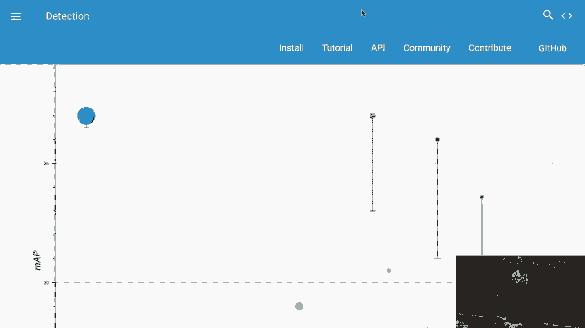

MixUp是一种非常规但有效的**数据增强**方法。它的核心思想是：在每次训练时，我们不直接使用原始样本，而是将两个随机样本及其标签进行线性组合，生成一个新的“混合”样本来进行训练。

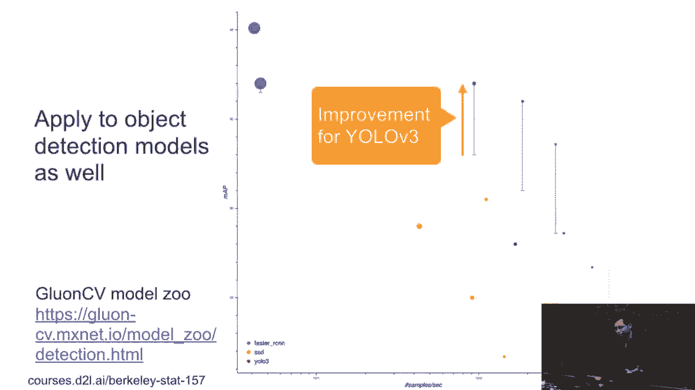

以下是其工作原理：

1.  **选择样本**：从数据集中随机选择两个样本，记作 `(X_i, Y_i)` 和 `(X_j, Y_j)`。
2.  **生成混合系数**：从Beta分布或简单地从区间 `[0, 1]` 中随机采样一个系数 `λ`。
3.  **混合输入与标签**：
    *   新的输入 `X_new` 是两个原始输入的加权和：`X_new = λ * X_i + (1 - λ) * X_j`
    *   新的标签 `Y_new` 也是两个原始独热编码标签的加权和：`Y_new = λ * Y_i + (1 - λ) * Y_j`

**代码描述**：
```python
# 假设 lambda 是混合系数
lambda = np.random.beta(alpha, alpha)  # 或 np.random.uniform(0, 1)
x_mixed = lambda * x_i + (1 - lambda) * x_j
y_mixed = lambda * y_i + (1 - lambda) * y_j
# 使用 x_mixed 和 y_mixed 进行训练
```

这种方法生成的图像可能看起来很奇怪（例如，一个时钟图像中混合了微弱的眼镜特征），但它能鼓励模型学习更平滑的决策边界，从而提升泛化能力。

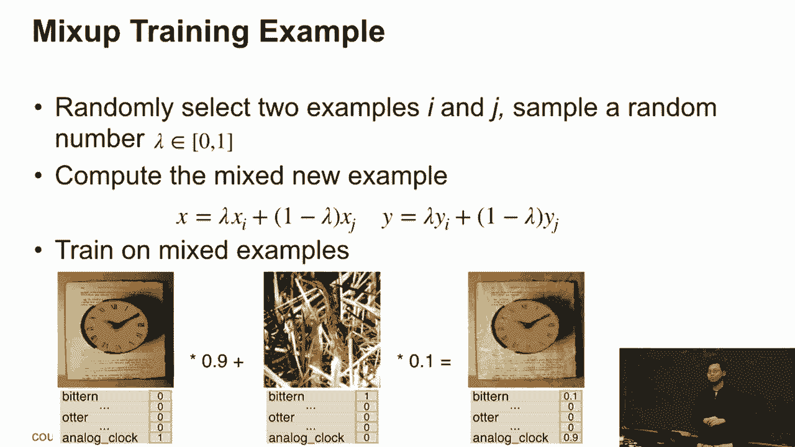

**在目标检测中的应用**：MixUp也可用于目标检测。此时，需要将两张图片拼接，并将它们的边界框（bounding box）列表合并。关键是要保持输入图像的几何形状不变，以避免比例失真。

---

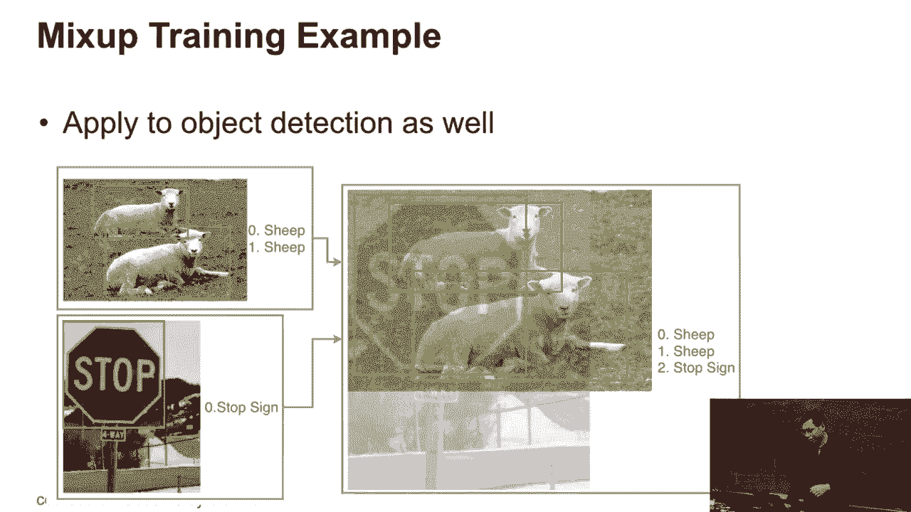

## 🏷️ 技巧二：标签平滑

在分类任务中，我们通常使用**独热编码**来表示标签：对于类别 `i`，其标签向量在第 `i` 位为1，其余位为0。然而，模型的输出层通常使用Softmax函数，它很难完美地逼近0或1这样的极值。

**标签平滑**通过软化独热编码的“硬”目标来解决这个问题，使模型训练更稳定，并有助于模型校准。

具体做法是：对于真实类别 `i`，我们不将其标签设为1，而是设为 `1 - ε`；对于其他所有类别，我们不将其标签设为0，而是设为 `ε / (K - 1)`，其中 `K` 是总类别数。

**公式描述**：
对于真实类别 `i` 的平滑后标签 `y_smooth`：
*   `y_smooth[i] = 1 - ε`
*   对于所有 `j ≠ i`，`y_smooth[j] = ε / (K - 1)`

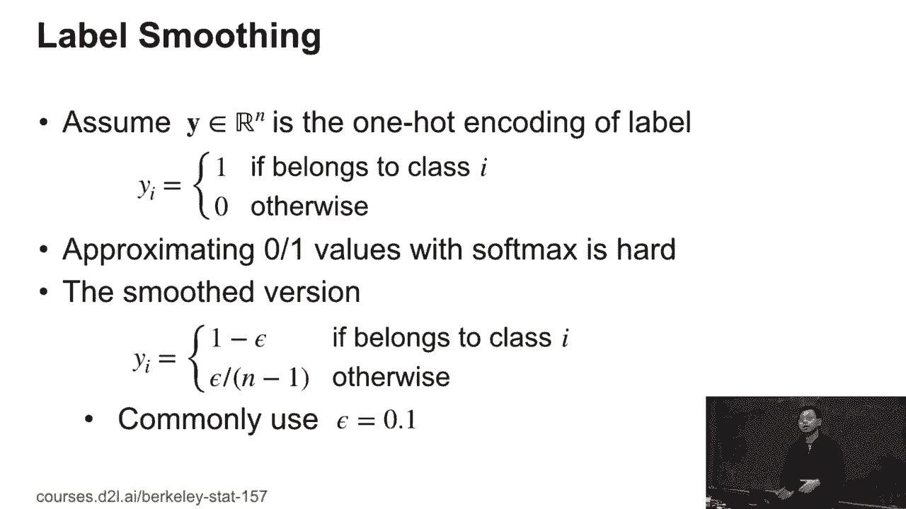

例如，当 `ε = 0.1`，`K=10`时，真实类别的标签变为0.9，其他每个类别的标签变为0.1/9 ≈ 0.011。这使得目标分布更加平滑，更容易让Softmax去拟合。

---

## 📈 技巧三：学习率预热与余弦衰减

学习率的设置对训练收敛速度和最终效果影响巨大。这里介绍两种策略：**预热**和**余弦衰减**。

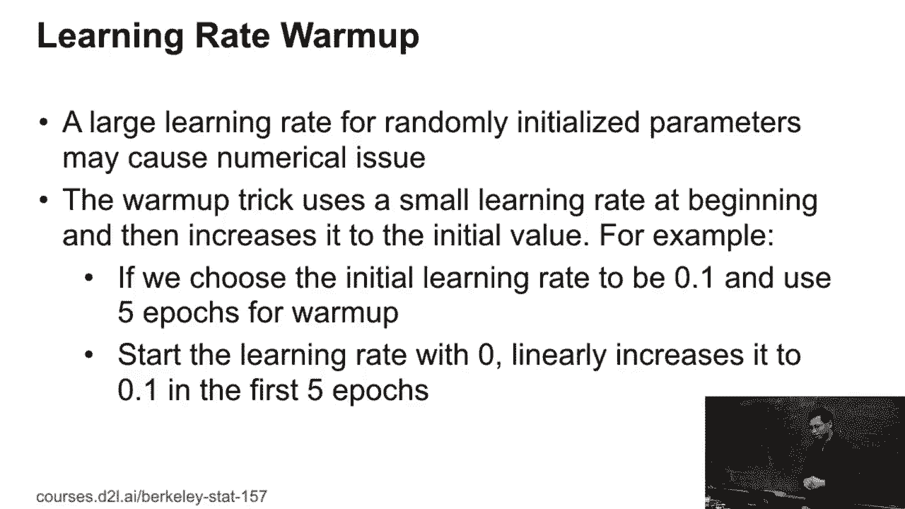

### 学习率预热

当我们使用**大批量训练**或**复杂的模型初始化**时，如果一开始就使用较大的学习率，可能导致优化过程不稳定。**学习率预热**策略在训练初期使用一个很小的学习率，然后线性地增加到预设的初始学习率。

**操作方式**：假设我们计划使用0.1作为基础学习率。在前 `N` 个epoch（例如5个）内，学习率从0线性增长到0.1。这给了模型一个“热身”阶段，使其参数先稳定到一个相对平滑的区域。

### 余弦衰减

传统的学习率调度（如在30、60、90个epoch时将学习率降低10倍）需要手动设置多个超参数。**余弦衰减**提供了一种更平滑、更自动化的衰减方式。

**公式描述**：
假设总训练步数为 `T`，当前步数为 `t`，初始学习率为 `η`，则当前学习率 `η_t` 为：
`η_t = 0.5 * η * (1 + cos(π * t / T))`

这种调度方式在开始时衰减较慢，中期近似线性下降，末期衰减又逐渐变缓，形成一个平滑的曲线。它的主要优点是几乎无需调参，并且通常能带来更好的最终精度。

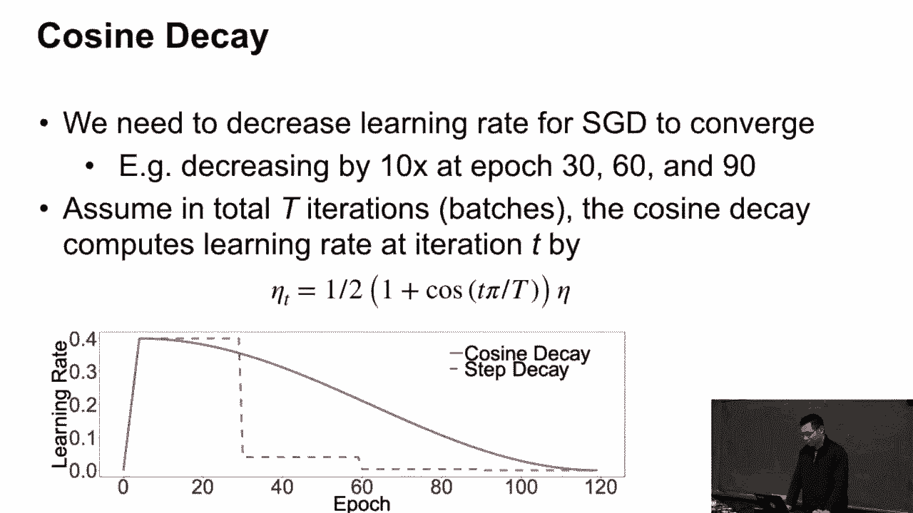

---

## 🔗 技巧四：同步批量归一化

标准的**批量归一化**在一个批次的数据上计算均值和方差。这在图像分类任务中通常没问题，因为我们可以使用较大的批次大小（如32、64）。

然而，在**目标检测**或**语义分割**任务中，由于需要处理大量候选区域（如锚框），内存消耗巨大，经常导致每个GPU只能处理一张或很少几张图片（即批次大小很小）。在小批次上计算的BN统计量非常不可靠，会导致训练不稳定。

**同步批量归一化**的解决方案是：在多GPU训练时，跨所有GPU同步计算均值和方差。如果使用8个GPU，每个GPU有1张图片，那么SyncBN就相当于在一个批次大小为8的数据上计算BN统计量。虽然这引入了GPU间的通信开销，但换来了稳定且有效的归一化，对于检测和分割任务至关重要。

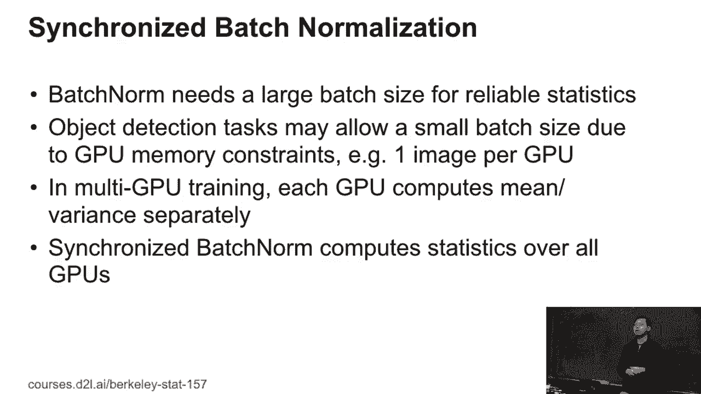

---

## 🖼️ 技巧五：随机训练尺寸

在图像分类中，我们通常将所有输入图像缩放到固定尺寸（如224x224）。但在目标检测中，物体尺寸变化很大，固定尺寸可能不是最优的。

**随机训练尺寸**策略在**每个训练批次**中，随机选择一个目标尺寸（通常是32的倍数，如224、256、288等），然后将该批次内的所有图片都缩放到这个随机尺寸。

**为什么选择32的倍数？** 因为许多CNN（如ResNet）包含多个下采样阶段（通常为5次，每次缩小2倍），最终特征图尺寸会缩小32倍。使用32的倍数作为输入尺寸，可以确保最终特征图的尺寸是整数，避免不必要的对齐问题。

这种方法让模型在训练过程中接触到不同尺度的图像，提升了模型对不同尺寸目标的鲁棒性。

---

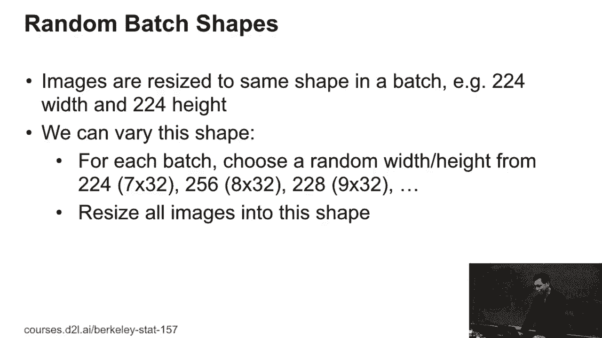

## 📊 技巧效果总结

让我们通过一些实验结果，直观感受这些技巧带来的提升：

*   **图像分类（如ResNet）**：
    *   基线准确率：约77%
    *   + 余弦衰减：提升 ~0.75%
    *   + 标签平滑：提升 ~0.4%
    *   + MixUp：提升 ~0.8%
    *   累计提升后准确率：接近79%

*   **目标检测（如YOLOv3）**：
    *   基线mAP：约80%
    *   + 同步批量归一化：提升 ~0.56%
    *   + 随机训练尺寸：提升 ~0.4%
    *   + 余弦衰减：提升 ~0.4%
    *   + 标签平滑：提升 ~0.4%
    *   + MixUp：提升 ~1.5%
    *   累计提升后mAP：提升约3.4%

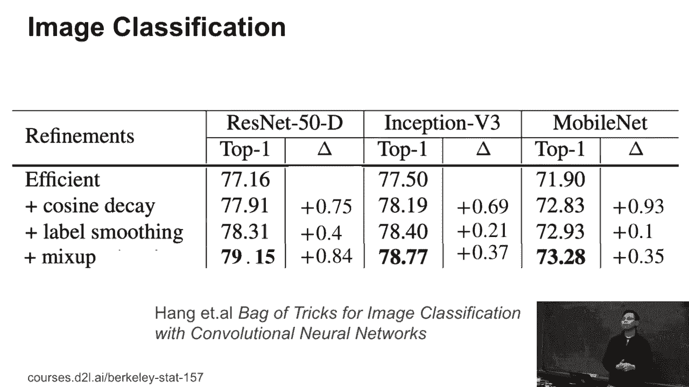

可以看到，将这些技巧组合使用，能带来非常可观的性能增益。

---

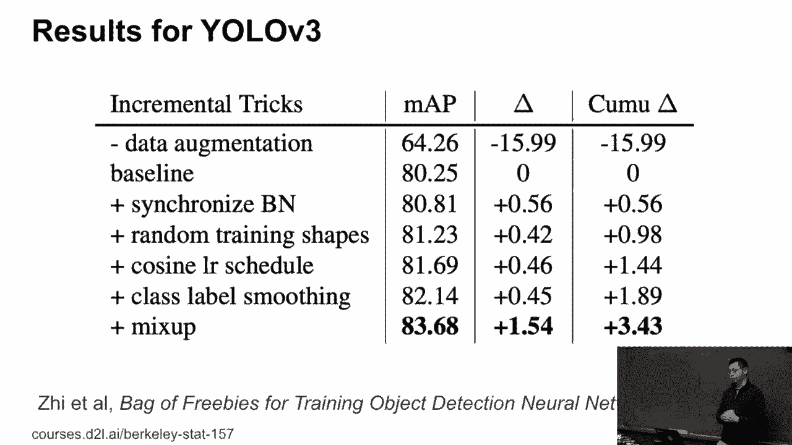

## 🎯 课程总结


本节课我们一起学习了五个关键的CNN训练技巧：
1.  **MixUp**：通过线性混合样本和标签进行数据增强。
2.  **标签平滑**：软化独热编码标签，使训练更稳定。
3.  **学习率预热与余弦衰减**：更智能地调度学习率，促进收敛。
4.  **同步批量归一化**：解决小批次训练时的归一化问题，对检测/分割任务关键。
5.  **随机训练尺寸**：提升模型对不同输入尺度的适应性。


这些技巧是许多高水平论文和代码库中的“隐藏细节”。掌握它们，不仅能帮助你更好地复现前沿成果，也能在你自己的项目中有效提升模型性能。未来阅读论文或源码时，请务必留意这些看似微小却至关重要的实践。