# 92：在 Python 中实现 SSD 🚀

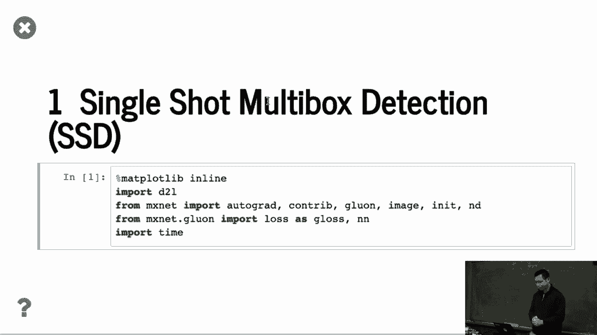

在本节课中，我们将学习如何用 Python 实现单次多框检测器。我们将从核心概念入手，逐步构建一个简化的“Tiny SSD”模型，并完成训练和预测的全过程。

---

## 概述 📋

SSD 是一种高效的目标检测算法。与之前的方法相比，它速度更快，因为它能在一次前向传播中同时预测多个边界框及其类别。本节课，我们将深入探讨其实现细节，包括网络结构设计、多尺度预测、损失函数以及最终的预测流程。

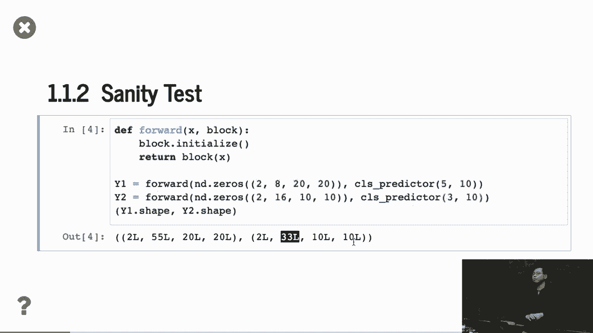

---

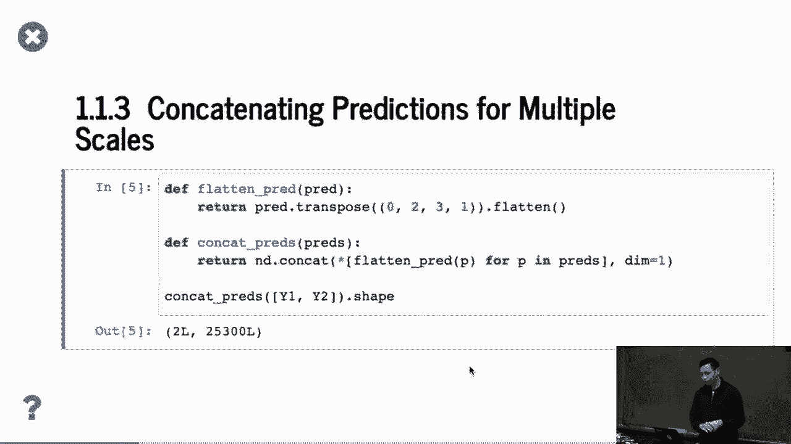

## 1. 类别预测

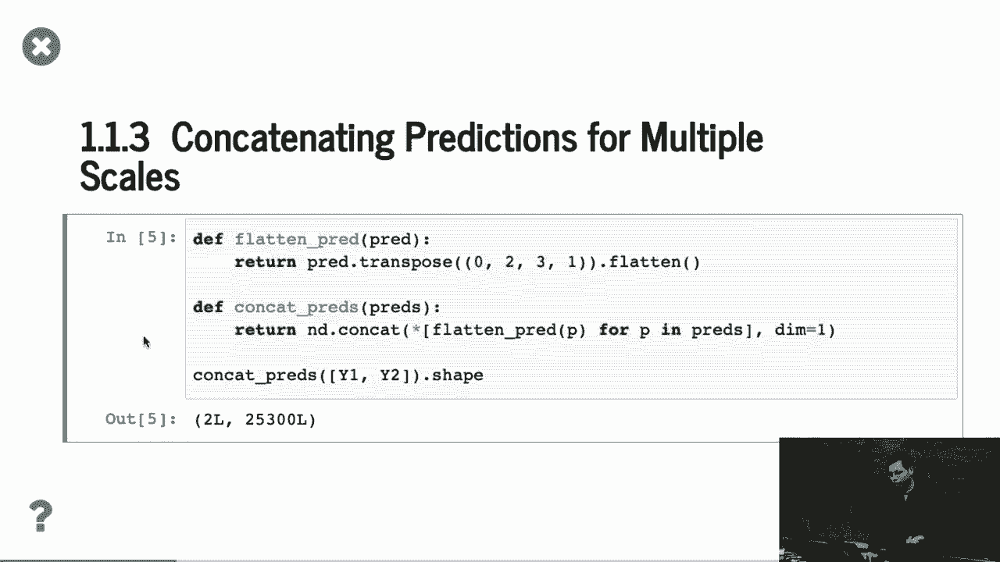

上一节我们介绍了 SSD 的基本思想，本节中我们来看看如何为每个锚框预测类别。

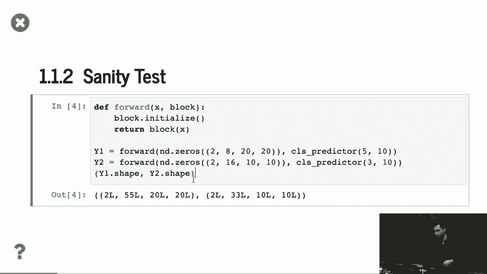

假设我们有一个输入特征图，并为它生成了多个锚框。设锚框数量为 `a`，类别数量为 `c`。对于每个锚框，我们需要预测 `c + 1` 个类别的分数，其中加上的“1”代表“背景”类别，表示该锚框不包含任何目标物体。

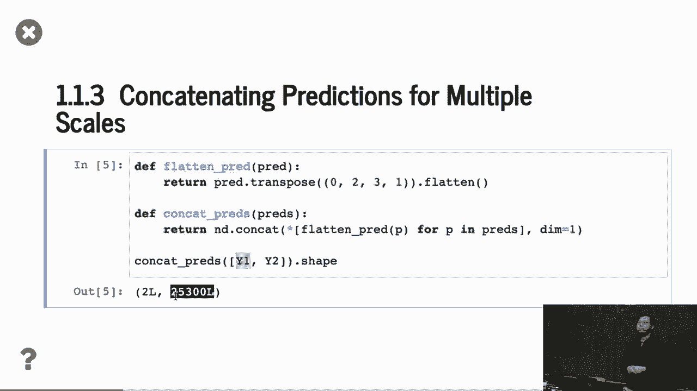

为了实现这一点，我们使用一个卷积层。其输出通道数应为 `a * (c + 1)`。这是因为对于特征图上的每个像素位置（对应一个锚框中心），我们需要为 `a` 个锚框中的每一个生成 `c+1` 个预测值。

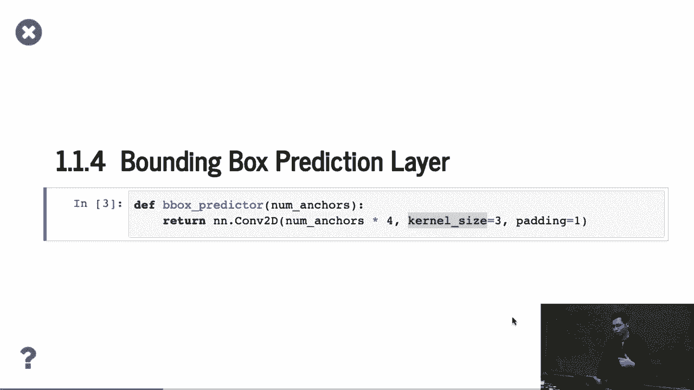

我们选择卷积核大小为 3，步长为 1，填充为 1。这样可以保证输出特征图的空间尺寸（高度和宽度）与输入相同。这意味着特征图上的每个像素，在输出中都有一个对应的像素，而该像素拥有 `a * (c+1)` 个通道，分别代表该位置所有锚框的类别预测。

这与传统的图像分类网络不同。在分类网络中，我们通常通过全局平均池化将特征图压缩成一个向量，其长度等于类别数 `c`。但在 SSD 中，我们**不进行池化**，因为需要为空间中的每个位置（即每个锚框）进行独立预测。

以下是类别预测层的代码示意：
```python
# num_anchors: 锚框数量 a
# num_classes: 类别数量 c
cls_predictor = nn.Conv2d(in_channels, num_anchors * (num_classes + 1), kernel_size=3, padding=1)
```

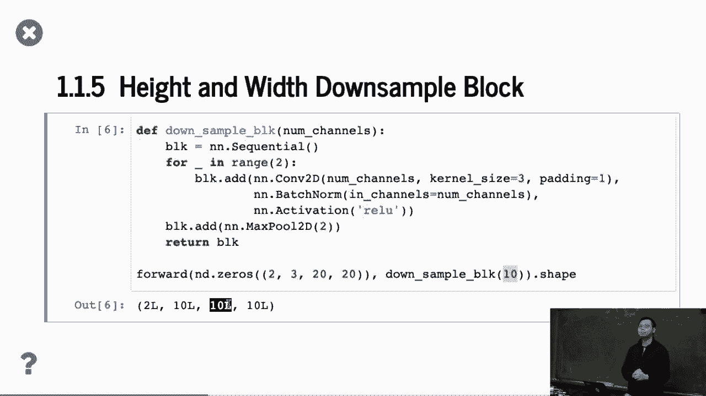

---

## 2. 边界框预测

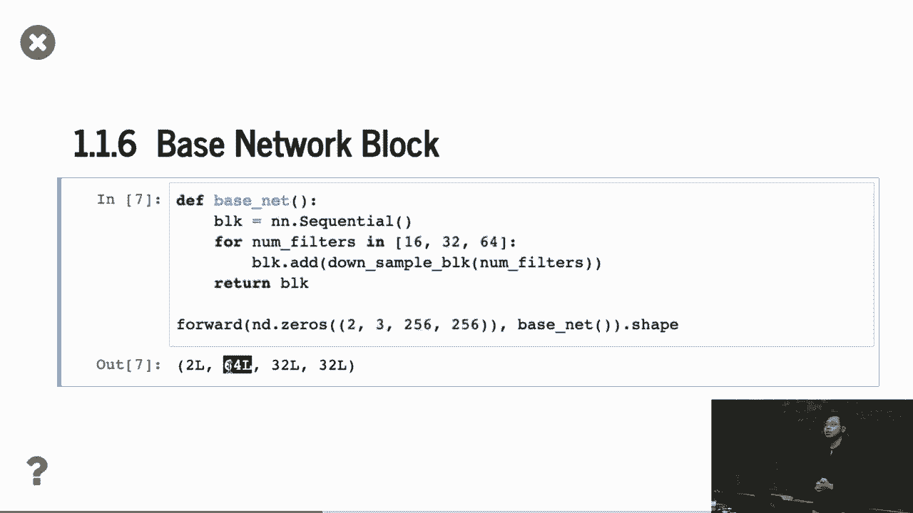

与类别预测类似，我们也需要为每个锚框预测其边界框的偏移量。

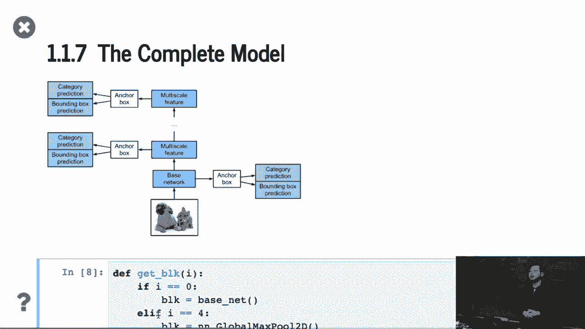


一个边界框可以用 4 个值表示（例如中心点坐标、高度和宽度）。因此，对于 `a` 个锚框，边界框预测层的输出通道数应为 `a * 4`。

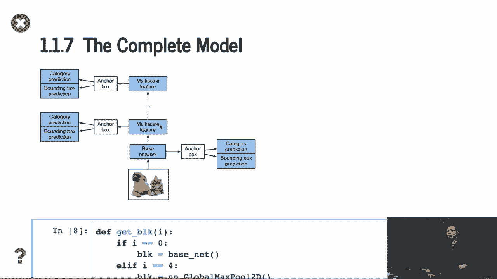

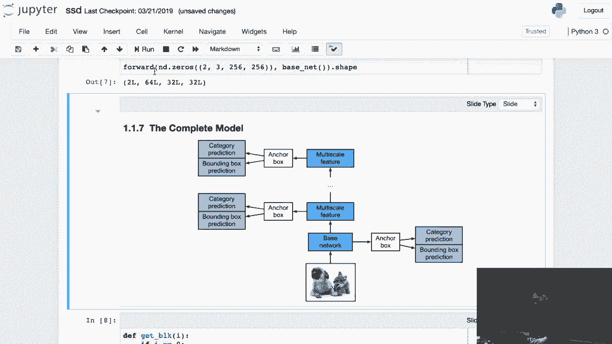

以下是边界框预测层的代码示意：
```python
# num_anchors: 锚框数量 a
bbox_predictor = nn.Conv2d(in_channels, num_anchors * 4, kernel_size=3, padding=1)
```

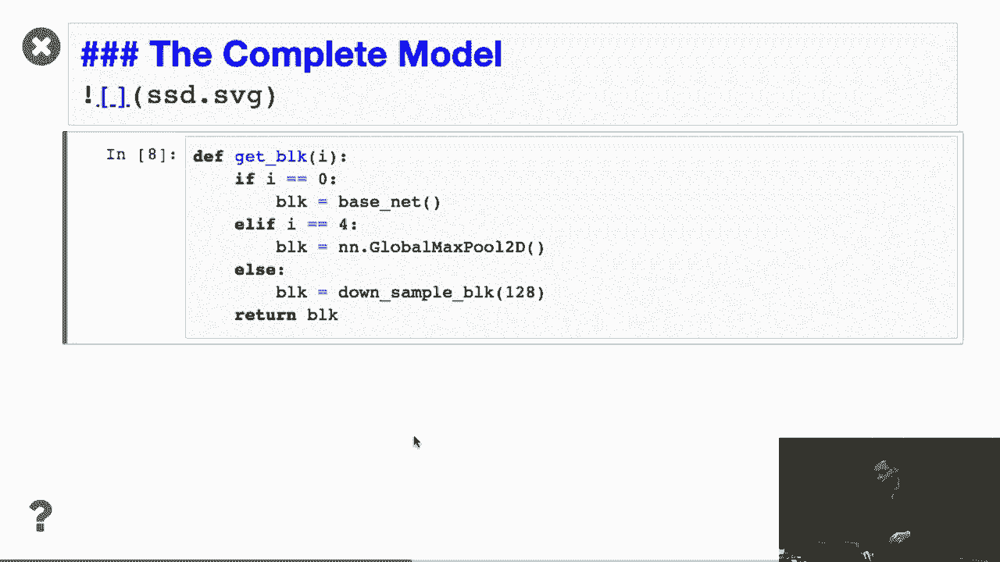

---

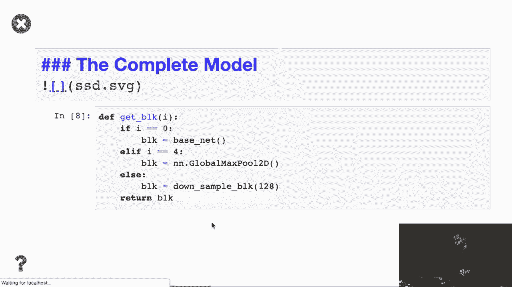

## 3. 拼接多尺度预测

SSD 的核心优势在于利用不同层级的特征图进行多尺度预测。每个尺度会输出自己的预测结果，我们需要将它们拼接起来，输入到损失函数中进行统一计算。

具体做法如下：
1.  对于每个尺度的输出张量，其形状为 `(batch_size, channels, height, width)`。
2.  我们将其**转置**为 `(batch_size, height, width, channels)`。
3.  然后将其**展平**为一个二维矩阵，形状为 `(batch_size * height * width, channels)`。这里的 `channels` 对于类别预测是 `a*(c+1)`，对于边界框预测是 `a*4`。
4.  最后，将所有尺度展平后的预测矩阵在**第0维（非批次维度）进行拼接**。

假设有两个尺度的类别预测 `y1` 和 `y2`，处理后的形状分别为 `(N1, C)` 和 `(N2, C)`，拼接后得到 `(N1+N2, C)`。这样，我们就将所有锚框的预测统一到了一个二维张量中。

---

## 4. 下采样块

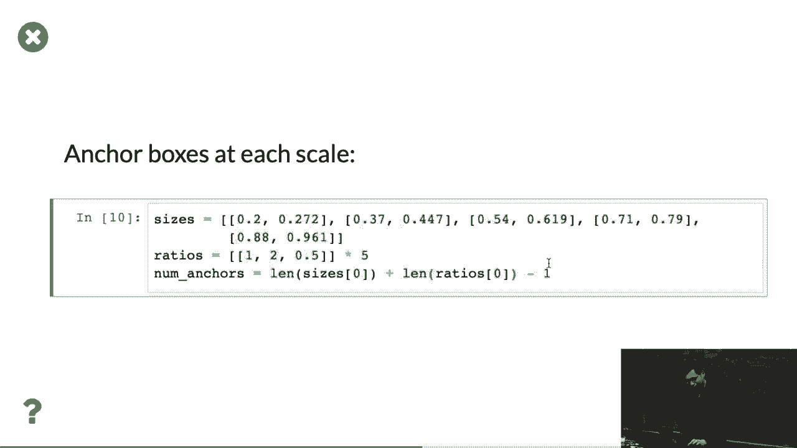

为了生成多尺度特征图，我们需要一个能降低空间分辨率（下采样）并增加通道数的基本模块。

我们定义一个“下采样块”。它通常包含以下操作：
1.  一个卷积层（`Conv2d`），用于将通道数映射到目标输出通道数，并保持空间尺寸不变（通过填充实现）。
2.  批量归一化层（`BatchNorm2d`）。
3.  ReLU 激活函数。
4.  一个最大池化层（`MaxPool2d`），步长为 2，用于将高度和宽度减半。

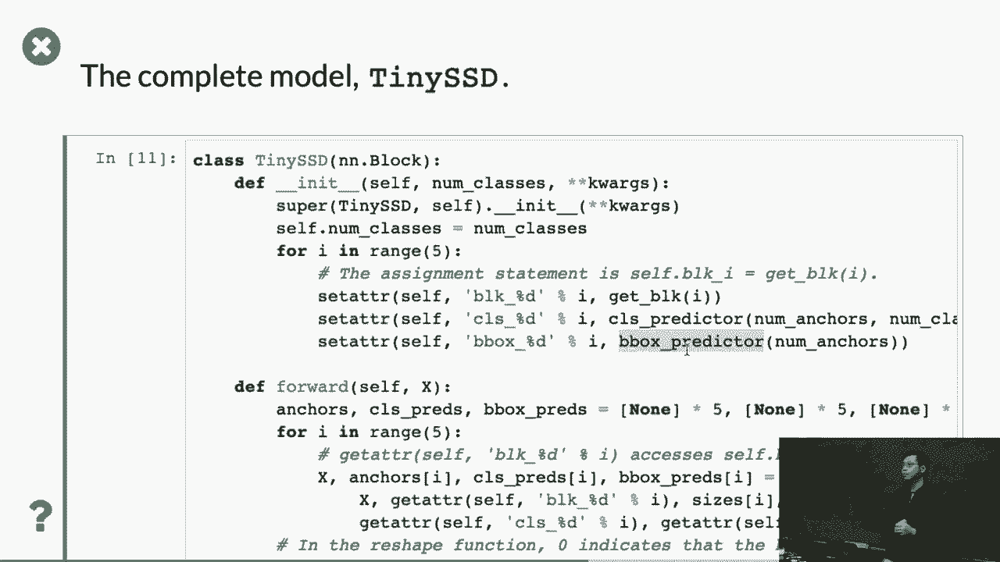

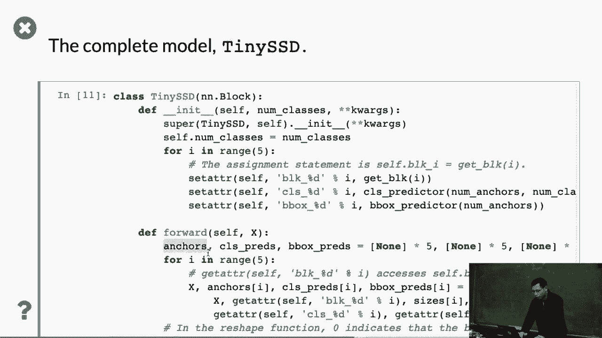

例如，输入一个 `20x20` 的特征图，经过下采样块后，输出通道数变为指定值（如 10），而空间尺寸变为 `10x10`。

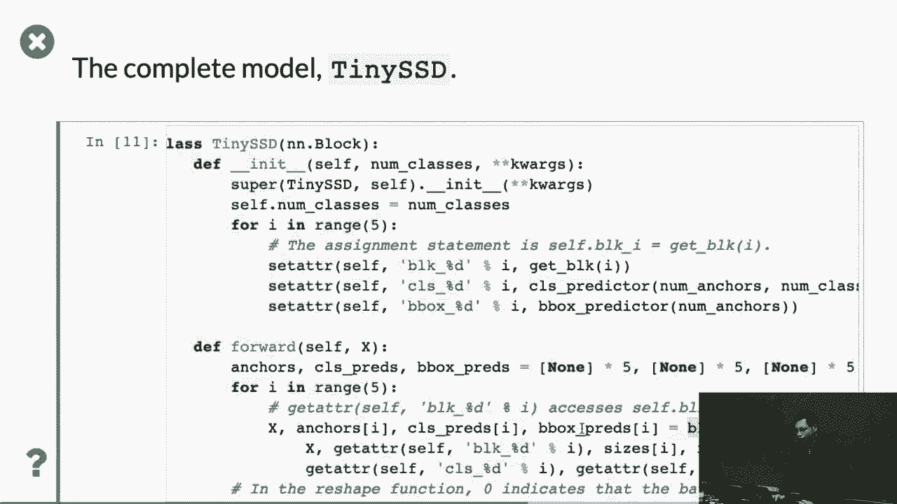

以下是下采样块的代码示意：
```python
def down_sample_blk(in_channels, out_channels):
    blk = []
    # 卷积层，改变通道数，保持尺寸
    blk.append(nn.Conv2d(in_channels, out_channels, kernel_size=3, padding=1))
    blk.append(nn.BatchNorm2d(out_channels))
    blk.append(nn.ReLU())
    # 池化层，尺寸减半
    blk.append(nn.MaxPool2d(2))
    return nn.Sequential(*blk)
```

---

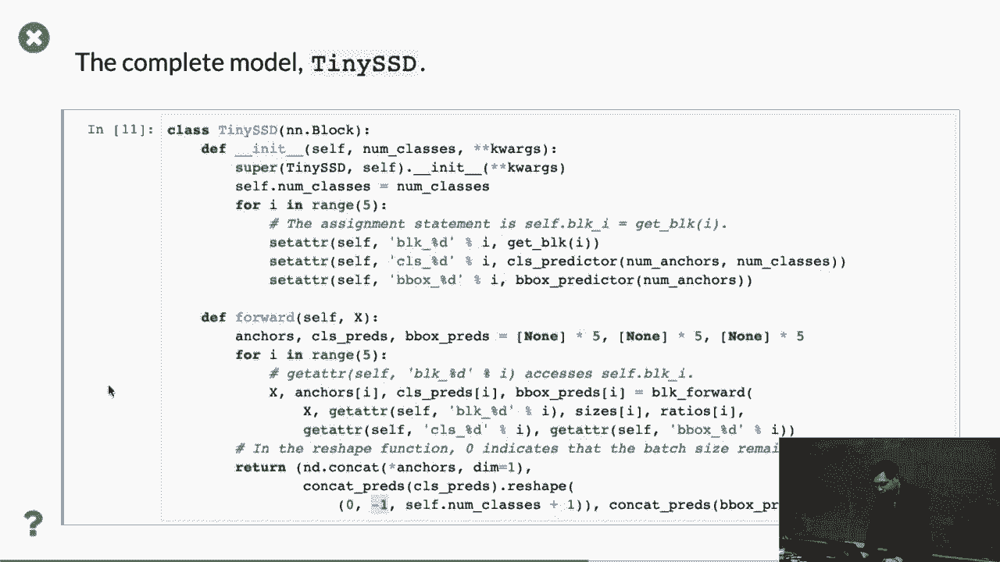

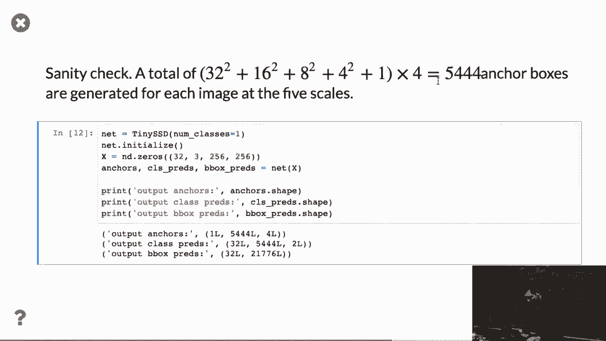

## 5. 基础网络与完整模型


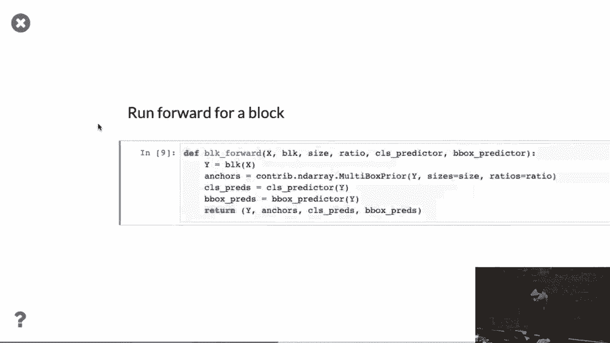

现在，我们可以组装完整的 Tiny SSD 模型。

**基础网络**：通常可以使用 ResNet 等预训练网络进行微调。为了简化，这里我们将多个下采样块堆叠起来作为基础网络。例如，连续使用三个下采样块，每次将空间尺寸减半，并将通道数翻倍。对于 `256x256` 的输入图像，基础网络可将其转换为 `32x32` 的特征图（尺寸减少 8 倍）。

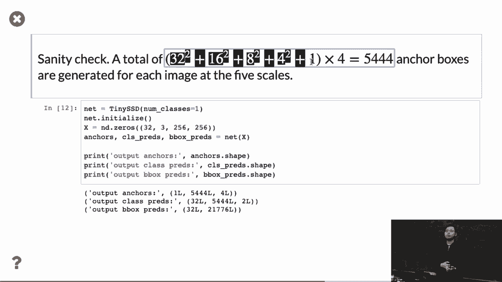

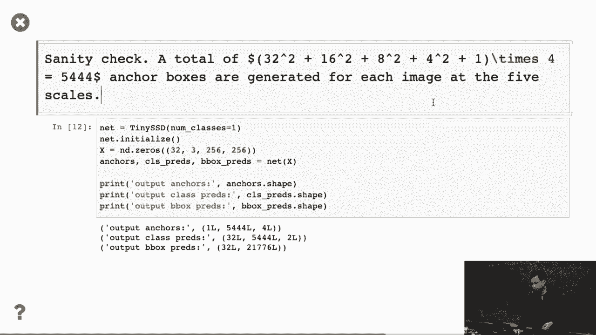

**完整模型流程**：完整的 Tiny SSD 包含 5 个“阶段”。
1.  **阶段 0**：基础网络。
2.  **阶段 1-3**：三个额外的下采样块，用于生成更小尺度的特征图。
3.  **阶段 4**：一个全局平均池化层，生成 `1x1` 的特征图，用于检测非常大的物体。

每个阶段都会输出特征图，并为该特征图上的每个像素生成锚框、类别预测和边界框预测。

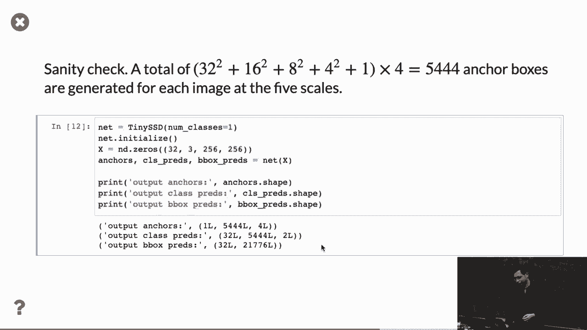

**前向传播**：对于每个阶段，输入通过该阶段的网络得到特征图 `y`。然后，根据为该阶段预设的锚框尺寸和宽高比，为特征图 `y` 上的每个像素生成锚框。接着，将特征图 `y` 分别输入该阶段对应的类别预测器和边界框预测器，得到预测结果。最后，将所有阶段的锚框、类别预测、边界框预测分别拼接起来。

**锚框设置**：不同阶段负责检测不同大小的物体。例如：
*   浅层特征图（尺寸大）使用较小的锚框尺寸（如原图的 20%），用于检测小物体。
*   深层特征图（尺寸小）使用较大的锚框尺寸（如原图的 80%），用于检测大物体。
*   每个位置通常设置多个宽高比（如 1:1, 2:1, 1:2）的锚框。若设置 2 种尺寸和 2 种宽高比，则每个位置有 4 个锚框。

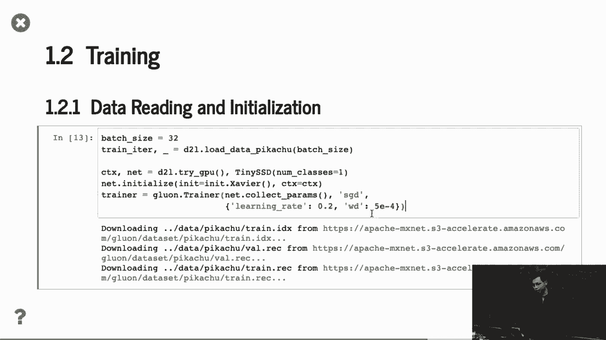

---

## 6. 损失函数

SSD 的损失函数由两部分组成：类别损失和边界框损失。

**类别损失**：使用交叉熵损失（Cross-Entropy Loss）。对于每个锚框，我们计算其预测的 `c+1` 个类别分数与真实标签之间的损失。
```python
cls_loss = F.cross_entropy(cls_preds, cls_labels)
```

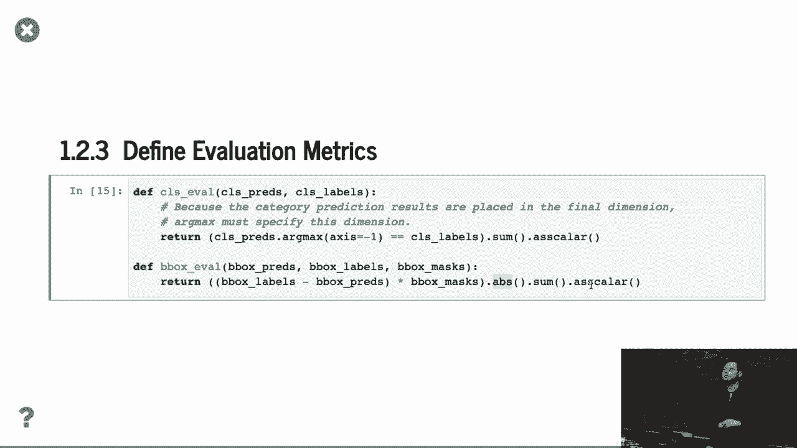

**边界框损失**：使用 L1 损失（平滑 L1 损失更佳）。我们只对那些与真实边界框匹配（即非背景）的锚框的边界框预测进行惩罚。这通过一个掩码来实现。
```python
# bbox_preds: 边界框预测
# bbox_labels: 边界框真实标签
# bbox_masks: 掩码，匹配的锚框位置为1，背景为0
bbox_loss = F.l1_loss(bbox_preds * bbox_masks, bbox_labels * bbox_masks)
```

**总损失**：总损失是类别损失和边界框损失的加权和。为简化，常将两者直接相加。
```python
total_loss = cls_loss + bbox_loss
```

---

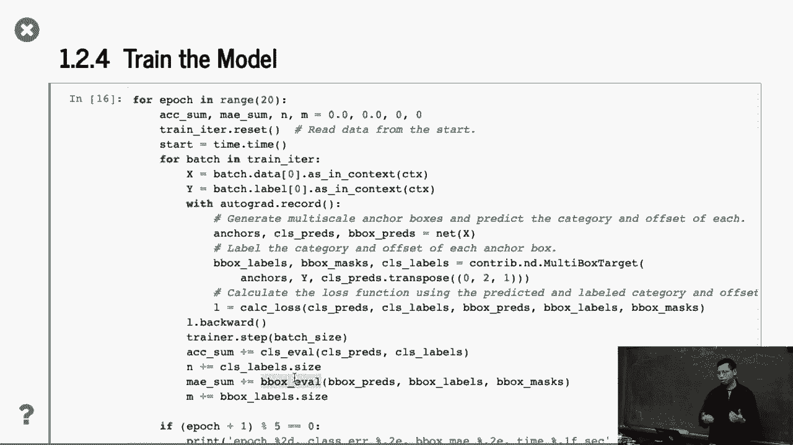

## 7. 训练流程

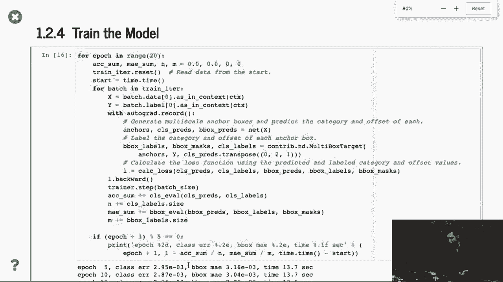

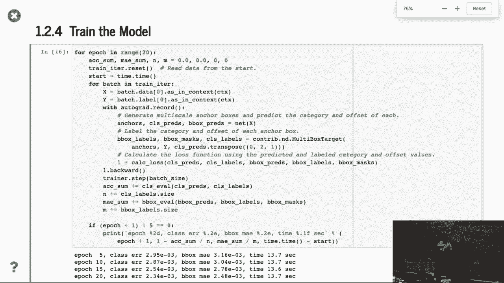

训练循环与分类网络类似，但数据准备和损失计算更复杂。

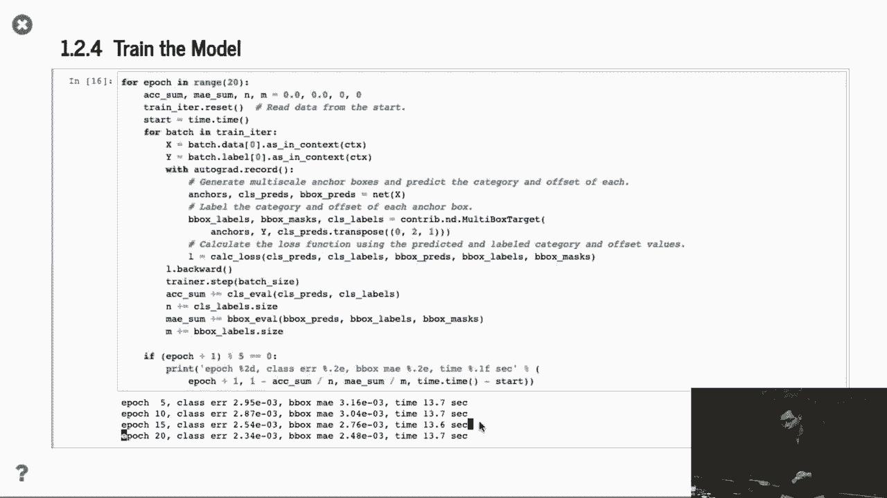

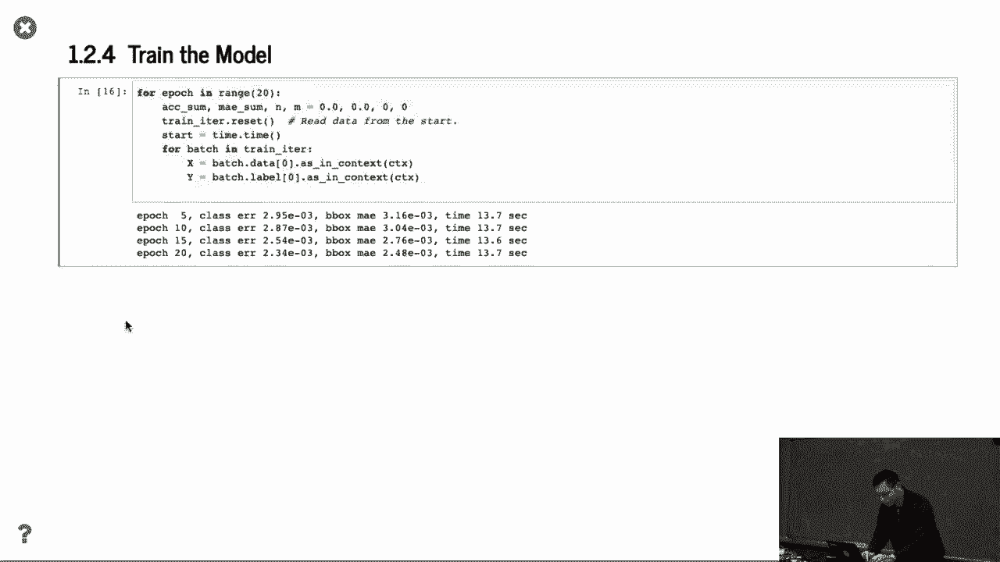

以下是核心训练步骤：
1.  **前向传播**：将图像输入网络，得到所有锚框、类别预测和边界框预测。
2.  **匹配锚框**：将预测的锚框与图像的真实标注边界框进行匹配，为每个锚框分配类别标签和边界框偏移量标签，并生成掩码。
3.  **计算损失**：使用匹配得到的标签和掩码，计算类别损失和边界框损失，并求和。
4.  **反向传播与优化**：计算梯度，并更新模型参数。
5.  **评估**：计算分类准确率和边界框预测的平均 L1 误差，用于监控训练过程。

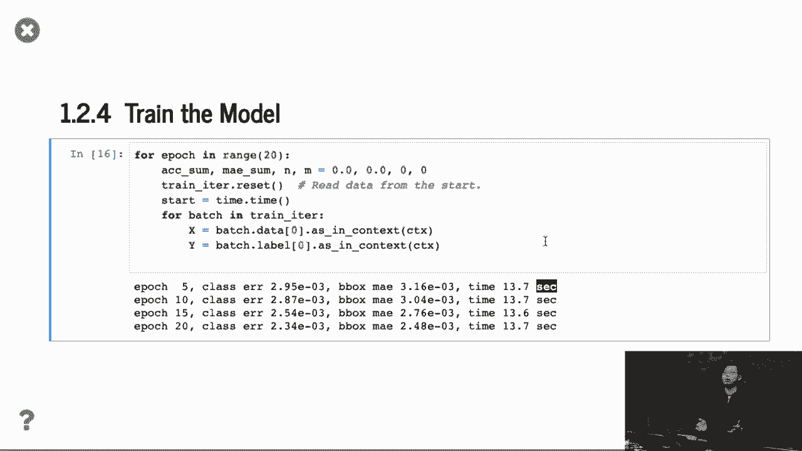

由于需要为每张图像处理成千上万个锚框，目标检测的训练通常比图像分类更耗时。

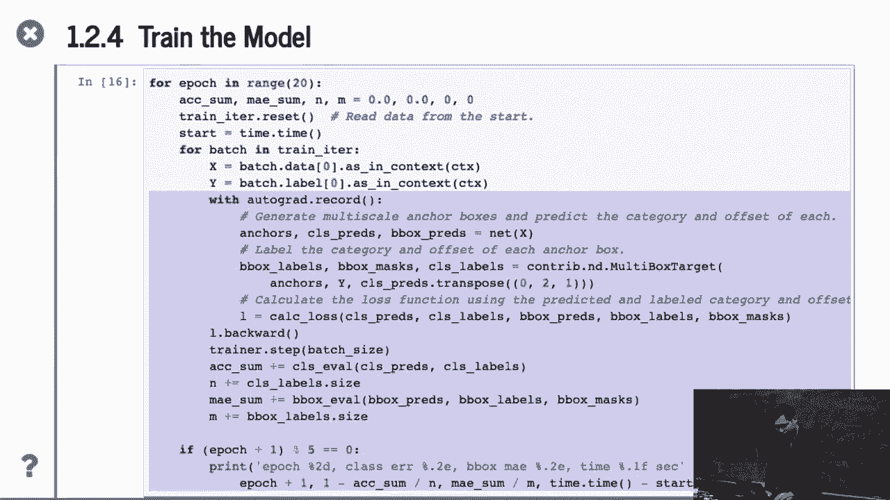

---

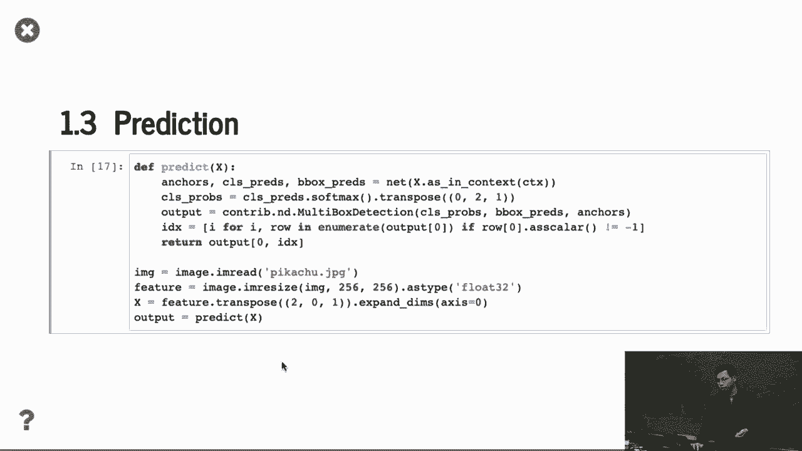

## 8. 预测与后处理

训练好模型后，我们可以用它来预测新图像。

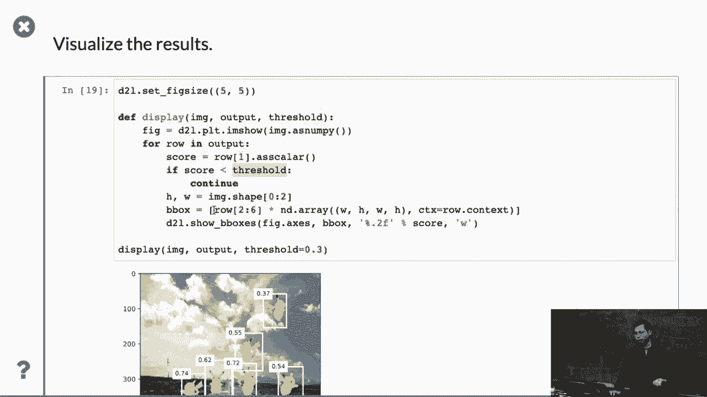

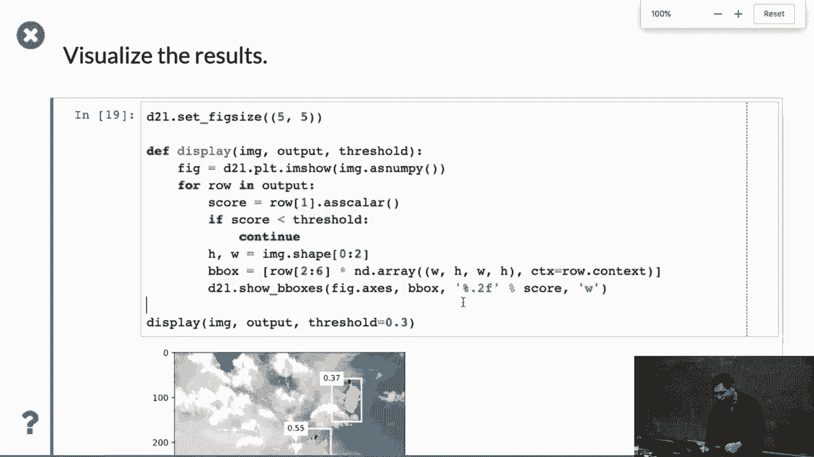

预测步骤：
1.  **网络前向传播**：输入图像，得到锚框、类别预测分数和边界框偏移量预测。
2.  **生成最终边界框**：利用预测的偏移量调整对应的锚框，得到初步的预测框。
3.  **应用 Softmax**：对类别预测分数应用 Softmax，得到每个框属于各个类别的置信度。
4.  **非极大值抑制**：由于会产生大量重叠的预测框，需要使用非极大值抑制来移除冗余框。NMS 会保留置信度最高的框，并抑制与其重叠度（IoU）过高的其他框。
5.  **阈值过滤**：根据设定的置信度阈值（如 0.5），过滤掉置信度低的预测结果，只保留可靠的检测框。

最终，我们将保留下来的边界框及其类别标签、置信度绘制在原始图像上，完成目标检测。

---

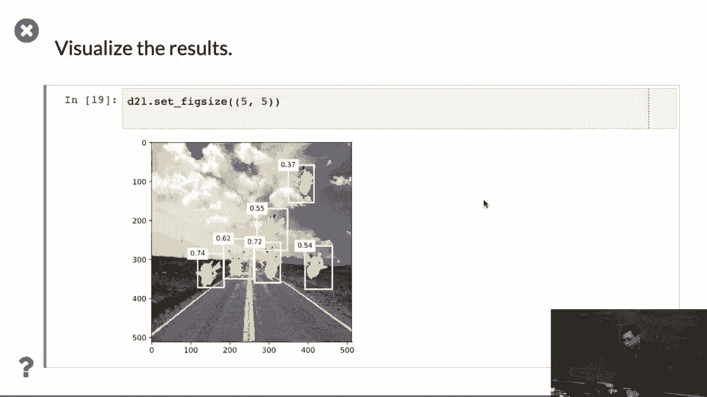

## 总结 🎯

本节课中，我们一起学习了 SSD 目标检测算法的 Python 实现。我们从类别与边界框的预测原理出发，构建了多尺度预测的网络结构，定义了包含分类和回归的损失函数，并完成了模型的训练和预测流程。虽然这是一个简化版的“Tiny SSD”，但它涵盖了 SSD 的核心思想：**利用单次前向传播，在不同特征层上密集预测目标类别和位置，从而实现快速且有效的检测**。理解这个流程是掌握现代目标检测模型的重要基础。