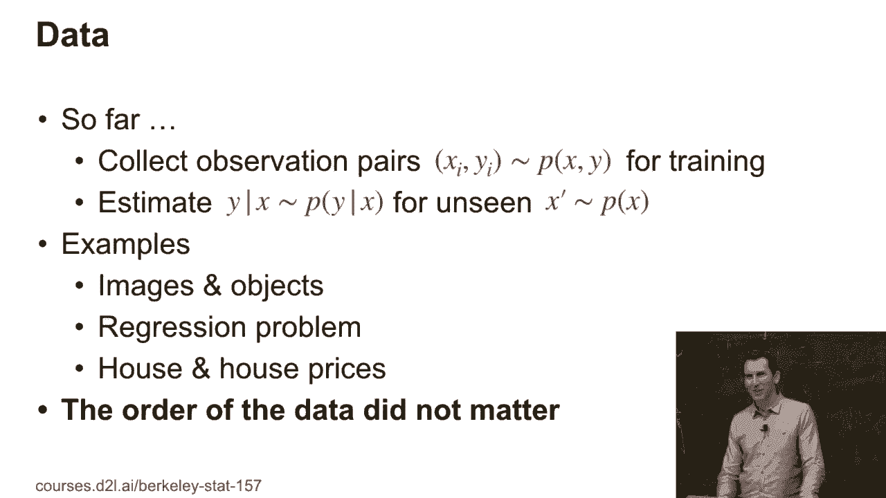
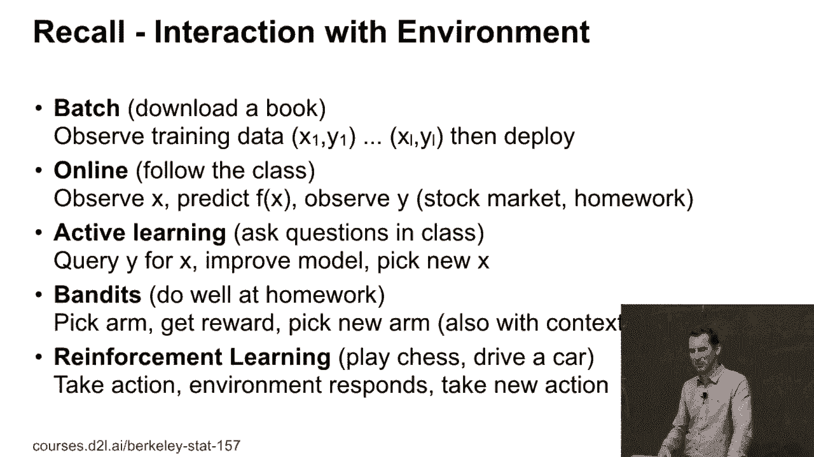
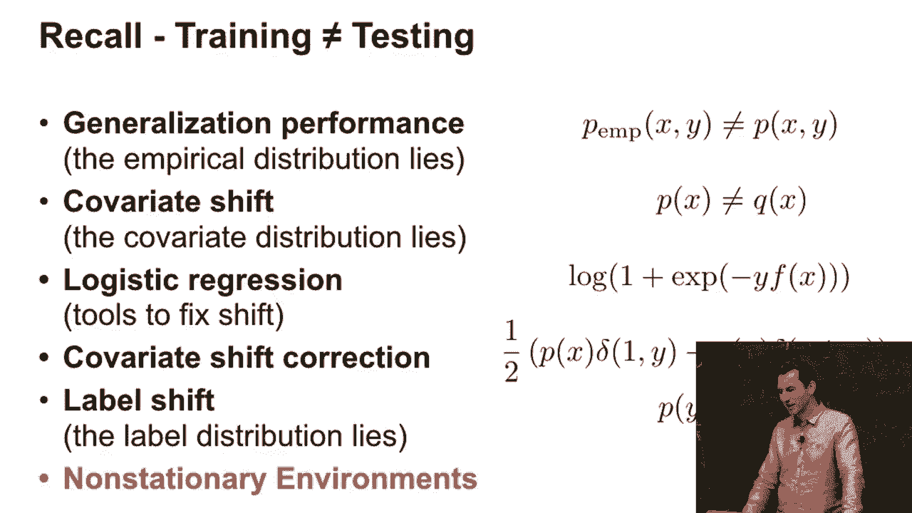
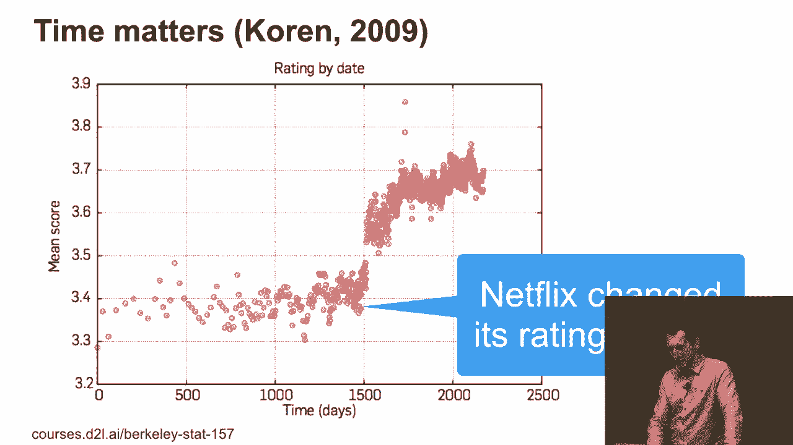
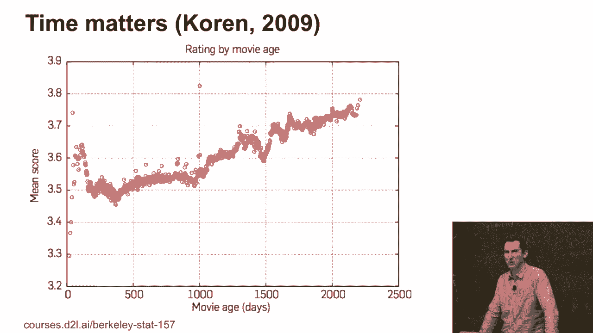
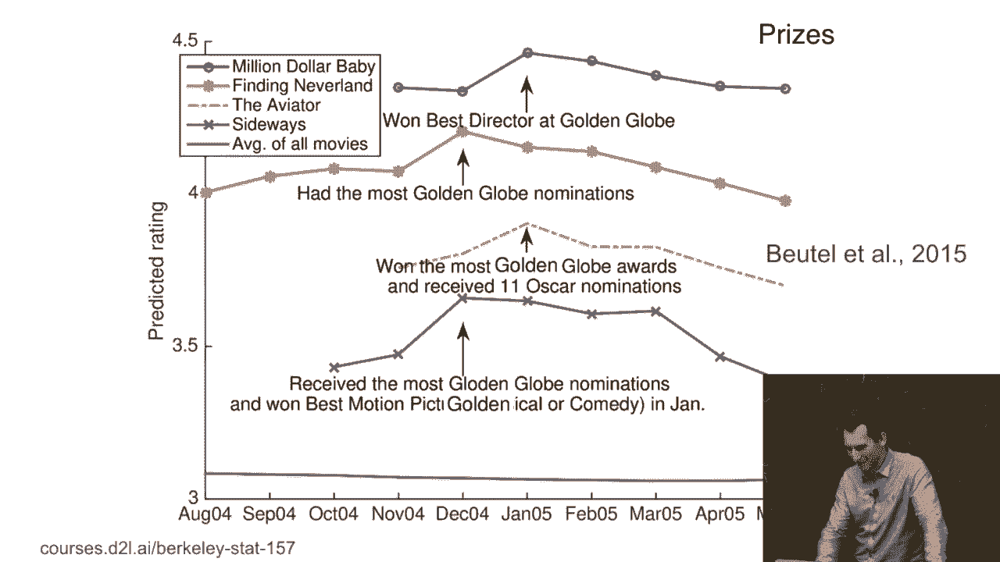
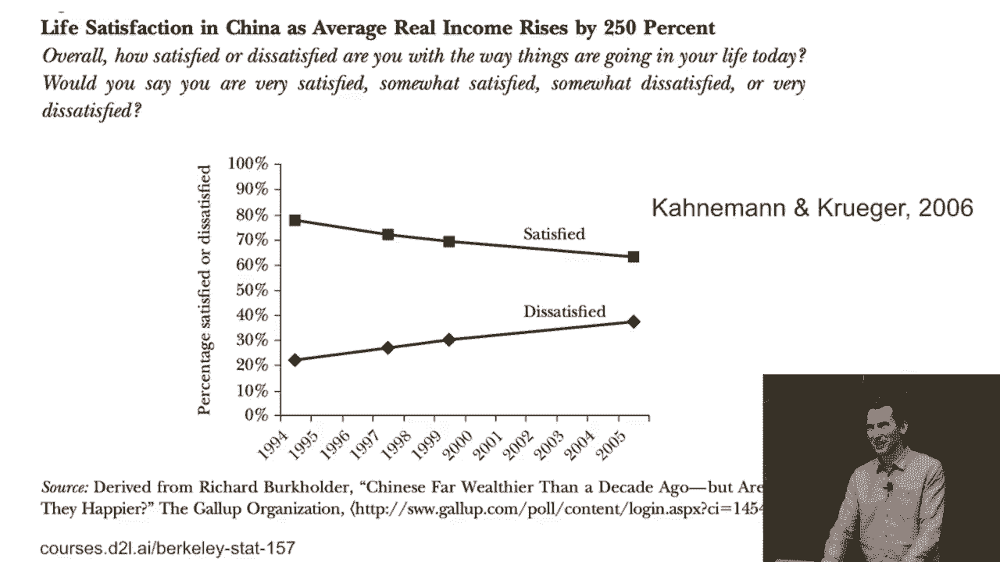
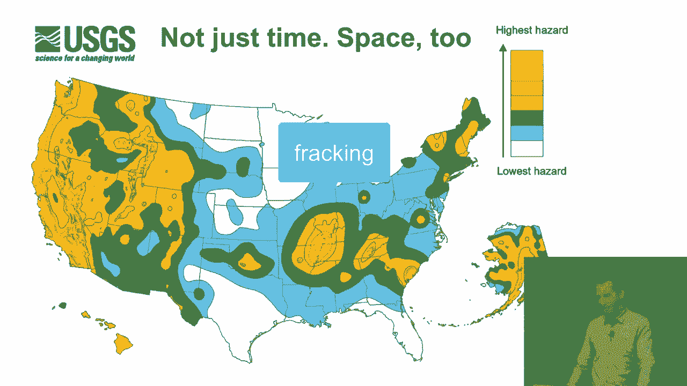
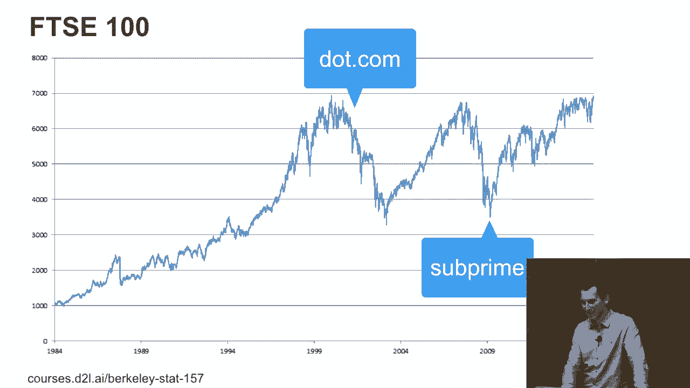
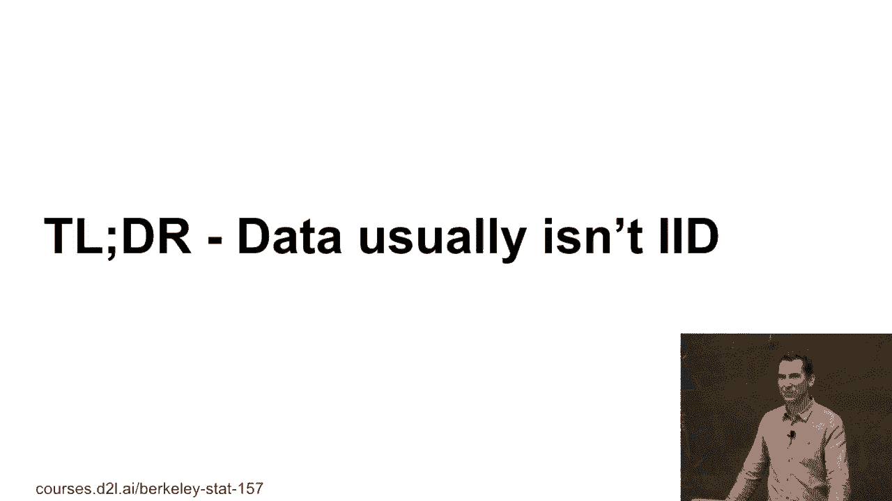

# 93：依赖随机变量 🧠

在本节课中，我们将学习序列模型以及为什么需要它们。我们将探讨数据通常不是独立同分布（IID）的现实情况，并理解处理依赖随机变量的重要性。

---

## 为什么需要序列模型？🤔

到目前为止，我们讨论的模型大多基于一个假设：训练数据点是独立且同分布的。我们收集观察对 `(xi, yi)`，它们来自某个联合分布 `p(x, y)`。然后我们估计条件分布 `p(y | x)`，以对新的 `x'` 进行预测。例如，这适用于图像分类、回归或房价预测问题。

在这种设定下，数据点的顺序并不重要。我们可以随意遍历训练集，一切都很顺利。然而，现实世界的数据往往不满足这种理想化的假设。

## 回顾：与环境的互动模式 🔄

上一节我们介绍了独立同分布的理想情况。本节中，我们来看看当数据存在依赖关系时，我们与环境互动的几种不同模式。

以下是几种主要的互动模式：

*   **批量训练**：下载所有数据，在这些数据上训练模型，然后部署。
*   **在线学习**：每次获取一个观察值，更新模型，然后部署。这在计算广告等领域很重要，因为模型越新鲜，效果可能越好。
*   **主动学习**：主动与环境互动并进行实验。例如，在广告中尝试展示一个不确定效果的新广告以收集数据。
*   **强化学习**：智能体采取一个行动，环境做出反应并给出奖励，然后智能体采取新的行动。例如，自动驾驶汽车需要根据环境状态（如是否快撞到树）做出连续决策。

## 系统的状态与记忆 💾

关键的区别在于系统是否**有状态**。一个有状态的系统拥有记忆，其当前行为会受到过去经历的影响。例如，一只未被惊扰的犀牛和一只曾被麻醉枪射击过的犀牛，对同一刺激的反应会截然不同。同样的系统，因为记忆不同，状态也不同。

因此，训练环境和测试环境可能并不相同。特别是，我们可能会遇到**非平稳环境**，即数据分布随时间或其他因素而变化。接下来，我们将探讨如何应对非平稳、有状态以及依赖性的情况。

## 非平稳数据的实例 📈

为了理解非平稳性，让我们看几个现实世界的例子。

以下是几个展示数据依赖性和非平稳性的具体案例：

1.  **Netflix评分突变**：Netflix曾更改其评分体系的标签（例如将“讨厌”改为“不喜欢”），导致用户评分行为发生整体性偏移，平均评分出现跳跃式变化。这并非推荐系统改进，而是度量标准本身发生了变化。
2.  **电影评分随时间“改善”**：老电影的平均评分似乎随时间推移而升高。这可能是一种选择性偏差：人们倾向于回顾并评价历史上公认的经典好电影，而非随机的老旧电影。
3.  **获奖效应**：某部电影在获奖（如奥斯卡）后，其评分会短期冲高，但大约一年后会回落到原本的水平。这表明外部事件会短暂影响用户评价。
4.  **幸福感变化**：数据显示，已婚女性的幸福感在婚后初期上升，但随后会逐渐回落并稳定。类似地，尽管收入增长，某些地区的整体生活满意度却可能停滞甚至下降。这反映了“享乐适应”现象。
5.  **地震发生率**：地震不仅发生在传统断层带（如加州）。由于人类活动（如俄克拉荷马州的水力压裂采油），会扰动地质结构，导致地震在非传统区域发生。依赖性基于地理位置和人类活动。
6.  **股票价格**：像FTSE100这样的股票指数，其变化明显受到科技股泡沫、次贷危机等重大事件的影响，是典型的非平稳过程。

## 核心结论 🎯

本节课中我们一起学习了依赖随机变量的概念。核心结论是：**数据通常不是独立同分布（IID）的**。

`IID` 只是一个为了使问题初始简化而做的假设。在现实中，数据点之间常常存在基于时间、序列顺序、空间位置或其他变量的依赖关系，并且数据分布可能是非平稳的。认识到这一点，并发展能够处理数据依赖性和非平稳性的模型，通常能带来更好的性能表现。