# 94：序列模型 📊

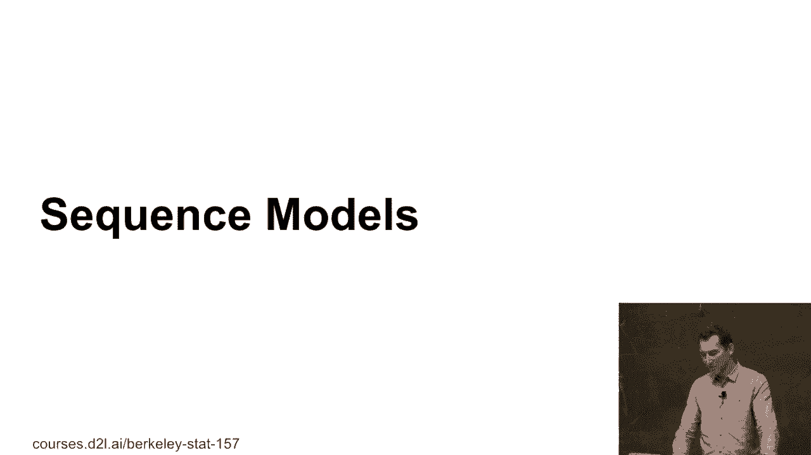

在本节课中，我们将学习序列模型的基本概念。序列模型用于处理具有时间或顺序依赖关系的数据，例如时间序列、语言或DNA序列。我们将探讨如何对这类数据进行建模，并比较两种主要的建模思路。

---

## 序列建模的基本思路

到目前为止，我们处理的数据通常被视为独立同分布的。然而，许多数据具有序列依赖关系。

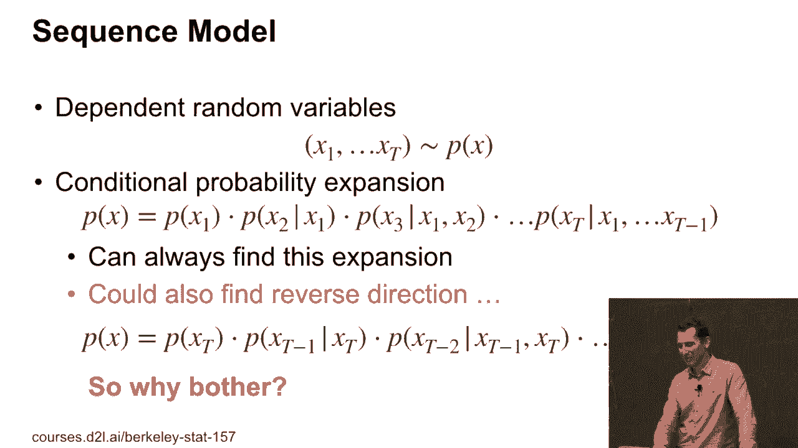

那么，如何为这种数据建模呢？假设我们有一系列相互依赖的随机变量 `x1` 到 `xt`，它们从某个分布 `p(x)` 中抽取。我们可以通过条件概率来写出联合概率分布：

`p(x) = p(x1) * p(x2|x1) * p(x3|x1, x2) * ... * p(xt|x1, ..., xt-1)`

这个分解方法无论数据是否是时间序列都适用。我们也可以写出反向的条件概率分解。单纯从数学上看，我们可以构建出许多模型，但其中一些可能在现实中是荒谬的。

了解这一点有什么意义呢？关键在于，现实世界中的因果关系通常具有方向性。

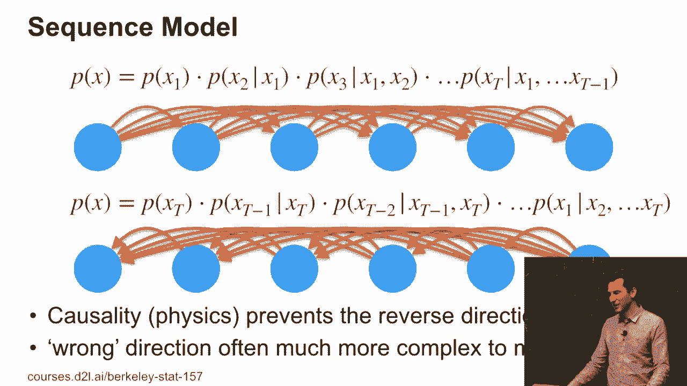

---

## 因果关系的方向性

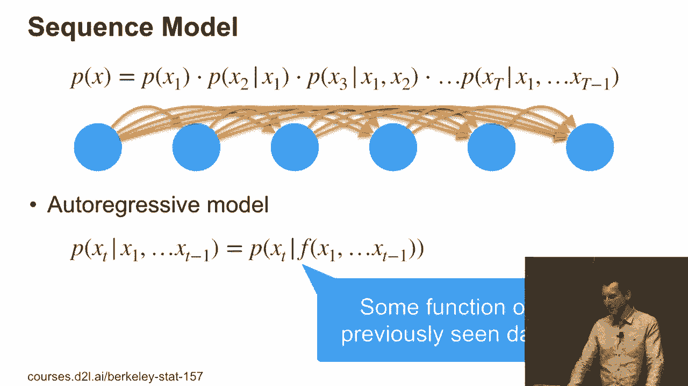

让我们再次审视两种分解方式。

在一种情况下，所有的依赖箭头指向右侧（未来依赖于过去）；在另一种情况下，箭头指向左侧（过去依赖于未来）。现实中的因果关系通常防止反向影响，即未来不会影响现在或过去。因此，我们通常采用前向的因果模型。

确定时间方向的一种方法是尝试用两种模型拟合数据，然后看哪一种更合适、解释更简单。数学上可以证明，错误的因果关系方向通常会导致更复杂的模型。Bernard Cholkopf 和 Dominic Yansing 在这方面做了很多出色的工作，并著有相关书籍。

---

## 回归模型方法（计划 A）

既然这是一门深度学习课程，我们自然会想到使用模型。一种直接的方法是使用回归模型。我们的目标是建模条件概率 `p(xt|x1, ..., xt-1)`。我们可以简单地将其视为给定过去所有数据的某个函数 `f` 的输出。

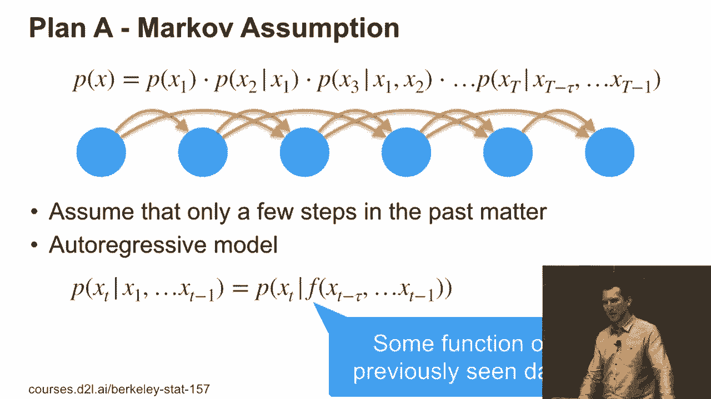

`p(xt|x1, ..., xt-1) ≈ p(xt) given f(x1, ..., xt-1)`

这里存在一个问题：如果函数 `f` 需要捕捉所有历史信息，计算会变得非常复杂。我们将探讨几种解决这个问题的方法。

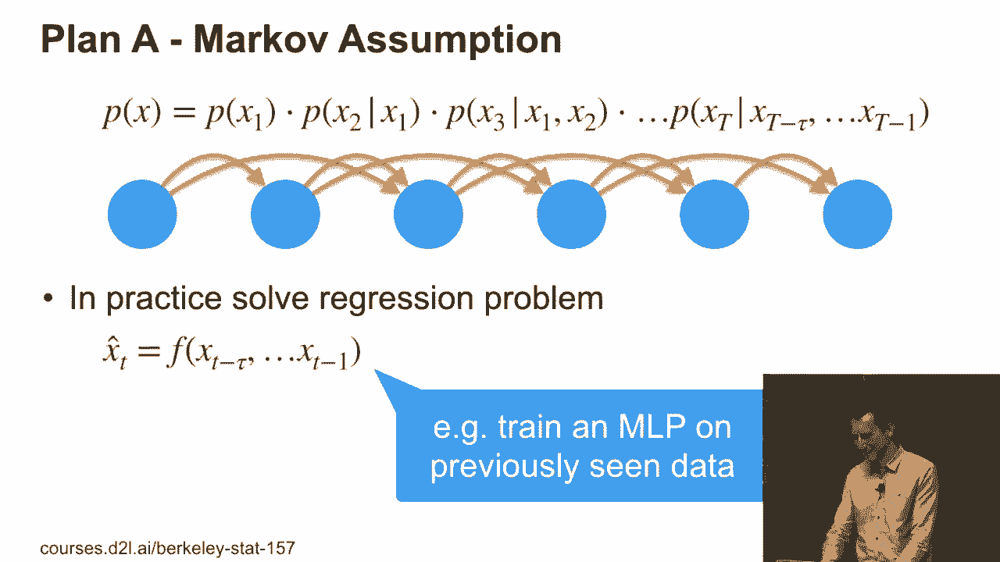

---

### 马尔可夫假设

第一种解决方案是使用马尔可夫假设。该假设认为，当前状态只依赖于过去有限步（τ步）的历史，而不是全部历史。

`p(xt|x1, ..., xt-1) ≈ f(xt-τ, ..., xt-1)`

这是一个完全合理的模型。如果 `τ` 足够长且数据充足，它可以很好地工作。但在许多情况下，这种方法可能会失败。

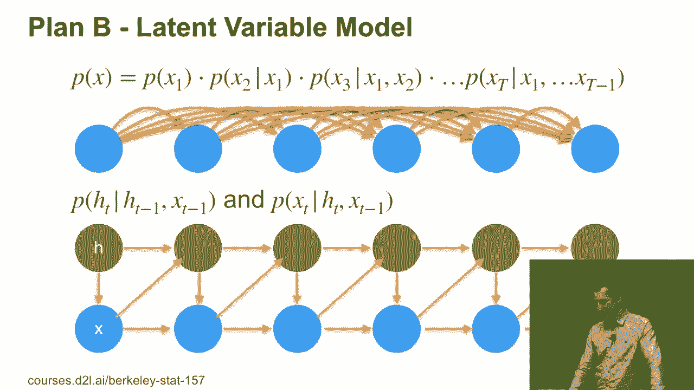

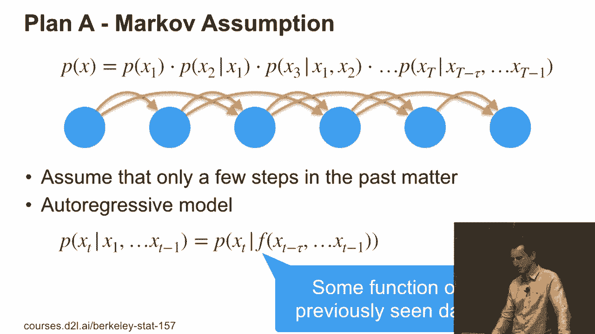

基于此，我们可以将其简化为一个回归问题：

`x̂_t = f(xt-τ, ..., xt-1)`

然后通过最小化预测误差来训练模型。这是一个非常直接的方法。如果问题都这么简单，那么时间序列建模就完成了。但显然，还有更多内容需要探讨。

---

## 隐变量模型方法（计划 B）

第二种长期流行的方法是使用隐变量（或潜状态）模型。我们不直接截断历史，而是假设存在一个隐藏状态 `h_t`，它承载了历史信息。

这个隐藏状态根据过去的观察 `x_{t-1}` 和过去的隐藏状态 `h_{t-1}` 进行更新。新的观察值 `x_t` 则依赖于当前的隐藏状态 `h_t`。

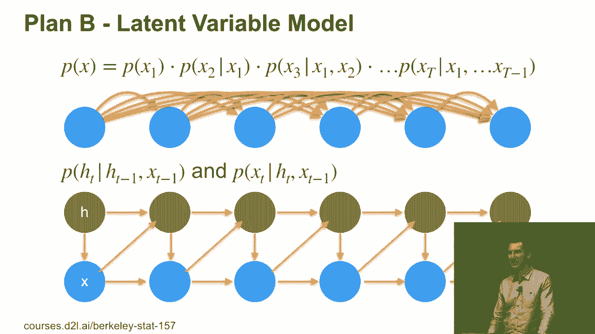

在图中，绿点代表隐藏状态，蓝点代表观察值。可以看到，如果隐藏状态 `h_t` 是 `h_{t-1}` 和 `x_{t-1}` 的函数，并且足够强大以存储信息，那么它就等价于拥有一个依赖于全部历史的函数，只是表达形式不同。

---

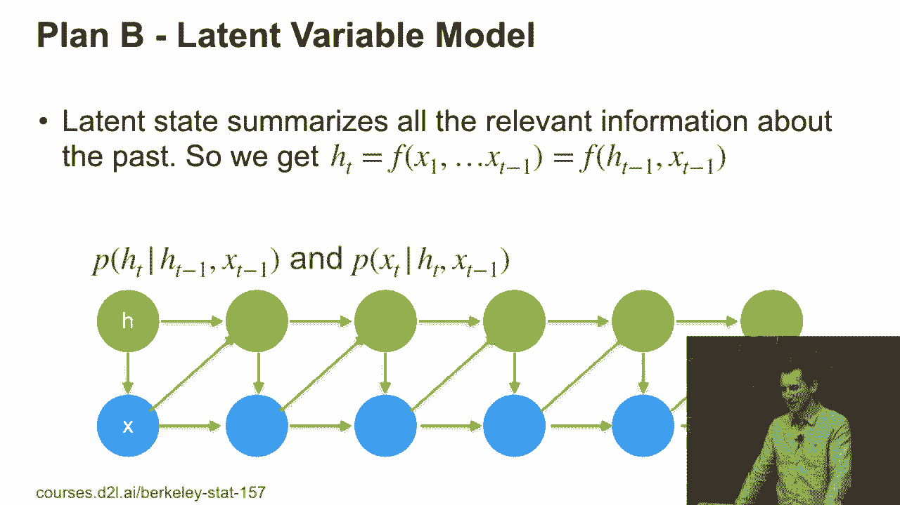

### 两种方法的对比

总结一下两种核心思路：

*   **计划A（显式回归）**：在马尔可夫假设下，我们直接用一个依赖于近期过去观察值的函数进行建模。一切都是可观测的，我们可以直接构造训练数据。
*   **计划B（隐变量模型）**：我们假设存在一个隐藏状态，它根据 `(h_{t-1}, x_{t-1})` 更新为 `h_t`，而观察值 `x_t` 由 `h_t` 生成。

这两者之间有微妙的区别。隐变量模型的一个现实例子是语音理解：说话者的大脑产生思想（隐藏状态），思想生成语音（观察值）；听者的大脑则解决逆向问题，从语音（观察值）推断思想（隐藏状态）。

虽然区别微妙，但它会引向非常不同的算法。在接下来的课程中，我们将遇到的大多数模型都属于计划B（隐变量模型）。

---

## 经典序列模型实例

在深度学习兴起之前，人们已经发展了许多基于隐变量思想的序列模型。了解这些背景有助于理解当前技术与传统的联系。

以下是一些经典模型的例子：

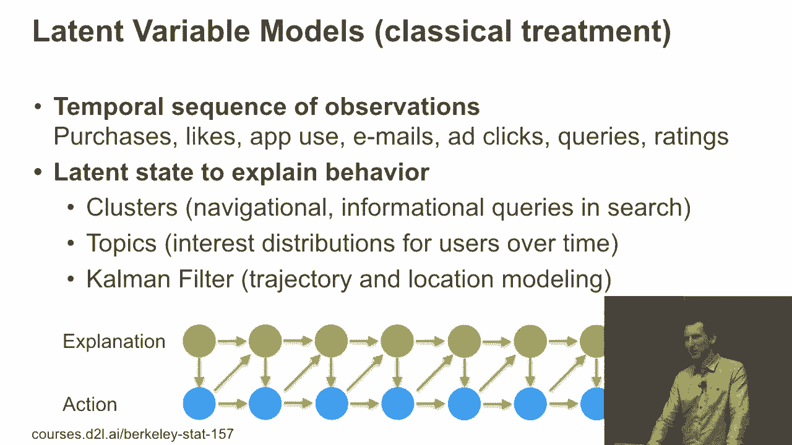

*   **隐马尔可夫模型（HMM）**：用于语音识别、生物信息学等。它假设系统是一个马尔可夫过程，但状态不可见（隐藏），只能观察到由状态生成的输出。
*   **卡尔曼滤波器**：用于控制系统（如雷达跟踪飞机）。它假设存在一个潜在状态（如飞机位置），你观察到的是带有噪声的测量值（雷达回波）。
    
*   **主题模型（如动态主题模型）**：用于文本分析。假设文档背后存在随时间演变的主题（隐藏状态），观察到的词由这些主题生成。
*   **线性动力系统（时间主成分分析）**：一种潜在因子模型，假设潜在变量服从正态分布，并通过线性变换生成观察序列。
    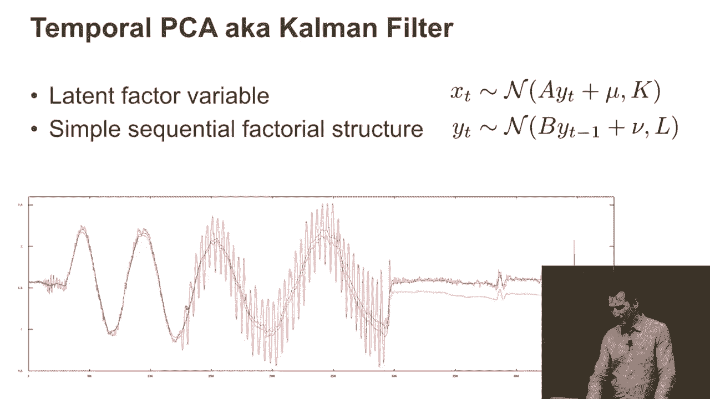

---

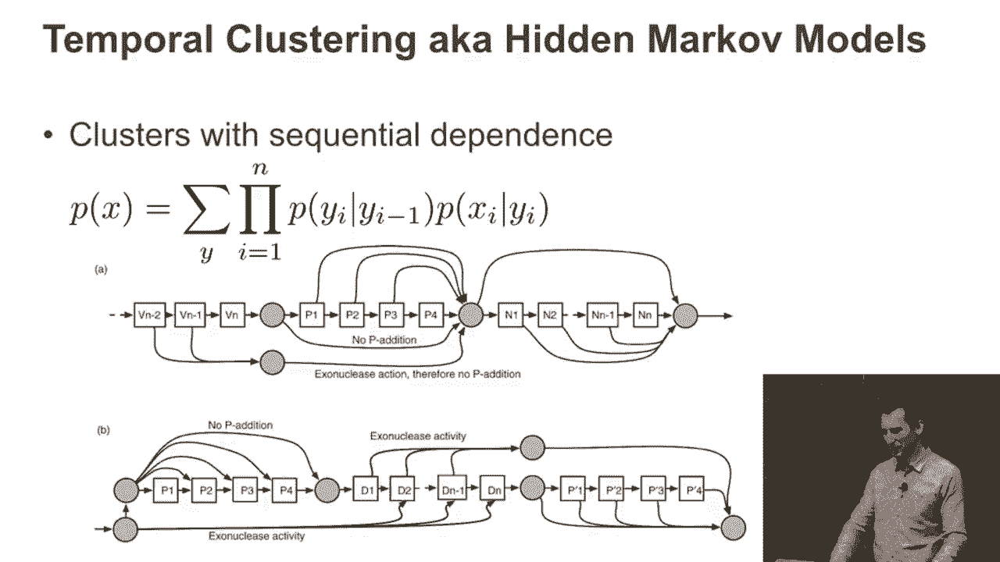

## 为什么需要深度学习？

既然经典方法已经存在了几十年，为什么我们还需要深度学习来处理序列问题呢？

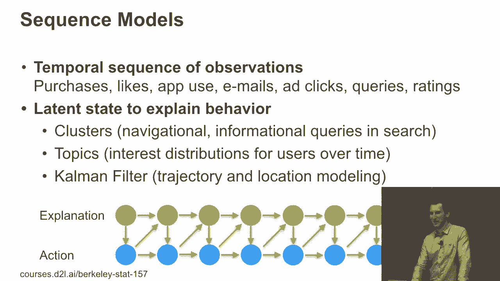

核心问题在于：我们是否应该完全相信这些具有强参数假设的经典模型？经典模型通常是科学家为了处理少量数据或强行引入可解释结构而做的简化假设（例如，语音由离散单词组成）。

然而，现实世界的数据往往更复杂、更丰富。深度学习提供了更灵活的表示能力，能够自动从数据中学习复杂的依赖关系和模式，而无需过多的人为假设。

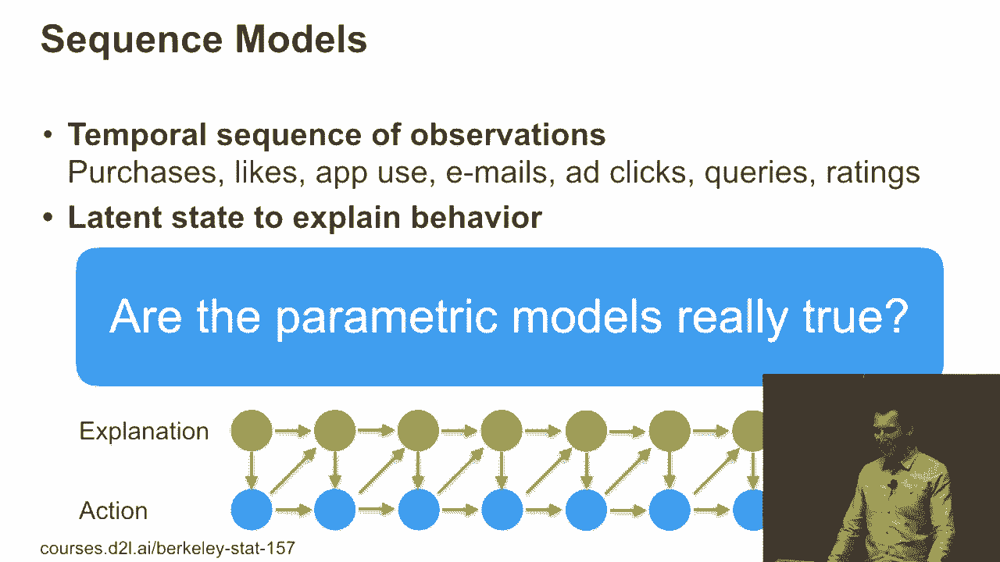

例如，深度学习模型可以更好地处理事件发生在随机时间点（而非固定间隔）的数据，或者学习更丰富、更连续的潜在状态表示。

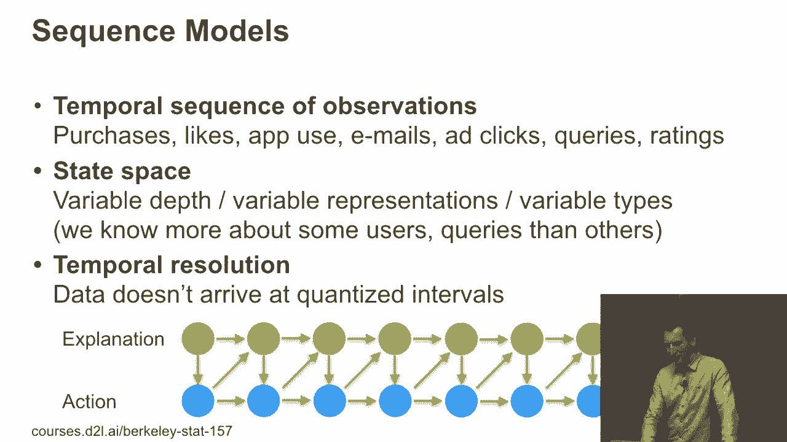

---

## 总结 🎯

本节课我们一起学习了序列模型的基础。我们首先了解了如何通过条件概率分解为序列数据建模，并讨论了因果关系的方向性。接着，我们重点对比了两种建模思路：基于马尔可夫假设的直接回归方法（计划A）和基于隐变量的状态空间方法（计划B）。我们还回顾了隐变量思想在经典模型（如HMM、卡尔曼滤波器）中的应用，并探讨了深度学习为序列建模带来更强表示能力和灵活性的原因。在接下来的课程中，我们将深入探讨基于深度学习的序列模型。