# 95：L18_3 马尔科夫假设与自回归模型 📈

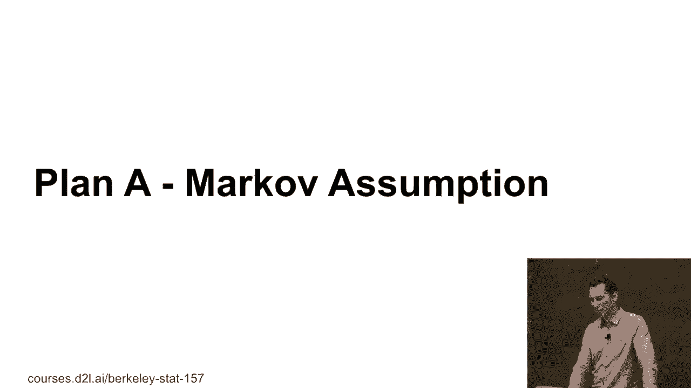

在本节课中，我们将要学习马尔科夫假设的基本概念，并动手实现一个基于该假设的自回归模型来预测时间序列数据。我们将通过Python代码演示其工作原理，并探讨其在短期和长期预测中的表现差异。

***

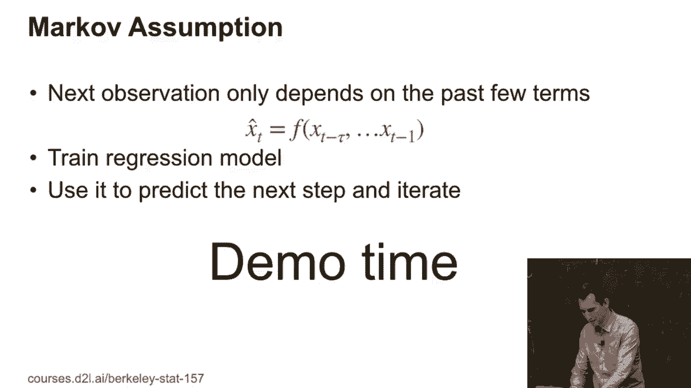

## 马尔科夫假设简介

上一节我们介绍了时间序列预测的背景，本节中我们来看看马尔科夫假设。马尔科夫假设的核心思想是：未来的状态仅依赖于最近的过去，而与更早的历史无关。

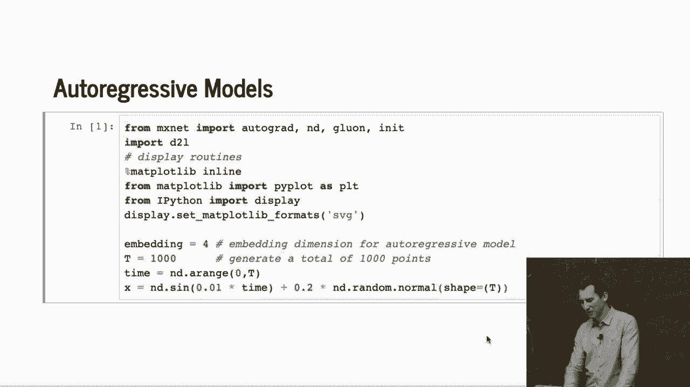

在时间序列预测中，这意味着我们可以用最近 `τ` 个时间点的观测值来预测下一个时间点的值。其核心公式可以表示为：

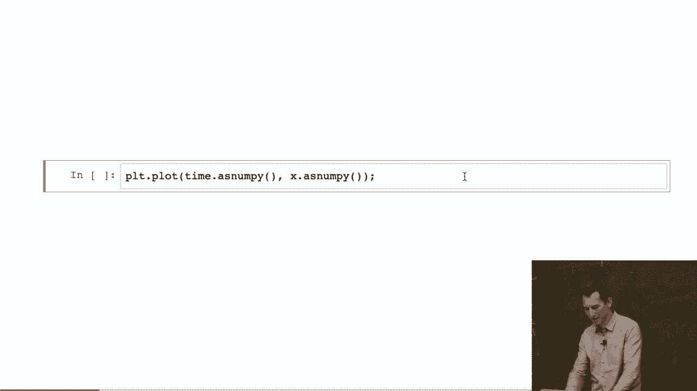

**`x̂_t = f(x_{t-τ}, ..., x_{t-1})`**

其中，`x̂_t` 是时间点 `t` 的预测值，`f` 是我们需要训练的回归模型。

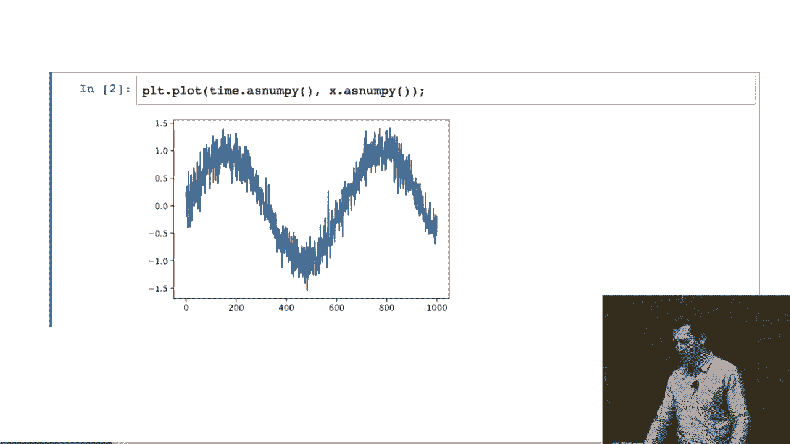

***

## 生成模拟数据

为了理解模型如何工作，我们首先需要一些数据。以下是生成模拟时间序列数据的步骤。

以下是生成数据的代码：

```python
import numpy as np

# 设置参数
tau = 4          # 嵌入维度，即使用过去4个点
n = 1000         # 总数据点数

# 生成时间序列：正弦波加噪声
time = np.arange(n)
data = np.sin(0.01 * time) + np.random.normal(0, 0.1, n)
```

这段代码生成了一个包含1000个数据点的序列，它由一个基础的正弦波和叠加的高斯噪声组成。我们可以将其可视化以便更好地理解。

***

## 构建数据集与模型

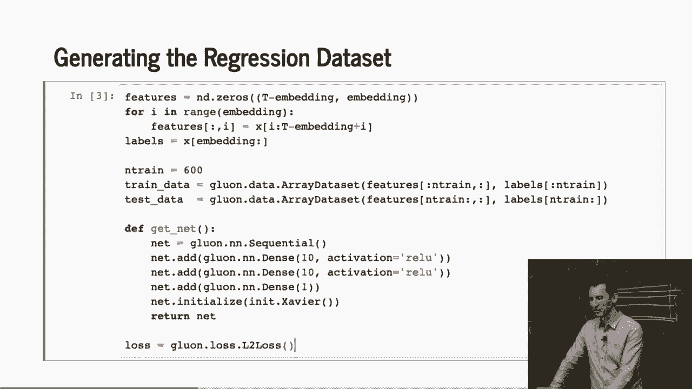

有了数据之后，我们需要根据马尔科夫假设构建用于训练的数据集。具体来说，我们需要将连续的 `τ` 个观测值作为特征（`X`），将其下一个观测值作为标签（`y`）。

以下是构建数据集的步骤：

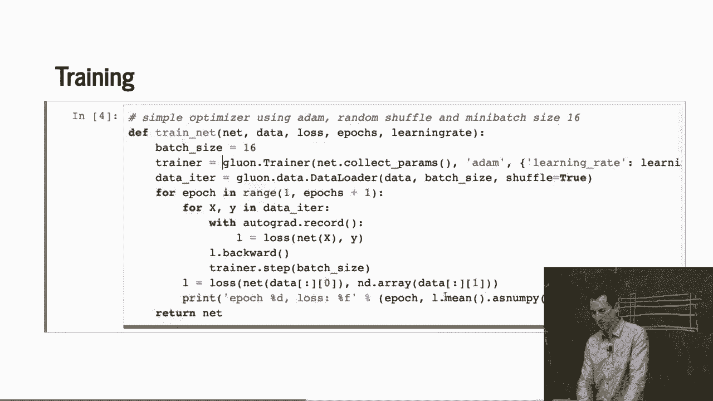

1.  初始化特征矩阵 `X` 和标签向量 `y`。
2.  遍历数据，将每个时间点 `t` 之前的 `τ` 个值作为一组特征。
3.  将时间点 `t` 的值作为对应的标签。

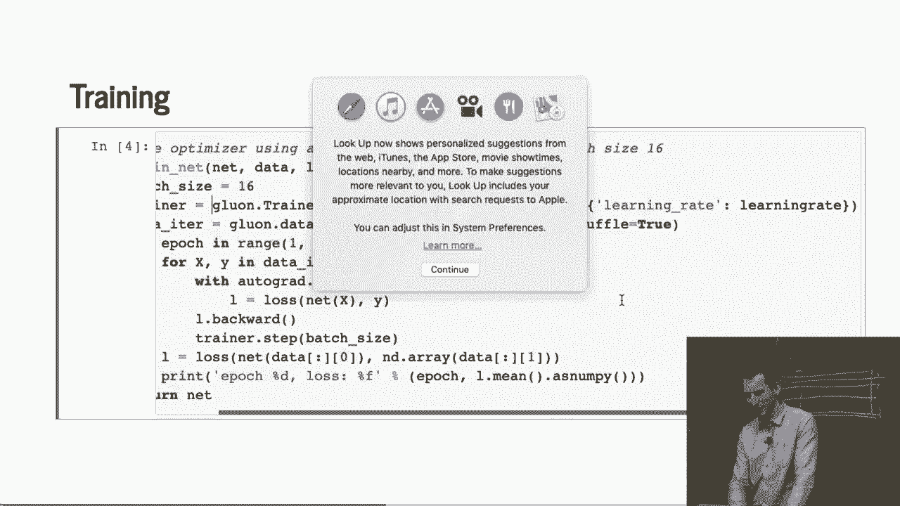

为了提高效率，我们可以使用向量化操作而非循环来构建数据集。

接下来，我们定义一个简单的多层感知机（MLP）作为回归模型 `f`。

以下是定义模型的代码：

```python
import torch
import torch.nn as nn

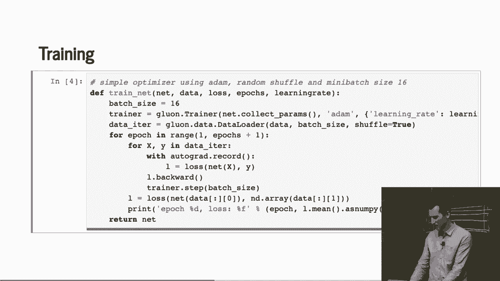

class RegressionModel(nn.Module):
    def __init__(self, input_dim):
        super().__init__()
        self.net = nn.Sequential(
            nn.Linear(input_dim, 10),
            nn.ReLU(),
            nn.Linear(10, 10),
            nn.ReLU(),
            nn.Linear(10, 1)
        )
        # 使用Xavier初始化权重
        for layer in self.net:
            if isinstance(layer, nn.Linear):
                nn.init.xavier_uniform_(layer.weight)

    def forward(self, x):
        return self.net(x)
```

这个模型结构简单，包含两个隐藏层，使用ReLU激活函数，适用于我们的回归任务。

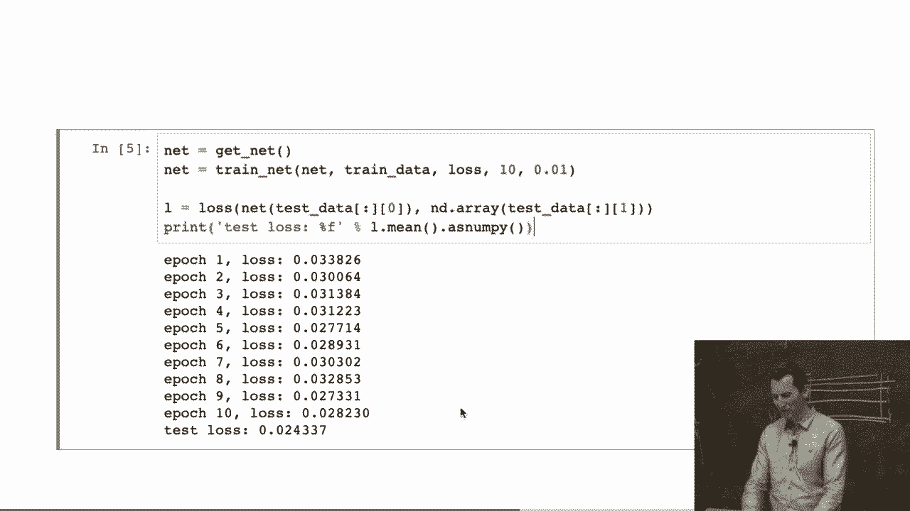

***

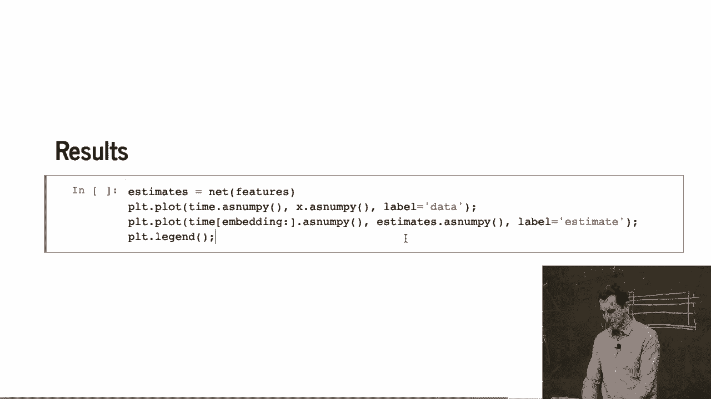

## 训练模型

数据集和模型准备就绪后，我们就可以开始训练了。我们将使用前600个数据点作为训练集，剩余部分作为测试集。

以下是训练循环的核心步骤：

1.  定义损失函数（均方误差损失）和优化器（Adam）。
2.  在多个训练周期（epoch）中，遍历训练数据的小批量（mini-batch）。
3.  对于每个小批量，计算模型预测值、损失、梯度，并更新模型参数。

训练过程会打印出每个周期的平均损失，以便我们监控训练进度。

***

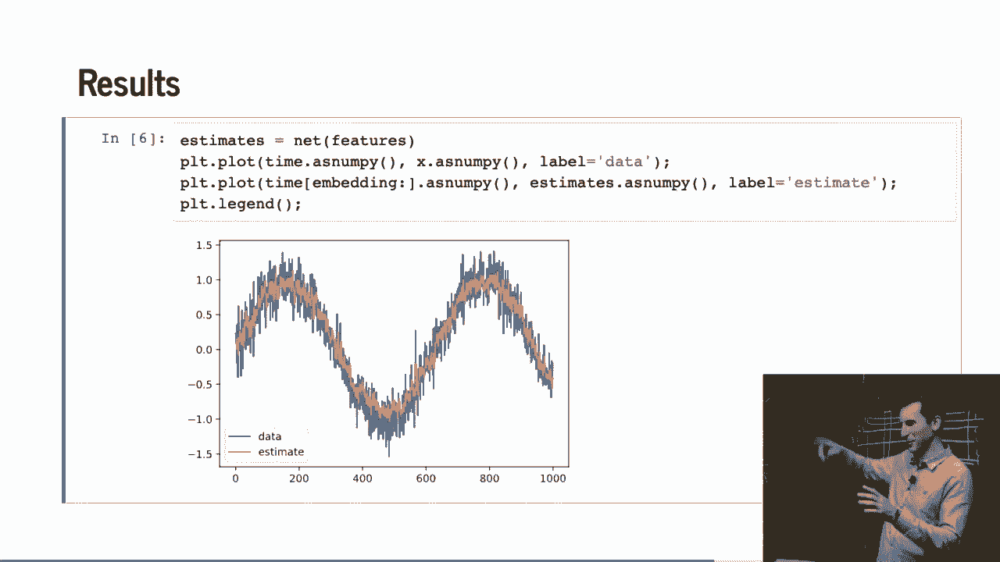

## 模型评估与问题揭示

训练完成后，我们首先在测试集上进行“一步预测”评估。即，在预测每个未来点时，我们仍然使用真实的过去观测值作为输入。

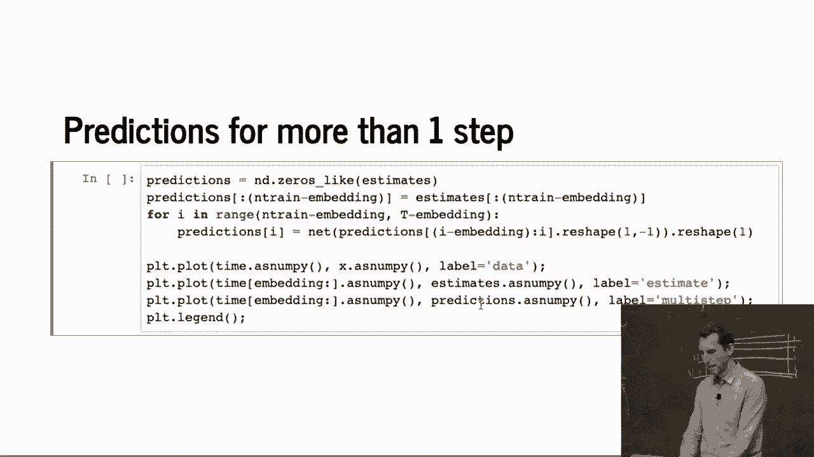

结果看起来非常好，预测曲线（橙色）与真实数据曲线（蓝色）几乎重合。这表明模型在拥有真实历史数据的情况下，可以准确预测下一步。

然而，这引出了一个关键问题：在真实的长期预测场景中，我们并没有未来的真实数据。当我们预测第 `t+1` 步时，我们必须使用第 `t` 步的**预测值**作为输入，而不是真实值。这个过程称为**自回归预测**或**多步预测**。

当我们进行这种真正的多步预测时（例如，从第600步之后开始完全依赖模型自身的预测），结果迅速恶化。预测值很快收敛到一个常数，不再捕捉数据的任何波动。

以下是进行多步预测的简化逻辑：

```python
predictions = []
# 初始输入是最后tau个真实观测值
current_input = last_tau_true_values

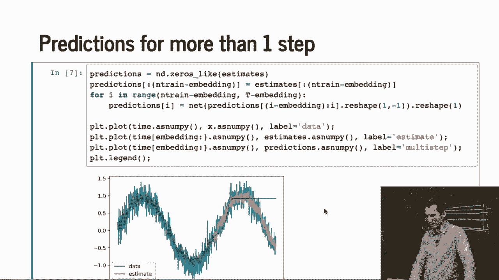

for i in range(steps_to_predict):
    # 用模型预测下一步
    next_pred = model(current_input)
    predictions.append(next_pred)
    # 更新输入：去掉最旧的值，加入最新的预测值
    current_input = torch.cat([current_input[:, 1:], next_pred.unsqueeze(1)], dim=1)
```

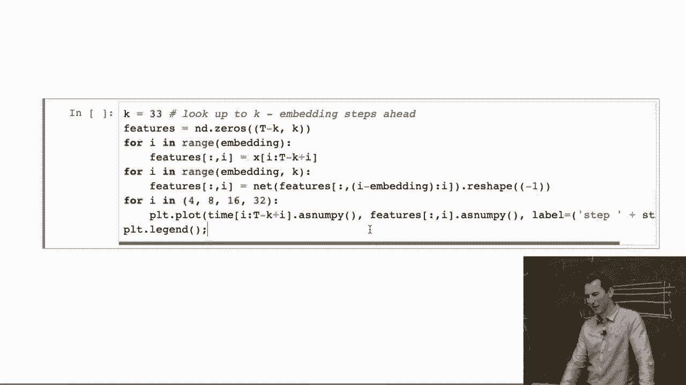

我们进一步分析了预测步长（如4步、8步、16步、32步）对误差的影响。结果显示，模型在短期（4-8步）预测中表现尚可，但随着预测步长增加，误差急剧上升，长期预测能力非常有限。

***

## 总结

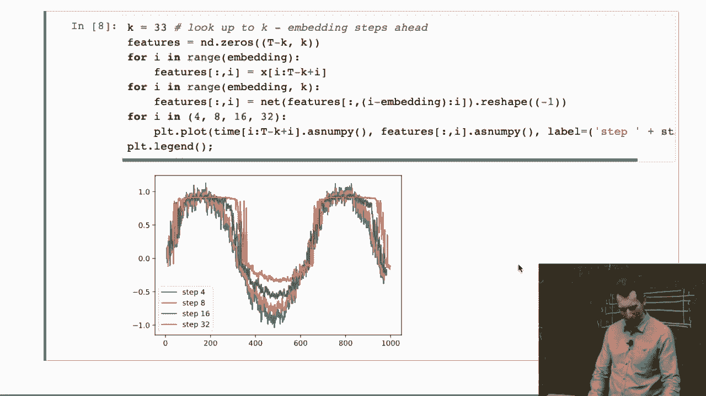

本节课中我们一起学习了马尔科夫假设和自回归模型。我们了解到，基于马尔科夫假设的模型在**单步预测**（使用真实历史数据）时表现优异。然而，在进行真正的**多步自回归预测**时，由于误差会随着预测步长的增加而累积和放大，模型的长期预测效果会显著下降。这是一个在实际应用时间序列模型时需要特别注意的关键局限性。