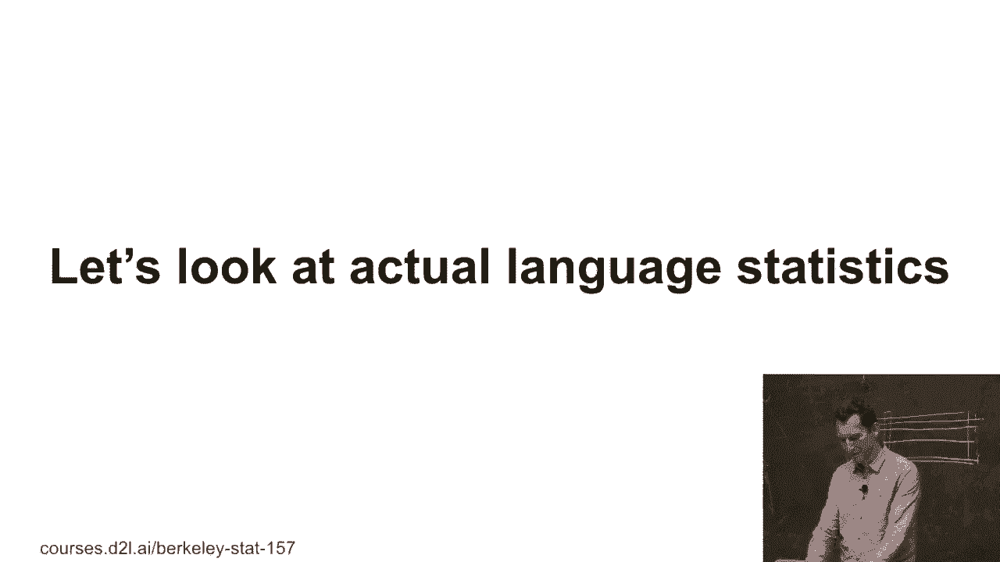
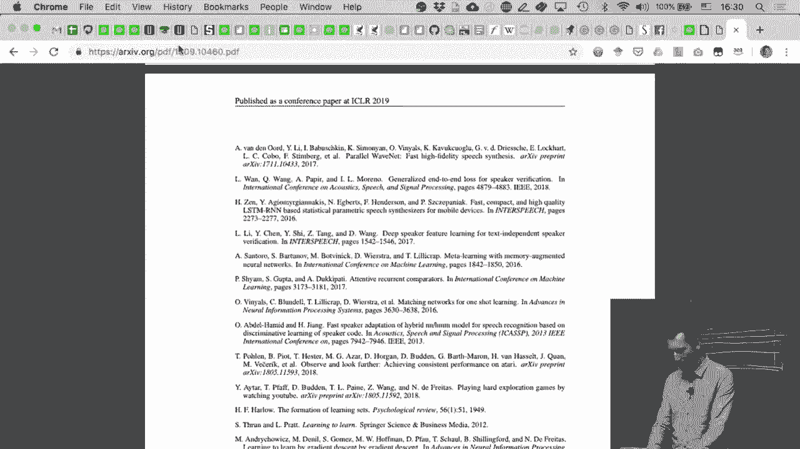
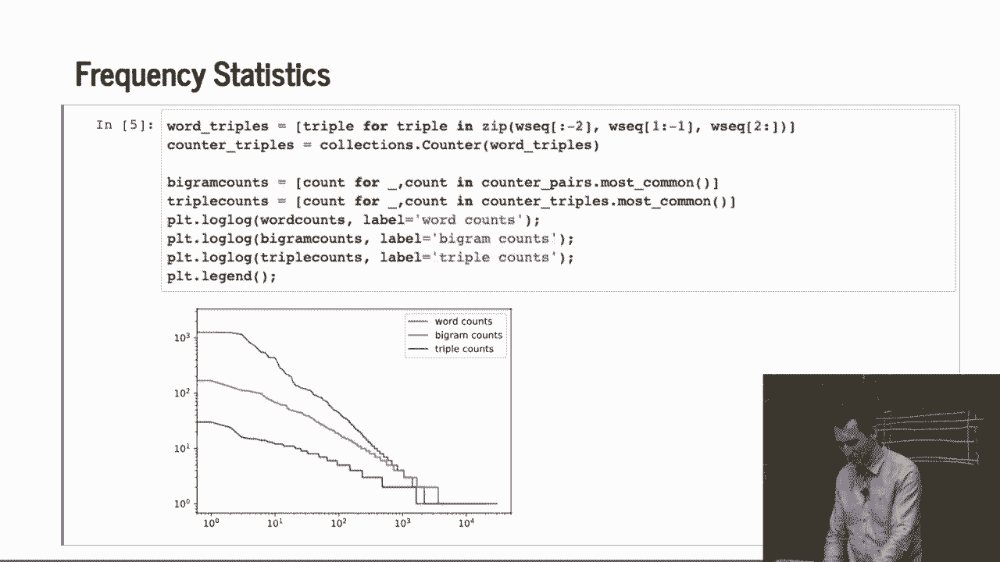

# 96：语言建模基础 🧠

在本节课中，我们将学习如何处理和分析文本序列数据。我们将从基础概念开始，介绍如何将文本转换为可处理的标记，并探讨经典的 n-gram 语言建模方法。通过一个具体的例子，我们将看到如何加载数据、进行基本的统计分析，并观察文本数据中普遍存在的统计规律。

---

## 从数字序列到字符序列 🔄

到目前为止，我们主要关注的是数字序列数据。现在，我们将转向字符序列数据，因为这是一个非常常见的应用场景，并且需要一些特殊的处理方式。因此，我们必须了解如何实际处理这类数据。

这包括如何加载数据，以及如何将其映射为具体的处理对象。这是我们需要完成的一些基础工作。

---

## 标记与词汇表 📝

在文本处理中，标记（tokens）并不是实际的值，并且其所属的领域（词汇表）是可数的、有限的。至少在假设下，我们有一个有限的词汇宇宙。但这并不总是成立。例如，英语语言会不断吸收新的单词。

因为人们会创造新词，或者从其他语言中引入词汇。所以总是会有新的内容出现。即便如此，我们仍然可以尝试对这些内容进行建模。

---

## 经典的 n-gram 语言建模 🧮

例如，如果我有一个标记序列 “statistics is fun”。我可以通过以下公式来建模它：

`p(statistics) * p(is | statistics) * p(fun | statistics is)`

如果我想获得一些有意义的概率估计，我可以建模 `p_hat(is | statistics)`。我只需计算我看到 “statistics is” 的次数，然后除以我看到 “statistics” 的次数。这给了我一个粗略的估计。

从统计学的标准来看，这种方法非常粗糙。同样地，对于长的 n-gram，我基本上需要先进行平滑处理。我们在做朴素贝叶斯分类器时已经看到了这一点。

当我们构建朴素贝叶斯分类器时，我们添加了伪计数。你也需要为单词概率做这件事。因此，你可能会预留一些额外的概率质量 ε，然后将其均匀分配到所有类别上。

所以，`p_hat(w)` 可能是该单词出现的次数加上某个 ε，除以总标记数 n 加上 ε 乘以词汇表大小 m。

然后，我可以处理 `p(w‘ | w)`，并使用回退平滑器来处理像单例这样的情况。对于像三元组这样的长序列，我可以回退到二元组。这是一个变通方法。

我写的几处细节并不完全精确，但核心思想是这样的。如果你想了解如何正确地进行，你应该去上 Tom Griffiths、Mike Jordan 或 Jim Pitman 教授的基础非参数统计课程。

我们不会深入讨论细节，但这就是经典统计学中建模 n-gram 的精神：先获取计数，然后使用某种回退平滑技术。你可以看到，一旦我有了庞大的词汇表或更长的序列，这种方法就不太奏效了，因为大多数计数都会是零。

---

## 实践：分析《时间机器》文本 📚

为了让事情更具体，我们将使用一个小型数据集进行实践。我们将使用《时间机器》的文本。

我们要做的第一件事是加载它。我打开一个文件，从中读取一些行。这是我从古腾堡计划下载的《时间机器》原始数据集。然后，我将文本拆分成单独的标记，并将所有内容转换为小写字母。我丢弃了所有的标点符号和其他非字母字符。

以下是文本的开头几行：
> “the time traveler for so it will be convenient to speak of him was expounding a recondite matter to us his grey eyes shone and twinkled”

这就是时间旅行的开始。这就像是 Python 101 的基础操作。

---

## 计算单词频率 📊

现在，我要计算单词的数量。我将使用一个简单的集合，即计数器（Counter）。我将遍历数据集中的每个标记。

在 Python 中，你可以优雅地写出双重循环：`for string in raw_dataset for token in string`。这很酷。然后，计算所有内容。这就是人们喜欢 Python 的原因，因为很多复杂的代码已经被封装好了，你只需要调用它。

我只需查找 `counter[‘traveler’]`，它会给我计数结果。计数器甚至有一个叫做 `most_common` 的函数。所以，前 10 个最常见的单词是：首先是 “the”，然后是 “and”, “i”, “of”, “a”, “to”, “was”, “in”, “that”, “it”。

这些单词都非常频繁地出现，这是完全可以预期的，因为它们是英语中常见的单词。它们是最常用的词汇之一。这些单词通常被称为**停用词**。

过去在自然语言处理中，人们通常会丢弃这些停用词，因为它们出现得太频繁了。但现在情况不同了，人们会保留它们，因为现代模型（如 Transformer 或 LSTM）可以直接处理它们。所以，我们不再丢弃停用词，但要意识到它们的存在。

---

## 观察齐夫定律（Zipf‘s Law）📉

接下来，我要绘制单词的出现次数与其排名顺序的关系图。我绘制的是对数-对数图。这应该是一个巨大的提示，告诉你预期会看到什么样子。

结果是**幂律分布**。这几乎是一条直线。出现次数的对数与排名的对数呈线性关系。即使是那些只出现一次的最不常见的单词也是如此。

这就是齐夫定律。它的意思是，计数与 `(rank + C)^(-α)` 成正比。基本上，我有一个偏移量 C 和一个负指数 α。当然，如果我对两边取对数，我就得到 `log(count) = -α * log(rank + C) + constant`。

几乎总是，当你有大的离散集合时，就会出现某种**幂律**。充分利用这一点。如果在你的领域里还没有人做过这件事，你可以就此写一篇论文。

例如，在推荐系统中，你会发现实际上有少数几部电影非常受欢迎，而大多数电影都非常不受欢迎；有些人会给很多电影评分，而大多数人则不会。如果你利用这一点，你可以构建一个比没有利用这一点的实现要快得多的版本。

---

## 分析二元组与三元组 🔗

让我们看看这是否同样适用于单词对（二元组）。同样，这非常 Pythonic。我生成了一个单词序列，然后通过将序列中的每个单词与其后一个单词配对，生成了这些二元组。

我使用了 `zip` 函数来取两个数组（单词序列和其偏移一位的序列）并生成配对。

如果我们查看文本的开头，常见的二元组包括 “time traveler”, “time machine”。然后，“machine by”, “by h”, “h g” 等等。最常见的二元组主要是停用词的组合。唯一的例外是 “time traveler”，它出现了 102 次。

基于此，可以得出几点结论。正如你所见，用几行代码就能得到相当有意义的文本统计。如果我能做到，你们肯定也能做到。而且，在开始其他工作之前先浏览一下数据是个好主意。

现在，我们还可以查看三元组，并绘制单元词、二元组和三元组的频率分布。结果是，齐夫定律同样适用于二元组和三元组。你可能想在模型中以某种方式利用这一点。

---

## 总结 🎯

本节课中，我们一起学习了语言建模的基础知识。我们从处理字符序列与数字序列的区别开始，介绍了标记和词汇表的概念。我们探讨了经典的 n-gram 建模方法及其平滑技术。通过《时间机器》文本的实践，我们学习了如何加载和预处理文本数据，计算单词频率，并观察到了文本数据中普遍存在的齐夫定律。我们还简单分析了二元组和三元组的统计特性。这些基础操作为后续更复杂的语言模型打下了坚实的基础。