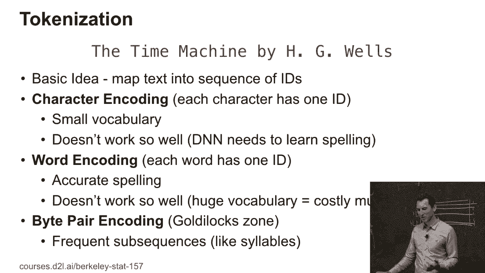
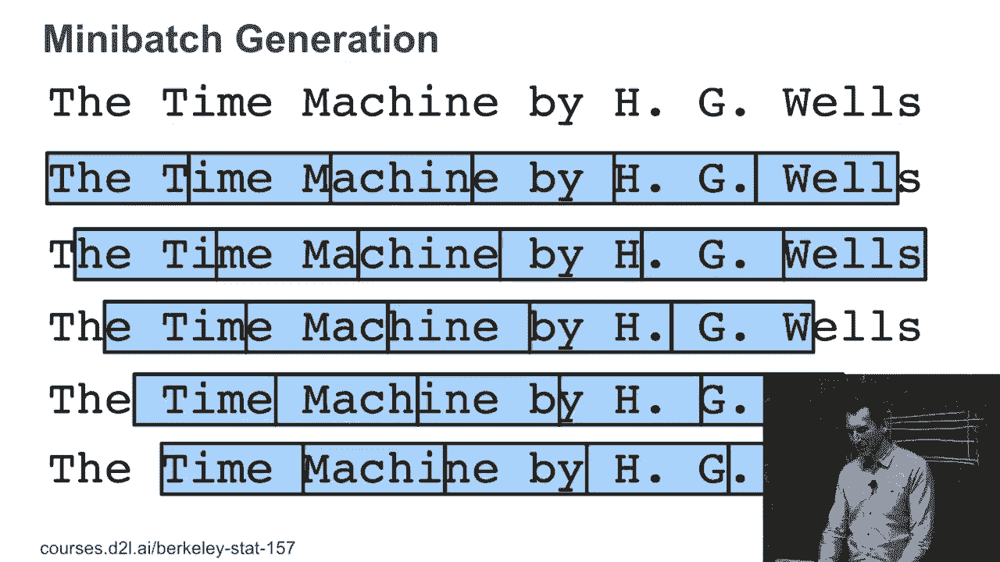
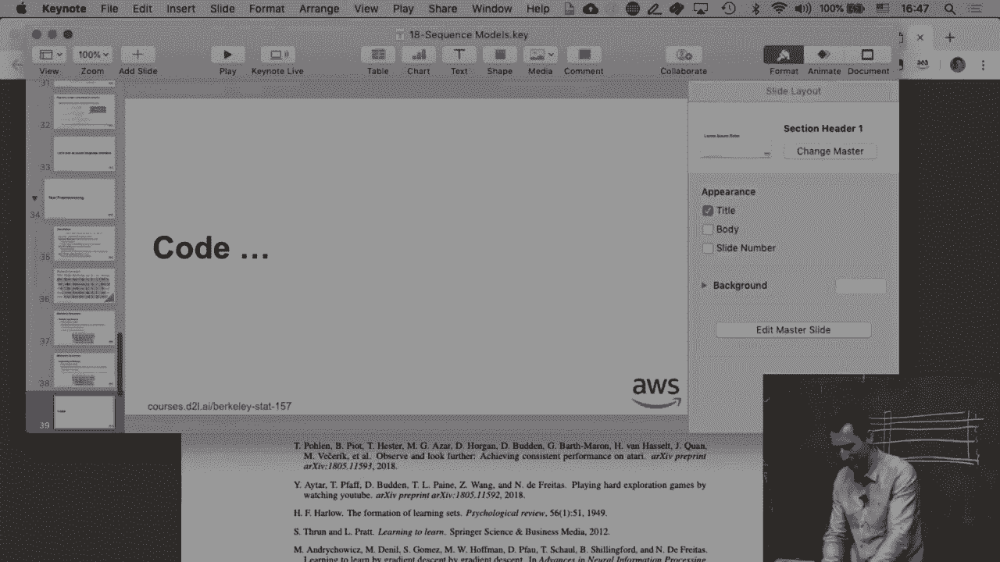
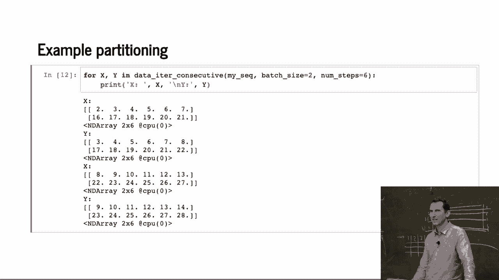

# 97：文本预处理 📝

在本节课中，我们将学习如何为语言模型准备文本数据。我们将探讨分词的不同方法，并学习如何将文本序列有效地组织成用于训练的小批量数据。

---

## 1. 分词：将文本转换为数字序列 🔢

上一节我们介绍了基本的文本统计信息。本节中我们来看看我们实际上该如何处理文本。

我们首先要做的就是对文本进行分词处理。所谓分词，指的是把每个词或者每个简单的单位转换成一个概念，然后文本就变成了一系列整数。

有很多方法可以实现这个目标。

### 字符编码
一种方法是使用字符编码。这种方法很好，因为如果只有30到35个有意义的字符，词汇表会非常小，每次预测一个新字符会非常容易。这样做永远不会遇到一个没见过的特定单词，因为所有单词都由这些字符组成。

问题是，如果这么做，模型往往并不能很好地工作。网络需要学习如何正确拼写。对于某些语言来说，这实际上是件好事。

以下是字符编码的优缺点：
*   **优点**：词汇量小，不会遇到未知字符。
*   **缺点**：模型需要学习拼写，对于小字母表的语言（如英语）效果不佳。

### 词级分词
另一种方法是把每个词当作一个标记。这对于中文来说非常有效，因为中文有成千上万个字符，这提供了一个“恰到好处”的颗粒度表示。



然而，对于英语或其他语言，名词和动词的形式变化非常剧烈。这会导致词汇量非常庞大，模型可能无法很好地泛化到没见过的单词形式上。

### 字节对编码
显然，在字符和词之间有一个折中方案，那就是**字节对编码**。



人们寻找常见的频繁子字符串，对它们排序、聚合，最频繁的常见子字符串会被进一步聚合。这样得到的东西看起来像音节。如果你有一些非常常见的其他子字符串，它们可能会稍微长一些。

这种字节对编码几乎可以让你进入一个“恰到好处”的区间，而处理日语或中文时，你基本上一开始就已经进入了这个区间。

---

## 2. 生成训练小批量 📦

接下来我们需要生成小批量数据，因为我们需要生成训练数据。记住，我们有嵌入，然后我们想预测下一个字符。




你可以将文本分割开，例如，分成五个字符的子序列。这样你就有不同的偏移量，你只需要继续，稍微计算一下，确保不会越界。

### 随机分区
一种方法是随机分区，例如选择一个随机偏移量，将序列随机分布到小批量中。这会给你一种相对独立的样本，虽然它们不完全独立。

问题是，如果你有一个潜变量模型，你需要重置隐藏状态。因为每当你在该字符串的不同部分生成一个不同的序列时，你并不知道它所来自的上下文，所以你需要重置你的隐藏状态。

### 顺序分区
另一种方法是使用顺序分区。你只需取一个随机偏移量，然后将序列分布到小批量中，但你需要保持序列在小批量中不变。

你为这一部分生成一个小批量，接下来的小批量用于这里，下一个小批量用于这里，然后继续下去。这样你可以在小批量之间携带隐藏状态。这样做效果要好得多。

---

## 3. 代码实现 💻

现在是代码时间。我们将读取文本数据，并实现上述的分区方法。

首先，我们读取数据并建立字符到索引的映射。

```python
# 假设 text 是读取的文本字符串
chars = sorted(list(set(text)))
char_to_idx = {ch: i for i, ch in enumerate(chars)}
idx_to_char = {i: ch for i, ch in enumerate(chars)}
vocab_size = len(chars)
```

这段代码获取了数据集中所有唯一的字符，并建立了字符与整数索引之间的双向映射。

### 随机小批量生成器
接下来，我们实现一个函数来生成随机的小批量数据。

```python
import torch
import random

def data_iter_random(corpus_indices, batch_size, num_steps, device=None):
    # 计算可用的子序列数量
    num_examples = (len(corpus_indices) - 1) // num_steps
    # 随机偏移量
    offset = random.randint(0, num_steps)
    # 丢弃开头的一些字符
    corpus_indices = corpus_indices[offset:]
    num_examples = (len(corpus_indices) - 1) // num_steps
    example_indices = list(range(num_examples))
    random.shuffle(example_indices)

    # 返回数据的迭代器
    def _data(pos):
        return corpus_indices[pos: pos + num_steps]
    if device is None:
        device = torch.device('cuda' if torch.cuda.is_available() else 'cpu')

    for i in range(0, num_examples, batch_size):
        batch_indices = example_indices[i: i + batch_size]
        X = [_data(j * num_steps) for j in batch_indices]
        Y = [_data(j * num_steps + 1) for j in batch_indices]
        yield torch.tensor(X, dtype=torch.long, device=device), torch.tensor(Y, dtype=torch.long, device=device)
```

这个函数会生成 `(X, Y)` 对，其中 `X` 是一个子序列，`Y` 是 `X` 向右移动一个位置后的子序列。

### 顺序小批量生成器
然后，我们实现顺序分区的小批量生成器。

```python
def data_iter_consecutive(corpus_indices, batch_size, num_steps, device=None):
    if device is None:
        device = torch.device('cuda' if torch.cuda.is_available() else 'cpu')
    corpus_indices = torch.tensor(corpus_indices, dtype=torch.long, device=device)
    data_len = len(corpus_indices)
    batch_len = data_len // batch_size
    indices = corpus_indices[0: batch_size * batch_len].view(batch_size, batch_len)
    epoch_size = (batch_len - 1) // num_steps
    for i in range(epoch_size):
        i = i * num_steps
        X = indices[:, i: i + num_steps]
        Y = indices[:, i + 1: i + num_steps + 1]
        yield X, Y
```

这个函数将长序列分成 `batch_size` 段，然后每次从每段中取出长度为 `num_steps` 的连续子序列作为一个小批量。

---

## 总结 🎯

本节课中我们一起学习了文本预处理的几个关键步骤：
1.  **分词**：我们探讨了字符编码、词级分词和字节对编码等不同方法，理解了它们各自的适用场景。
2.  **生成小批量**：我们学习了两种生成训练数据小批量的方法：随机分区和顺序分区。随机分区样本相对独立但需要重置隐藏状态；顺序分区允许在小批量间传递隐藏状态，通常效果更好。
3.  **代码实践**：我们使用 Python 和 PyTorch 实现了字符映射、随机小批量生成器和顺序小批量生成器，为后续构建和训练语言模型打下了基础。



掌握这些预处理技术是构建高效语言模型的第一步。