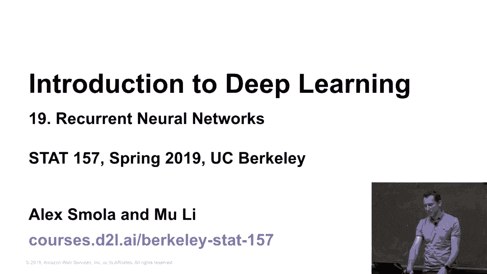
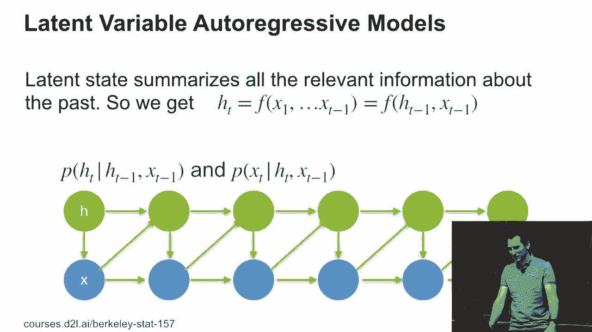
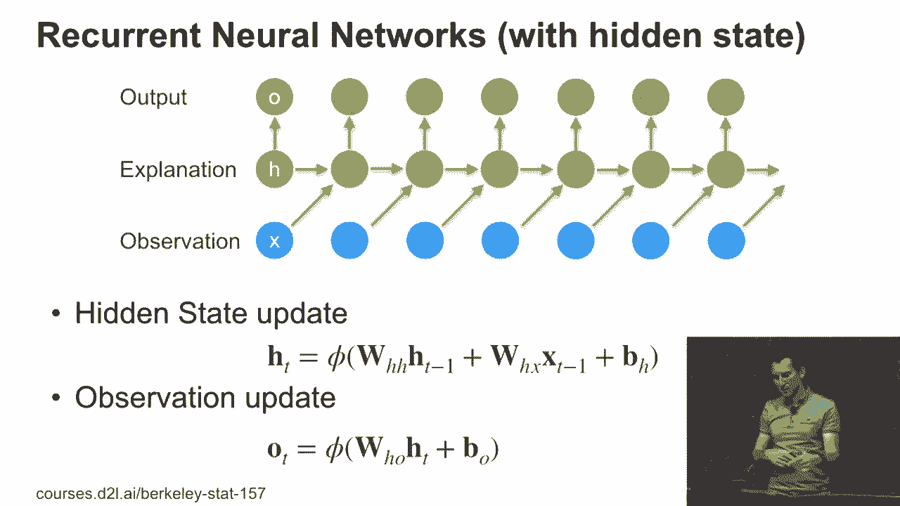
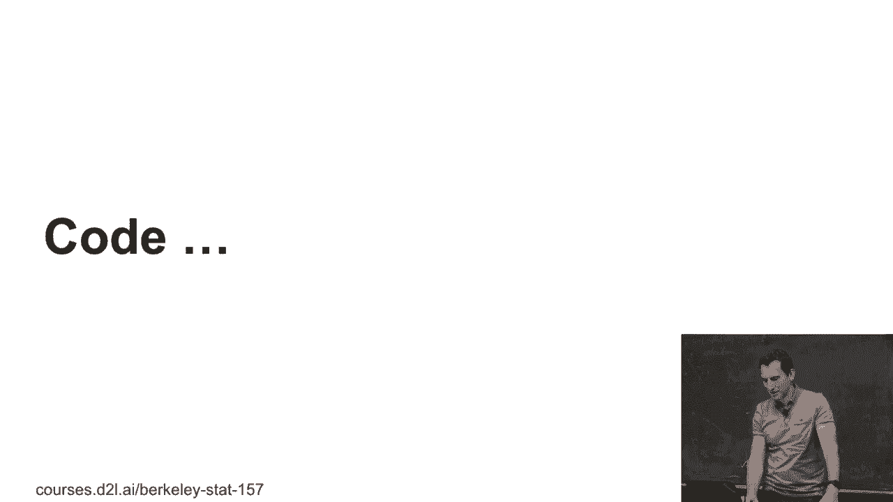

# 98：递归神经网络 (RNN) 入门 🧠

在本节课中，我们将学习递归神经网络（RNN）的基本概念、工作原理及其在序列数据处理中的应用。我们将从回顾潜在变量模型开始，逐步深入到RNN的具体实现，并通过简单的代码示例来理解其核心机制。

---

## 回顾：潜在变量模型与序列建模

上一节我们介绍了为什么需要递归模型来处理序列数据。关键区别在于，你可以选择仅使用过去k个观测作为输入，也可以引入一个**潜在变量**来聚合所有历史信息。



*   **仅使用过去k个观测**：训练简单，但可能精度有限。
*   **使用潜在变量模型**：在建模上更灵活，理论上能存储所有过去观测的充分统计量，可能表现更好。

理想情况下，潜在变量能有效压缩从 `X1` 到 `Xt-1` 的所有信息，形成一个状态 `ht`。为了避免为每个时间步显式计算整个历史（计算量巨大），我们设计一个函数 `F`，使其能递归地更新状态。

其核心递归公式为：
`ht = F(ht-1, xt-1)`
这意味着当前状态 `ht` 由前一个状态 `ht-1` 和前一个观测 `xt-1` 共同决定。同时，观测 `xt` 由当前状态 `ht` 生成。

这种设计与深度学习结合，绕过了传统图模型中复杂且可能低效的精确推断问题，使我们能专注于设计可训练且高效的模型。

---

## 从理论到实践：基础RNN模型

理解了潜在变量的概念后，本节我们来看看如何将其工程化为一个具体的、可训练的神经网络模型，即基础的递归神经网络（RNN）。

在最简单的情况下，我们可以如下定义RNN：

1.  **隐藏状态更新**：当前时刻的隐藏状态 `ht` 是前一刻状态 `ht-1` 和当前输入 `xt` 的函数。
    `ht = φ(Whh * ht-1 + Wxh * xt + bh)`
    其中，`φ` 是非线性激活函数（如tanh），`Whh` 和 `Wxh` 是权重矩阵，`bh` 是偏置项。

2.  **输出生成**：当前时刻的输出 `ot` 由当前隐藏状态 `ht` 经过一个变换得到。
    `ot = ψ(Who * ht + bo)`
    其中，`ψ` 是输出激活函数（取决于任务，如Softmax用于分类），`Who` 是权重矩阵，`bo` 是偏置项。

需要区分**观测**（输入，如单词）和**输出**（预测目标，如词性标签）。在序列标注等任务中，我们并不总是用输出来预测下一个输入。

---

## 代码视角：实现一个简单的RNN

理论模型看起来可能有些抽象，现在让我们从代码的角度来实际理解它，因为其实现真的非常简单。

以下是一个高度简化的RNN前向传播步骤的伪代码，展示了如何按时间步处理序列：

```python
# 初始化隐藏状态
hidden_state = zeros(hidden_size)

# 遍历输入序列中的每个元素
for input_t in input_sequence:
    # 结合当前输入和上一个隐藏状态，计算新的隐藏状态
    combined = np.dot(Whh, hidden_state) + np.dot(Wxh, input_t) + bh
    hidden_state = np.tanh(combined)  # 应用非线性激活

    # 根据当前隐藏状态计算输出
    output_t = np.dot(Who, hidden_state) + bo
    # 存储或处理 output_t
```



这个循环结构清晰地体现了RNN“递归”的本质：状态在时间步之间传递并不断更新。

---

## 总结

本节课中，我们一起学习了递归神经网络（RNN）的核心思想。



1.  我们从**潜在变量模型**的动机出发，理解了使用一个持续更新的状态来汇总历史信息的重要性。
2.  接着，我们将该思想具体化为**基础的RNN模型**，定义了隐藏状态更新和输出生成的数学公式。
3.  最后，我们通过**简单的伪代码**揭示了RNN前向传播的过程，看到它本质上是一个在时间维度上展开的循环，结构并不比多层感知机复杂太多。



RNN为处理文本、语音、时间序列等数据提供了强大的基础框架。然而，基础RNN在实践中可能面临梯度消失或爆炸等挑战，这引出了后续更复杂的变体，如LSTM和GRU，我们将在未来的课程中探讨。