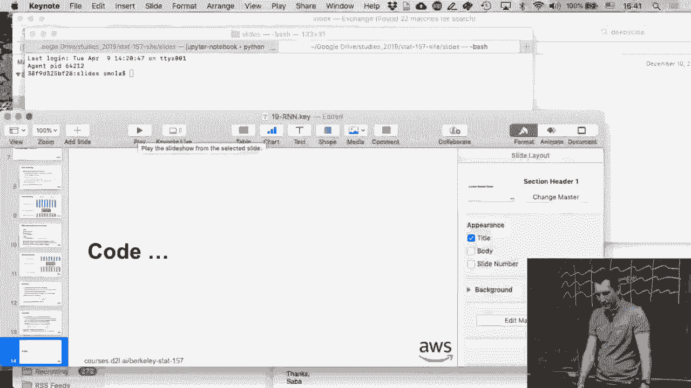
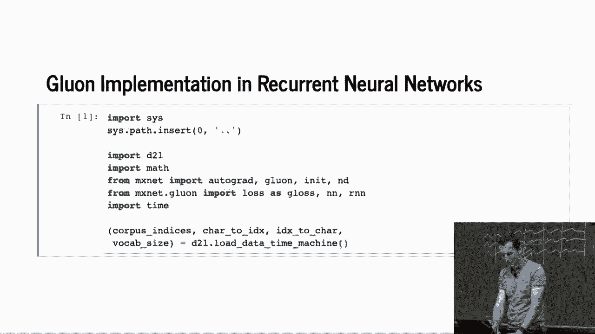
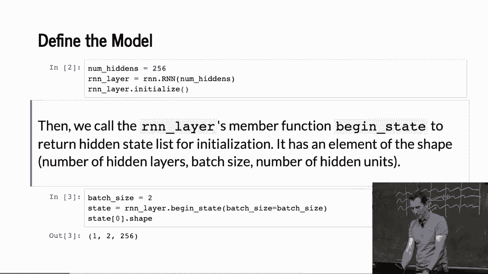

# 【AI 】伯克利深度学习Deep Learning UC Berkeley STAT-李沐 & Alex - P101：101. L19_4 Recurrent Neural Networks in Gluon - Python小能 - BV1CB4y1U7P6

 And so the blue one version of this is actually very， very brief。

 So the first thing I need to do is， well， I just load the data as before。 Okay。

 And then I define my model。

 And I have the RNN module。 And so RNN。capital RNN number of hiddens gives me a， well。

 RNN with 256 hidden units。 RNN layer initialized， just initialized it。

 So basically all the work that we did before is just those three lines。 Okay。 Makes life easy。

 right？ We still need to do a couple of other things， though。 So we need to， you know， start it。

 right？ So let's say mini batch size equals two。 We need to have an initial state。

 And so what we get is this。 And so that's the mini batch size。 That's the number of hidden units。

 256， right？ And that's where it outputs。 Okay。 And so what we can do is we can look exactly what happens if I take。

 you know， one step forward。 And so， you know， 35 steps means simply， you know， taking， you know。

 sequence of 35 and， you know， producing this。 And so this is exactly the same code as what we have before。

 So this is just checking that the input and the output match in terms of shape。

 So the two states match and the shape of the states also matches。 Okay。 All right。

 So this is really simple。 Okay。 And then， now that was a little bit more complex。

 We need to define an RNN block。 So the RNN block， okay。

 And so the reason why we need a block is because the RNN model itself just， you know。

 deals with feeding data in and out。 The block does the entire forward pass where you， then。

 you know， that knows how to， you know， one hot encode and do all the other convenience。

 routines around it。 So the first thing we need is， you know， it needs to go and， you know。

 construct the RNN layer and then for the decoding and encoding， it needs to create a dense matrix。

 So that's just the constructor。 Now， for the forward pass， this one here。

 it needs to one hot encode the inputs。 All right。 It then runs the RNN and then it needs to generate the output。

 because the RNN doesn't know anything about that。 All right。 Because， you know。

 we could have done anything bizarre here。 And lastly， we go and just return the output in the state。

 And then we need another function， begin state， such that the RNN block knows， you know。

 how to start。 Okay。 Okay。 Any questions so far？ Yes？ >> So this is how can I get the input？

 >> Sorry。 Can you speak up a little bit？ >> [INAUDIBLE]， >> Sorry， I'm still-， >> [INAUDIBLE]。

 >> No。 Okay。 So the question was， does this do anything about the sequence sampling？ No。 Not yet。

 So this is really just a mechanism of， well， here's a device where I feed it some data。

 and it produces some other state sequence from it， right？

 It doesn't actually do anything about preparing the input data yet。 All right。

 We'll still have to do that by hand。 All right。 Or， you know， encode， obviously。 But， yeah。 Okay。

 Oops。 That's the problem with hot cores。 So for prediction， it looks very similar to before。

 The only thing is that， yeah， we now call the RNN model。 So that's the model here。

 So we initialize it。 So begin state。 That's exactly what we invoke。 We generate our outputs。

 where we're going to put things in。 And then， for all the characters in that sequence， okay。

 so we reshape it， and we just let the， RNN take one step forward。 Right。

 This is basically because the RNN is just， you know， the device to， you know。

 generate the next object one at a time。 Whereas， yeah， then， and you can actually see， for instance。

 here the decoding， you know， through argmax， right。

 This is actually what converts it from a vector into characters again。 Now。

 the if the nls is exactly the same as what we have before。 Namely， if this is still part of。

 you know， the original characters that I've fed in to start with， it doesn't overwrite those。

 and it just copies them from input to output。 And only after it's run out of characters that it was supposed to see in the beginning will。

 start producing new characters。 So now there's an obvious question。

 Why on earth do we just let it process one character at a time， and then we don't have。

 actually care very much about the output there。 Does anybody have a good idea as to why we would do such a wasteful thing？

 Right。 This is weird， right。 Why don't I just start， you know， after， you know。

 the characters that I already know that， exist？ Okay。 Let me give you a hint。

 If I ignore the first few characters， right， and just started after those characters， would。

 my model still take those characters into account？

 Would it still matter whether the first few characters are time traveler or chainsaw？ Okay。

 I guess people are starting to shake their heads。 It probably doesn't。

 it probably wouldn't matter then， right。 And that's exactly the point。

 So if you were to ignore those first few characters， then your hidden state would not。

 depend on those characters。 So those first few steps are not wasteful。

 They are just there in order to load up the hidden state into something meaningful。 Right。

 That's the reason why I have to go and start with a meaningful hidden state。

 So if I wanted to have a better hidden state， I would simply ingest more。 Okay。 So then in the end。

 well， I just concatenate everything and that's it。 So let's try and see。

 And this is exactly doing the same thing as what we did before。 You know。

 I started with traveler and then have it produce another 10 characters。

 And those 10 characters are utterly useless because， well， yeah。 Now again。

 comes the slightly more complex function。 And in the interest of time。

 I'll go through this only so much。 And I strongly recommend that you look at those notebooks online afterwards。

 Okay。 So let's look at that。 Right。 So we have a loss which is， you know， softmax cross entropy。

 I initialize my model。 And I invoke my trainer。 Right。 That's my optimization algorithm。 Okay。

 Then you go through the data， you know， for whatever number of epochs you have。

 This is just timing as before。 And the only thing that I'm doing is I'm only using the consecutive data iterator。

 because the other one turned out to be bad anyway， so no point in implementing both。

 And this training predict RNA in gluon is a function that will come in very handy。

 for instance also for your homework。 You will end up calling this function quite a bit。 So。

 first thing is you initialize the state， right？ As you would。 And then you go with the data。

 And there's this funky thing that I'm doing here which says est。detach。 For estin state， detach。

 Right。 So that just tells the autograph not to back propagate beyond the boundaries of my。

 mini batch。 Right。 So this is at the very beginning of a mini batch that I have this， and I'm just。

 saying it， well， hey， anything you knew about state from before， drop that from the。

 computational graph。 Okay。 We'll get to that in a lot more detail on Thursday where we'll actually look at back。

 drop through time and truncation and all those other tricks in quite a bit more。

 But for now just trust me that this is doing something sensible。

 And then we do our usual training loop。 So with autograph record， this is now it's game on。

 We produce output in state from the model。 We take the y's and compare them through the loss function。

 Okay。 Once we have that， go and compute the gradient。 Take the parameter vectors， clip them。

 and then all you do is you just compute one， update from the trainer， update the loss function。

 and that's it。 Okay。 So that's really it。 Now， the last thing and I'm going to omit this is this is really just monitoring to。

 figure out what the perplexity is。 For the homework， you will need to read that part。

 The difference is for the homework， you're actually going to implement something where。

 you're going to measure the perplexity on an unseen test set。

 Here we're just logging the perplexity on the training set。

 The difference is that in the homework you'll have to keep training and test it separate。

 Short of that it's going to be very similar。 Okay。 Any questions？ Okay。 Good。 Then let's run。

 Maybe let's run it for more than 200 epochs。 Maybe run it for 400。 And let's see what happens。 Okay。

 Any questions so far？ Yes？ Is the procedure for using multiple GPUs to say that's the one that was shown just by。

 you for a couple of different numbers？ Okay。 Multiple GPUs in sequence models。 It's close。

 The basic idea is the same。 You compute gradients for many batches that are sent to different GPUs。

 Those different GPUs do their own thing and then you get the gradients back。

 Essentially sequence models are much heavier on the CPU。

 Even the ones that use a lot of glue and functionality。

 And that's not a big deal if you have a relatively slow GPU and a fast CPU。

 It can become a problem if you have like a P3 16x large with 8 GPUs。

 The mix net is pretty good with that so the Python part is fairly lightweight but it's。

 non-trivial nonetheless。 And there are cases where you can end up in a situation where it's essentially the。

 CPU holding back to rest。 This is why it requires a little bit more work。

 If you want to have a lot of detail about that， you should check out the latest。

 Bluhan NLP toolkit which has parallel distributed training for the transformers for， BERT。

 That's a highly non-trivial language model。 And that will give you some idea of how to do this efficiently in parallel。

 And most of the difficulty is really engineering in this case。 Okay。 But what we can see now is。

 well， first of all， it ran quite a bit faster。 Right？ So you can see it's， you know， 0。

15 seconds per pass。 In the homework， the data set will be a lot larger。

 So this data set is around 140，000 characters。 In the homework。

 the data set will be 5 million characters because you're going to。

 have fun with the collected works of Shakespeare。 And then we can see whether your models can produce another Shakespeare。

 Right？ Or at least， you know how close it will get。 Yeah。

 it's team work on works that don't worry too much。 I mean， you can team up。 Yeah。

 Any other questions？ OK， good then。