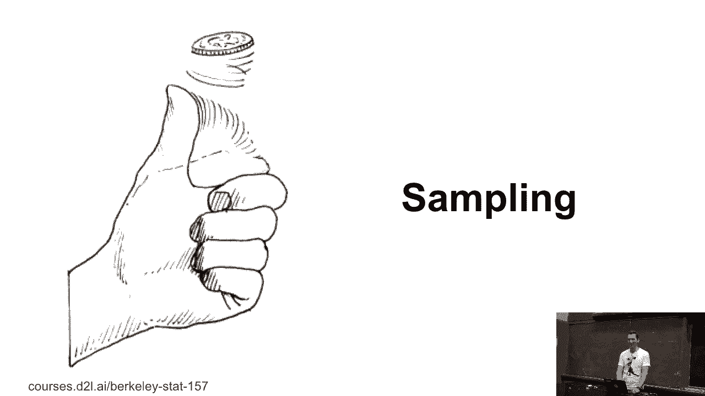
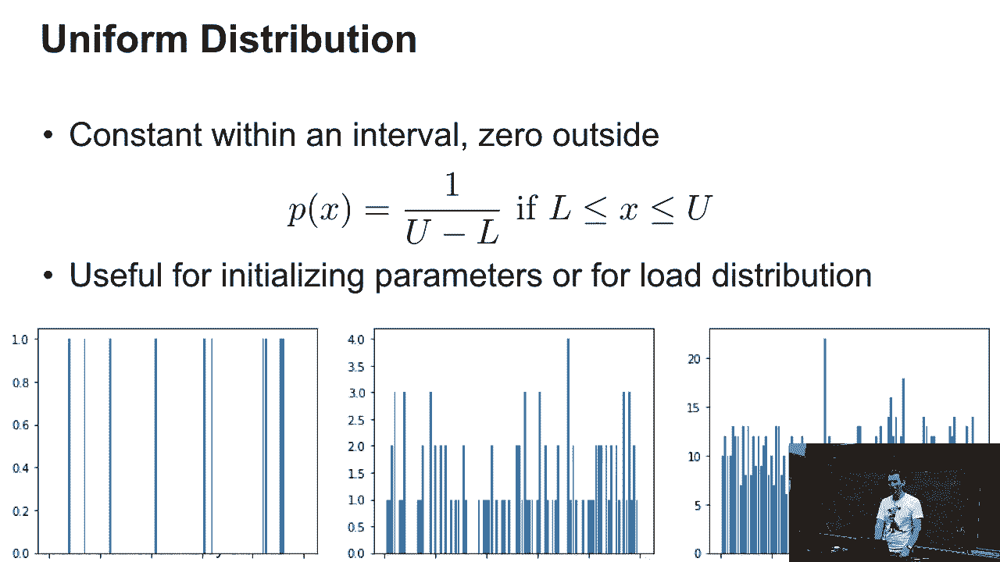
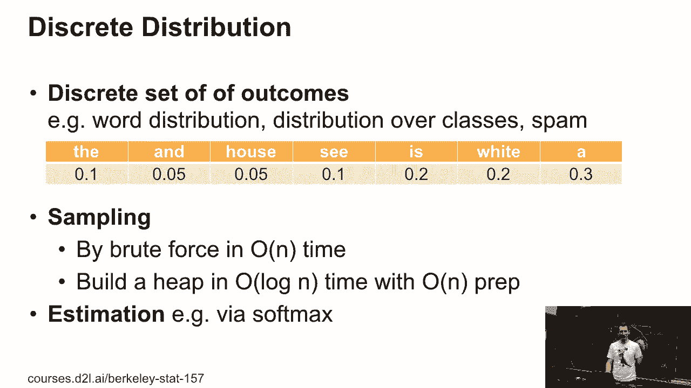
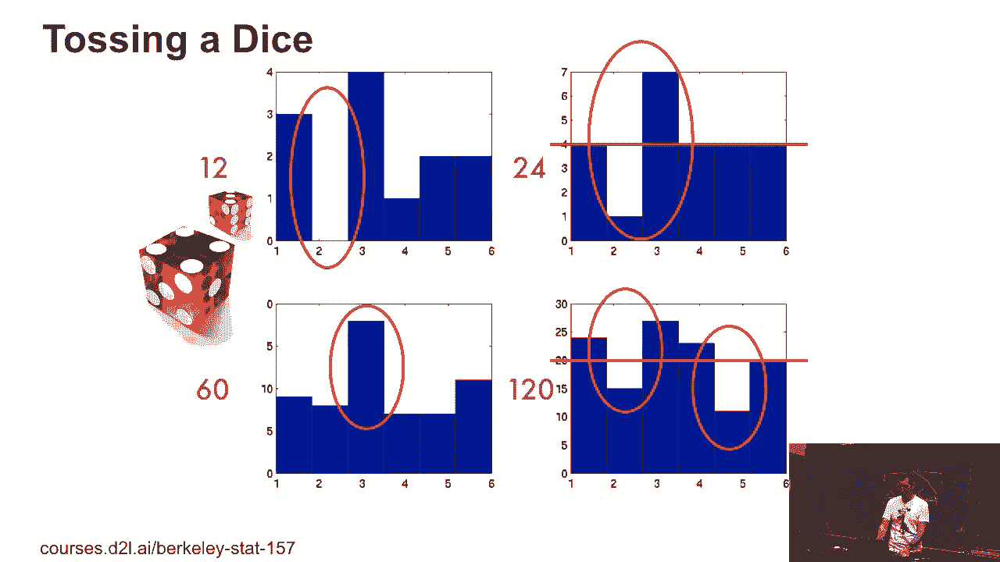
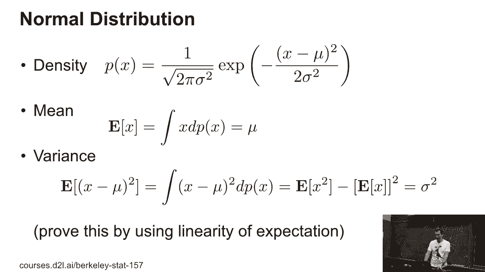
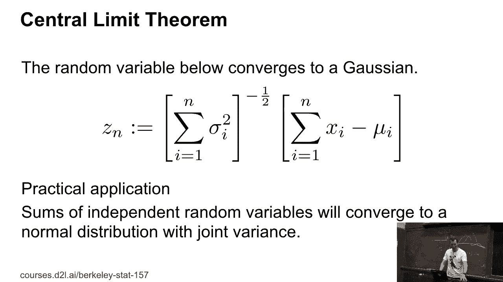

# 【AI 】伯克利深度学习Deep Learning UC Berkeley STAT-李沐 & Alex - P12：12. L3_1 Sampling - Python小能 - BV1CB4y1U7P6

 Okay。 So this is the leftover from Thursday's class， namely sampling。 So， I mean， one of。

 the obvious things that you probably have gotten used to as a decision is how to sample， right？

 Who has implemented a sample before in their life？ Okay。 After this homework， all the hands。

 will go up because implementing a sample will be one of the home works that you'll have， to do。

 Okay。 So， what's the simplest distribution I could pick？ Well， actually， a uniform distribution。

 is pretty simple， right？ So in a uniform distribution， well， what I have is， I just say， well， you。

 know， there's some interval from L to U， lower to upper bound。 And within that interval， all。

 values occur with equal probability。 And outside of that， nothing happens。 Your typical uniform。

 random number generators will look like that。 And so if you draw from that maybe 10， 100。

 and 1000 times， you get something that is starting to look increasingly， well， uniform， but not。

 quite。 I mean， obviously， I didn't quite draw this with infinitism， really small bins because。

 otherwise the lines would be infinitism， really narrow。 So you can see some stuff that's a little。

 bit taller。 So I quantize at some point。 But this is essentially what happens if you draw。

 from uniform distribution。 And we'll see that in practice in a moment。 Now， the slightly。

 more interesting thing is drawing from a discrete distribution。 So this is a really stupid language。

 model， right？ So this language model has six words。 The and how C is white A。 Well， okay。

 it doesn't make a lot of sense， but I've just attached some probabilities to that， right？

 Maybe the word that occurs with 10% and the word and with 5%。 And so what I could do is。

 I could just sample from that distribution by brute force in linear time。 Okay。 So how。

 would I do that？ I mean， so the first thing is let's assume that those numbers actually。

 add up to one。 If they don't， then it's kind of awkward， but let's just assume that。 Well。

 what I can do is I can just take a random variable that's between zero and one。 And so。

 I'll draw and maybe I draw something here。 Okay。 And then I just iterate through that， entire array。

 And I subtract zero point one from it。 I then subtract zero point zero， point zero five from it。

 subtract another zero point zero five， subtract point one， subtract， point two。

 And now all of a sudden for the next subtraction， I end up with something that's， less than zero。

 In other words， I just keep on subtracting from the number from the random， variable。

 all the various probabilities until I end up with something that's less than zero。

 And now I know that I've hit that interval。 So this is how you can draw from a discrete。

 probability distribution。 Now this is hideously expensive， right？ Because if I have in outcomes。

 I need to draw on average about in over two items。 Okay。 Does somebody know how I would。

 need to reorder this probability distribution up there in order to minimize the number of。

 subtractions？ Okay。 Exactly。 I would sort this from the largest to the smallest one。 So this way。

 because it's， you know， I would， because basically something out here requires。

 all these operations up here， right？ So this will give me an algorithm that can be faster。

 than linear time， especially if I have， if most of my events are with very， very small， probability。

 then I really only care about the large chunks and only occasionally I need。

 to pay something a little bit more expensive。 Now that's not a bad idea， but you can do better。

 So one way how to do better in order to get something that works in log time is if I build， a heap。

 So if I have my entire set of probabilities， stuff like this， I go and combine them here。

 combine them here， and I perform the sum of those two， sum of those two and so on going， up this。

 Now if I then walk down this heap， well if my random variable is larger than。

 the sum of these terms， I know I need to be over here。 So this is really just implementing。

 binary search。 Okay。 Puzzle question for you。 It's not in the homework， but it's an。

 interesting question for you to think about。 Can I construct this heap in place here without。

 needing more than in entries？ I mean obviously it has to be possible because this is， these。

 are linear combinations of those numbers， right？ So if I have in numbers here， in numbers。

 there will have to do。 So think about it， what data structure and what conditions you would， have。

 This is probably a fun question anyway to ponder about。 It's not totally idle because。

 if you design any samplers， maybe for your projects or later on in your career， you may。

 very well need to come back to such data structures。 There are lots of other fancy data structures。

 beyond that。 If you take any class on MCMC methods and numerically focused ones， they。

 would probably look into tricks like that as well。 So this is useful。 In many cases。

 math can get you easily orders of magnitude speed up。 Good code might get you maybe 50%， speed up。

 Okay。 Now of course we are going to estimate those probabilities later and。

 we are just going to use this off max for it。 Now if we roll a dice， similar picture to， before。

 you know if I roll it 12 times， you would expect that everything occurs twice。

 but for instance the twos don't occur at all。 And so only as we draw more and more， we get。

 something that's closer to the average。 Okay。 We'll look exactly at that rate of conversion。

 in a moment。 But yeah， these guys are clearly bad。 Now another thing is a normal distribution。

 So there the density is quite straightforward and simple， right？ I mean everybody has seen。

 a normal distribution。 So in Germany， there used to be a bank note， a thin Deutsch-Mark。

 bank note and that actually had the equation of the normal distribution on it。 This was。

 the high school student's favorite for Exi-Ampre because of course you were allowed to bring。

 legal currency into class。 But okay， by now we have the euro so this is gone。 But anyway。

 so that's a normal distribution。 I guess that picture shouldn't surprise anybody。 Okay。

 So obviously there are useful quantities that go with that。 There's the mean and there's。

 the variance。 And the mean is mu and the variance is sigma squared and they're given by just。

 you know the integral dp of x times x。 And the variance is just dp of x times， well in。

 this case x minus mu squared。 And then， well， we have this very nice decomposition into the。

 expectation of x squared and the expectation of x squared。 Okay。 Who has seen the derivation。

 for this before？ It's about maybe 60， 70 percent。 Okay， I'll quickly do it just as a refresher。

 It just goes over the linearity of expectations as game。 So the expectation of x minus mu is。

 of course nothing else than the expectation of x squared minus 2u x plus mu squared。 Okay。

 So this is good news because we can take apart these three terms。 And so we have the expectation。

 of x squared plus the expectation of x squared minus 2 mu times the expectation of x。 However， now。

 and this is something I can do because by linearity can pull it out of the expectation。 Now。

 fortunately these two terms then cancel out。 Right？ And so I get minus。 Okay。 So it's。

 a really straightforward decomposition。 But， okay， so why is it useful？ So let's say you're。

 observing the xi's one at a time。 And you want to get the mean and the variance， right？ And。

 you know， if you look at this， I mean it seems like mission impossible， right？ Because。

 I mean it's like you need to know the mean in order to get the variance。 But given that。

 I can go and compute a running average of the x squareds and a running average of the， x's。

 And then when the time comes， I just instantiate this。 Okay。 That should be fairly。

 straightforward。 Good。 Now， we have this thing called a central limit theorem。 And that's。

 one of those really useful properties。 It's one of the most basic properties for averages。

 and how they behave。 And basically suppose I have some random variable xi。 And I go and。

 subtract from it its appropriate mean mu i。 Then I know that the sum over those random。

 variables will have as aggregate variance the sum of the individual variances。 Right？

 So that's the case because all those random variables at least， if they're independent。

 in this holds。 Right？ Otherwise it doesn't。 Now， if I go and then rescale such that this。

 random variable has zero mean and unit variance， the zero mean comes from the fact that I'm。

 subtracting out the means individually。 And the unit variance comes by from dividing through。

 the aggregate variance。 Then I get a random variable that has zero mean and unit variance。

 And it can be shown that in the limit for n going to infinity under reasonable regularity。

 conditions such as the sigma i squared not being too large。 This will converge for Gaussian。

 So this is kind of a nice theory but it's actually really useful in practice because that happens。

 fairly quickly。 So tens of random variables will already give you something that behaves。

 pretty well behaved at least if the individual constituents look nice。 Okay。 So let me quickly。

 give you an example of this。 And the， yeah， so I learned this reasoning from Grace Wabbe。

 and initially it's like totally surprising。 Suppose I have some function that's just an。

 indicator function， right？ So it goes from maybe minus one to one。 So this is like some。

 chi from minus one to one。 And let's assume that its value here is one half。 So you can。

 see this is like a uniform distribution between minus one and one。 And if I go and fold and。

 convolve this thing by itself a few times then very quickly so you can see if you convolve。

 this by itself。 So let me call this thing here p one。 Well actually it's called it b， zero。

 So b spline and b one of course looks like this and b two will look like that。 And， so on and so on。

 Then you can show that this very quickly converges to a Gaussian。 But you'll。

 have to rescale this thing according to the central limit theorem。 And essentially you。

 can invoke the central limit theorem to prove that in the limit of convolving this an infinite。

 number of times with appropriate rescaling I get a Gaussian。 So this is using central limit。

 theorem to prove something in functional analysis。 Neatrix。 Yes？ Oh。 Yeah， it's a good。

 thing to cover this anyway because we will do convolutions and they don't just share the。

 name they actually share the math。 So if I have some function f convolved with g then。

 this is defined as the integral of f of x times g of， well， z minus x dx。 So I'm basically。

 computing the overlap between two functions and where the second function has been shifted。

 to either side。 It's really like a filter that you're applying。 So for instance if I want。

 to apply a low pass filter to audio I would go and convolve the audio signal here with。

 you know something that looks suitably smooth。 So for instance one thing you could do is you。

 could just average adjacent samplings and this will give you a low pass filtering。 But。

 there are better ways of low pass filtering。 Yes？ Okay， I'm not sure I'm very good at that。

 part but you could think of it as you know taking the overlap in this case between this， and itself。

 right？ There is just that area here。 Or more generally you just have you know。

 one function here that does maybe something like this。 Another function that does that。

 And so now you're computing the pointwise product and integrating all the pointwise product。 Okay。

 This is g。 But you actually have to flip g then。 So it's like a， like an inner product。 Yes？

 Is it what？ Is it commutative？ Yes， in this case you can actually work out that， it will。

 So there are a couple of nice properties of this。 It you know has spectrum preserving。

 properties and so on。 So that's okay。 Take a signal processing class and you'll probably。

 spend half the class doing convolutions at least in the basic one。 We will only need very。

 very basic properties of that for computer vision where we won't look at one dimensional。

 convolutions but two dimensional convolutions and higher dimensions。 So you basically go。

 over the image and use smooth appropriately。 Okay。 Now this sounds like a lot of theory。

 Let's actually try this out in practice。

