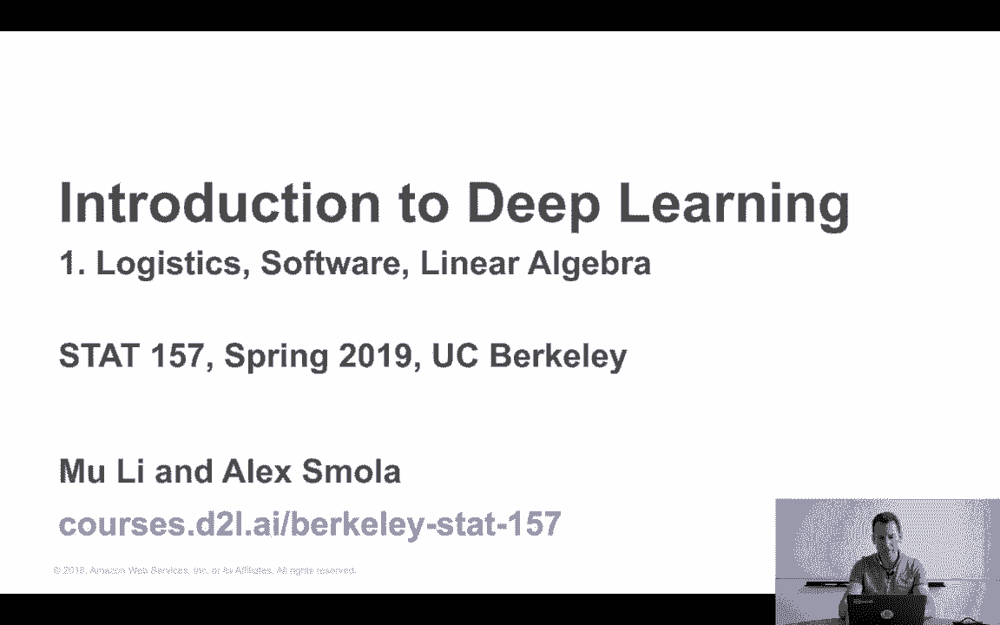
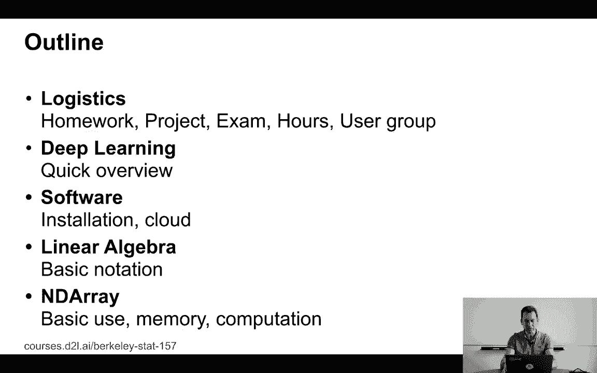
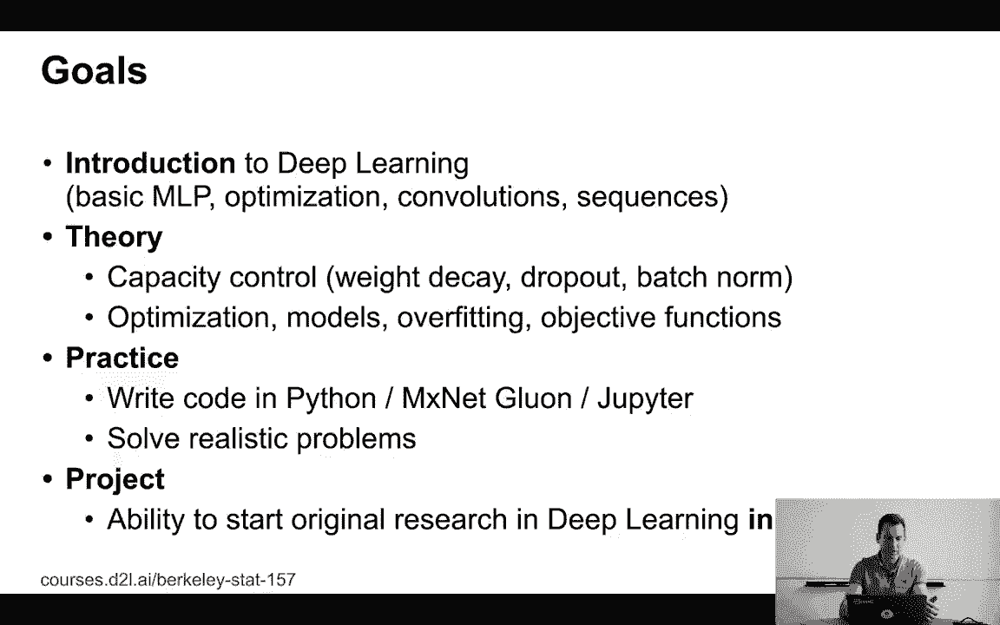
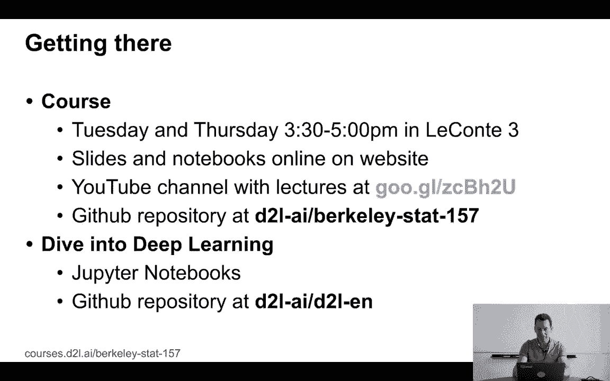
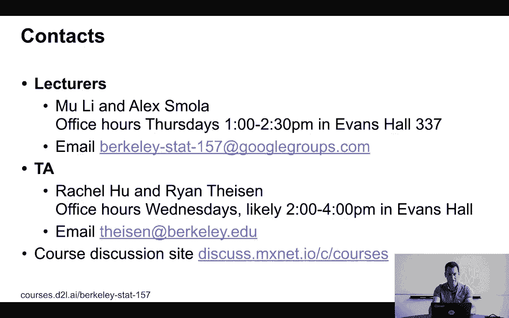
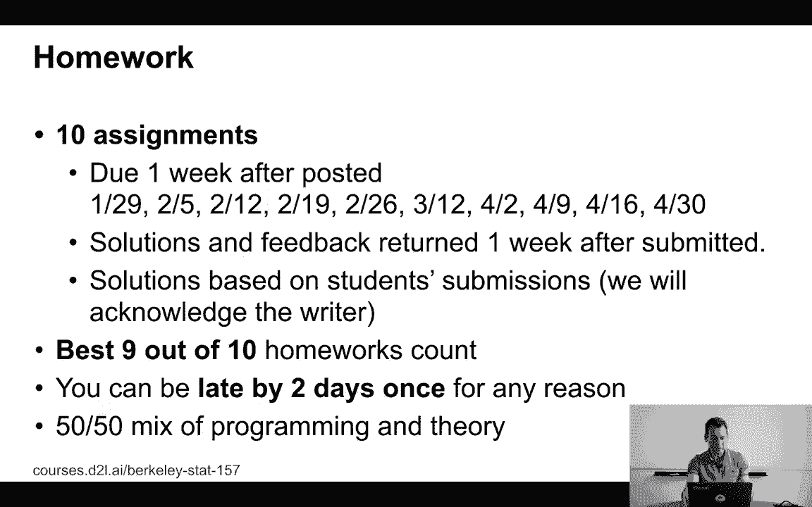
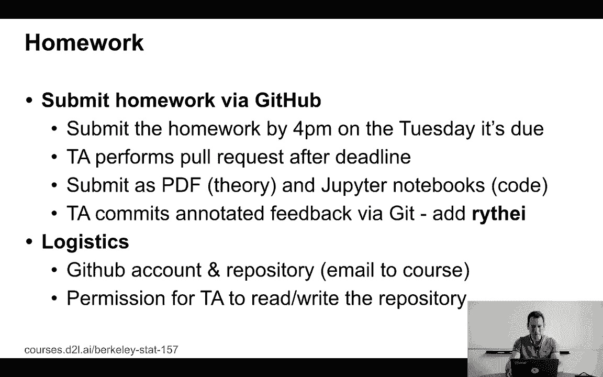
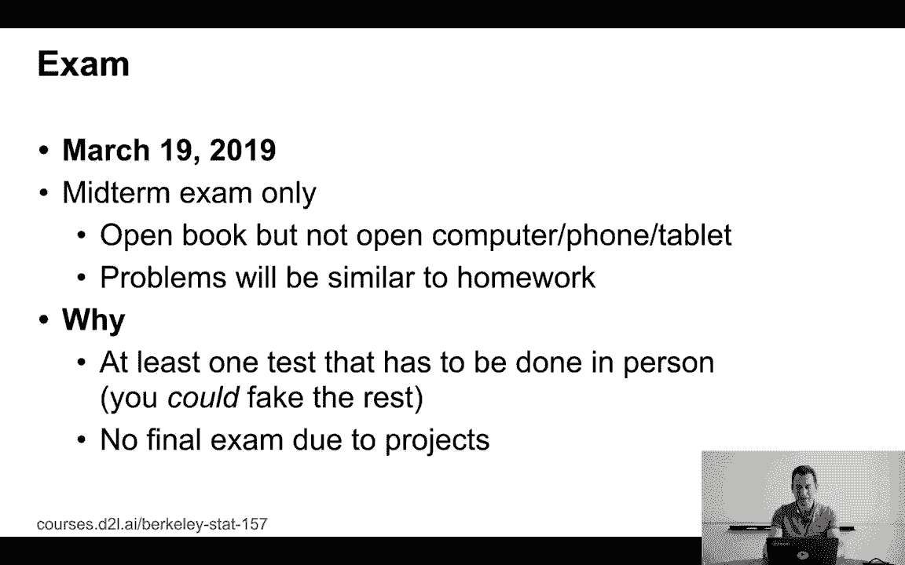
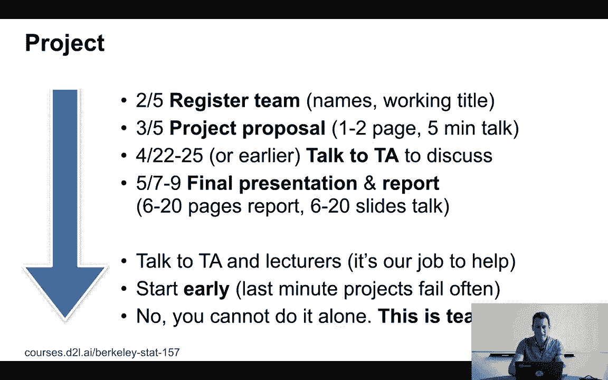
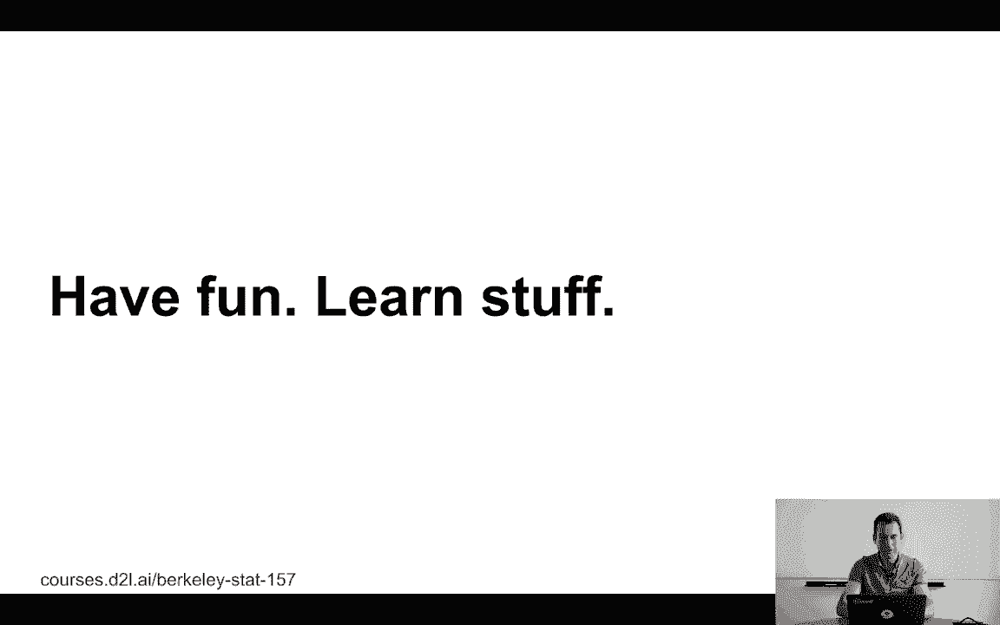

# 【AI 】伯克利深度学习Deep Learning UC Berkeley STAT-李沐 & Alex - P1：1. L1_1 Logistics - Python小能 - BV1CB4y1U7P6

 Welcome to this class on deep learning。 This is the first lecture for the statistics 157 course for the spring semester at UC Berkeley。

 Due to technical issues of the life recording， this is a re-recording。

 So apologies for not having the life recording here。 We hope that the re-recording is acceptable。

 Okay， so the first thing that we should cover in this class is logistics。 Namely， you know。

 how the homework， projects， exams， hours， user groups and other things work。

 We'll then give a brief overview of deep learning。

 We'll talk a little bit about software installation， linear algebra。

 and then the endear race storage format for MX-NIC-1。

 Let's start with logistics。 This is really just there such that we know how the class operates and how to get everything done。

 So what's the goal of this class？ Well， the first thing is I want to give an introduction to deep learning。

 Right， so this is basic multilayer perceptron， optimizations， convolutions。

 sequence models like LSTMs， maybe a bit of attention and so on。

 This is really just the bare bones how to build a deep network。 But at the same time。

 I also want to make sure that everybody understands the theory of deep learning behind it。 Well。

 at least as much as you can cover in an undergrad introduction to deep learning course。

 So that means talking about capacity control， weight decay， dropout， batch normalization。

 but also about optimization， different types of models， overfitting objective functions and so on。

 Now， since this is a deep learning class and since this is a practical one。

 I want to make sure that also everybody gets a good idea of how to actually perform and apply deep learning in practice。

 So you will have to write code in Python on Jupyter Notebooks。

 and the deep learning framework of our choices MX-NIC-1。

 But if you're for instance familiar with PyTorch or TensorFlow eager or China。

 this should not look too surprising for you。 The goal is to get to the point where you can solve realistic problems。

 not necessarily large-scale wheel well-prone， but at least realistic problems。 And ultimately。

 for you to be able to run a project。 This project is effectively research with training wheels and will help you getting things right。

 So this is really your first starting point to do original research in deep learning。

 And the important thing is not just on your own， but in a team。 Now。

 how we get there is in two ways。 One is through a course and that will be held on Tuesdays and Thursdays from 3。

30 to 5 p。m。 in the con。 And obviously， if you made it to this class， well， you know where this is。

 And if not， you can always stream it on YouTube。 Furthermore。

 we'll make all the slides and notebooks available online on the website。

 The YouTube channel always has the latest lectures there。 Obviously。

 pending some technical difficulties， which is why the first lecture set was actually delayed。

 And we'll put everything up on the GitHub repository at d2l-ai， Berkeley-Stad 157。

 In addition to that， there are the Jupyter notebooks from dive into deep learning。

 And they form the basis of the notebooks that I'll be walking you through in this class。 Obviously。

 not just me， but also Mully， my co-lecturer。 And then there's a GitHub repository where you can just go and git clone all those。

 So basically， if you look at the d2l-ai repository， this has a lot of details in there。

 both for the class and also the book and also other things coming over the next few months。

 Lectures？ Well， that's Alex Smoller。 That's me。 And Mully。

 who will be teaching the other half of the course。 We'll have office hours on Thursdays from 1 to 2。

13 Evans Hall。 And you can read just by email to Berkeley-Stad-157@googlegroups。com。

 Our brave TAs are Rachel Hu and Ryan Tyson。 And the office hours are going to be most likely on Wednesdays from 2 to 4pm in Evans Hall。

 For details， please have a look at the website。 They are finding some arrangements in terms of where they can actually have the office hours。

 because there might be a large number of people attending。 If you have any questions。

 send an email to either the overall course email address， so that's Berkeley-Stad-157。

 or email Ryan。 Course discussions are on this course， so go to discuss。amixnet。io/c/courses。

 So instead of Piazza， we are putting it there。 The main motivation being that if it's a more MXNet related question。

 you can just post it in general。 If it's otherwise about machine learning。

 probably others will find your questions useful as well。 If it's something confidential。

 come in during office hours， or send us an email directly。

 Okay。 Now， homework。 Obviously， one way of making sure that everybody gets something out of it is by making sure they're already practices。

 And that's what the homework is for。 We'll have 10 assignments。

 and they add you on a weekly cadence。 The reason for weekly cadence is very simple。

 I want to make sure that you don't procrastinate and leave the homework up until the last day before that one week or two week or four week deadline。

 And so I figured it's easier if we make the homework available on a weekly basis。

 so it's a smaller amount。 There is going to be a fair amount of coding and some theory。

 It's all interpreter。 And you basically submit it one week after the homework's out。

 and then we'll give results and grade and push things out。 Now， the good thing is， if you。

 for some reason， can't get one homework done or whatever else， that's all right。

 We'll only count the best nine out of ten homework， and furthermore。

 you can be laid by today's once for any reason。 So this should help you， for instance。

 you need to attend a conference， you need to go to a job interview， you're sick or whatever。

 It'll give you some leeway。 Lastly， all the submissions are through Git， so therefore。

 you don't even need to be on site。 For all intents and purposes。

 you could be in Hawaii submitting your GitHub， your homework through GitHub， and it'll be fine。

 So， the way how it works is， you submit the homework by 4pm。 On the Tuesday， it's due。

 and the TA performs a pull request after the deadline。

 You could or should submit it as PDF and TruePit and Notebooks。

 the PDF is just to be on the safe side in case the TruePit doesn't render in some way。

 And the TA commits annotated feedback back via Git。

 so you need to add RY-T-H-I-E-I to Git such that he can perform a Git pull from your repository。

 Please contact Ryan to get details about， basically send him your Git address and your repo name such that he can pull that information automatically。

 So， for this， Ryan will cover in a separate meeting a little bit on how to do Git if you've never used it before。

 Mind you， this is a very useful skill that'll help you for all your career。

 whether you're an engineer or scientist or even a manager。 Git is your friend。 And， yeah。

 so this is easier than just submitting by email。 In addition to that， for instance。

 if you're still on the wait list， it means， so just submit your homework into Git。

 This way we have timestamps， and even if it's delayed， well。

 we can still use that to verify that you've done your things beautifully。 Obviously。

 that's not really， really proof because you can always tamper with timestamps on Git。

 but on the other hand， if you can do that， you can probably pass the course。 So， it's all right。

 and I'm simply appealing to you， honestly， here。

 There's an exam。 This is only a mid-term exam。 The day is going to be March 19， 2019。

 It's open book， but no computers， phones， tablets， or similar things allowed。 The point being。

 I don't want you to be able to Google the solution， right？ So， go and use any notes that you have。

 By all means， if you want， print out all the slides。 That's completely up to you。 The point is。

 though， you cannot just post the solution chat with somebody who will then give you the answer or something。

 So， there needs to be a mechanism to ensure that this is you who is providing the answers。

 This is also why there is an actual exam rather than just projects and homework。

 because I want to make sure that there has to be at least one proof that you are the one who's taking the course。

 Otherwise， you could outsource everything to， let's say。

 India that might improve your management skills， but it's probably not so useful if you actually want to learn something。

 There's no final exam because the projects are really the thing that matters and that actually is what carries the line share of the points。

 Now， project。 So， the idea is for you to perform original work in machine learning。 So。

 original work can mean a number of things。 You could， for instance， go and use existing tools。

 apply it to a novel problem to a novel data set， or you can come up with new algorithms。 Now。

 I understand that this is not easy because， well， this is probably the first time you're doing。

 like， research research。 So， you can ask me， you can ask me。

 you can ask the TAs for advice in case you stop。 After all， this is research with training wheels。

 which simulates academic research。 And that will help you get started。

 that will help you become a better scientist， a better researcher。

 also a better engineer as you go along。 And it also will teach you how to work and research in a team。

 So， you should very， very soon team up with， let's say。

 three to five other students and you then start planning your work。 Right？ So。

 there are going to be deliverables and deadlines and other things。

 And the main reason for that is just that if I leave just everything up to the final project。

 then everybody will start working on that project one week before， if you're lucky。

 And then it's a mad rush to get something done within a week。 At least we're all stress puppies。

 And I know from my own experience that if I didn't have any constraints。

 I will probably leave it until the end to。 So， don't do that。

 And I've imposed some constraints to make sure that it doesn't happen。 Now。

 the end result is going to be some paper report and presentation。

 And while it just so happens to be in a NIPS template and it just so happens to be that the project deadline is about two weeks before NIPS。

 So， there's the added bonus that if you do a really good job。

 maybe you can submit it to some conference。 And I'm fairly sure that this will increase your chances of what you'll do further on。

 maybe doing your PhD， maybe doing your masters。 So， the entire thing is not wasted effort。

 Do a good job and it'll help you way beyond just this course。

 So， timing。 I want you to register a team very， very early。

 That's why there's a deadline on February 5th。 By that time， you need to register a team。

 That means names and a working title。 No， you cannot submit the project proposal on your own。

 If you want to do that， well， we will simply assign you to another project that has less than five team members at random。

 And you may not like the people who we assign you to。 So。

 if you really want to work on a project and with a team that you enjoy， please pick one now。 So。

 now then the project proposal， which means one to two page write up and the five minutes talk in front of everybody will happen exactly one month later on March the 5th。

 This involves a five minutes talk in front of the entire class presenting what you're planning to do。

 This five minutes talk is there to make sure that there's a strong encouragement to present something good because otherwise you'll be embarrassing yourself in front of everybody in the class。

 And by the way， you will be recording this unless you object to it and will be posting it online。

 Now， this sounds very scary but actually it's not because we're there to help you。 So。

 come any time， start discussing project ideas， project proposals， suggestions， any comments。

 This is really there to help you get started。 Now， in case you're feeling too shy。

 I still want to make sure that you talk to at least somebody from the team at least once。 So。

 within the week of April 22 to 25 or earlier， you must talk to the TAs to discuss the project。

 If you don't， you lose points。 This is really just to make sure that everybody talks to the TAs and that they get their feedback and to ensure that this is really done properly。

 Because you then still have about two， three weeks time to rectify things。

 the final project and presentations at you on May 7 and 9 will use two lectures just for project presentations。

 You need to produce at least six pages of a report。 There's a hard upper limit of 20 pages。

 We will disregard anything longer than 20 and longer is no better。

 And that limit is simply there such that the poor TAs will get some sleep when reviewing the stuff。

 Also， you need to produce at least six and no more than 20 slides for your talk。 Again。

 this is such that you produce at least some meaningful effort but also that you don't just keep on going with 60 slides in 10 minutes and that's starting to approach frame rates of computer games。

 Well， not quite but I guess you get the point。 So talk to your TAs， talk to us。

 It's our job to help you。 Start early。 It's right now。

 things are not very stressful yet but later on， you probably have other courses。

 things get hectic and you need to do it in a team。

 This is Team Vark。 Okay。 Overall， the goal is really enjoy yourself， learn stuff。

 We want to teach you。

 [BLANK_AUDIO]。