# 【AI 】伯克利深度学习Deep Learning UC Berkeley STAT-李沐 & Alex - P21：21. L5_5 Logistic Regression in Jupyter - Python小能 - BV1CB4y1U7P6

 The first thing is， I'm going to look at some data that you can actually work with。

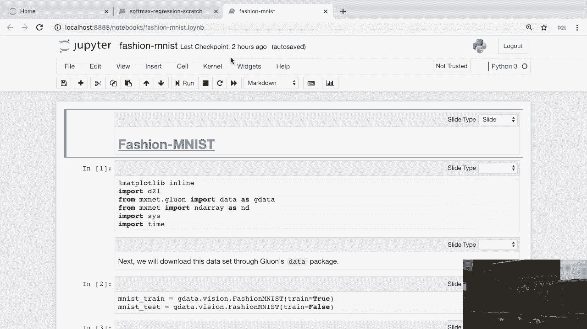

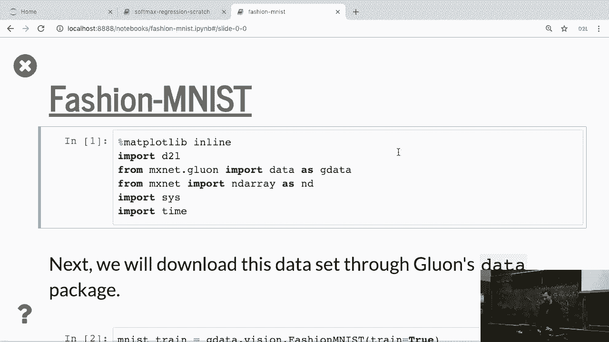

 So we're going to work a fair amount in this course with a data set called fashion MNIST。

 So who has heard of MNIST before？ So MNIST is this digit data set， 60，000 observations， 10 classes。

 And by now it's really been trained to this and you can typically get less than 1% error。

 Now given that， it's not so interesting anymore to train on MNIST。

 And so at some point somebody said， well， hey， we still want to have a small data set。

 so we can play with it easily。 But something a little bit more difficult。

 And so some guys at Solando decided that it would be a good idea to use clothes for， that。

 So they designed this thing called fashion MNIST。 The good thing is， there's actually a -- oops。

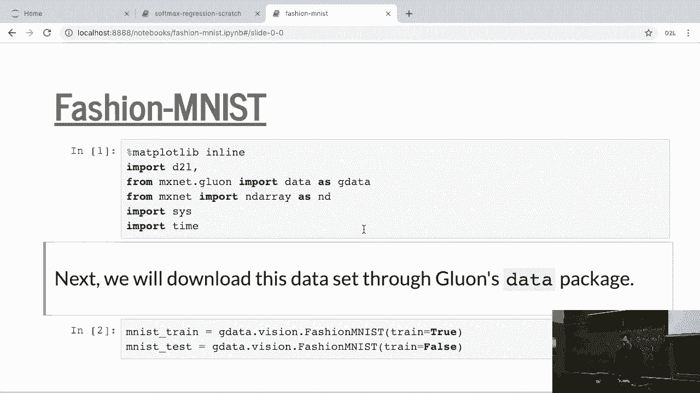

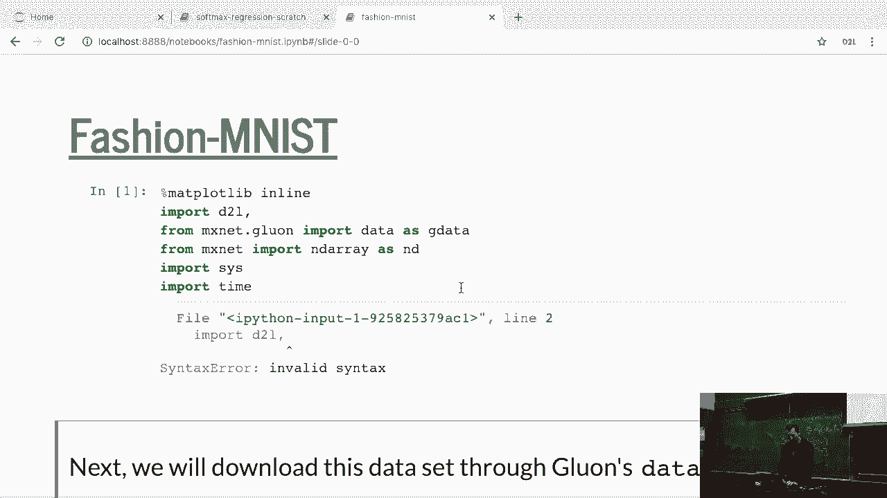

 Okay， let's just -- let's even know that for now。

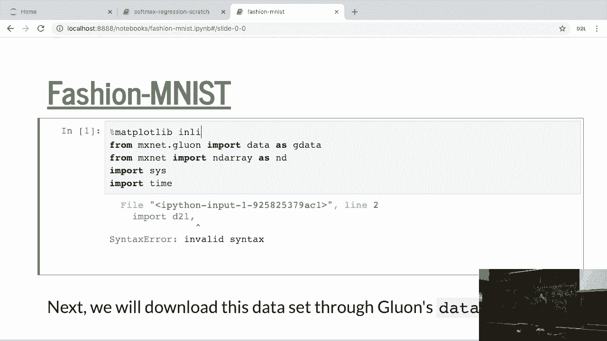

 Okay。 And so we're just going to download this data set。

 And the first thing it'll do is it'll actually go out and download it from S3。 Okay。

 Let's hope we're on the network。 Yes， we are。 And then we'll find it'll get this done。

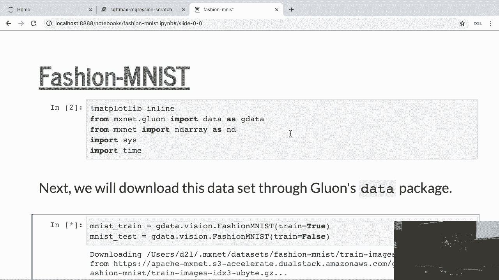

 And then， okay， so I'm obviously not going to be able to show you this until it's done， downloading。

 If you were to look at the size of it， well， you know， the training and the test set are， 60。

000 and 10，000 each。 So that's exactly the same size as MNIST。 Then okay。

 Once you have the data and this is -- the reason for showing you this is also to get a bit more。

 familiarity with the MXNet data format。 And so the data format contains， you know。

 features and labels。 And in this case， feature shape is just going to be Uint8， NumPy。

 data types and， you know， the labels are going to be， you know， just like lanes。

 There's nothing particularly special there and you can index it just like any other way。

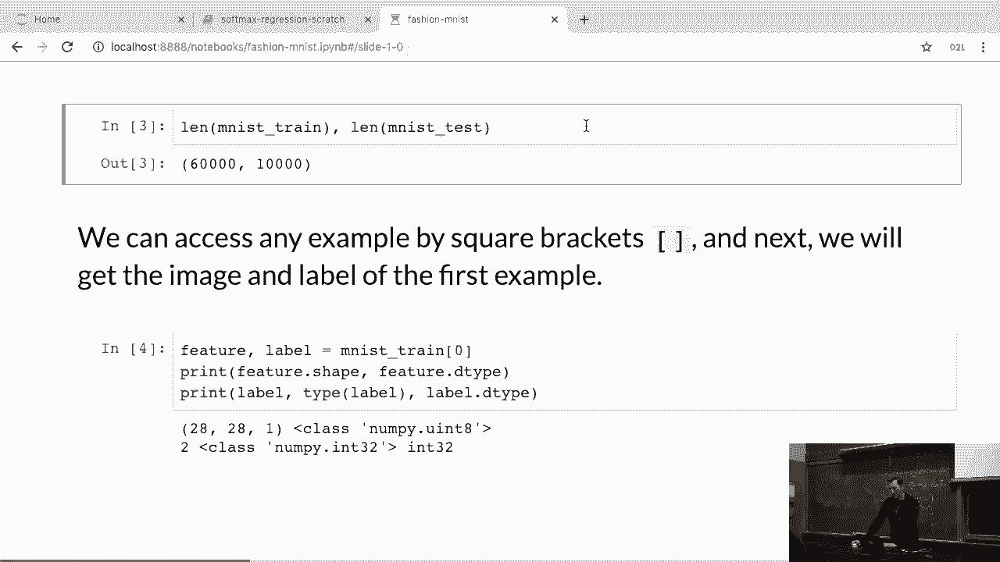

 So let's see whether it's done。

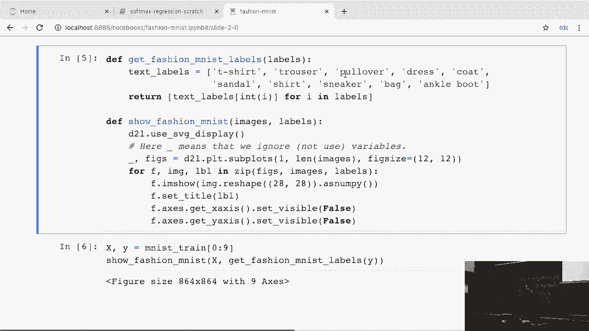

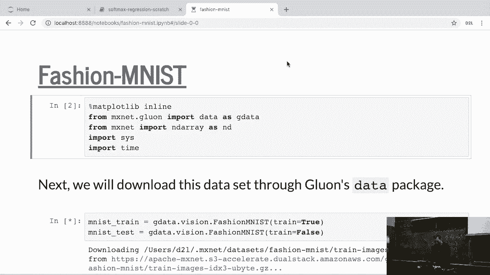

 Something's very funky about the network here。 Okay。

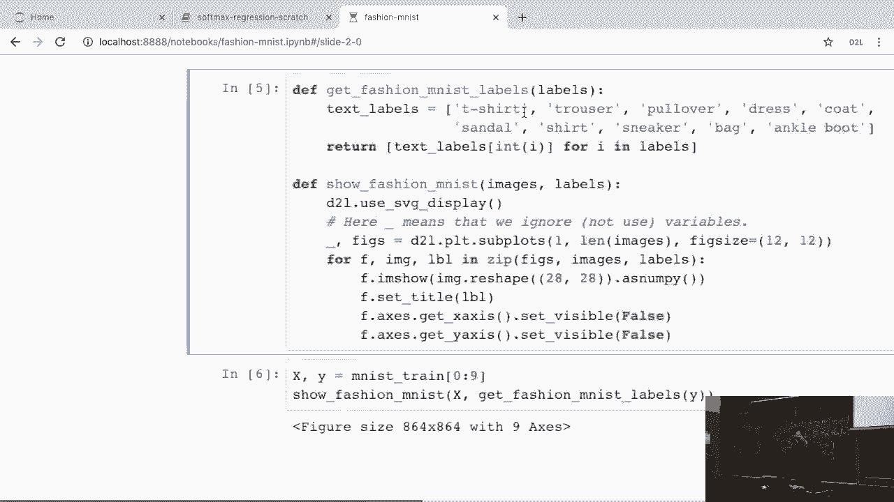

 So if you were to run this -- so these are the categories that you find， okay。 Sneakers。

 bags and ankle boots and， frankly， that's a special thing or sandals。

 You can go and plot it just as you would。 And so if -- I mean。

 these are just some very simple functions。 This one just turns into labels and this one prints things。

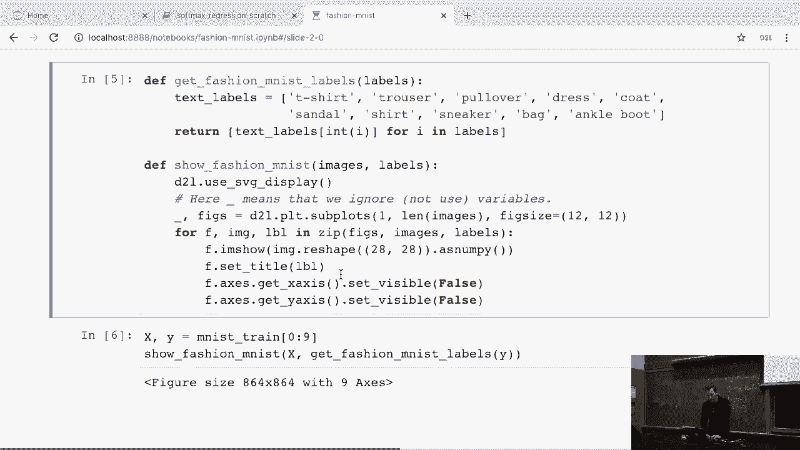

 And then you can -- okay。 Let's see。

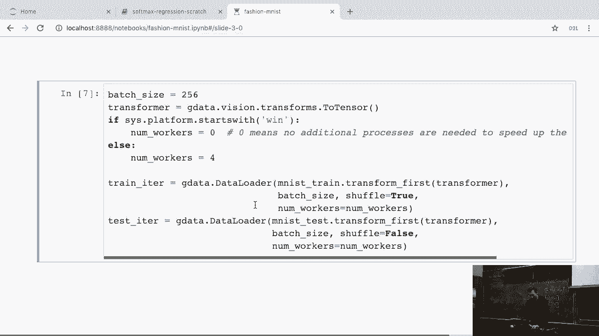

 This takes forever。

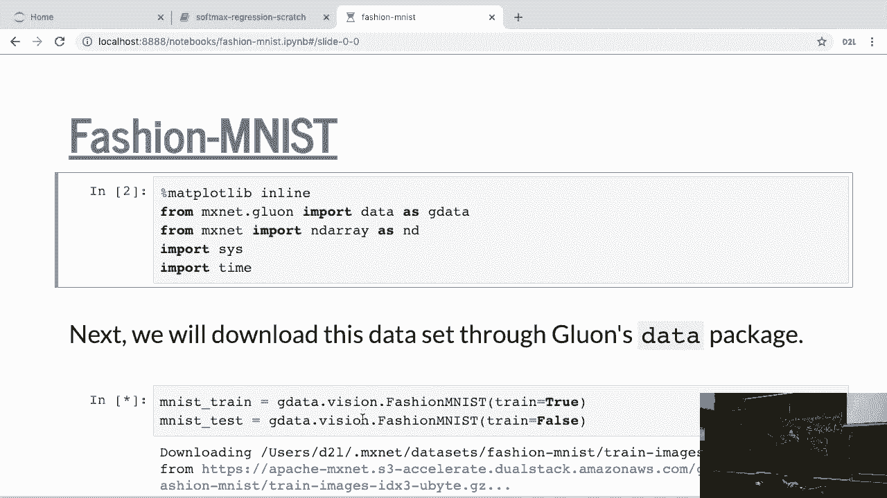

 I have no idea why it's taking so long。

 Okay。 Okay。 I guess that's -- yeah。 Okay。 Fine。 So if you were to run the script at home and we'll put it up online。

 you'll basically。

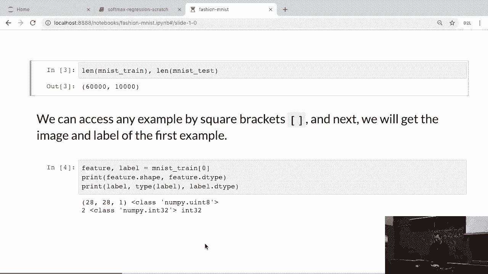

 see pretty pictures of， you know， lower resolution sneakers or sandals or jackets， which isn't。

 so exciting。

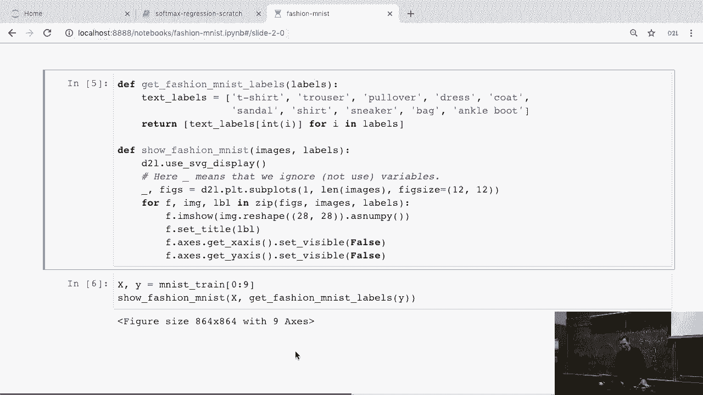

 Okay。 But anyway， you can get that。 Then you can go and， you know， you can load this thing。

 Now in order to load it， it's actually quite interesting。 You can transform the data。

 So as you're loading the data in， we have a couple of predefined standard transformations。

 namely to turn things into， you know， an MXNet Tensor， an NDRA。

 And then you use these or at the point when you import the data。 Now this is nice because you can。

 for instance， have transformers which， you know， crop the， data， distort it， renormalize it。

 down-samplate， up-samplate， perform a lot of other tricks。

 And you can do that in the background and you don't need to worry about that in the actual。

 training loop。 And yeah。

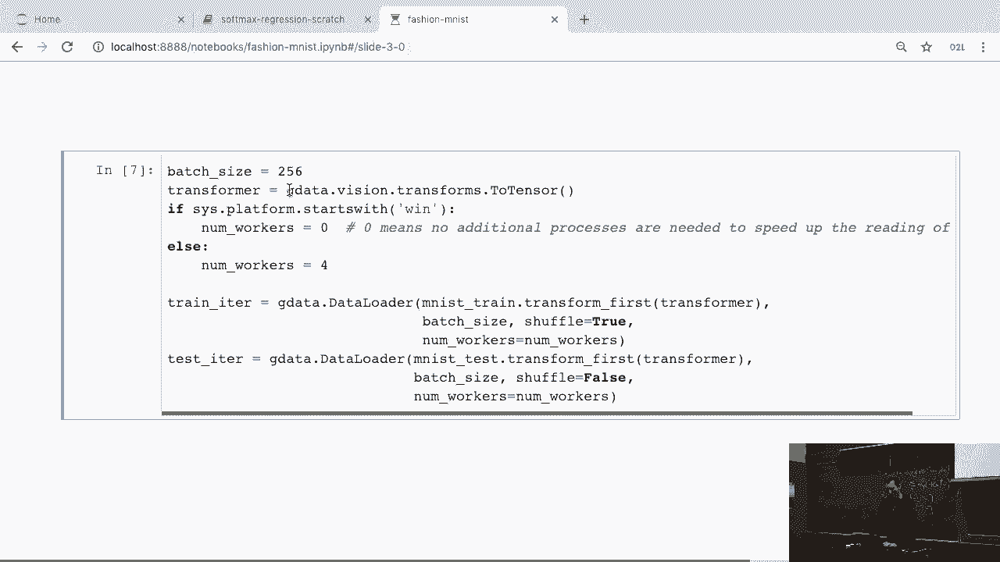

 So that's basically what those data loaders do。 And that's about all you would see。

 now if I were to load this data and， as I said， I， have no idea why it's not done。

 it would iterate through all the data in about three， and a half seconds on this laptop。 Okay。 Fine。

 Let's put Smether's light。

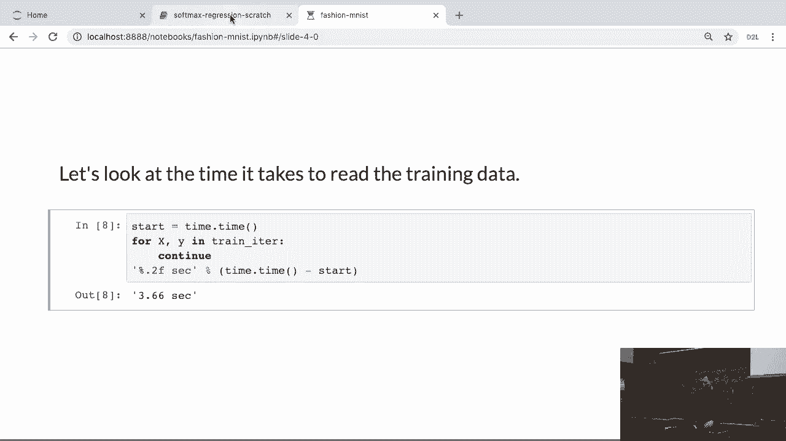

 Problem because I need this data to show you how to actually do regression。

 Let's postpone that until Thursday。 Instead of that。

 we're going to do a little bit of information theory。

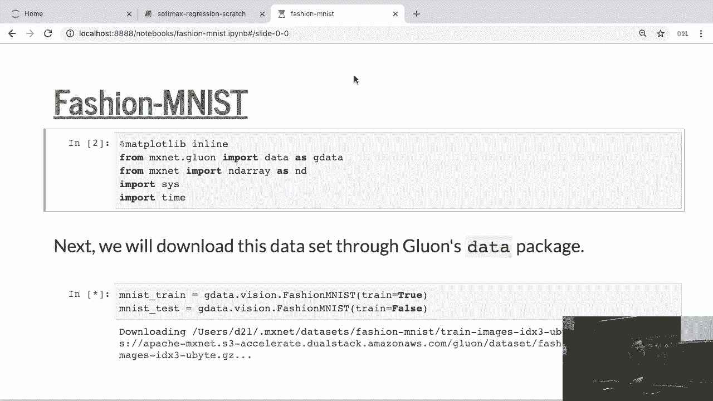

 Okay。 So apologies for that。