# 【AI 】伯克利深度学习Deep Learning UC Berkeley STAT-李沐 & Alex - P31：31. L7_3 Squared L2 Regularization in Jupyter - Python小能 - BV1CB4y1U7P6

 The weight decay we also like import something， we can ignore that。 Here we can fit a high。

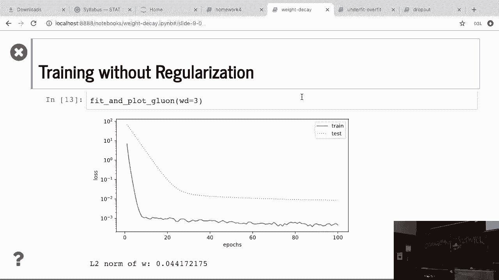

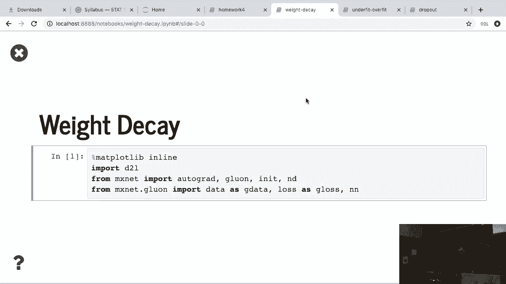

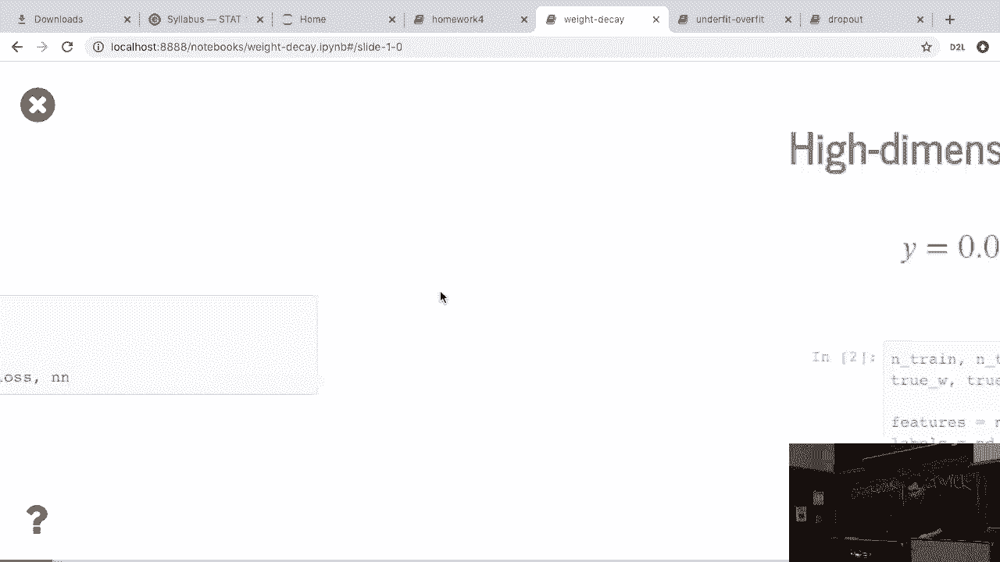

 dimension on linear regression。 That's d is a number of dimensions we have。 The weight。

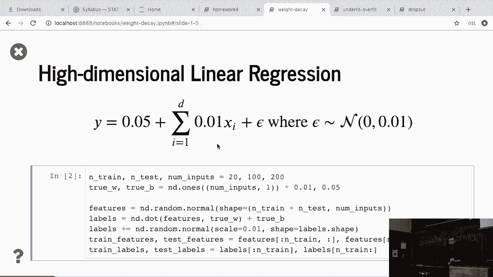

 is pretty simple， all equal to 0 minus 0， 1 and plus a noise。 We can know how we actually。

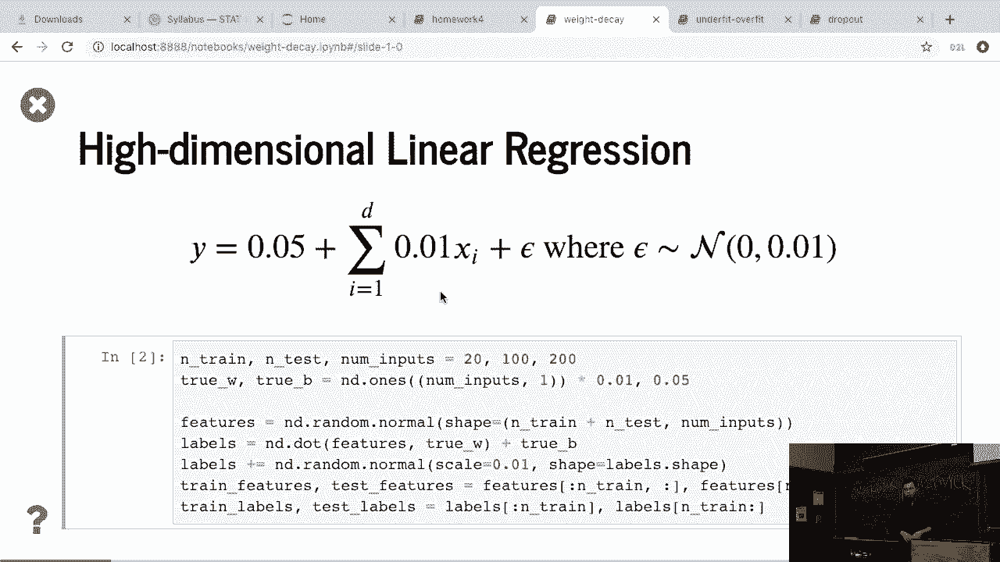

 obtain this data。 And then similar to before we construct linear regression and initialize。

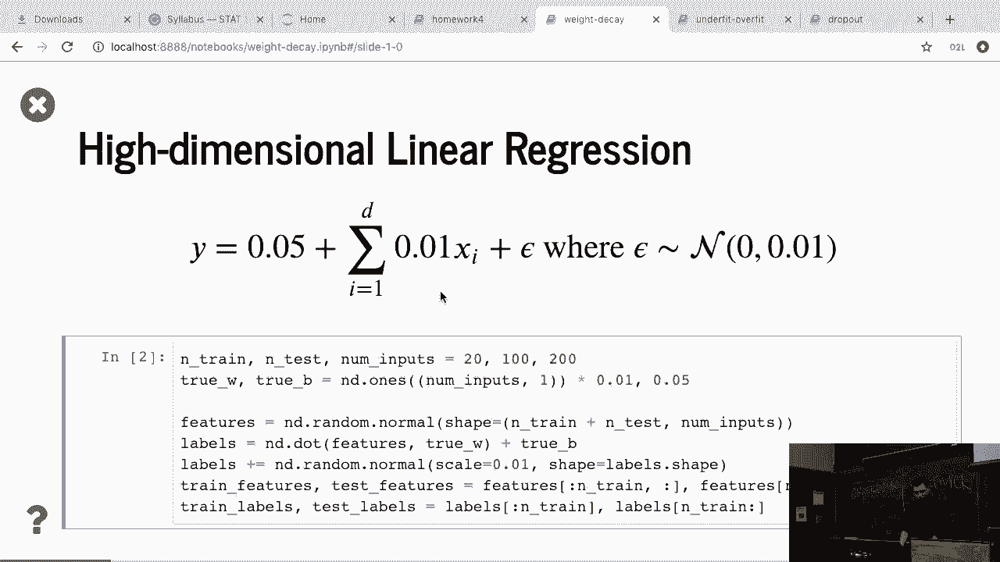

 the weight， attach gradients。 Then define the square L2 long penalty or。

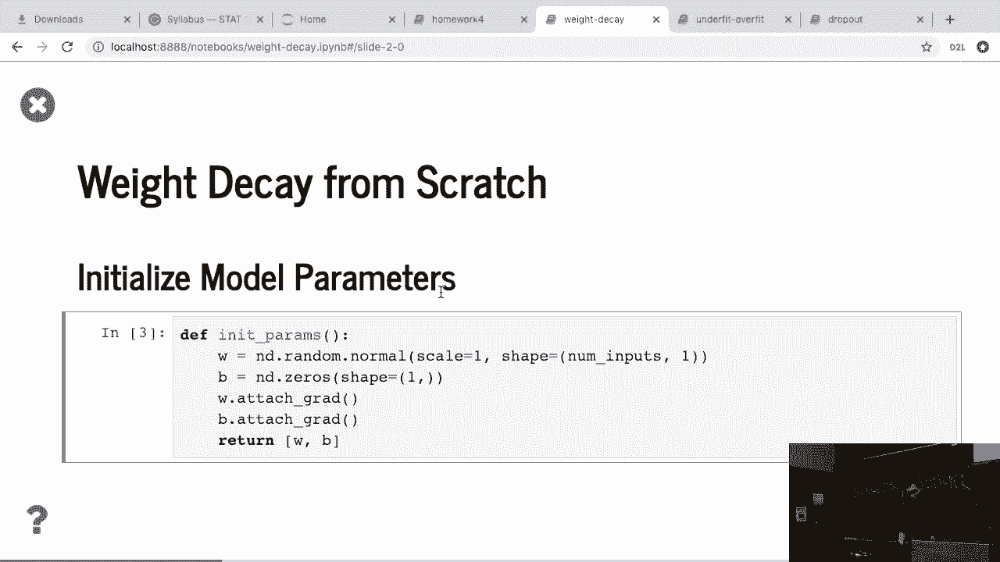

 regularization。 So it actually is given W， power to 2 and the sum of the elements and， divided by 2。

 That's L2， regularization。 The training is actually pretty similar to before。

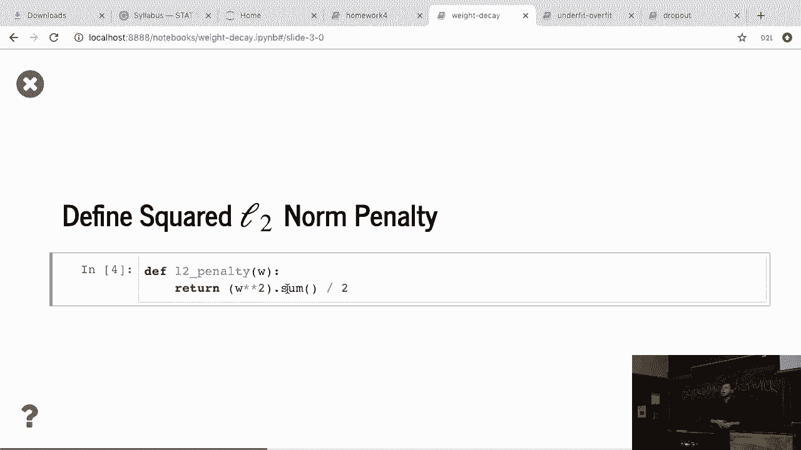

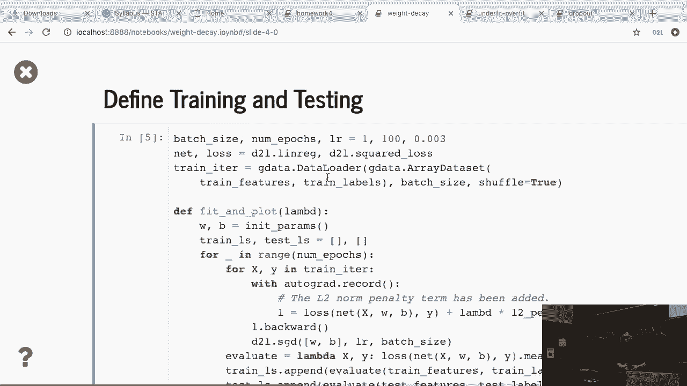

 The only difference here is that the loss function， sorry， it's a lot， original loss。

 And you do not afford and compare the loss between against the Y plus lambda times the， L2。

 regularization of W。 So this is the only thing we have here。 All the others are similar， to before。

 Okay？ They ignore that。 The net first fit number that equals 0， which means。

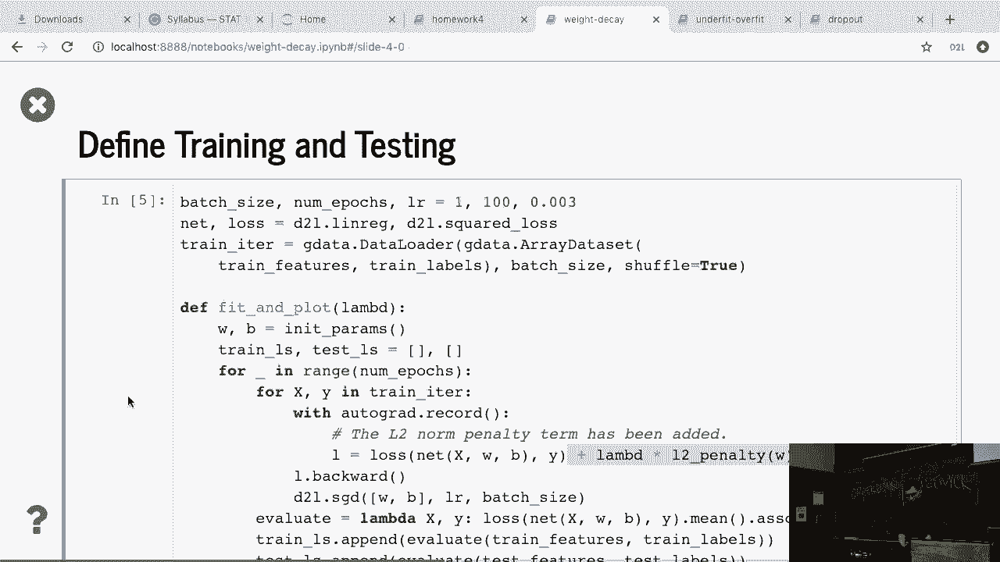

 no regularization here。 You can see that similar thing， the blue line is a training。

 error and the dotted line is the validation error。 You can see that the training curve。

 decreases but the validation accuracy actually is up。 It didn't change too much。 The reason。

 is because we are using 100 dimensions but we are only using a very small number of examples。

 So even linear model can overfeed this data set a lot。 And we can compute the final W2。

 long is to 13。 Now let's try if I use weight decay。 We use lambda equal to 3。 You can see。

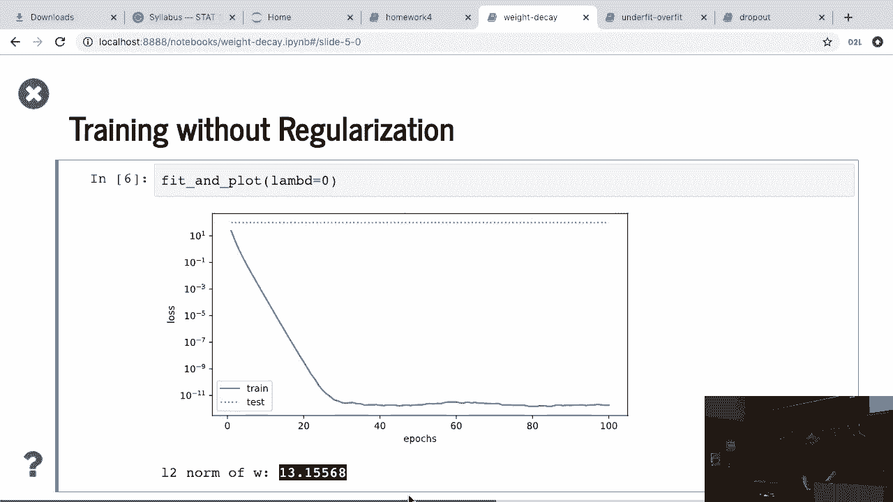

 that we still have a little bit of over-fitting here but it's much better。 We actually drop。

 the test error down by a lot。 But given that we still have only a few examples for this。

 high dimension data set， the model is still over-fitting the data but the adding number。

 actually decreases the test error a lot。 And also we can see that there are two long W。

 is pretty small compared to before。 So if implementing from scratch what we did， we just。

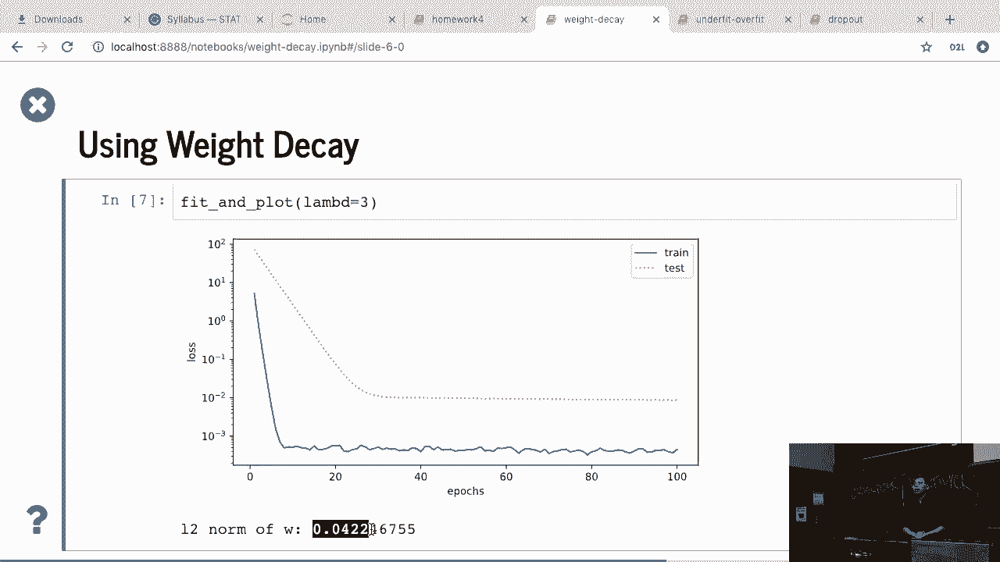

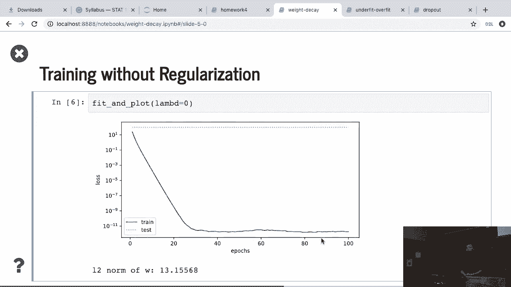

 changed the loss function and if you're going to use a coroure or using any deep brain library。

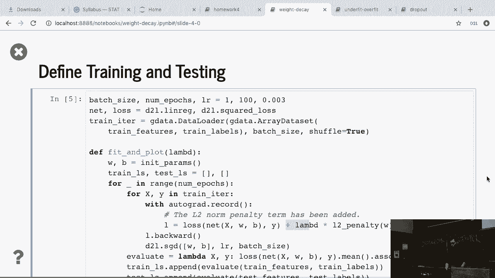

 we usually just tell the SGD function that is apply weight decay that we directly apply。

 to the SGD function。 For example in Gruell you can say that when you get the linear rate。

 besides the linear rate you can specify that the weight decay Wd you could do a particular， number。

 So here we did libiof more complex thing here。 We only apply to weights so we。

 cannot talk about how actually this API works。 Actually we connect also to weight and apply。

 with weight decay and for bias turns we didn't apply any weight decay。 That is close to what。

 we talk about on the equations。 And then because we are already at the weight decay on the。

 optimization method we don't need to change the loss function here。 So in practice you。

 don't need to do that you just specify the weight decay。 Apply on bias or not doesn't。

 matter too much in most of the cases。 Then similar thing using weight decay equal to zero you。

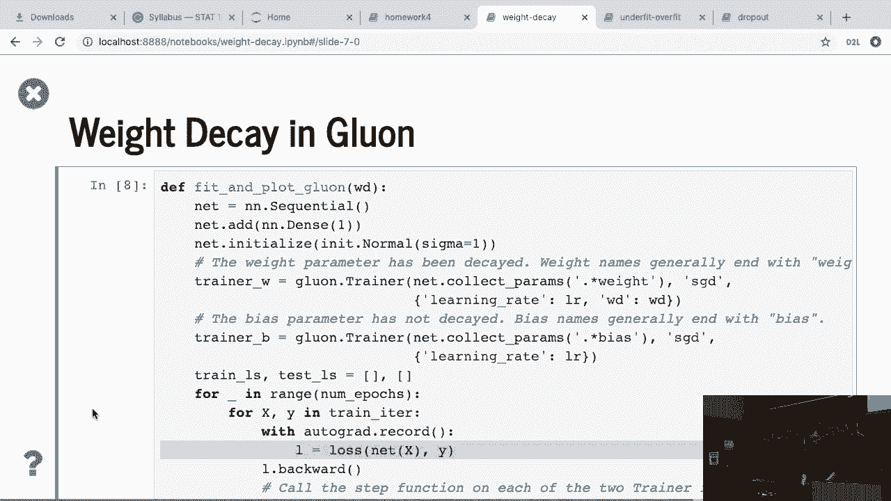

 see a big gap between test accuracy and training accuracy and then if you apply weight decay。

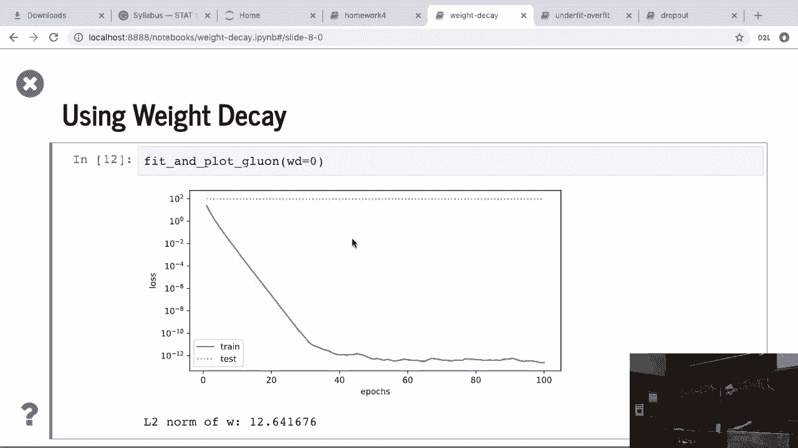

 equal to three you also see the test accuracy drops。 So also the L2 law of W decreases as， well。

 Any questions so far？ Good。

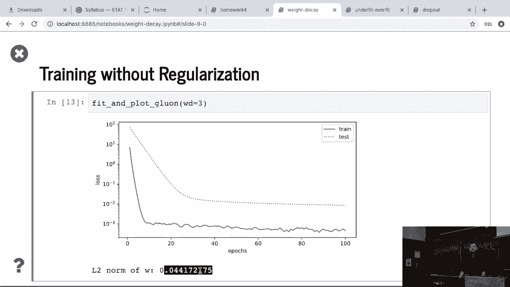