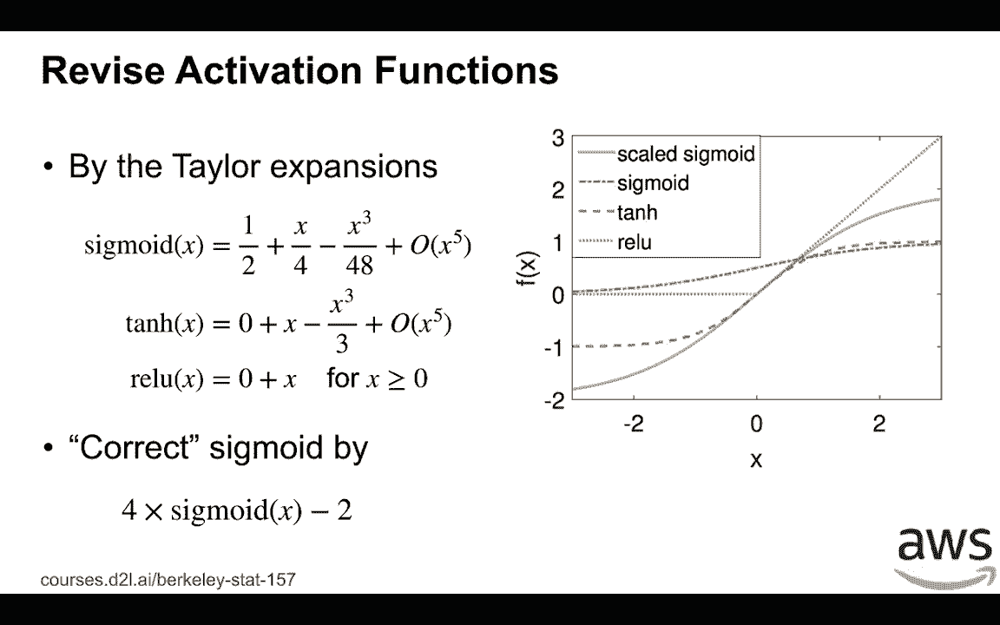

# 【AI 】伯克利深度学习Deep Learning UC Berkeley STAT-李沐 & Alex - P35：35. L8_3 Stabilize Training - Activations - Python小能 - BV1CB4y1U7P6

 So far， we only extend identity activation functions。

 We know that if we're going to use identity activation function。

 no matter how many layers we have is always equal to single layer。 So now let's consider real cases。

 That is the reactivish functions we are going to use in new networks。

 Let's start with a simple activation function， which is a linear function。 Given x。

 the sigma x is equal to alpha x plus beta。 If we denote by the h prime to be wt times ht minus 1。

 which is the input of this activation function， and then ht， the output of this layer。

 equals to apply sigma to h prime。 Now we can compute the variance and expectations of ht。

 We know that h prime have zero min， so then ht we have min equal to beta。 By assumption。

 we're going to have zero min， which means beta should be equal to zero。 Similarly， for the variance。

 we know that ht is a linear combination of h prime and h prime is already constant。

 by if we choose the proper with initialization methods。

 Then if beta is zero and we can do a bunch of other things here。

 we know that the variance of ht equals to the alpha squared times the variance of h prime。

 Because the variance of h prime is already constant， then alpha should be equal to 1。

 Which means if we， for the fourth pass， if we're going to have satisfied assumptions that we have before。

 then the linear function， the activation function should be adjusted at any function we have。

 Similarly， for the backward function， we know that by chain rule， the loss function of l。

 the gradient function of loss with respect to the ht minus 1， the input of this layer。

 equals to the alpha times the loss function with respect to the input of activation functions。

 And so then similarly， we know the expectation of it's already zero， then we get zero beta beta。

 and the variance is actually of the input is actually alpha squared of the variance of the loss of the gradient function with respect to the input of the activation function。

 Again， we have r for equal to 1。 So then we actually can only choose activation function。

 which is close to the independent function we have。

 Now let's consider the activation functions we actually used on deep learning。 So we have。

 we usually using sigmoid tangent or red， but how the expansions near zero， near x equal to zero。

 we know that it can approximate by a linear function here。 For example。

 for sigmoid is equal to 1 over 2 plus x over 4， and some high order function of x。 Similarly。

 in two tangent is actually equals to zero plus x， this is the identity function。

 and with some high order function of x。 For relu， if x larger than zero。

 then it's actually identity function。 So then we see that close to x equals to 1。

 both tangent and the relu are close to the identity functions we have。 If we choose x。

 the input is actually values nearby zero， which is actually the case because you know that the weight functions are randomly initialized around zero。

 and the input， the output function also have zero mean and small variance， which means。

 the activation function is actually close to linear function here， you can see the graph is here。

 Then for both tangent and the relu are fine， but the problem is the sigmoid。

 because it's not close to identity function。 What we can do， we can simply fix it by scale it。

 We use a four times sigmoid and the minus two， then it's close to identity function。

 So you can see from the right hand figure is that the blue line is a scale sigmoid。

 You can see that close to x equals to 1， the curve is almost identical to the tangent and the sigmoid。

 which is very different to the original sigmoid。 This is a green line here。

 [BLANK_AUDIO]。