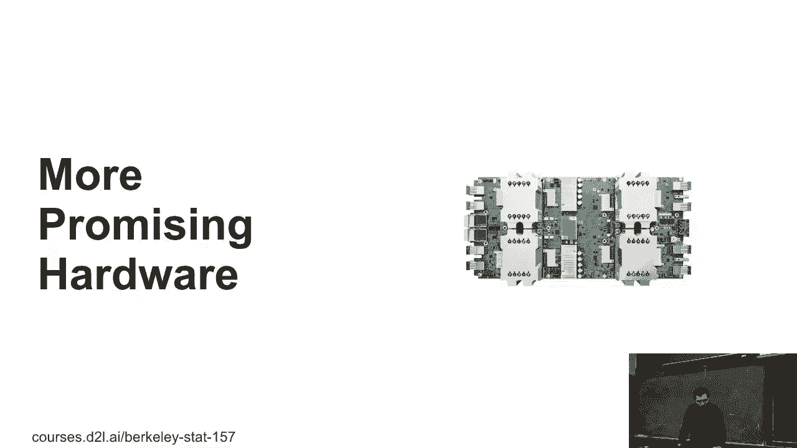
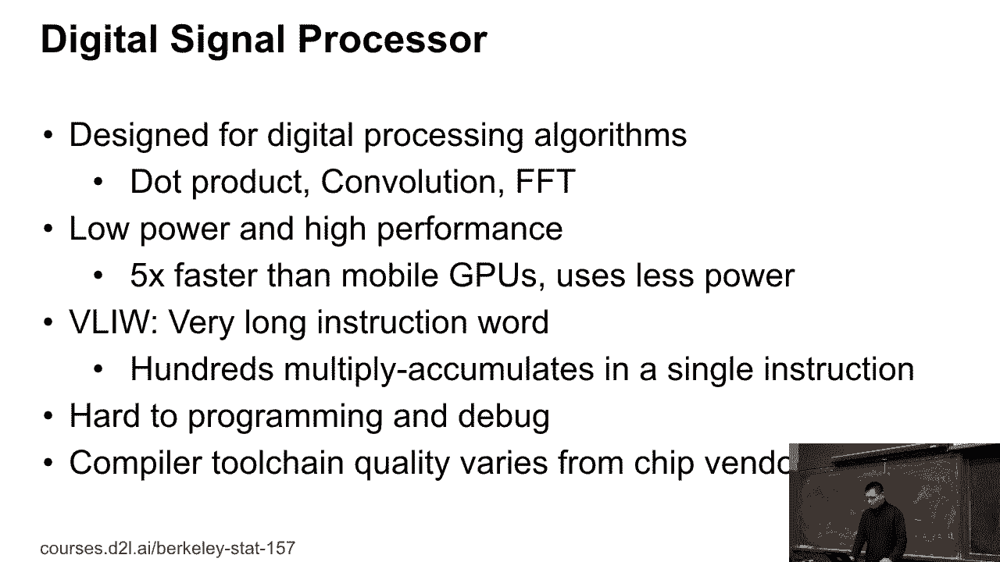
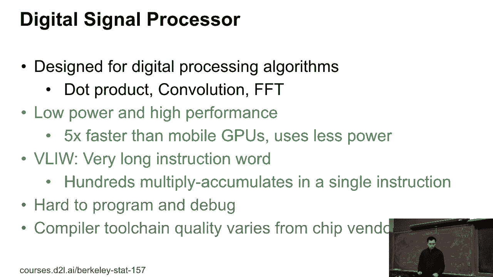
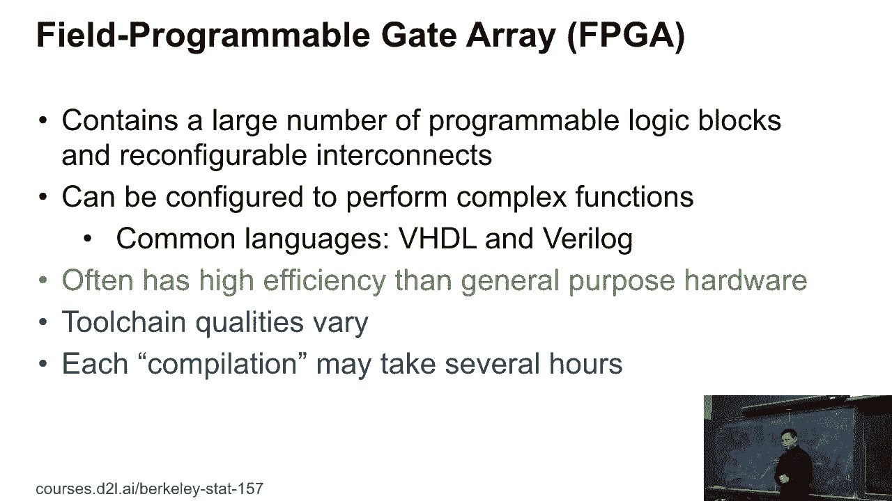
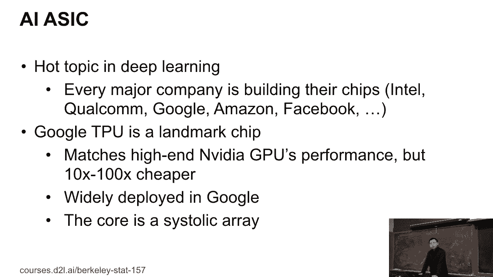
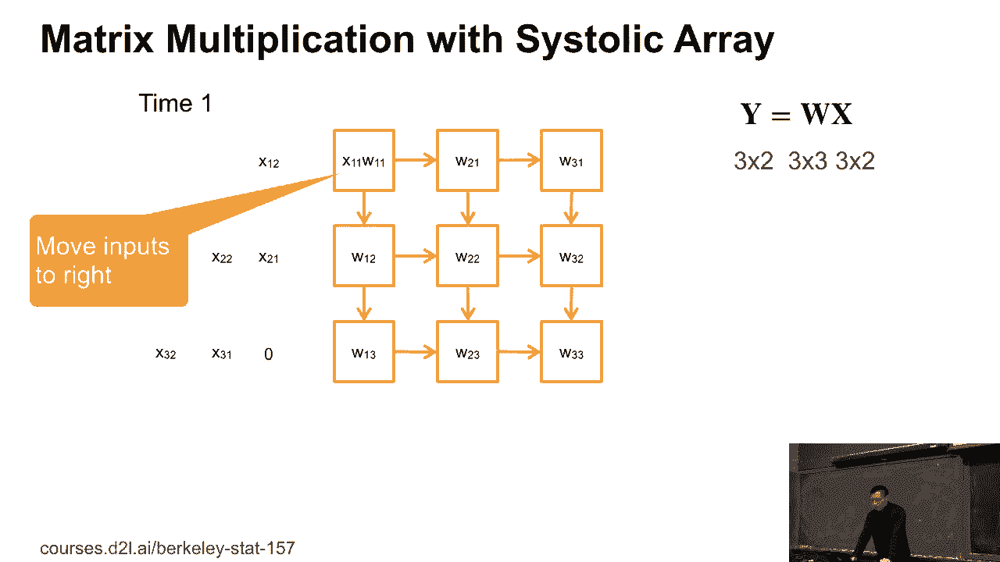
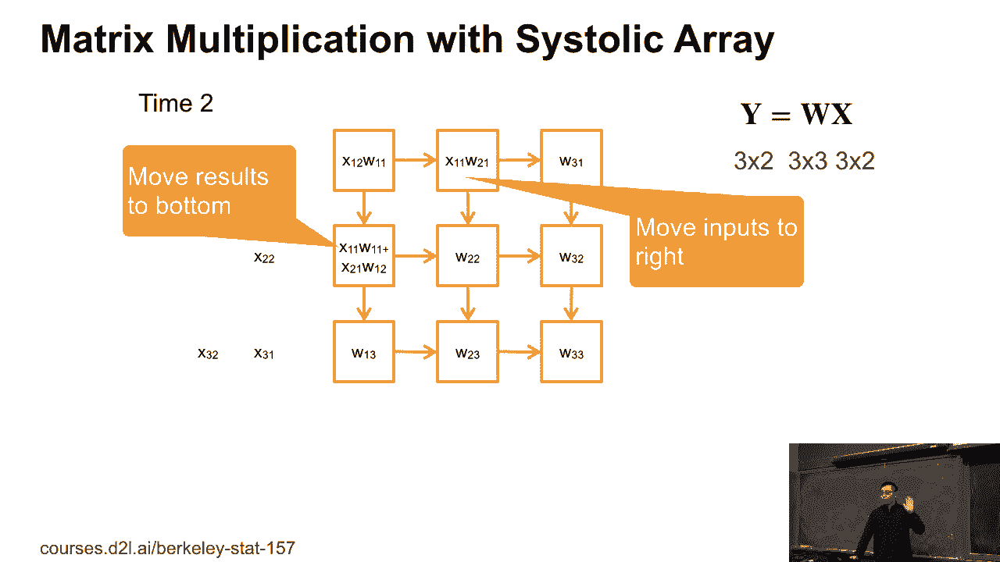
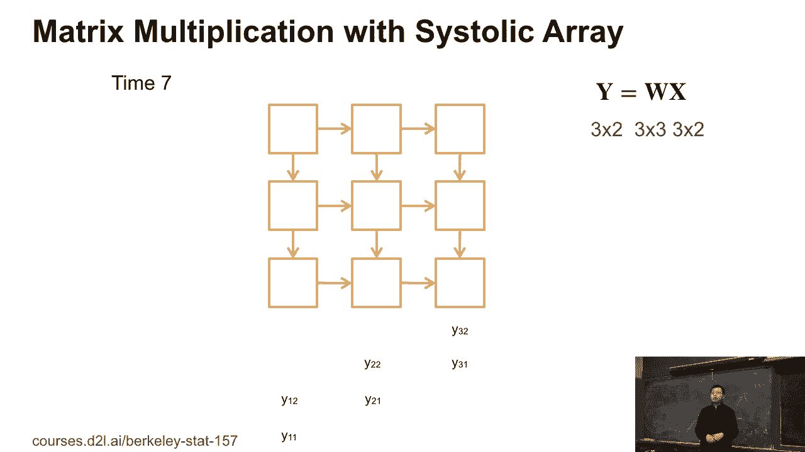
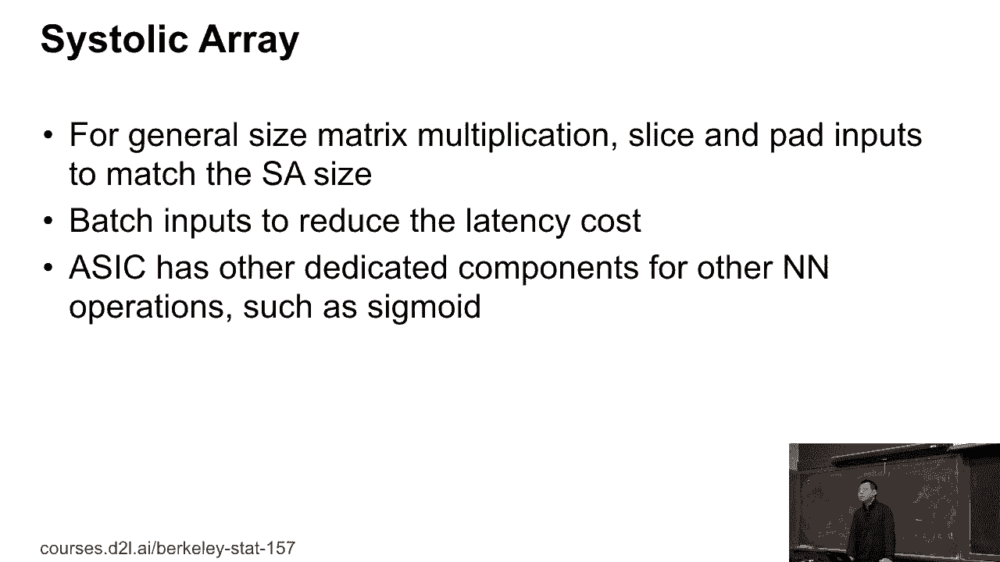
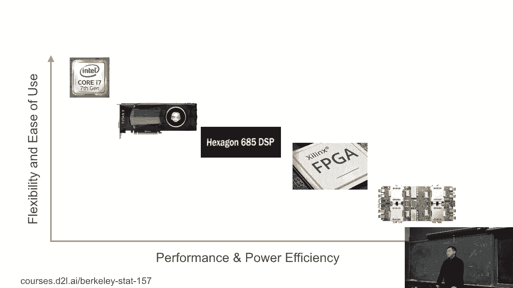

# 【AI 】伯克利深度学习Deep Learning UC Berkeley STAT-李沐 & Alex - P38：38. L8_6 Advanced Deep Learning Hardware - Python小能 - BV1CB4y1U7P6

 with more hardware。

 So we mentioned that there's more hardware， besides CPU and GPUs。 So for example。

 here's the Qualcomm SLAP Dragon 845。 So this is the chip you may be find on your Android phones。

 So you can look at the chip。 You have multiple components there。 So on the top right， this is a GPU。

 And close to the right button， this is a CPU。 Between the GPU and CPU， there's something called ISP。

 which is called Image Signal Processing。 On the left hand of the ISP， something called DSP。

 this is a digital signal processing。 You can see that both DSP and ISP take a lot of area。

 from the chip。 Actually， it's pretty powerful， and we can use for deep planning。 For example。

 the DSP called the digital signal processor， which is designed for digital process algorithms。

 For example， we can do very efficient matrix dot， convolutions， FFTs。

 The first two are pretty related to deep planning here。 And the design purpose of the DSP。

 is that sometimes it's much higher， accuracy performance。

 You should maybe five times more powerful than GPUs， more board GPUs。

 And the big one thing is that it uses less power， which。

 means if you run something on your mobile phones， you don't want to get more boards so hot。

 So you want to save the power， which， means if you run deep planning algorithms on DSPs instead。

 of a GPU and a CPU， and you can run much more， on the battery mode。

 The leap of the thing about the architecture， the architecture is called very long instruction words。

 On the CPU， for each instruction， you maybe can compute tens of floating multiplications。

 But on DSPs， for each instruction， you can compute the handjose of floating multiplications here。

 So that's a key thing actually have even low frequency， can per CPU。

 but DSPs may be much 10 times stronger than CPU。 But that's the advantage。 The disadvantage is that。

 well， DSPs leave a hard program， is to program and debug， especially the compiler tool， chain。

 actually the quality of various phone chip winners。 That's a disadvantage。

 OK， so the advantage is that DSPs usually， faster than GPUs and are more power efficient。

 And these are the one digits that DSPs pretty hard to program。

 If you are not familiar with all the DSPs， how to debug and how to progress so hard。 And also。

 depending on the chip winners。

 the tool chain quality varies。 Another one is called FPGA。 You may heard about that before。

 It's pretty different to DSP and normal program we have。

 So FPGA have a large number of programmable logic blocks。

 And we can reconfigure these different interactions， between these blocks。 So normally。

 on CPU and GPU， we write a program， and execute on that。 But FPGA is what it does。

 You write a program to describe what hardware it looks like。 During the compilation。

 you actually change FPGA， so that it can enumerate the hardware you can have。

 So each compilation here， it maybe take a few hours， or even a few days。 Then once you compile。

 then you get the new hardware。 You can run your program there。

 So you can use a chromium language called the VHDL， or Verilog to do that thing。

 You need to learn a lot of things for that。 The one that you hear sometimes FPGA。

 can provide high efficiency than general purpose hardware。 Because you can configure hardware only。

 designed for your application。 You can remove all these other things you don't need。

 So you can have higher efficiency。 But again， it's not so commonly used。

 The 2HM or so the quality of virus。 So sometimes you get very good compilers。

 you can compile very fast。 Sometimes it's pretty slow。 And also compilation takes so many hours。

 It's so hard to debug。

 The other one is called AI-6 or AIA chip。 You may have heard about that before。

 It's pretty hard topic on deep learning。 So every major companies， Intel， Qualcomm。

 does cheap renders or IT companies， Google， Facebook， and Amazon are building their own AI chips。

 Among them， Google TPU is the kind of the earliest one， and is the most successful one。

 So Google TPU can match high-end， immediate TPUs， performance， which means they can provide。

 100 TFLOPS floating point。 But the one thing here， if you buy a high-end， immediate TPUs。

 it takes you maybe $10，000。 But if you want to produce a TPU by yourself， it takes you maybe $500。

 That's 20 times difference。 So that's a major benefit。 So at Google， TPU is why they deployed。

 And people can research using TPUs。 And actually， most of Google researchers， if you read a paper。

 a lot of researchers， are based on TPU instead of TPUs。

 The core of the TPU is called systolic array。

 So we cannot have a very brief introduction， of what is systolic array and show。

 that why TPU is good for deep learning。 The systolic array is kind of-- you。

 have a array of processing elements。 It's called PE。 Every PE you can think of。

 You can think you can do to give it to floating point。 You can do multiplication。

 That's a simplified version。 Then the systolic array， which is-- we。

 align this PE into a 2D mesh and connect by rows and by columns。 And besides。

 we have input buffer and output buffer。 So you can see that's pretty simple。

 You can config the number of rows， number of columns。

 You can config the input and output buffer size。 Then this one is designed for matrix-mature multiplication。

 So let's show example here。

 We're going to compute y equals to w times x。 W is 3 by 3 matrix。 x is 3 by 2 matrix。 So y， again。

 we know y is 3 by 2。 So what are we going to do here？ Before we compute。

 we put each element of w into single PE。 So we align w here。

 We also align x by a particular shape in the input buffer。 So that is the data pairing stage。

 At time one， what do we do is we move the input buffer， to left by one step。 So you can see that x1。

 x1， 1 is now on the left top PE。 So given the input， the PE deals multiplications。

 between the weight w1 and the input x1。 Because the other two rows are just the zeros。

 nothing happened。 Now， time two。

 Time two， we do two things。 Firstly， we further move the input to left by another step。

 So you can see that x1， 1 is now at the second column。 And the first column is x1， 2。

 And the second row is x2， x2， 1。 So we move the input to left by another step。

 The second thing we are doing here， we move the result from the PE to the bottom。

 So you can see that x1， 1 times xw1， 1。 This is the top left PE results we have in the previous time。

 Now we move to the bottom。 So two things。 One， two， left， and one， two， bottom。

 Input to left， result to bottom。 Time two， similar thing。

 We further move input to not to left again。 So x1， 1 is now at the third column。 And the result， x1。

 1 times w1， 1 that we get on the time one， is along the third row。 Similarly。

 we also move other results， to left and to bottom as well。

 We continue to do that。 Now we have to left the bottom PE output these results。

 It's actually equal to 1， 1。 Or y1， 1。 So if we do that again， we get another result， y1， 2， y2， 1。

 And again， again， now at time seven， we actually get all this result of y。

 So here is example how we first put the weight into PEs， and given different input。

 we can compute a y。 So that is how systoptical ray works。 So assume that usually on deep learning。

 the w is the weight matrix， or the convolution kernel， we're going to introduce the next week。

 Then we put different x and we can compute usually the x。

 the number of rows of x is kind of the number of examples。

 you have is could be very long than the efficiency。

 of systoptical rays pretty high usually。 In general， if we want to do general size matrix。

 multiplications， depend on the ray size， we just patting zeros and slice matrix into the fixed size。

 and put the data into systoptical ray accordingly。

 And we can-- because now we see that three by three matrix， we have latency equals to seven。

 which means if you have a lot of inputs and we can batch in， then we can reduce the latency。

 So systoptical ray actually have very good throughput。

 Now this only for matrix matrix multiplications， if you want to do other things like sigmoid。

 you want to have dedicated chips to do that as well。 Question。

 There are also benefits for using systoptical rays， for sparse looking algebra？ Not too much。

 unfortunately。 If you do sparse--， so there's a bunch of AI-6 to sparse things。 For sparse。

 usually people don't care about performance too， much， they care about power。

 If I know this input is zero， I don't want to fetch the data， I can skip the computation。

 which is saves a lot of power。 Currently， we don't have the hardware。

 don't have these functionalities。 And sparse computation chips usually。

 almost a similar performance as dense ones， but it can reduce maybe by 10 times， in power。

 which is pretty popular for like h devices。 OK， another question？ Other questions？

 So it's a very brief introduction of all the hardware。

 you have。 So we can classify then into x-axis is the performance。

 and the power efficiency to the left that we have most， of power and to the right we have to left。

 that we have the slow one。 And the y-axis is the flexibility， how to use it to program。

 how to debug， and how to deploy。 We can see that CPU is the easiest one to use。

 So nomad is Intel CPUs， MD CPUs， ARM CPUs， almost likely we can write the same compiler。

 to compile on that。 Every program runs similarly on GPUs。 GPU is faster than CPU。

 but it will be harder to program。 You need to run CUDA for a media GPU。 And for MD and Intel GPUs。

 much harder， is you need to use OpenCL。 Then DSP is usually only for mobile phones。

 for small devices， for ACOL， for example， small homes。

 DSP can have higher efficiency than mobile GPUs， but still lower than the video desktop GPUs。

 But against even harder to program， FPGAs， you need to know exactly what our sister architecture we。

 have。 You need to know about hardware a lot。 ACK， ACK kind of we put here is still on the early stage。

 It's dedicated to put some algorithms， not all of them。 And you need to know something's wrong。

 then you need to really know what happens there。 But again。

 we think maybe in the coming one to year， there's a lot of ACK coming in。 Nomad is on the cloud。

 nomad is on the mobile phones。 We cannot see a lot of ACK coming in the next one to year。

 So if you're going to do research on deep running sister， architecture or any radio field， you。

 may be considered to do understand ACK。 If you want to go to industrial to deploy deep brain models。

 into hardware， you may be considering， yes DSPs， FPGA probably not， and also ACK as well。

 OK。