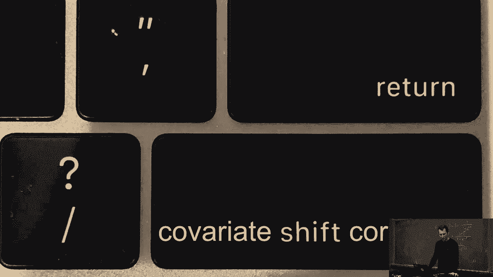
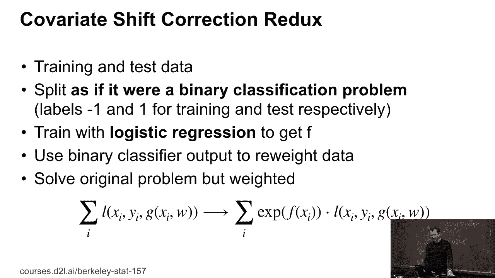

# 【AI 】伯克利深度学习Deep Learning UC Berkeley STAT-李沐 & Alex - P43：43. L9_5 Covariate Shift Correction - Python小能 - BV1CB4y1U7P6

 So now let's talk about covariative correction。

 So let's get back to what we have before。 Remember we had this propensity scoring。

 and if I just had this function DQDP， so the ratio of the two densities， this function alpha。

 then we'd be in really good shape。 And I can use a lot of。

 really fancy statistical techniques for it， where I can just make my life real simple。

 and use tools that I've already built beforehand。 And as a matter of fact， as part of your homework。

 you'll be implementing a logistic regression problem， and you'll be using it both for。

 covariative correction and then afterwards also for solving。

 the actual classification problem at hand。 So let's pick a classifier。 What I'm going to do is I'm。

 and let's assume that my training and， test this data are of the same size。 And I'm just picking。

 you know， training set with， you know， weight one half， and the test set with weight one half。

 Just giving the training set class level one， the test set class level minus one。 Okay。

 Nothing particular has happened here。 I've just thrown all the data together。

 And now my goal is going to be to see， can I distinguish training from test set？

 The intuition is that if I cannot distinguish it， then well。

 actually those two data sets are probably drawn from， the same distribution。

 so this is a two sample test， if you will。 And if I can distinguish it。

 or at least with some probability， then this might tell me how likely a particular observation is to。

 come from one or the other， and I can use it to weigh things。

 So that trick of using a classifier is what people use quite a bit also in。

 generative adversarial networks， so in GANs。 So there they use a two sample test to then invoke an entire machinery to generate。

 fake data that looks like the real thing。 Here we are just going to use it to find out how I would have to。

 re-weight one dataset to make it look like the other thing。 So if you will， this is also a GAN。

 just that it's not generating data， it's just re-weighting it。 Okay。

 And so now comes something really， really elegant。

 So let's look at the conditional class probability。 So the conditional class probability。

 P of y equals one。 So remember we've taken equal mix between P and Q， it's just P over P plus Q。

 And so therefore if I look at alpha， which is the ratio between Q and P。

 then all I need to do is I just need to look at the ratio of the corresponding。

 conditional class probabilities。 So you take the condition class probability for minus one and the one for。

 one， take the ratio。 And it actually turns out if you go through the algebra and we can do that here。

 I get that e to the f of x is exactly what I get。 So let's work that out， right？

 So let me to erase some things。 [BLANK_AUDIO]， So we had one over one plus e to the minus f。

 You want it by one plus e to the minus f。 And here we have e to the minus f， right？

 And so this cancels out。 And of course this term here just becomes e to the f。

 which is the equation in yellow。 So now what this means is that rather than taking a very complicated detour。

 over a density estimation and everything， I can just invoke any of the shelf classifier。

 as long as it gives me conditional class probabilities。

 something that will give me a covariative corrector。 So in sum， what I then do is I take。

 once I have those weights， I take the training data， I train this binary classifier。

 And then now I have my weighted data so， I can wave by e to the f of xi。

 And I now use this to weigh my training data to solve the problem I really should have done。

 There are a couple of things that could possibly go wrong。

 Can somebody tell me something that looks a little bit off in the last equation？ Okay。

 is everybody cool with exponentiating some function？ Those numbers could be huge， right？

 So this is where things can go badly wrong， that f of x could be really large or also really small。

 If it's really large， it just means that it gives that particular observation a ridiculously high weight。

 If it's really small， it means we'll throw the starter point out。

 And it may be a little bit too rash in both cases。

 So one way to fix this is for instance you just take the function f and you clip it。

 And you say well look， if it's anything above some threshold c or below some threshold， minus c。

 I'm going to use those thresholds in the of the function that would have estimated。

 And this limits the influence of individual observations to something that's fairly palatable。

 But it all and it also can ensure that you're never throwing data out entirely because it could still be useful。

 This of course introduces a little bit of bias， but it can drastically reduce the variance。 Okay。

 any questions？ Yes？ >> Why are you waiting for the exponential to measure this？ >> Oh， okay。

 So remember we did this thing here， right？ So we had this function alpha。 And so if I-。

 >> Alpha is the exponential。 >> So that alpha is exactly， yeah， that's correct。

 So let me write that out again。 So basically if I draw from p。

 then I would have to go and compute alpha of xi， l of xi， yi， f of xi， right？

 I would have to compute something like this。 Some loss， right？ That's basically。

 so without the alpha's， some of i going from 1 to m， that's what you would be minimizing。 Now。

 if I have covariate shift， I need to overweight the observations that look like。

 what I would really care about in the test set and， underweight the ones that I care about less。

 Now this alpha of xi， okay， actually let me rename this thing here because of course。

 otherwise we have fs and gs clashing。 This， remember， is the thing that we estimated with。

 covariate shift is e to the f of xi。 What you would typically do is you would use something like a clip of this。

 which basically takes whatever function you have here and。

 it clips it from at least above to some value and from below to some value。

 This way you don't throw a data and you also don't overweight it。

 Because of course this function f is just again an estimate。

 So you really shouldn't trust it that much， right？ It might be wrong。 And in that case。

 it would introduce a lot of variance here， which would give us a bad estimate there。 Okay。

 there are a lot fancier ways how you can deal with this， something called W-Robos estimation。

 Let me just quickly write it out。 [SOUND]， So do a Google search on W-Robos's converative correction and。

 you'll find a whole bunch of algorithms for that。 Overall W-Robos estimators。

 So usually a very nice combination of statistical techniques where you correct。

 the bias in two independent ways and if even just one of the two succeeds， you're in luck。 Okay。

 So that's convergent shift。

