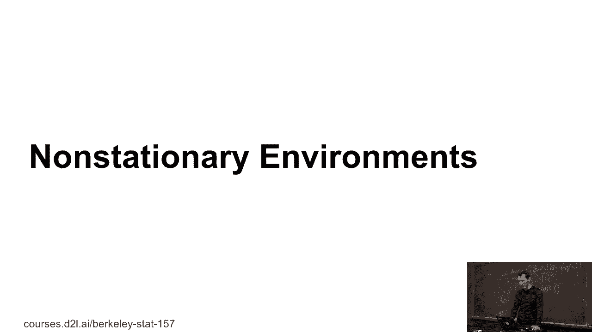
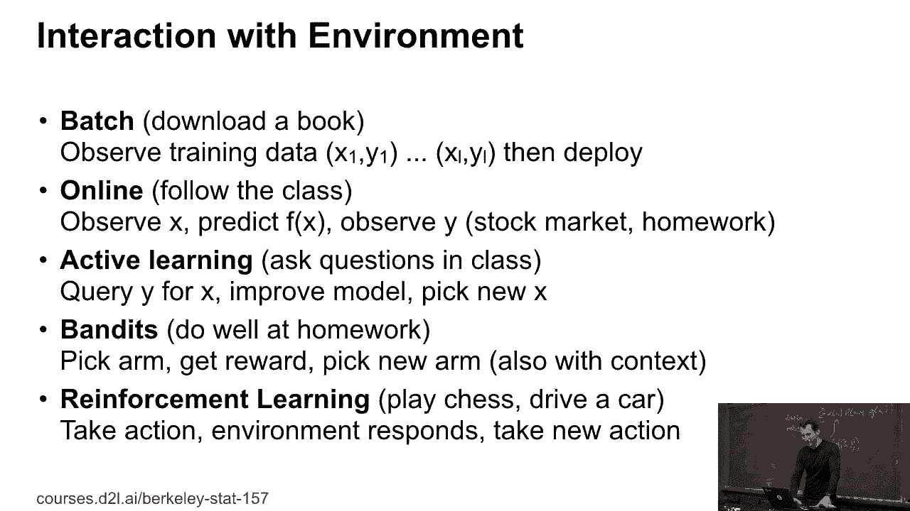
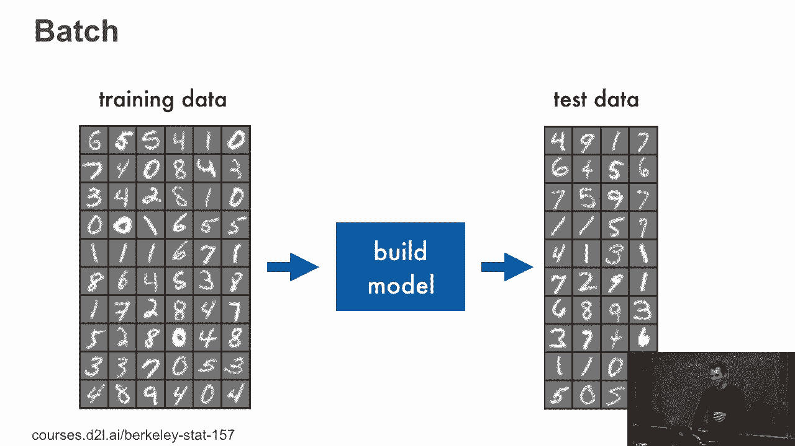
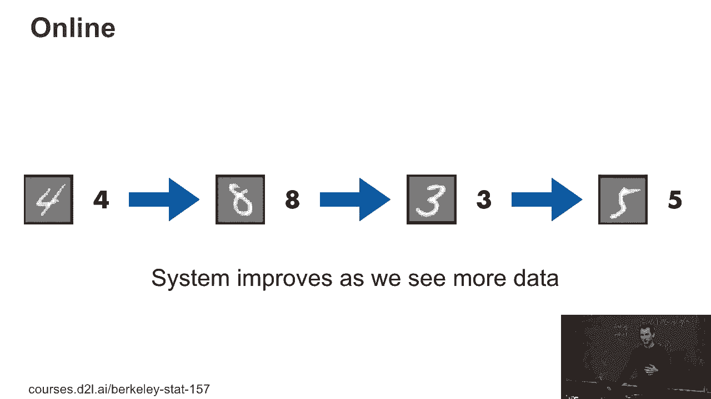
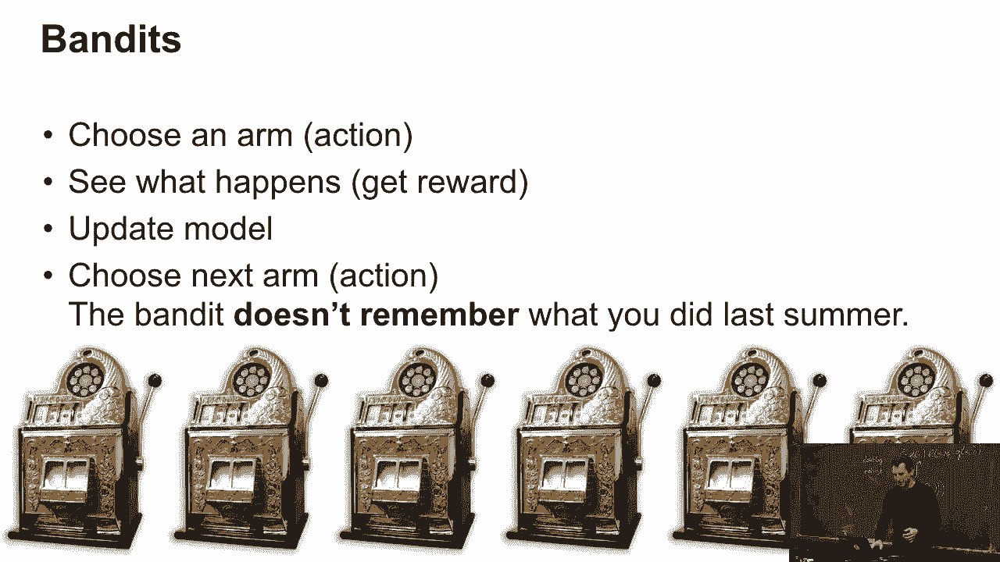
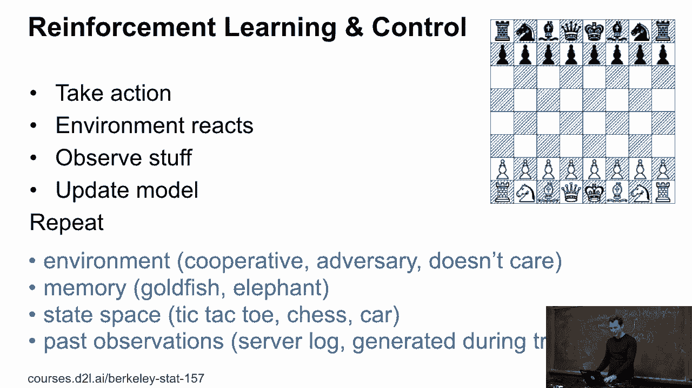
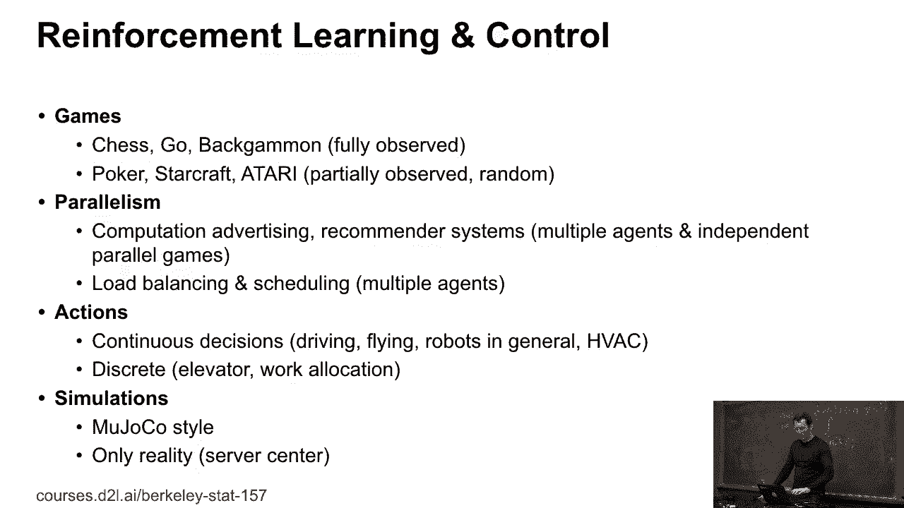
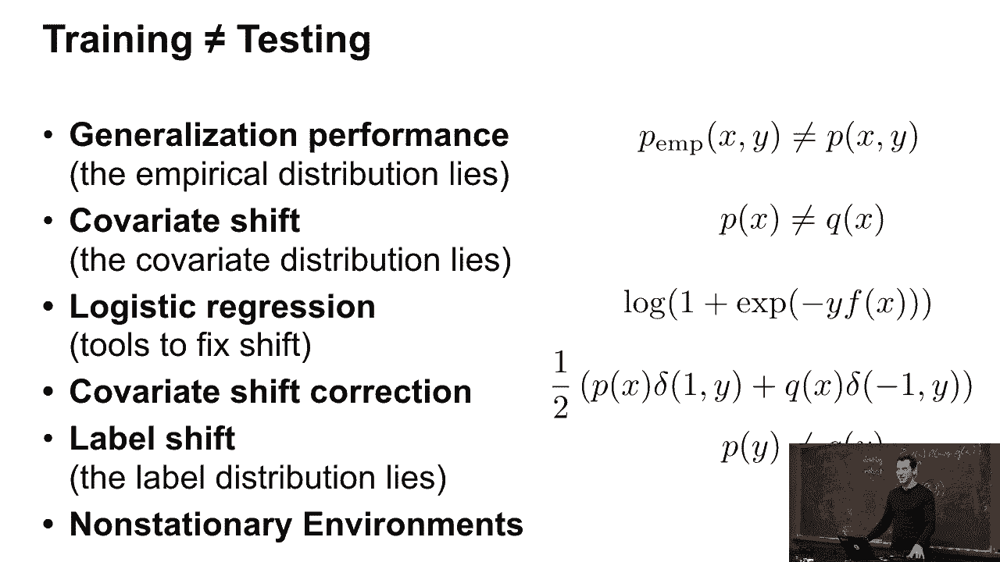

# P46：46. L9_8 Nonstationary Environment - Python小能 - BV1CB4y1U7P6

 So last part， nonstational environments。 So when you're deploying a machine learning system。

 there are different ways how you can interact with environment。 For instance。

 you could just have a batch of data。 This is what we've done pretty much so far throughout。

 And we train on that batch of data and we produce a classifier。

 and then we submit it to great scope or in notebook or whatever， and say， "Hey。

 here's my classifier。"， Okay。 You might be in a situation where you have some data。

 you predict a label， you actually observe the label， you update your classifying。

 you keep on doing this and keep on going。 For instance， if you want to predict on the stock market。

 it's really new interest to update your model every day that you， see new data。 Or for instance。

 with the homework， my hope is that as you， you know， see a new assignment and you do the homework。

 your mathematical model of what machine learning is will continue， to grow and expand。

 And so you will become smarter in the beta machine learner。 Now there's also active learning。

 In this case， it's like， you know， you can ask queries。

 And there are different flavors where you can ask queries only for。

 given images or you can generate images and ask queries for those。

 So the equivalent of that is if you ask questions in class and， quite unsurprisingly。

 if you do that， at least in machine learning， your algorithm converges significantly faster and I can。

 assure you if you ask questions here， your mathematical model of。

 what machine learning does will also converge much faster。 So asking questions is good。

 Then there's， you know， banded algorithms。 So you pick an arm， you get a reward。

 you pick in your arm， you may have some context。 Then lastly， reinforcement learning。

 And this is actually the most complex of all of those because in， this case。

 your actions have consequences。 So let's look at that in a bit more detail。

 So in the batch setting， while you have some training data。

 you can build a model and you have some test data and you deploy it。

 Stand up。 Online， well， maybe I see a four， I have taken my model， I see an eight。

 I predict an eight， I have taken my model， CS3， maybe I predict an eight， again。

 but it's actually a three， I have taken my model。 Yeah， keep on doing this。

 This is actually the scenario that's much more common for any， meaningful， large。

 real world problem that's being deployed。 For instance， if you're running an ad service。

 you should be using， online updates because if not， you're losing some money。

 Bandits， well， you have some degree of exploration there， right？ You can pull an arm。

 you see what happens， and then you update the， model and okay。

 these are six one arm bandits and they are the old。

 fashioned bandits before computers were introduced。 So by now， if you go to Zwegas。

 don't assume that the returns in， different bandits are in any way under your control， right？

 But in the old style， maybe there were some mechanical tolerances and。

 maybe one was a bit more worn out than the other。 So it was actually new interest to figure out which bandit to play。

 The good thing is the bandit doesn't actually remember what you did， previously， right？

 So you just want to find the best arm。 There are efficient algorithms for that。

 And then there are stateful systems。 So if I have a stateful system。

 then depending on what they do to， that stateful system， right， like this Rhino。

 it may be happy or less， happy about me and I may or may not survive。 On the other hand。

 if I remove the memory from that stateful system， right， so if I tranquilize that Rhino。

 I can poke it and do whatever， and it will not be upset at me in the next moment。

 So what it really means is reinforcement learning and control。 So I take an action。

 the environment reacts and I observe stuff， I update my model。

 and then there are lots of different flavors of what I could do。

 so I could have an environment that's actually cooperative。

 Could have an environment that's adversarial， like if I play chess with you。

 What I have in many cases， an environment that doesn't care。 So for instance。

 if I try to control a server center and I try to control the HVAC。

 the HVAC isn't out to get me and be particularly evil to me。

 nor is the HVAC system trying to help me。 It just doesn't care about it。

 it will just respond to things that I'm doing， but it's not going to have any particular opinion about my success or failure。

 I may have very short memory， I may have very long memories， right。

 My state space may be very simple or ridiculously complicated， like in a car。

 And then I may or may not have access to a lot of past observations。 For instance。

 I might have the goal of improving maybe a database system。

 and I have server logs from the past five years。 Maybe they were obtained before even thinking about deploying reinforcement learning。

 but I still want to be able to use this。 In this case， I have a lot of data。

 but then it may have to do a lot of clever things。

 with off-policy and on-policy reinforcement learning to deal with it。

 And then the other things like how parallel is my system， what kind of actions can I execute， right。

 So I might be able to have discrete actions like I move this chess piece over there。

 or I press the elevator or don't or I send the elevator somewhere。

 We might have continuous actions like in Ujoko， right。

 So you've probably seen those mostly out of deep mind， you know。

 flopping stick figures that walk around in some virtual environment。

 That's Ujoko and they then usually differ with the degree of elegance with which they move。

 But then you may have also the much more commercially vital things where you have reality。

 So for instance， in， you know， Ujoko's simulation。

 nobody cares if stickman falls over and breaks a leg。 I reboot。

 If I run this in a server center and I fry a rack of servers， that's the end of my simulation。

 right。 I get fired probably。 But at least that's the end of the experiment。

 So all those things really matter。 Once you go to slightly more complex machine learning settings。

 this is really just scratching the surface and this is to give you a bit of an idea。

 of all the things that you will have to worry about once you start deploying some of those things in reality。

 Be it in your research or if you do an internship or， you know， do a job or whatever。

 you will care about this。 And with that， well， I'm concluding for today。

 So I hope that I convinced you that training and testing are quite different beasts。

 that they are stateful environments， that there are a whole bunch of tools that I can use to mitigate this。

 but it's not quite fixable。 And that， yeah， I mean。

 if you do this and then somebody tries to construe unpleasant cases， then yeah， okay， fine。

 you can find them because there's a mathematical basis for why that can always happen。 Okay。

 so with that， thanks a lot for today。 See you on Thursday。

