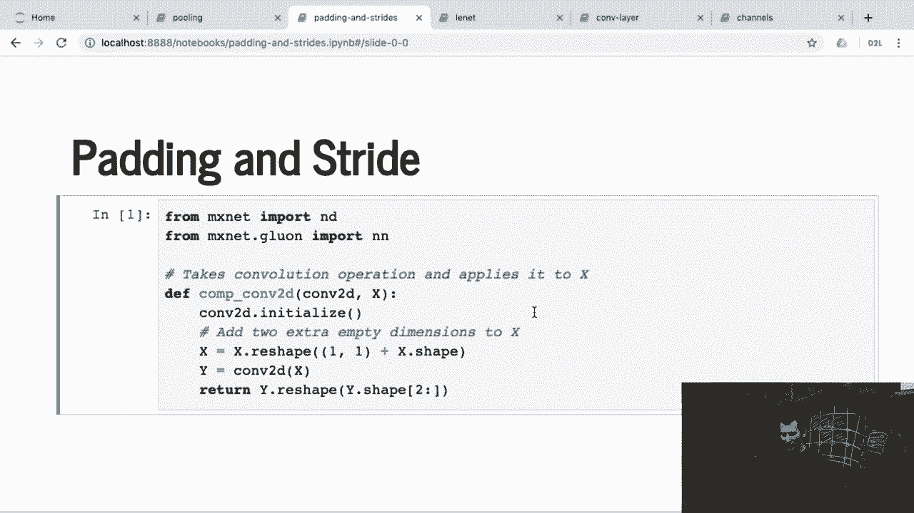
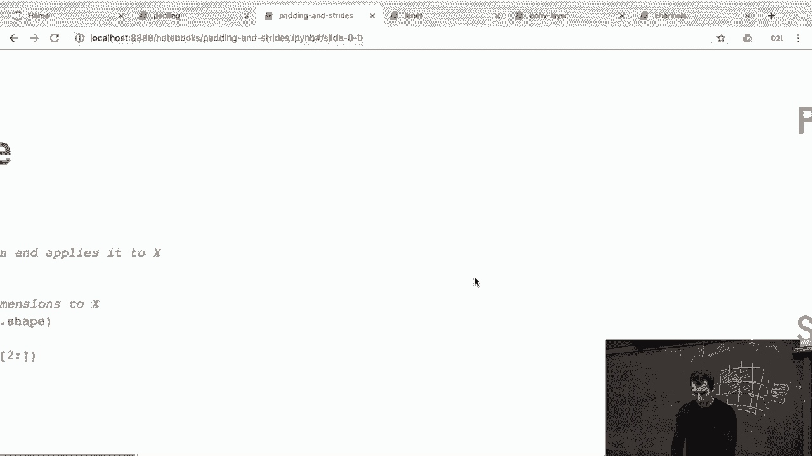
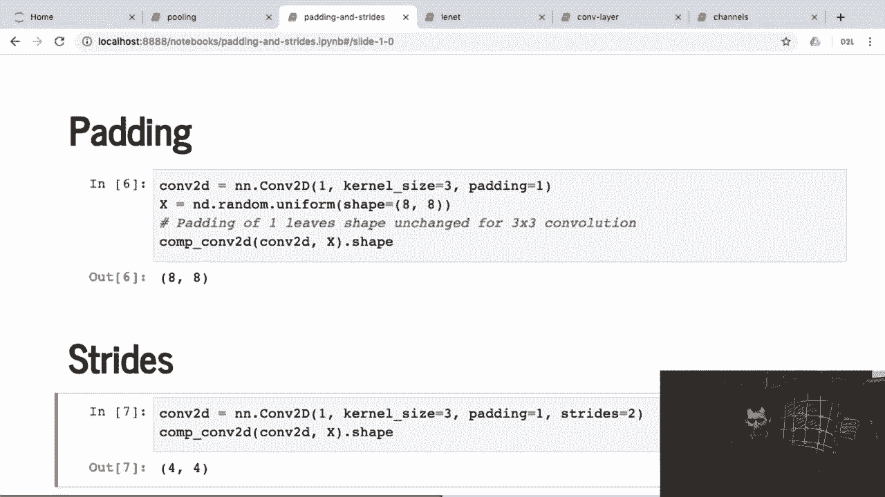
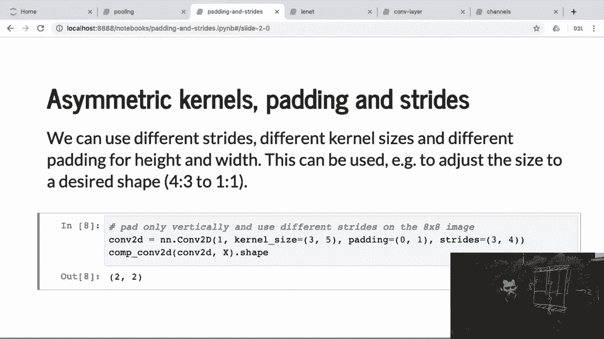

# 【AI 】伯克利深度学习Deep Learning UC Berkeley STAT-李沐 & Alex - P56：56. L11_5 Padding and Stride in Python - Python小能 - BV1CB4y1U7P6

 Okay。 So， what we're doing here is we're just implementing a very simple thing， namely。

 it just goes and， applies convolution to some data。

 That's a useful operation that we might need later for a couple of other cases， but。

 right now all it does is it just does a little bit of accounting reshaping and so on to make things work。

 and then it just， invokes those convolutions。 Okay。 Let me go back to this and execute it。 So， if I。

 you know， go and， you know。

 convolve something with， you know， kernel of size 3 by 3 and have a padding of 1。

 and the input was 8 by 8， then the output， lo and behold is also 8 by 8。

 Remember that was exactly the trick that I mentioned before。 Or， for instance， if I have， you know。

 a convolutional kernel of size 3， padding of 1 and stride of 2。

 so this way I'm skipping every second entry， then rather than 8 by 8。

 since I'm skipping every second entry rolling， column-wise， I get 4 by 4。 So。

 that's very unsurprising。 Now， if I have something that's asymmetric， let's say I have a。

 kernel size of 3 and 5， let's do the math。 We can just quickly verify what's going on。 So。

 here we have our 8 by 8 matrix， right， that's x。 We have a kernel of size 3 by 5。 So。

 that's our kernel。 Okay， so now， if I， and on top of that， I'm not padding on the rows。

 but I'm padding on the columns。 So， we have one extra here and one extra here。

 And we have strides of 3 and 4。 Okay， let's do the horizontal first。 So， we have size 3。 So。

 we really have 6 positions， right？ But we're jumping 3 at a time。 So， then， well， I don't。

 I only really have space to squeeze in two of those filters， right？

 It's not enough space for the third one， because it's only 8 pixels wide。 So。

 I have pixels 1 up to 3 here。 I have pixels 4 up to 6 there， with a composition， and then there。

 I'm out of space。 So， I only have two dimensions in this direction here。 Now， for the vertical part。

 remember we have a height of 5。 We have a total of 10 pixels。 So， 2 would fit in。 That's good。

 If I shift it entirely， since I'm not going to shift it entirely， but just by a step of 4。 So。

 we have 5 pixels for the first one。 Then we shift by 4。 So， we're now at pixel number 9。

 Then I would shift by 4 again。 So， 8 plus 5， right？ That's 13。 And 13 is out of range。 So。

 I get 2 horizontally and 2 vertically。 Okay。 If you're lucky。

 this is the only time in your life that you'll have to go over that。 Maybe in the homework， but， um。

 it's good to understand this once， and then for the rest， let your code take care of it。

 Any questions？ Yes？ Why do you hide？ Not the correct。 Because I probably got it wrong。

 But it doesn't really matter because it's just first dimension versus second dimension。

 It just took the first dimension as the width and the second as the height。

 but you could do it the other way around。 That's true。 In the slide， I had height times width。 Yeah。

 I'm just drawing width times height because， yeah， I mixed that up。 Good catch。 Any other questions？

 Okay。 Good。

