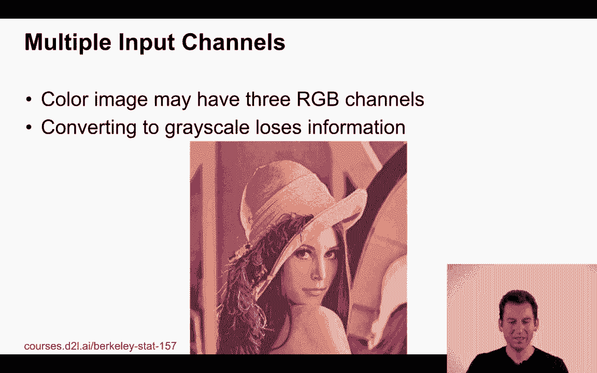
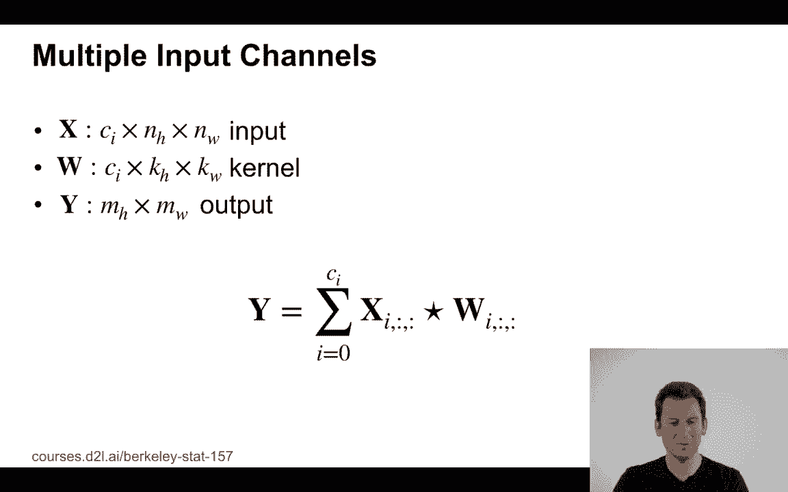
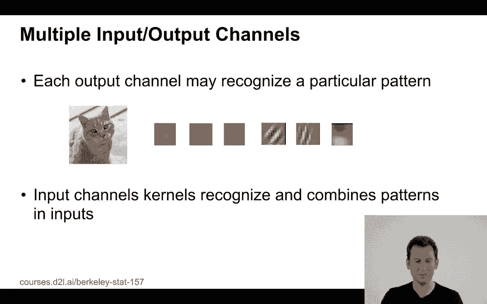
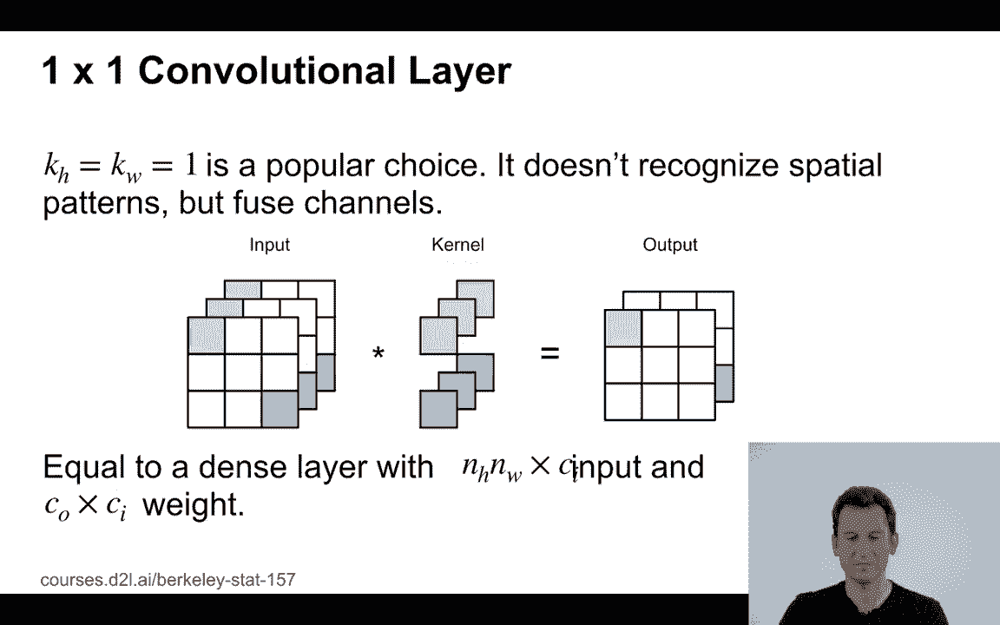
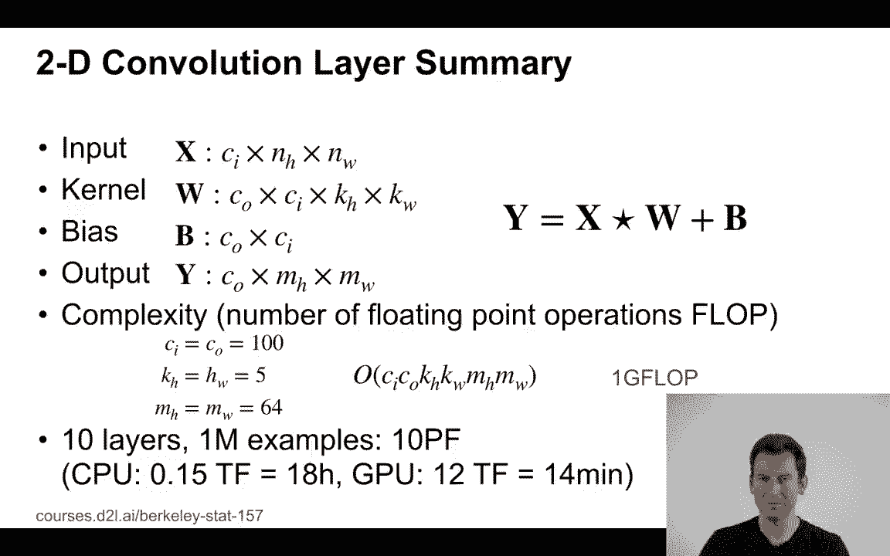

# P57：57. L11_6 Channels - Python小能 - BV1CB4y1U7P6

 Let's talk about channels in convolutional neural networks。

 So far we looked at mostly grayscale images which had just a different level of intensity， for。

 you know， very bright to very dark images。 For instance in fashion MNIST we had values between 0 and 255 to indicate how bright the。

 pixel was。 But if we look at this picture of this woman here， then it's very clear that grayscale。

 isn't quite going to do it justice。 Just a small side note。

 it's a picture of a very famous woman called Lena。

 And it's actually taken from Playboy magazine from， I think， 1971 and '72。 And mind you。

 this is the safe for work crop of that image。 The reason why it got very popular among image processing researchers is because the image。

 has a lot of really interesting and challenging details in there。 So there's a smooth skin。

 there's a lot of texture in the feather hanging off her hat。

 there's a lot of texture in her hat itself， there's background blur， there are sharp edges。

 namely the contour between the hat and the background。

 There's some degree of bokeh here and other things。

 So if you want to do really well in terms of image processing on that image， you have。

 to invest a significant amount of work。 This is why this is actually one of the more popular pictures。

 That's it。

 Let's look at the image in a bit more detail。 So this is the same image but now split into red。

 green and blue。 You can see that there's different types of information in those three channels。

 If we were to treat the image just as grayscale， we would lose a lot of information。

 But if we have a convolutional neural network， well， we need to have a way how to deal with， it。

 Turns out this is very simple。 Recall what we did when we had a single channel input。

 Well we just take our convolutional kernel， we applied it to that channel and we got some， output。

 Now if we have two or three or more channels， it's very easy。 We just apply a convolutional filter。

 most likely a different one， to every one of those， channels。

 in the end we just pair together the outputs， we add them up and we have a final， output。

 So what happened here in this picture is we have two channels， we take two kernels， we。

 apply them and we add it up and so we get this output and for instance in the upper left。

 by convolving a 3 by 3 with a 2 by 2 kernel， we get the number 56。

 So here's the math for it。 I now have x which is now of ci times nh times nw dimensions。

 So input channels times height times weight， I have the same thing for the kernel which。

 now depends also on the input channels and I get mh times mw output so I still get only。

 a 2 dimensional output because everything's padded together。

 This is how you deal with multiple input channels。 Of course you could now ask。

 well maybe a single input output channel isn't quite good。

 enough。 You might have multiple output channels for different features。 And that's very easy。 Well。

 you just take one convolutional filter for every output channel that I want to have。

 and then you stack up the results so you don't add them to get each stack them up。 In this case。

 well， if input channels have now a kernel that depends on output and input， dimensions。

 basically number of channels and the dimensions namely in terms of height and。

 width of the kernel itself applied。 Okay， so that's what you get and so you get input dimensions and you get output dimensions。

 fairly straightforward。

 Now why would you want to have this？ Well because every output channel may actually recognize a different particular pattern。

 For instance you might have for example filters， you might have vertical edge detectors， diagonal。

 ones， filters that detect circular parts， filters that detect greater green or blue things。

 or maybe some combinations thereof。 So that's why you need more than one。

 And of course this is then fed as an input signal into the next layer where you can maybe。

 do another fancy processing but this is basically how you can organize a meaningful convolutional。

 network。

 Now there's one very special anomaly， namely one by one convolutional layers。

 So one by one layers actually sounds kind of weird， right？

 What's a one by one convolution after all because I'm not convolving that pixel with， anything else。

 It's just that pixel and it stays that pixel as we go through that pipeline。

 However what happens is that it takes a linear combination of all the input channel weights。

 and performs matrix vector multiplication then followed by some nonlinearity and then。

 I get an output。 In other words this is a multi-layer perceptron which takes a certain set of input weights。

 and to generate the corresponding output weights。 So this is therefore equivalent to a dense network applied pixel-wise。

 So to sum everything up our two dimensional convolutional layer summary we have input， channels。

 we have kernels that depend on inputs and outputs and we have a bias which of course。

 depends on input and output channels and then we have some outputs which are output channels。

 times height times width。 So why would this matter？

 Well because if you actually think care about computing this efficiently the cost now scales。

 linearly with a number of input channels because they need to process them。

 Linearly with a number of output channels because these are the ones that I need to generate。

 the kernel height and width because that's the number of floating point operations that。

 I perform and then times the output height and output width。

 Okay so let's put some numbers behind that。 Suppose I have 100 input and 100 output channels that's not unusual。

 Suppose I have a 5x5 convolution that's also not so unusual and let's say I have maybe。

 64x64 pixel images。 So that all up if you work out the math gets you to about a gigaflop。

 Now one gigaflop doesn't sound like a lot but if I have 10 layers of such a convolutional。

 network if I have maybe a million observations that's 10 petaflops。

 So on a CPU that might perform at around 150 gigaflops that takes 18 hours whereas in。

 a GPU that performs maybe 12 teraflops so that's a modern GPU for less than $500 you。

 can get the same work done in 14 minutes。 So now we have hours versus minutes and that's one of the reasons why people nowadays use。

 GPUs if they want to run convolutional networks and similar structures on large amounts of， data。

 [BLANK_AUDIO]。

