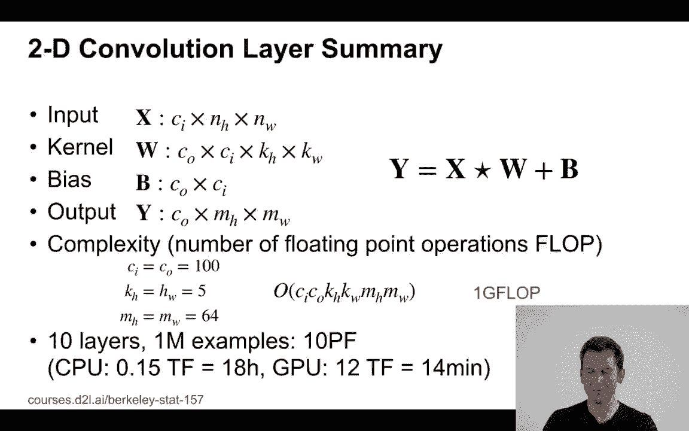
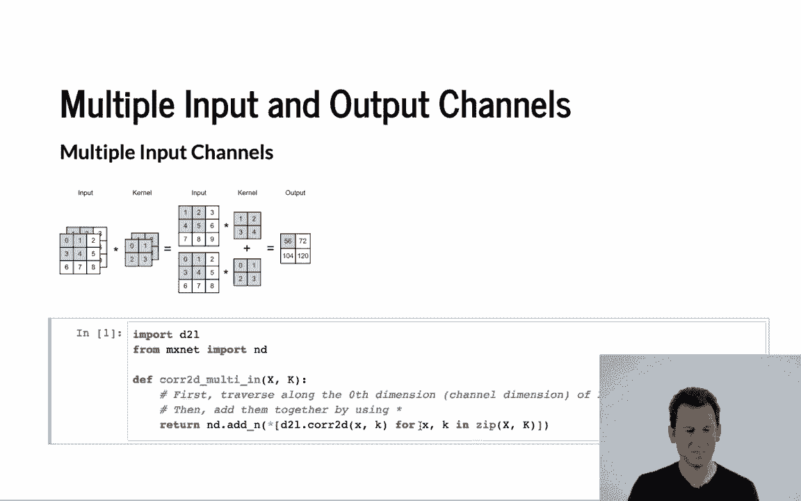
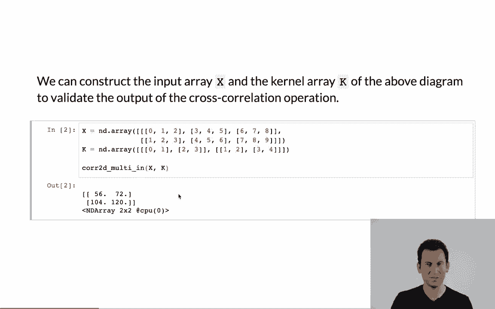
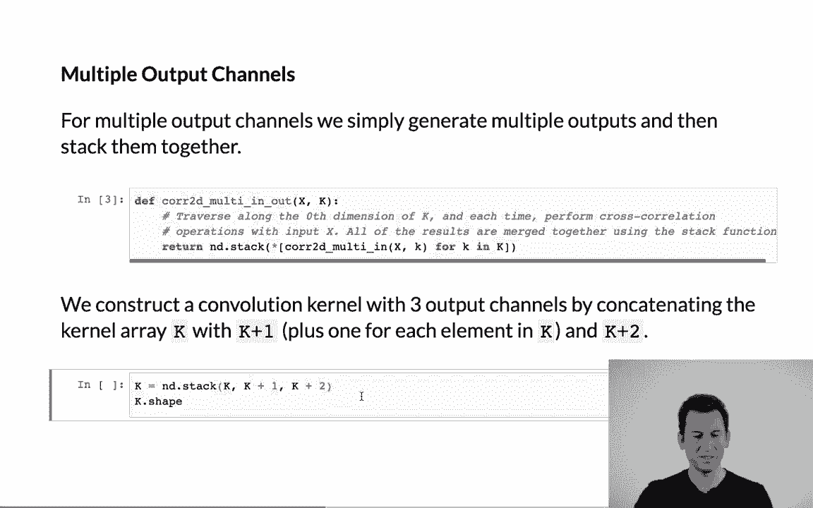

# 【AI 】伯克利深度学习Deep Learning UC Berkeley STAT-李沐 & Alex - P58：58. L11_7 Channels in Python - Python小能 - BV1CB4y1U7P6

 Let's have a look at multiple input and output channels when we do this in Python。

 So， let's recall what we have。 So， we have multiple input channels。

 You can evolve it with some kernel。 So， you basically go over the input。 In this case。

 it's a 2 by 2， apply it to a 3 by 3 image。 And so， we get this output here。 Okay。 So。

 in order to get started， well， we need to import MXNet。

 And I'm going to define a correlation multi-in。 And all I'm doing is I'm just taking the standard correlation function。

 And now， I'm going to use this to apply to multiple input channels。 And then in the end。

 I just add it up。 This is maybe not the most elegant way to do it。

 but this just illustrates the point。

 So then， well， let's have a look at what happens if we apply this to some data。 So。

 this is exactly the example from before。 I take two 3 by 3 channels。 Why？ I apply a 2 by 2 kernel。

 Again， I need to apply it for， I need to have a kernel for each channel。 I add this all up。

 and lo and behold， I get exactly the numbers that we saw before on the slides。

 Okay。 So， now if I want to have multiple output channels， well， what I simply do is。

 I apply the multiple input channel， sending for each of the output channels。

 And this gives me a multi-input multi-output channel。 Okay， so for that， now I need to get a kernel。

 which has multiple output channels。 I'm going to make my life easy。

 I'm just going to take the convolutional kernel K。 I'm going to add one to it。

 and I'm going to add two to it。 I'm going to stack it up。

 So this gives me a 3 by 2 by 2 by 2 tensor。 So it's 2 by 2 for the 2 by 2 convolutions。

 It's another 2 here for the two input dimensions， and it's 3 for the 3 output dimensions。 Okay。

 So now， let's see what happens when we apply this。

 So this applies the kernel to a 2 channel output inputs for a 3 by 3 image， and we get out of it 3。

 2 by 2 matrices。 So it's basically a 3 by 2 by 2 tensor。 That's exactly what we engineered。 Now。

 let's look at one by one convolutions， and I'm going to define an alternative definition。

 for one by one convolutions。 I'm going to extract bias and all the other terms from X。 Right？

 Get the corresponding output channels， and now I'm going to reshape X to allow me。

 to perform matrix vector multiply。 It's just the number of input dimensions。

 Then I do the same thing for， you know， here's， this is my kernel。 It now becomes a 2 by 2 matrix。

 or， you know， it's a matrix with output and input dimensions。

 And I perform a matrix vector multiply。 And in the end， I reshape it， and here's what we get。

 Mind you， I skip the bias just because otherwise the code looks a little bit lazy。 So there we go。

 Now let's actually compare what happens if I do this and compare it to one by one convolutions。

 apply the traditional way。 So remember， this is my one by one convolutional kernel。

 with two input and three output dimensions。 And the image， sorry。

 it's two output and three input dimensions。 The image itself is a three by three image with three channels。

 In that case， I can compute the output once by using multi-in-multi-out。

 and the other case by using the one by one version。 And lo and behold。

 I get exactly the same result， which is to be expected because that's what I engineered。

 This is just to illustrate the point that one by one convolutions are effectively multi-layer perceptrons。

 applied on a per pixel basis。 And this allows me to perform additional long linear transforms based on the channels。

 So for instance， if I wanted to find out whether I have a horizontal in a vertical edge。

 I would take the horizontal edge channel， the vertical edge channel。

 and then combine these appropriately to get another new feature out of it。

 And I could do this on a pixel level。 So this completes this conversation about input and output channels。

