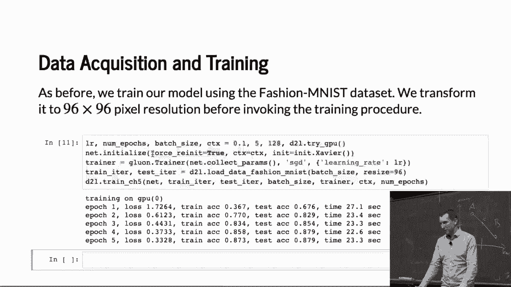
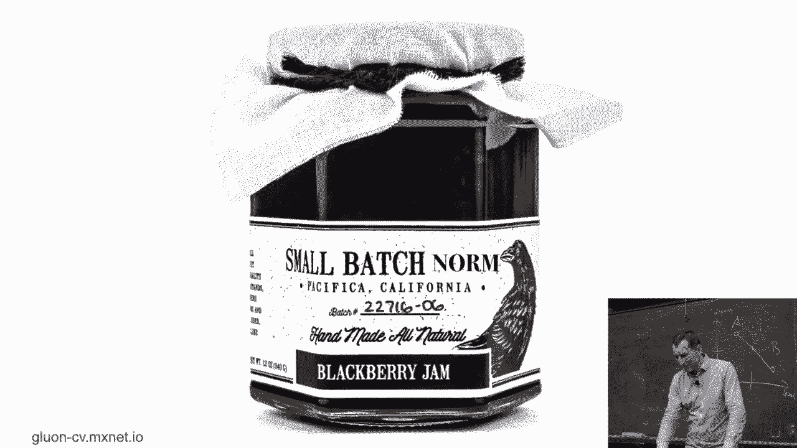
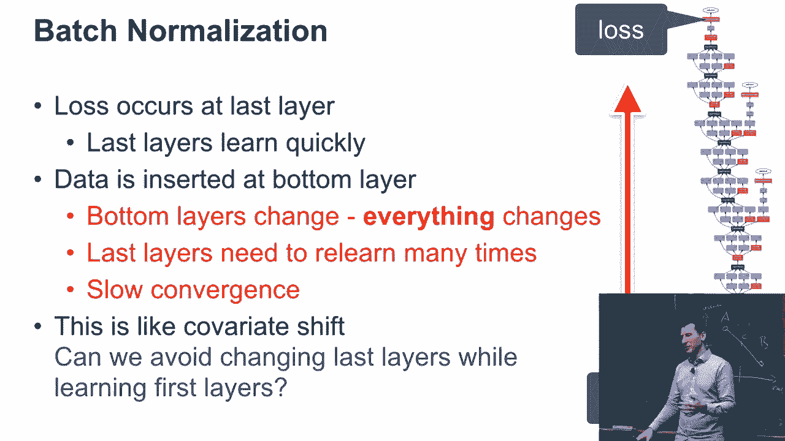
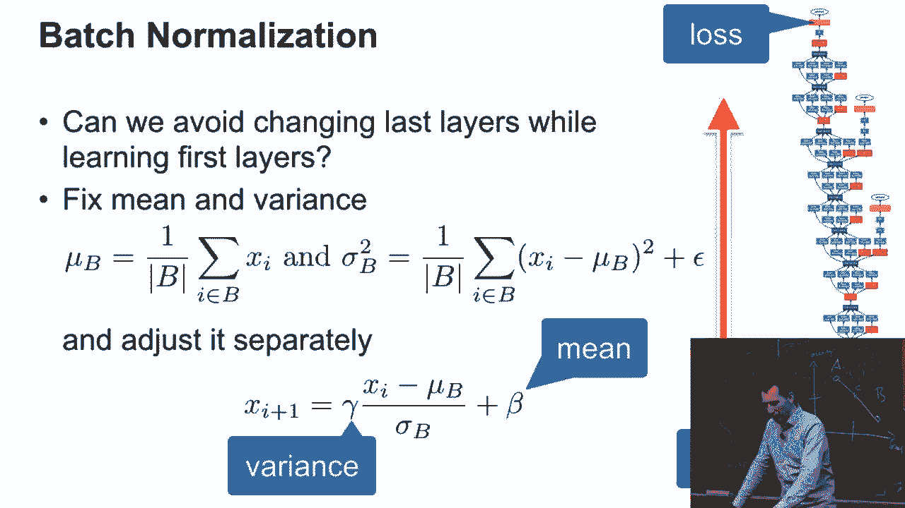
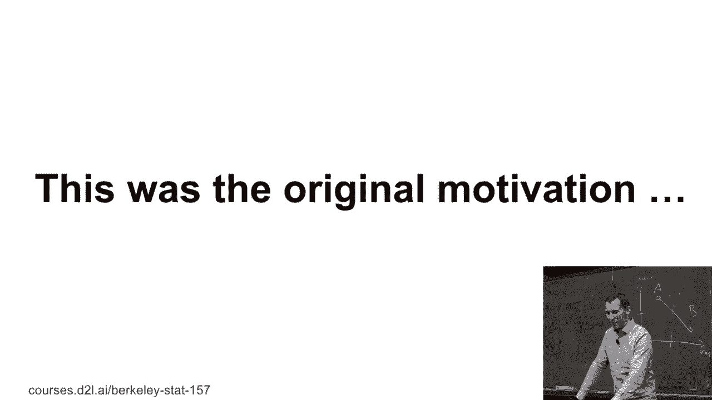
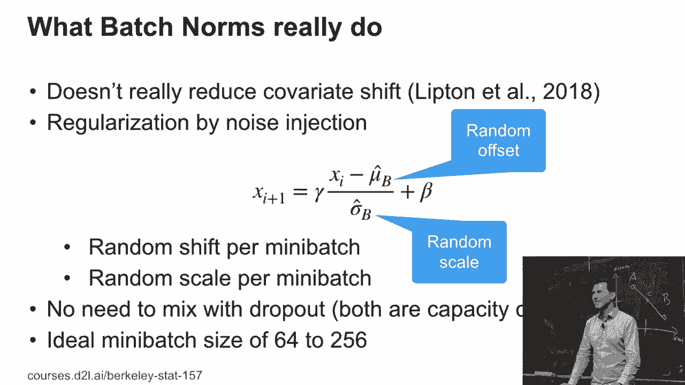
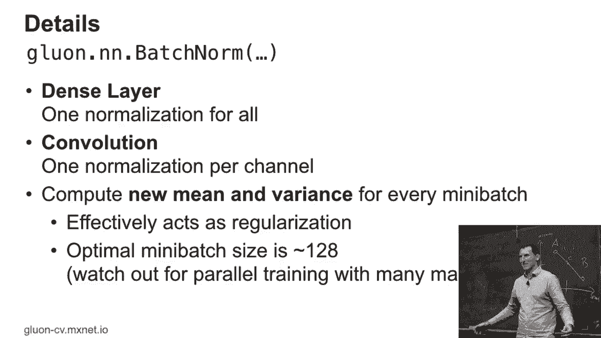
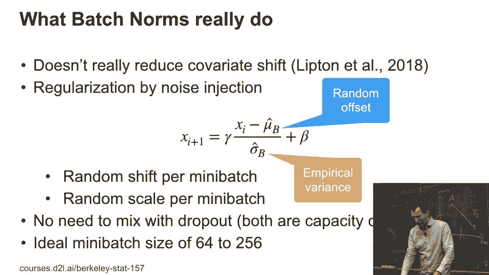
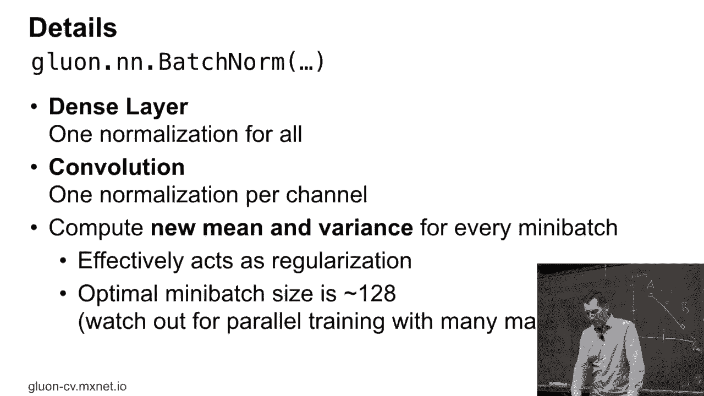

# 【AI 】伯克利深度学习Deep Learning UC Berkeley STAT-李沐 & Alex - P70：70. L13_3 Batch Normalization - Python小能 - BV1CB4y1U7P6

 Let's look at batch normalization。

 So here's what the original idea in batch normalization was。 So if you look at inception， right。

 as this， you know， ginormous network， it's really deep。

 It's got all those extra pieces hanging off it to make sure， that you can help conversions along。

 whatever。 But basically the idea is as follows。 At least that's what the intuition was。

 how they invented it。 Well， as I'm training my network， you know， my gradients。

 percolate through from the top to the bottom。 And so the last layers will start to adapt。

 And so they adapt to whatever the labels are。 And then the next layer down will start to adapt。

 The next layer down will start to adapt。 And so I get this cascade of stuff that keeps on adapting。

 The trouble is， as I'm adapting from the top down， of course。

 the features that are going back up are going to change。 So now that， for last layer。

 that was actually fairly well， adapted to begin with has to re-adapt now to the new inputs。

 that it's getting。 And so it takes for a very long time， at least that was the。

 reasoning at the time， for the training signal to then lead to， a well-converged network。 OK。

 sounds reasonable， right？ So this is a little bit like a variagift what we did before， right？

 So the question is， you know， since this looks a little bit， like a variagift。

 maybe we can fix things。 We can fix them by picking a given mean and a given variance。

 and just at least correcting for that as we train。 You don't want to completely fix those layers。

 but at least you， could say， well， I'm going to fix them up to an affine。

 transform that I'm going to learn separately。 A affine transform means multiply and add。

 OK？ So let's just say that we pick a mean and the variance， right？ You know。

 mu and sigma squared and we then re-normalize the data。

 So we take xi minus the mean divided by the variance， or standard deviation actually。

 And then I allow for a separate coefficient gamma and a separate。

 offset beta to take care of things。 This is batch normalization。

 Now batch normalization for the reason that I compute separate。

 means and separate variances per batch。 And this is already the part where you should start asking。

 questions and with a benefit of hindsight it's always really。

 to ask those questions whether that covariate shift correction。

 was really the entire reason of what this was made for， and whether that's really wide works。

 But any questions about the principle and the concept so far？ OK。 So。

 as I've already alluded to a few times that this was the。

 original motivation but it actually turns out that it doesn't。

 really reduce covariate shift。 So there's a paper by Lipnidal where they go and measure it。

 and they find out that it actually makes it worse。 OK， so much for that original motivation。

 The purported fix did nothing to that but it works and we'll see， that afterwards。

 So it actually turns out that basically this is doing， regularization by noise injection。

 You compute a mean and a variance on a mini batch。 So a mini batch of maybe 6428 observations。

 And so what you're effectively doing is you're subtracting， some empirical mean。

 that's obviously noisy。 You're dividing by some empirical standard deviation that's。

 obviously noisy and so you're basically getting a random shift， and a random scale per mini batch。

 And this is one of the reasons why if you use batch normalization。

 you really don't need dropout nearby because they kind of do。

 similar things in terms of capacity control。 So also one of the reasons why batch norm is quite sensitive to。

 mini batch size。 If you pick a mini batch that's too large。

 then you're not injecting enough noise and you're not， regularizing enough。

 If you're picking one that's too small， then basically the noise。

 becomes too high and then you're not converging very well。

 This doesn't matter so much for single GPU training but as soon as。

 you go to multi GPU it starts to matter quite immensely。

 For instance you might want to keep the mini batches to each， GPU and then just do the rest jointly。

 Any questions so far？ That sounds quite abstract the first time you see that。 Yes？

 So why do we have a random offset？ Well if you think about it the mu hat B is the mean of all the。

 xi's within a mini batch at a given layer。 And so of course this is close to the true mean but it's just。

 on a mini batch on a sample size of 6428。 So every time I pick a different mini batch the。

 mu hat B is different。 So therefore it amounts to really adding noise and。

 chittering around every mini batch the activations appropriately。

 Because each xi doesn't really have much of a saying which， mini batch it ends up in。

 So after all we shuffle these things。 So therefore it's entirely up to chance whether I'm adding or。

 subtracting a little bit from the mean。 And likewise for the scale。

 My variance estimates are also going to be noisy。 And that's exactly why this is sensitive to the mini batch。

 sizes。 Because if I pick a mini batch that's really small my noise in。

 the mean and the variance is going to be really high。

 If it's really large then it's going to be very stable and， it doesn't regularize quite as much。

 Any other questions？ Yes？

 Excellent question。 What do you do during test time？

 Well what you do during test time is you just fix this。

 Essentially so remember there are those parameters， gamma and beta。

 They are learned so they are basically you know a learned， scale and offset。 I fix them。

 And for the means and variances I'm actually going to use just。

 the running average and you know use a large sample size mean。

 And we'll see that in a lot more detail in Python as we go and。

 implement the batch number on from scratch。 That's a good question。 Any other questions？ Okay， cool。

 So everybody's ready to get going。

 Yeah so just one last little detail。 So you basically if you have a dense layer then you just use one。

 normalization for all the activations。 And if you have a convolution then you use one per channel。

 Yeah so it's kind of straightforward。

 Now this。