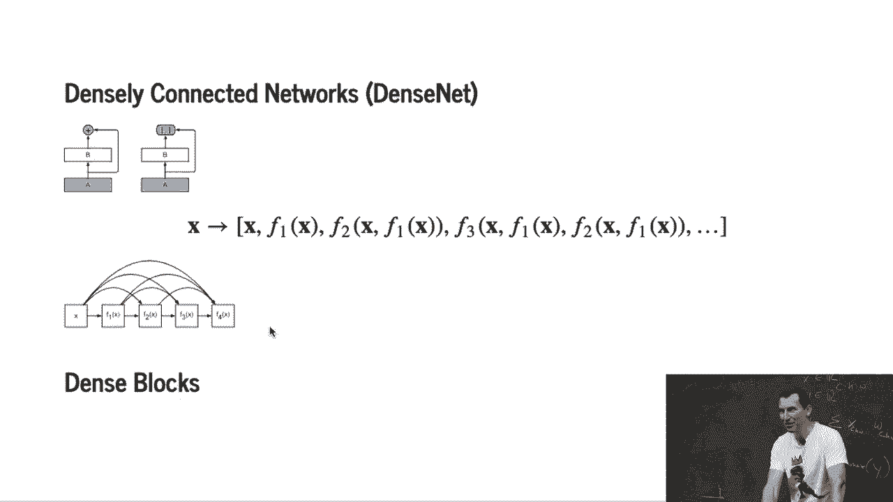
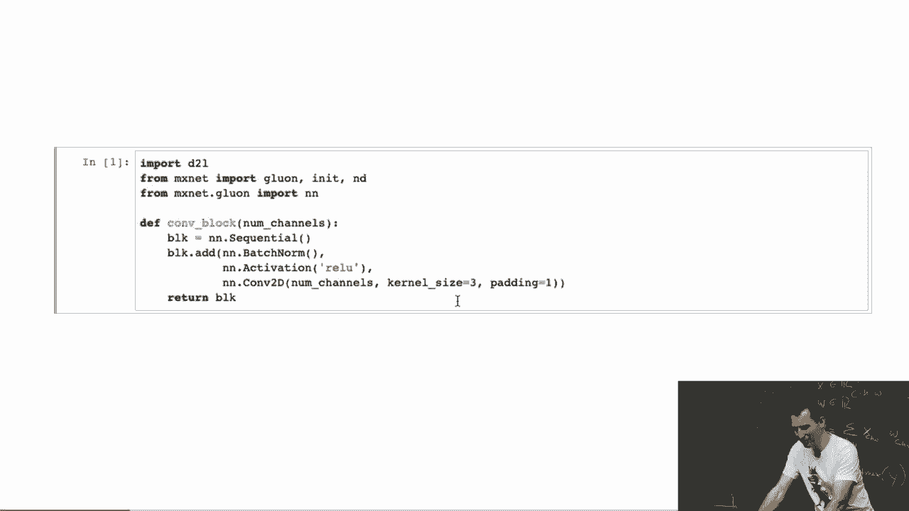
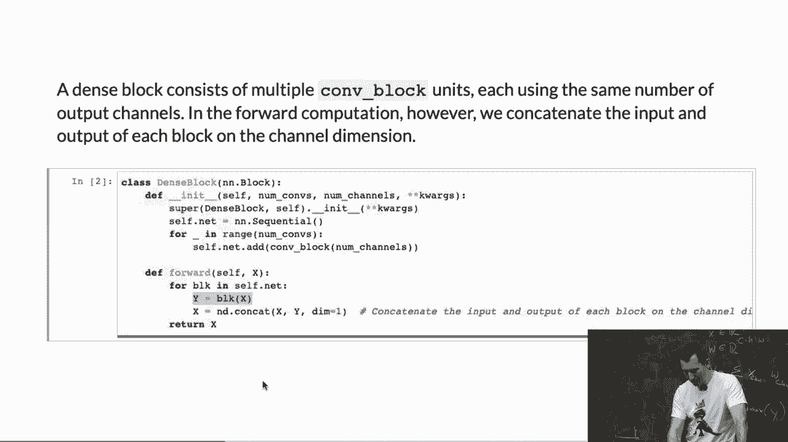
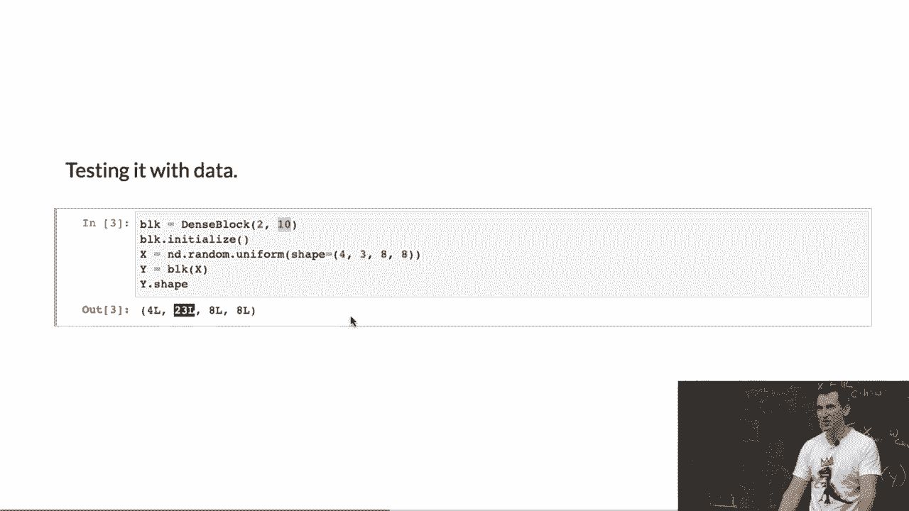
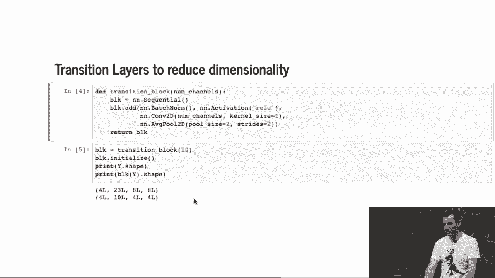
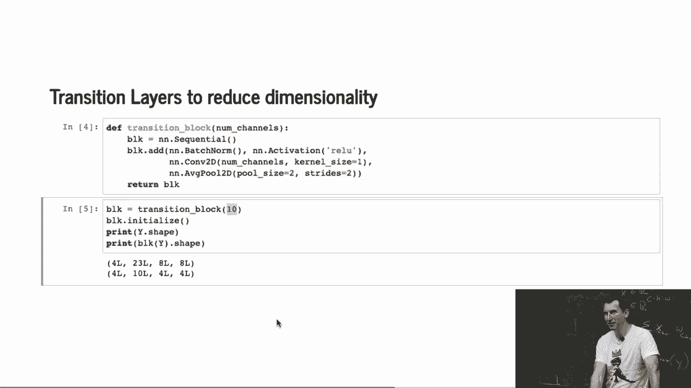
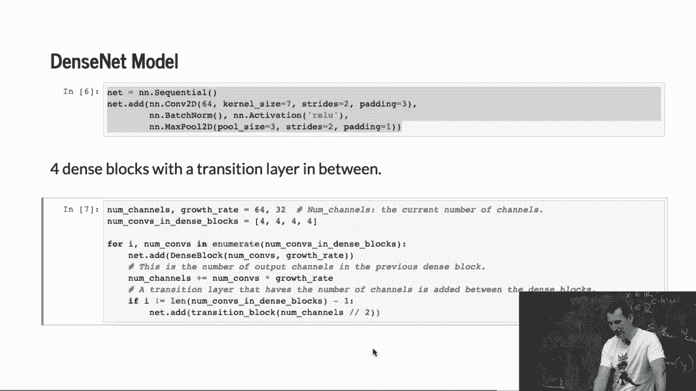
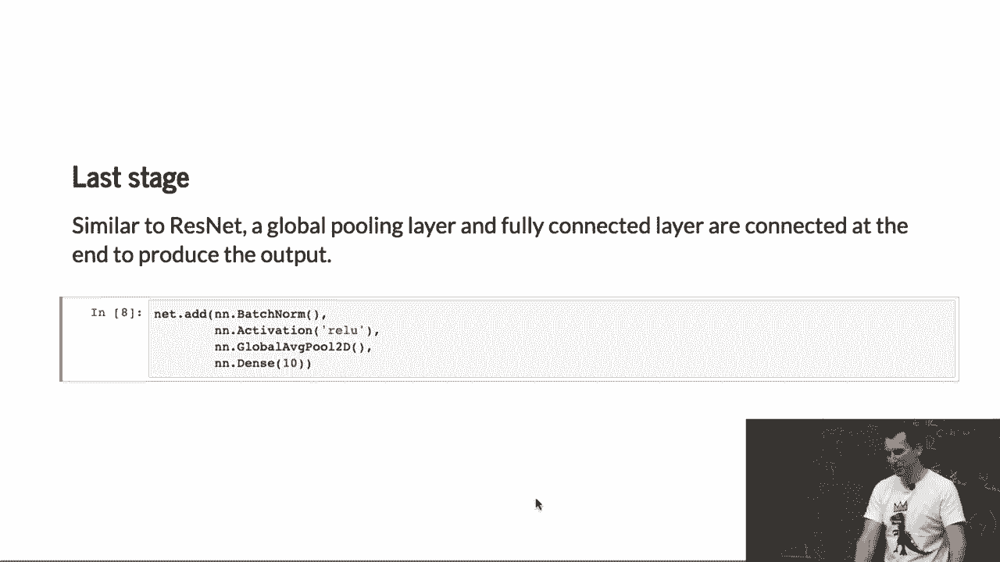
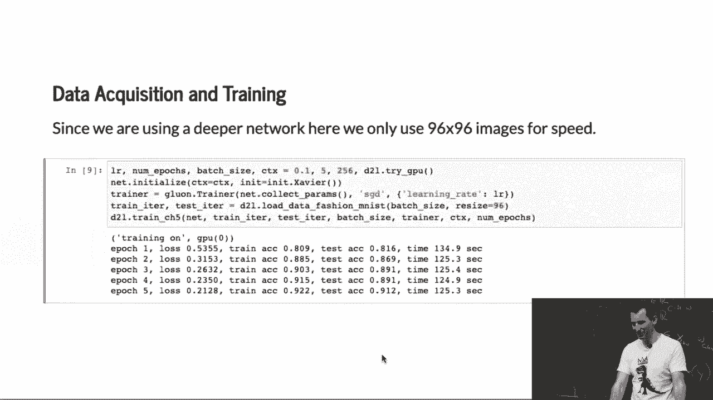
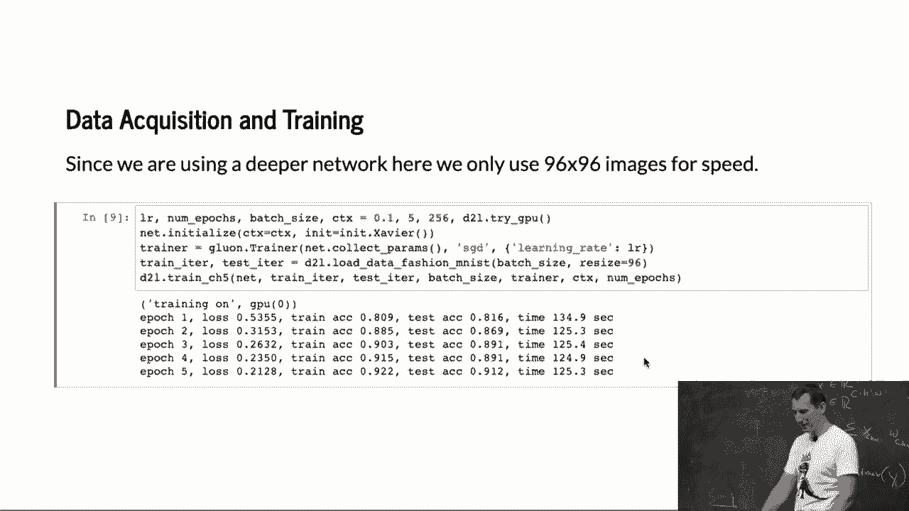

# P75：75. L13_8 DenseNet in Python - Python小能 - BV1CB4y1U7P6

 Let's look at the insnets in practice。 Remember this is essentially this function expansion， X。

 F1 of X， F2 of X， and F1 of X， F3 of X， F1 of X， F2 of X， and F1 of X， and so on and so on。

 So there's the diagram。 So let's see how we actually would go and code that up in Python。

 So I have a convolutional block。 And what I'm doing is， this is just a simple one。

 just adding batch， norm activation and the 2D convolution。 So this is just a simple object。

 So then we need a dense block。

 So it basically adds and constructs a couple of convolutional blocks。

 with different numbers of channels。 And so what I'm doing now is I'm saying， OK。

 I'm taking the original， block and concatenating it with the output of my previous network。

 So I'm getting longer and longer and longer stacks。 That's my dense block。

 You can see that as I keep on doing this， the higher order terms。

 that are being computed will have more parameters because the inputs are larger。

 So if we were to test this with data， well， we'd get that if I have this dense block。

 with 10 features and two iterations。 So I pick three channels as input。

 Then I add two times 10 channels to it。 So as a result， I'll get 23 channels。

 That's pretty straightforward from the construction。 Any questions so far？

 And so now， of course， if I were to keep on doing that forever。

 while the dimensionality would increase without bounds， so I need to squish it back。

 And one way of squishing it back is just you perform another 2D convolution。

 And we do that conveniently with also reducing the dimensionality。

 So I basically have this stage where my embedding explodes in terms of number of channels。

 And then I collapse it back to something more manageable。

 and at the same time I'm reducing the resolution as well。

 That's kind of the right thing to do because you pretty much don't want to reduce the resolution。

 and then build up the features because otherwise you've already thrown all the relevant pieces away。

 And yeah， you can see what happens if I look at the input before。

 I had 23 dimensions and then afterwards， yeah， if I have a transition block that chops it down to 10。

 well， then I get 10 channels after that and it's 4x4。 Simple batch norm， relu。

 then a convolution that reduces number of channels。 And then I， in this case， I use average pooling。

 but yeah， could have used different pooling as well。

 And so now here's our Dense-Step model。 Okay， so initially， well。

 we start off like any other good network， right， with a few convolutions and pooling。

 And now I basically have these two number of channels in growth rate， right。

 number of convolutions within the block， so we have that。 And now I just add a dense block。 Right。

 then I use a transition block。 And for that I need to figure out how many channels I need after that。

 And so I use the number of channels in a habit， right？ That's it。

 And so that's basically the design of a dense net。

 Last stage is just like， you know， global averaging。

 So you can see this kind of gets pre-predictable and boring because all those networks share a lot of common design patterns。

 which is good because at least nowadays a common design pattern of how one goes and constructs object recognizers。

 Then you train。 It works fairly well， but doesn't actually work necessarily better than ResNet or ResNEXT。

 So， but it takes a very long time。 The very long time has a lot to do with the fact that intermediate representations can get quite large。

 which we just keep on stacking up channels。 So in other words。

 the forward pass isn't a lot cheaper than what you might get for the backward pass。

 compared to what you have in the standard ResNet where you keep， you know。

 the number of parameters fairly well under control。 But yeah， that's about it。 Yes。

 Does the larger intermediate representation have benefits for transfer learning？

 Does it have benefits for transfer learning？ Not necessarily this one。 So transfer learning。

 we haven't even talked about that yet。 Mu is going to cover some of that。 Well。

 probably on Thursday or next week then， but don't worry， you won't need it for the exam。

 So transfer learning is essentially， let's say， I train a face recognizer on one dataset。

 and then I want to use it for a different dataset。 And mind you。

 transfer learning works often but not always。 For instance。

 if I perform transfer learning on English and then want to apply to Klingon。

 it's probably not going to go very well。 Okay， everybody knows that。

 We found out the hard way that if you train an image net and then want to apply to satellite images。

 it doesn't work either。 That was less obvious than the Klingon part。 Yes， question。

 Why do you do that to that word？ Of course。 That word is not。

 Because it's actually not very efficient at coming up with its feature representations。

 And ResNet already has most of the expansions around identity in it that gave it the big benefit。

 Relative to inception。 Going to higher order terms doesn't give you that much of a benefit。

 It actually becomes a little bit less pleasant to train。

 Which is also why probably people haven't spent quite as much time tuning it。 It's just too costly。

 So overall， if you have a fixed compute budget， you may be better off using your fixed compute。

 budget more wisely on things like shuffle net， on things like ResNet。

 ResNet where you partition channels。 Is there some strange combination of all those things that you could use？

 Probably yes。 For instance， there's something called Amoebanet where some folks at Google use the genetic。

 algorithm to basically roll the dice and burn a lot of TPUs to come up with a really， really。

 fancy network。 And then for this one problem， this really， really fancy network does really。

 really well。 The problem is a little bit that you don't really learn a lot about the problem from that。

 structure anymore。 It's just like， yeah， it's not quite a binary blob， but it's like a network blob。

 And yeah， just use that and things are going to be okay。 Structural improvements。

 especially if you care about efficiency， may be better。 Yes？

 >> As people try to connect to several previously used instead of all the previous loops。

 >> So ResNet， sorry， DensNet effectively connects to several previous layers， right？

 You keep on stacking up the representations， right？ So in that sense， the answer is yes。

 And that is DensNet。 Now， there are a couple of follow-up papers where they address some of the downsides of。

 this。 For instance， what you could do is you could try to build a network where you can decide。

 early on whether you should be spending extra compute effort or not。

 Let's say if I want to recognize a cat and it's very， obviously a cat， then I don't。

 really have to do a lot of work。 And I can maybe truncate earlier on。

 That actually makes things pretty in theory， but in practice， it's -- so here's the issue。 Well。

 if I give you 100 cat images， well， which one's going to be easy？ Well， if you knew that beforehand。

 well， life would be very easy。 So what you'd basically have to do is you'd have to do some form of dynamic batching where。

 you throw out all the easy cats， maybe after the first stage， and then you do some。

 computation after the second one and so on。 And all of this overhead may completely negate the on-paper benefit that you think you might。

 be getting from using something that has a lower flops count。

 So not every theoretical improvement will help you in practice。

 I've gotten burnt by that myself in some cases。 So in one very unfortunate case。

 somebody with a log-in higher complexity beat us in practice。

 because CPUs are very well suited to that and what we had wasn't。

 So this is the trade-off that you often need to explore when you propose a new， network。 Otherwise。

 it's just a paper and nobody uses it later。 Any other questions？ Okay， so with that， thanks a lot。

