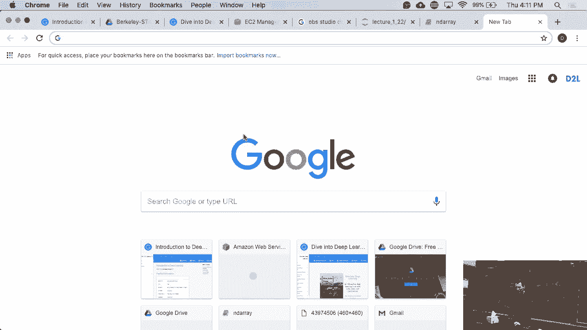
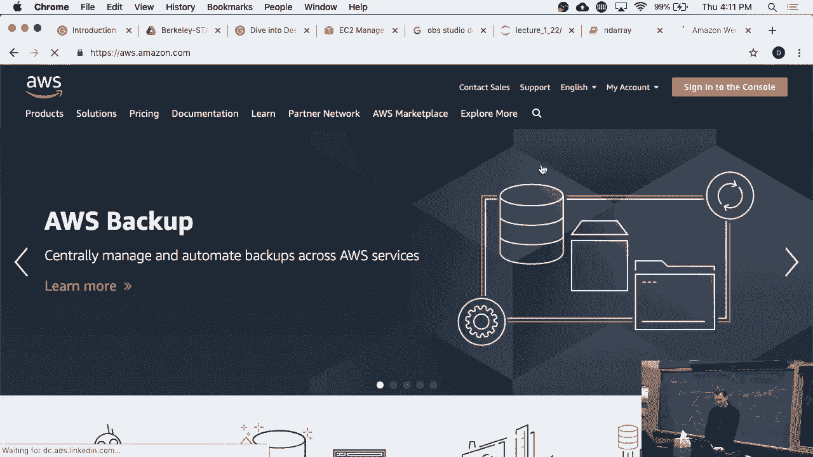
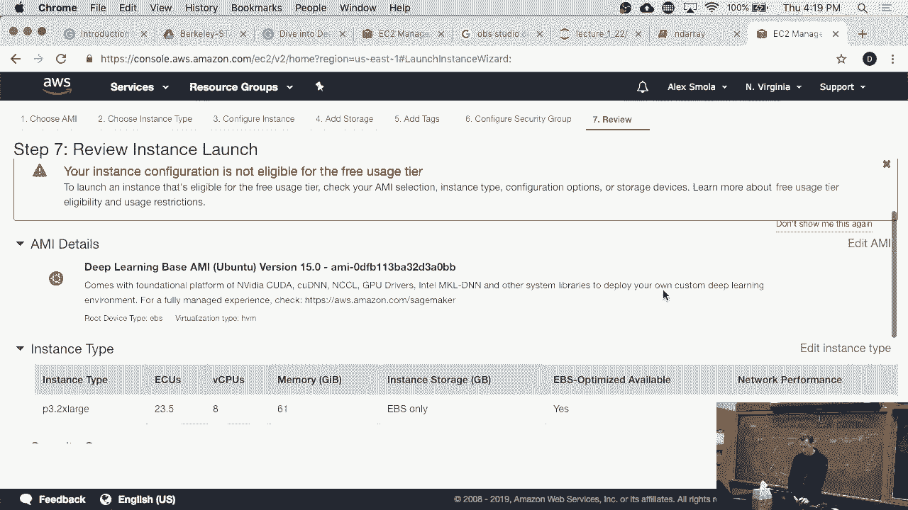
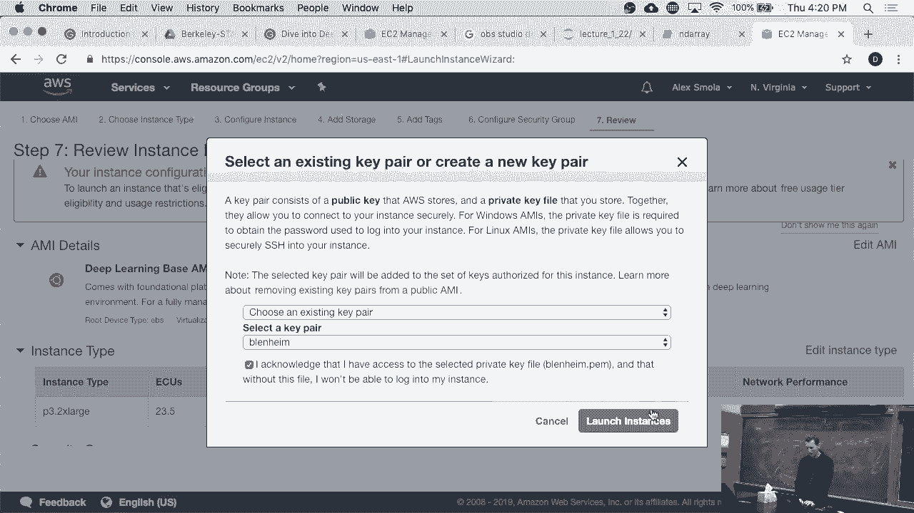
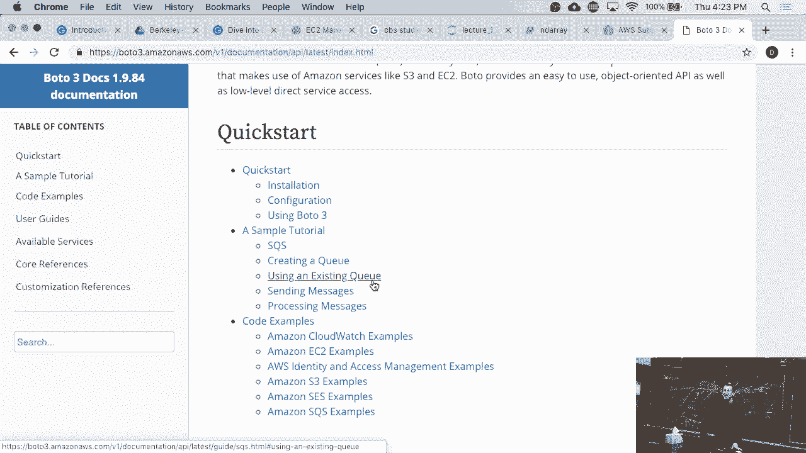

# P7：7. L2_2 AWS EC2 Instances - Python小能 - BV1CB4y1U7P6

 So in the office hours， I had a whole bunch of people come to me and ask me， "Oh my god。

 how do I actually start an instance？"， Okay。 So the one thing that we are not going to go through is how to sign up for AWS。

 You can do that in the comfort of your dorm room or whatever， but you go to aws。amazon。com。

 And then you click on sign into your console。

 And okay， I've signed in before， but if not， then it will ask you to create an account and， so on。

 And yeah， you should do that。 Okay。 So a couple of basics。 AWS operates in different regions。

 They're up here。 That's some of the regions。 And different regions have often slightly different equipment。

 sometimes different services。 And they very much have different prices。

 The regions you want to pick are probably the north Virginia region or maybe the US west， in Oregon。

 You might ask， you know， why on earth does AWS have all those regions？

 That wouldn't be much nicer if you could just say， "Hey， give me a machine。"， Well。

 that's true in theory until you， let's say， are a startup in Indonesia。

 And you want to be able to serve your service from machines that are very close to where。

 your customers are。 In which case， well， you might go and pick a machine in Singapore or in Seoul。

 Yeah， that would be probably something you would do。

 Or you might pick it in Mumbai if you want to launch a service in India。

 Now those zones are supposed to behave in the same way and they mostly do。

 But they often have slightly different amounts of servers and not all servers are launched。

 in all regions。 In some cases also for regulatory reasons。

 That's why you have all those things for the European Union。

 You need to have machines in the European Union， sometimes in a specific country。

 So don't pick the North California region， pick the North Virginia region。 Okay， good。

 Now within that， there's a whole bunch of services。

 The one that we are really interested in for this here is EC2。 And EC2 will give you computers。

 You can spin one up。 And so what you do is you say， well， go forth and create an instance。 Okay。

 And now when you select and create an instance， you get to select from a specific instance， AMI。

 So AMIs are， if you will， what kind of software there should be pre-installed on your machine。

 And you can build your own AMIs。 Typically you start with one that you like。

 you configure it and then you save it。 Or you pick one that's pre-built。

 And so if it's completely generic， I mean you would probably pick something like Amazon。

 Linux or rather Ubuntu because everybody knows how to use Ubuntu。

 But for this purpose here we want to get a deep learning army that already has all the。

 NVIDIA drivers installed。 So we search for deep learning。 And we'll find a couple of AMIs。

 So there's the deep learning army Ubuntu and then there's the base army。

 And you want to pick the base army because that one is free for you to configure with。

 everything that you need。 But it doesn't have anything else installed yet。 So let's select this。

 Now there's a lot of different instance types and I cannot walk you through the probably。

 over 100 different instance types that we have by now。

 But suffice it to say that you can pick different amounts of CPU， different amounts of memory。

 different amounts of network bandwidth， different amounts of storage optimization。

 And for different purposes and also different load profiles。 And for different purposes。

 different instances are the right choice。 So at some point when you're bored。

 look through that list and you'll be amazed what， you can find。

 For instance if you need to do any hardware project on ARM servers， well you can launch。

 them here so you don't need to build your own or deal with a Raspberry Pi。

 Or if you need FPGAs then usually they tend to be kind of expensive to buy and maintain。

 and all the software stack or you can just use an F1 instance。

 In our case what we care about is GPU instances and if I pick this then we'll find a couple。

 of them here。 These are probably the most ancient GPU instances that we're ever offered in cloud computing。

 They're like five years old and slow and cheap。 These are essentially K80s。 So KAAT。

 it's probably about state of the art three to four years ago from Nvidia。

 If you want to have something a little bit and the 8X or 16X just means you get more of。

 the GPUs in these machines， this is the current generation。 This is Nvidia Volta。

 Each Volta GPU would probably happily sell it to you for around $10，000 per GPU。

 If you need eight of those so that gives you one petaflop you can do that but it costs。

 So that's around the equivalent of maybe $200，000 for a DGX2。

 Cost on AWS is I think $20 which sounds like a lot of money。

 On the other hand if you rent like an expensive Ferrari for $200，000 it'll cost you more than。

 $20 an hour。 On the other hand if you crash the GPU instance it's not so bad。

 So let's pick like a P3 to X large。 Pick one。 If you want to make your money go further。

 pick a spot instance and you can see that they， are quite cheap。 They're around $1 per hour。

 The spot instances are the eBay equivalent of machines basically this is excess capacity。

 The first time you try this it's going to fail。 It's going to fail because you probably don't have the quota for it and you'll need to open。

 a support ticket and go to support center and kindly request a quota increase。

 It's fairly self-explanatory and it's in supremely tedious。

 I'm not going to do this right now because I didn't bother before。

 So you pretty much leave everything else as you would。 You then maybe 50 gigabytes here。

 okay if you need a larger disk you can do that。 You can add additional volumes。

 it's pretty like attaching disks。 There are lots of ways how you can optimize things。

 For instance you can have SSDs that are just generic。

 You can have a hard disk or you can have provisioned IOPS in other words。

 That's an SSD with a certain speed guarantee whereas otherwise it's essentially what you， get。

 But that's fine for most cases。 And then well actually we don't need to add tags。 At least not here。

 But yeah create a new security group that's fine and this means it's open to the world。

 So if you're a little bit more paranoid you would probably figure out what IP number you're。

 going to connect from and then make it accessible only from that or maybe only from the Berkeley。

 range and whatever。 Otherwise you'll soon have some friends from Russia logging in。

 Okay so yes it tells me that Alex this was a foolish idea。

 You shouldn't have done it but I'm going to do it anyway and by the way it'll cost you， money。

 Okay fine。

 We'll ignore this。 Now the last thing is you need a SSH key and in this case I picked this one in case you。

 wonder why Blenheim well it's a small orange apple。

 Well my laptop name but you can call the key whatever you want and you can create a new。

 one but anyway so it launches an instance。 And after some time well launch failed because apparently my quota has been set back to what。

 it。 Yeah okay so I would have to contact AWS right now about this。

 Apparently it didn't change the quota for those machines。

 In any case once you have that you can SSH into the machine。

 All the NVIDIA drivers are installed from there on it's really straightforward as if you had。

 a GPU server on the desk。 So what I would have to do now let's just actually walk through this exercise support。

 center and I would create a case。 Service limit increase limit type EC2 instances case description region well fine primary instance。

 type search P3 to X large and instance limit let's set it to maybe 4。

 And okay the web and at some point I'll get that。 I'm not going to pick phone up with otherwise they will call me within the next 60 seconds。

 and you'd have me on the phone right which would be utterly boring。

 Okay so they'll contact me and tell me what to do。 Okay good。

 So this was the cloud computing 101 with the obligatory failure because I didn't have enough。

 instances。 Yes。 Do you need to have the CLI to use it in your domain？

 Yes so if you don't like clicking through web forms there's something called photo so。

 everything on AWS can be done through a command line。

 Not just the command line you can also do it through Python。 So let me go to show you。 Go to 3。

 And you can look through this and if you ever do things at scale or you want to launch like。

 a thousand machines and launch jobs on them you will not use the web form but you'll probably。

 use something like photo this the equivalent version for JavaScript or you could use you。

 could send JSON packets if you feel like you want to have some punishment but I guess probably。

 Python or JavaScript are the things that I would use。

 But for testing things out quickly the web interface is very nice other than that yeah。

 basically use Python you can script and this is of course all available。 Okay。 Any questions so far？

 Good。 So then let's move on。