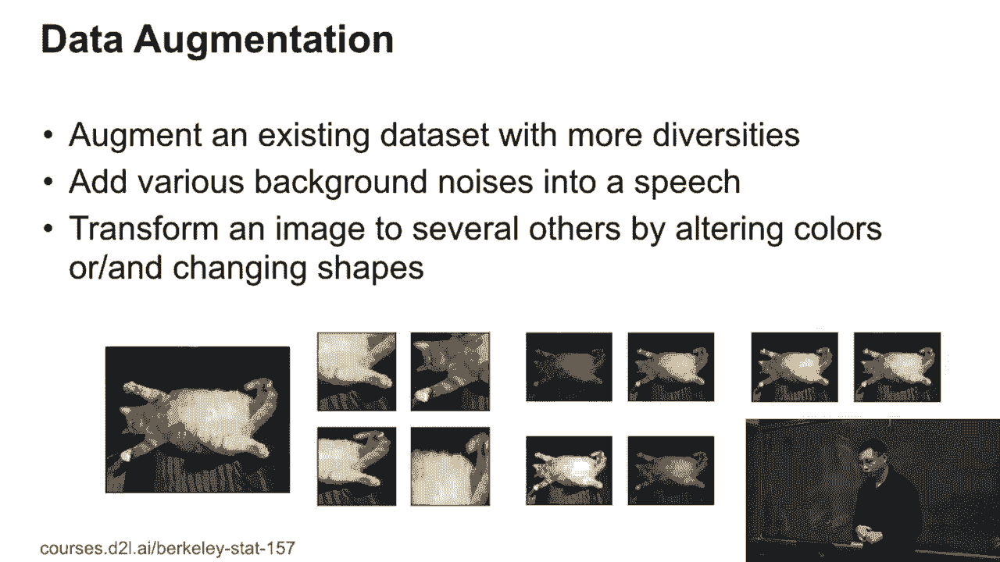
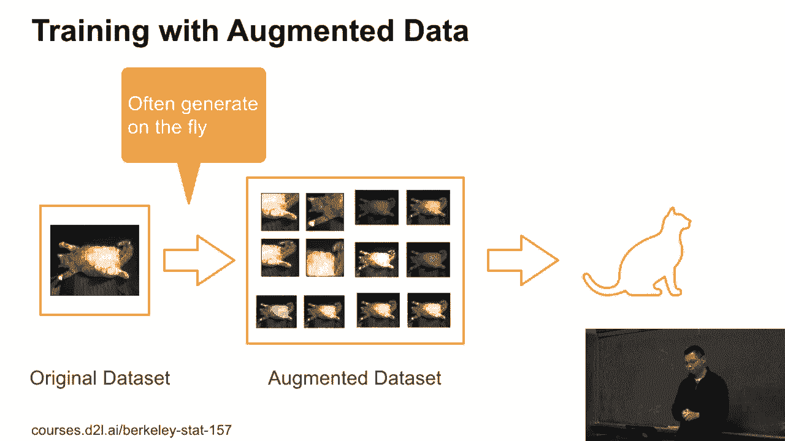
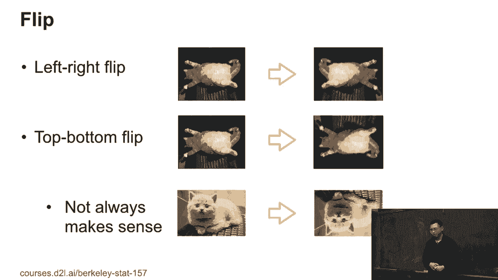
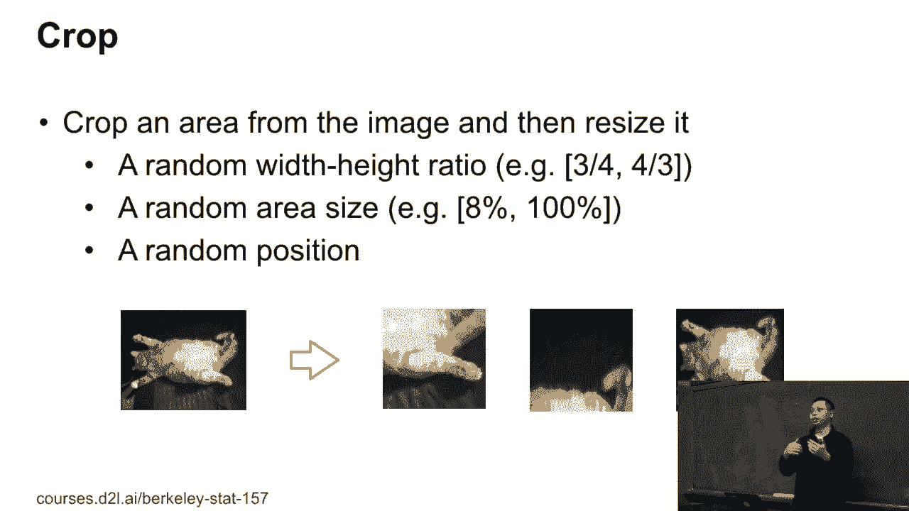
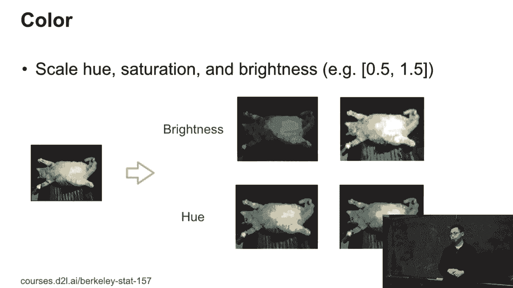
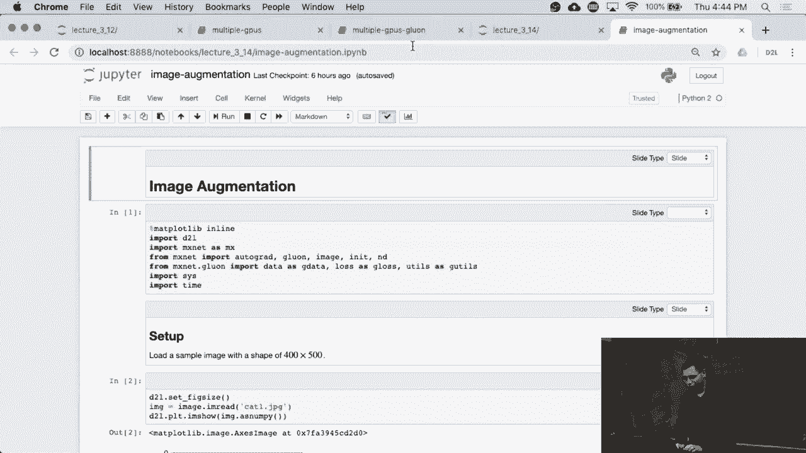

# P81：81. L15_1 Image Augmentation - Python小能 - BV1CB4y1U7P6

 OK， let's cover all image augmentations。 So here， I'm going to show you a real story at this year。

 There's a consumer electric show here like two months ago。 The startup wants to show demo。

 The demo is about small vending machines。 You put a vending machine here。 There's a bunch of drinks。

 You just grab a drink。 And there's a camera that can recognize， what the drinks you grabbed。

 So if it goes to Amazon Go， it's very similar to Amazon Go。 And then they built that one。

 Their lab works pretty well， like 99% accuracy， to recognize the drinks you grabbed。

 But then they bring to the show。 It doesn't work anymore。

 And the brain does show that the light before the next day， the next day， it's going to open。

 doesn't work。 Why can't debug that？ They find two reasons。 Firstly。

 the night temperature on the showroom， is different to the lab they have。

 It's pretty-- it cannot be hard to see on this picture， but it's quite yellow。 Secondly。

 they put a box on the desk。 You have light reflections from the desk。 And before that， in the lab。

 they don't have such a thing。 So how to solve it？ They worked all night， called engineers in China。

 sorry about that， guys。 And just to buy light， to authenticate， to the showroom light temperature。

 connect data again， and train a model。 That's all。 They spend all night to do that and connect。

 the like a bunch of data set。 Good， they have two vending machines。 So they can do that one。

 And then all the table cloth just， recovered the desk， so that's no light reflections。

 That's a real story。 And it's pretty commonly happened。 For example。

 you cannot deploy a face identification app， into your mobile phones。

 They're going to find-- after deploy， you're going to find the light condition of very different。

 indoor， outdoor， and camera quality are different。 Also， if you're going to do speech recognition。

 I don't know if you're using Siri to speak something。 Indoor， outdoor， back noise， all the things。

 affect all this motor accuracy。 So that is the lot of things we can add the real problem。

 to deploy a product into reality。 So one thing to help it， not to solve it， that is。

 we can augment the existing data set with more diversity。 For example， on the speech。

 we can add a lot of background， noise to the speech data set during training。

 so you can simulate the different scenarios。 For images， we can transfer images。

 to by change the shape， change the color， so that we can have more diverse cities on the images。

 Because we're going to talk about convovision。

 we're going to focus on image augmentation。 So how it works is like we have original data set。

 It's a cat here。 And we can generate a bunch of augmented data set。

 A lot of variance here to make a larger data set。 And then we try to model the larger data set。

 So usually we can generate that thing on the fly。 We actually don't just generate a lot of new image。

 installed in desk and train that。 We just， every time we read a bunch of images。

 do augmentations and train that。 We so we generate on the fly。

 So next， let's do several commonly used， documentation technologies。 The first is flip。

 You can randomly flip left the right of the cat。 And also you can do top to bottom flip。

 Top to bottom flip doesn't work any time。 For example， this cat cannot sit on the ceiling。

 You cannot put the sky on the bottom and the ground on the top。 So the thumbtice works。

 Another thing you can do crop。 Crop means that given image， a crop area in the image。

 So what I can do here， I can first， render pickup width to height ratio。

 So here I can render pickup ratio between 3/4 to 4/3。 And then we can render pickup area size。

 which， for example， we can pickup area size is between 8% to 100%， of the original， the whole image。

 Then we can render to the position。 After you crop， we resize to a common shape。

 So then the crop is pretty useful for that。 You have a bunch of different images have different size。

 and we crop and resize to the same size。 That's a pretty common use that one to normalize the image size。

 Besides the flip and the crop just take care of all--， if you take pictures。

 you can take a different distance， for the object at different angles， different length。

 distillations。 And also we have different colors。 Like we can change the hue， saturation。

 brightness。 So for example， we can change the scale。 We can either reduce the brightness by 50%。

 or increase by 50%， or just between them， any between them。

 So then， well， there's a lot of things to do that。 If you use the Photoshop before， anything。

 any transformation， you can do Photoshop to change for the image。

 You can do just the image augmentations。 So here's a report。 If you're interested。

 there are like 50 different， augmentations there。 Like change adding noise， make the sharp。

 and color a lot of--， even a blur， blurring， but even human color。

 how to read all these distillations。 So that's like a photoshopping the images。

 So let's show how do augmentations in Python， and actually using augmentation to try to imagine。

