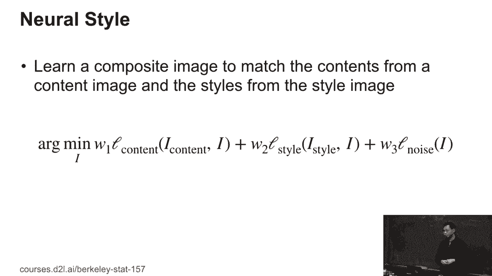
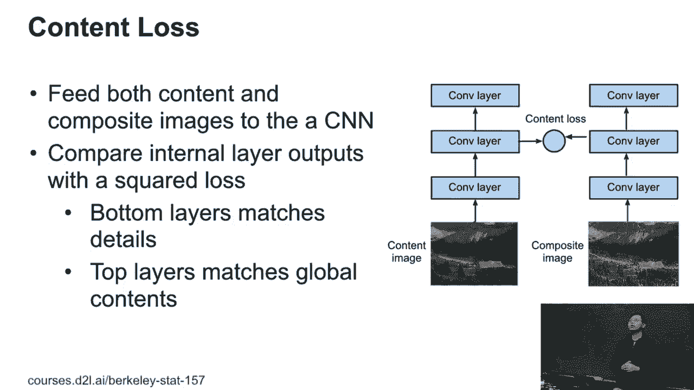
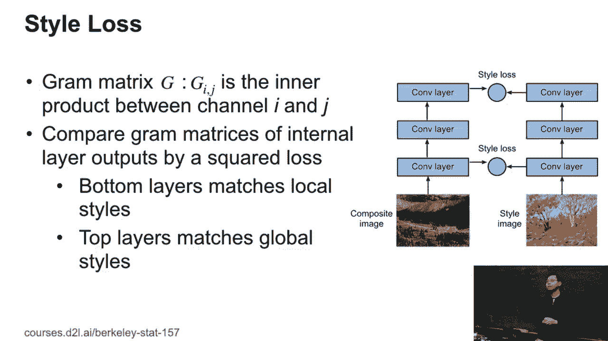
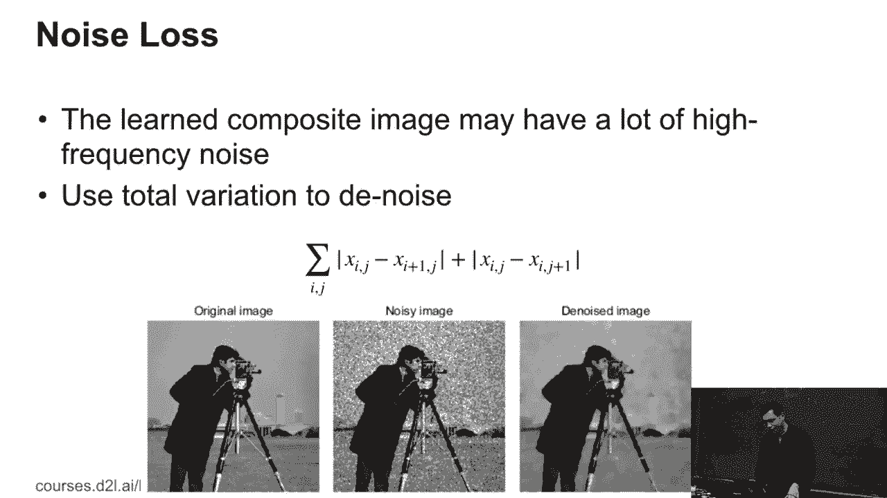
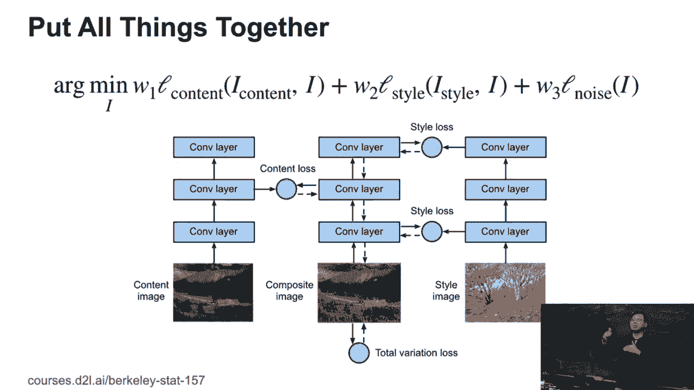

# P84：84. L15_4 Style Transfer - Python小能 - BV1CB4y1U7P6

 Okay， so the style transfer。 So basic idea here， I give you a content image。 Content image。

 this is the left top one， and give you style image， the style which is the kind of a filter。

 I want to generate a composite image that is， keep the content from the content image。

 and also have the style from the style image。 So here you can see， okay。

 well this is pretty pretty pretty。 And if I， now I just change the style image。

 I can change to another thing。 Okay， also change to another style， another style image， style image。

 Well， the good thing here， yes， if you use Photoshop， you know there's a lot of filters here。

 but the good thing here， that you don't need to know what the filter looks like。

 You can always find the style image。 I like this style， I can apply to my own content image。 Okay。

 so that's the application。 Another one， like， okay， another one。 Okay， so here's the math。

 So here I have the i's image code。 If i content is a content image， I have the i style。

 this is a style image。 So where I weird to learn a composite image called i。

 what to minimize the three things。 The first thing is that content loss。

 Compared to my composite image， to learn image to the content image I have。

 I manage the content loss， and w1 is the weight。 And plus w2。

 this is the loss between the style image， and my learned image。 The last one。

 usually we have a lot of noise， so we want to make the image pretty， pretty， have no。

 have good noise to ratio， loss to signal ratio。

 So let's go through each loss one by one。 So the content loss， like we have， so what do we do here？

 We have a content image， we have the learned image， we fit into the same network。

 So here we have three convolution layers。 And then we're not going to combine this kind of。

 the learned image by the current image by itself。 Like if you learn by itself， well。

 we just learn pixel by pixel， we don't want to do that。

 We want to learn some high order information here。 So we pick up， like we pick up the middle layer。

 the output of the middle layer， the middle convolution layer， and then adding an L2 loss。

 between compare the output of these two things。 So what I do here， I want to learn image。

 which is give almost the same result， for the second convolution layer output。

 comparing to the content image。 If you choose the bottom layer， well， the bottom layer trying to。

 you know the convolution layers， the bottom layer is trying to find the local information here。

 because it's like we have windows by windows。 The top layers， we have so many windows。

 as we have little bit global information。 So the bottom layer is trying to match the details。

 In the extremely case， just compare the raw pixel， you just pixel by pixel， you preserve everything。

 The top layers kind of match the global content， like the global shapes global objects here。

 So here， here we choose the middle。 We don't want to， too close to the content image。

 or also we don't want to， like very defined to the content image。

 Okay， choose the middle。 Similar thing for style。 Well， here are the things like， for content。

 I can always match one by one， like L2 loss。 So what is the style？ Style， well。

 it's a little bit hard to explain， but people think this works well。 Style is called a gram matrix。

 So first， it was a style。 The style you can think about the RGB， give an image。

 if RGB is three channels， a computer is a one。 So if I have two images。

 have the same history of one on RGB channels， very likely this image have very kinds of similar colors to each other。

 So you can think for each channel， RGB channel is match， you can think each pixel is a random value。

 and each channel is a variable。 Like the RGB channel， there's three variables。

 Each pixel kinds of the random value generates something。 So if for two images。

 I can match the probability of this pixels for each channel， I can think， okay。

 I match all these styles here。 To match the probability you can do， like I can match the min。

 I can match the values， I can match the third order， statics。

 so here gram matrix just the second order is the variance of the channel。 Okay。 So。

 and then like we don't want to do RGB channels because that's raw pixels。 What do we do here？

 We just think for the convolution layers， we have multiple channels。 Each channel is a variable。

 We're trying to match the variance of each channel for， the style image and the learner image。 Okay。

 So again， if it's bottom layers， we can match the local， like local style。

 if it's like global white， we can match the global style things。 So here for style。

 we can use multiple layers。 Like we using the bottom one。

 the bottom one should try to match the local one， and the top one try to match the global one。

 Okay。 We have two style laws。 The last thing is the noise loss。 Like on a combination。

 we have a thing called the total variation。 So the variation is just for each pixel。

 the xi and the j， i， j is the i-so and the j-s column。 It just minus the one row below。

 and the one column below beside。 And I compared it to pixels。

 and then compared the pseudo value and time this together。 Basically。

 this was one to each pixels very close to the label pixel you have。 So for example。

 you did an original image， you have adding a bunch of noise here。

 the denoise images can also smooth all these pixels together。 So this is。

 you can think it's like high order frequency noise， we can smooth all the things。 Okay。

 So then the last thing is。

 we have three laws combined together and the London image。 Like we have three laws together。

 And what we do here， we just start with random， kind of random images。

 and then to learn another one。

 just minimize the three laws we have。 For example， we're going to show。

 like this is a picture I took from my CMU office like four years ago。 Like you can again。

 like start from random， and then gradually learn for iterations to learn the image。 Okay。

 [BLANK_AUDIO]。