# P89：89. L16_4 Region-based CNNs - Python小能 - BV1CB4y1U7P6

 So， R3N is pretty the oldest detection family。 It's maybe the first success for deep learning based detection。

 algorithm we have。 You have multiple models。 We're going to do a quick overview here。

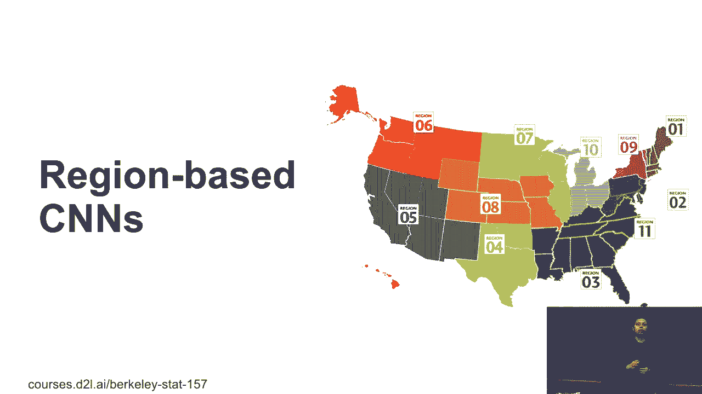

 The first they call it R， CN。 It's a region， CN。 The idea is pretty simple。 So， given image。

 given the dog and cat， we paid that image here。 What we do here。

 we first generate a bunch of anchor boxes。 The original one， RCL， used a heuristic algorithm。

 It's pretty complex。 It's based on the original non-deplearning， algorithm's families。 So。

 a lot of heuristics， how to look at the images， look at a lot of small things。 So。

 a lot of details there。 But you can see that you can just think of it like it's a black， box。

 Give image， it can output a lot of anchor box candidate。 Then， for each anchor box。

 what they do here， we just crop the image and make it a training example。 So， then for this image。

 what we do， we just generate two few images， two new images。 The first one can have the dog hat。

 the second one can nest the cat。 And then， for each region or each anchor box。

 we just first use a pre-trained network。 At that date， I think it's pre-trained。

 the VGG or anything else， pre-trained， or image that， to get the features for each anchor box。

 Once we get the feature， then we train SVN to classify the objects， in the image。 Then。

 we train a linear regression to predict the bond box offset。 So， that's all。 So， what we do here。

 give an image， select some anchor boxes， and use it in the CRN to get the features for each anchor box。

 So， for maybe each anchor box to get one thousand dimension， features。

 so that's the -- we didn't train yet。 We just did a pre-processing。 Then。

 we train SVN to get objects， trying a linear regression， to get a bond box。

 The training is on the last stage。 Question。 >> Which faster is it to use an SPC classifier。

 that is to use a multilec sub-product in stage three？ >> Well。

 it's -- I don't remember the color is VN all linear， but the key thing is on the feature structure。

 So， if -- think about each image， if I can select one， thousand images for you。

 you're going to run a thousand image， feature structures。 Which means。

 like if I have -- if my data set have one thousand -- not， one thousand。

 one hundred thousand images， and each image we generate， maybe just the one hundred anchor boxes。

 that we end up with ten， million images。 We need to run the fourth path of these ten million images。

 That's pretty expensive。 Which means you need to pass an image net by ten times。

 That's -- that's -- that's -- that's -- that's -- that's。

 the algorithm maybe six or at least six years ago， which means。

 you have a small GPU to take forever for you to do that thing。 So， what do people do here？

 I -- I give them -- give them data set。 I do -- I -- I get the features and save into disk。

 and I can use， those features later。 So， it's -- even saving disk is much easier -- much faster。

 than trying to generate regenerative -- regenerative on the， fly。 Okay？ Other questions？ Okay。 So。

 this original family， put this low。 And then we have a -- something called fast-ass EN。

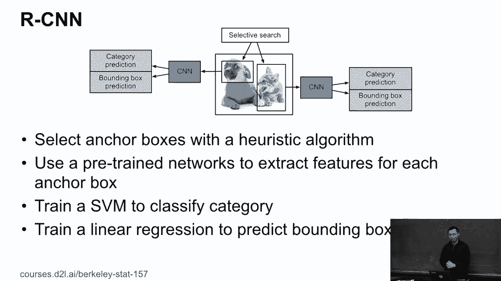

 Before we talk about a faster version， let's -- here's one， concept here called I/O/I pulling。

 region of interest pulling。 The idea here -- so， given a feature map and a given， bond box。

 given anchor box。 So， this is the -- that box we have is color of the anchor box。 So。

 if we're going to run a two-by-two I/O/I pulling， which， means for each anchor box。

 we're going to cut into two-by-two， regions， even in Kotlin。 But this is three。

 cannot divide by two。 So， the first region -- the first region we have two-by-two。

 and then the second one is just one。 Okay？ Then for each region， we show in different colors here。

 I， cannot make the max value of it。 So， at that -- so， then for each anchor box， we cannot get。

 the two-by-two output。 So， in general， if I have N by M， I/O/I pulling for each， anchor box。

 we cannot get N by M elements from this anchor box。 So， what a good thing about that。

 The good thing here， no matter the anchor box shape， I can always。

 get a fixed length of the feature presentation of the anchor box。 So。

 I can have different -- different size of anchor box， fit into the -- I/O/I pulling。

 and then for each one， I get， a light -- fix the shape of the features of each box。 Okay？ So。

 that's the key thing。 Think about how we did that before。

 Here， each anchor box had different shape， but I fit into， CNN， resize to the same shape。

 fit into CNN， get the same size of， thing。

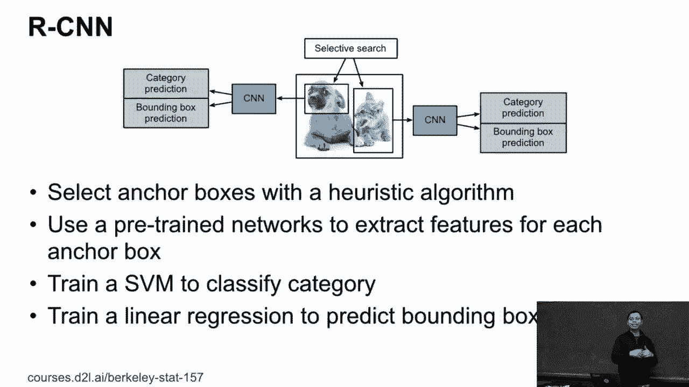

 I can do the other classifications。 So， here， I can realize the ROI pulling to get the same size of。

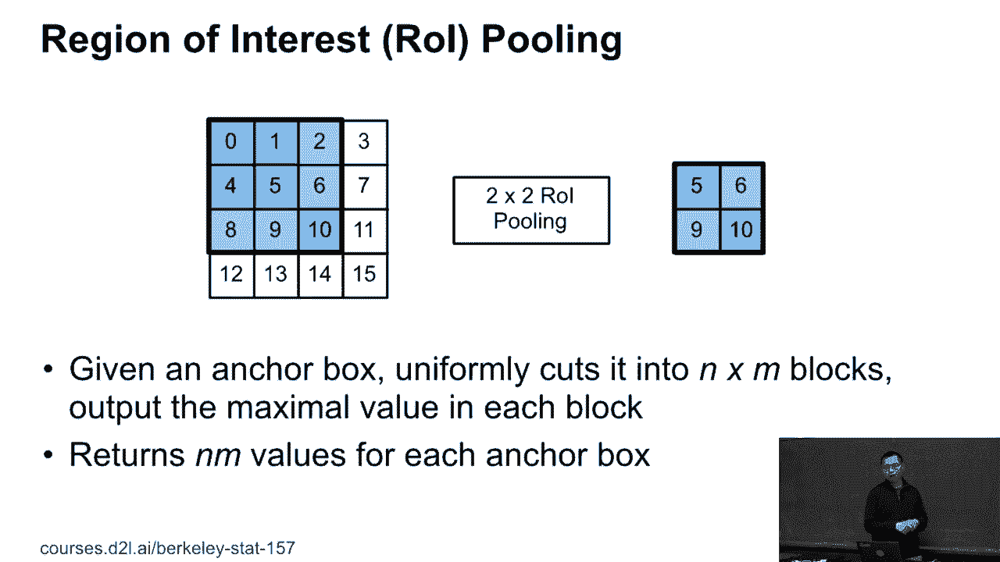

 each anchor box。 Okay？ So， here's the first RCN。 Well。

 it only changes the thing I just highlighted in the， yellow box here。 First。

 I just put it into CNN to get the features。 I don't put every anchor box into separate to CNN。

 I just put the original image into CNN here。 Then， still。

 like I select anchor boxes from the original image， I propose multiple ones。 Then。

 I apply the anchor boxes to the output of the CNN here。 So。

 here you do feature instructions and apply the anchor box。 Here。

 you need to resize a little bit because anchor boxes on the， original image is easier and larger。

 The output of the CNN may be a little bit smaller， but you can still。

 resize the anchor boxes accordingly and to fit into ROI pulling to get output。 So。

 at the end of the ROI pulling， you get， for each anchor box， you get the fixed length of features。

 Then， we can fit into dense layer and do like a prediction and。

 the bound of box here as similar as before。 But first。

 RCN changed for SVN to change SVN to softmax linear， regression。 So。

 that is easier to join together。 But the major thing， why we reduced the complexity because we only。

 run the CNN once。 We didn't run by a number of anchor boxes and ties。 So。

 this maybe give you 10 times faster here。 Okay， any questions here？ Okay， so， well。

 that's kind of one year after RCN is faster。 It's faster， but still not faster enough， actually。

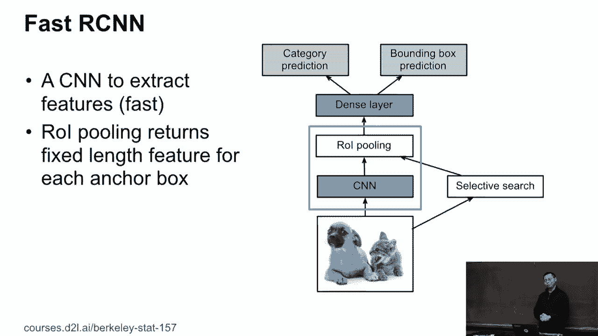

 Then， we have something called a faster RCN。 Well。

 the reason is because the selective search select some。

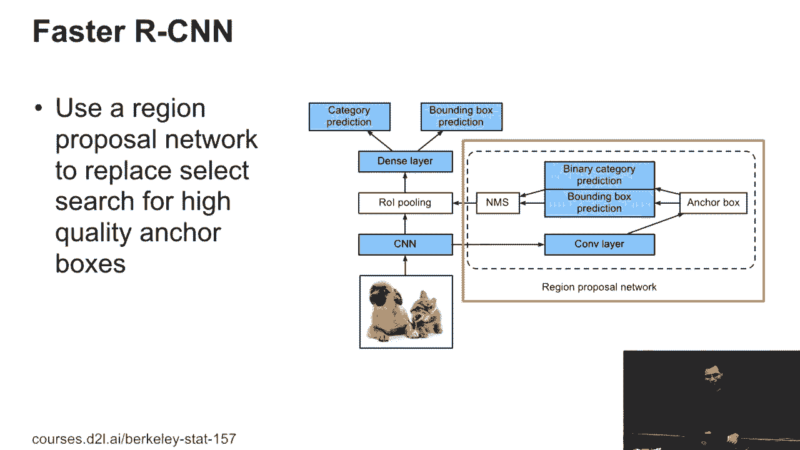

 anchor boxes not good enough。 Like， if you get a good coverage， you need to select a lot of anchor。

 boxes。 Then， also， the algorithm itself is pretty slow。 I want to improve the anchor box quality。

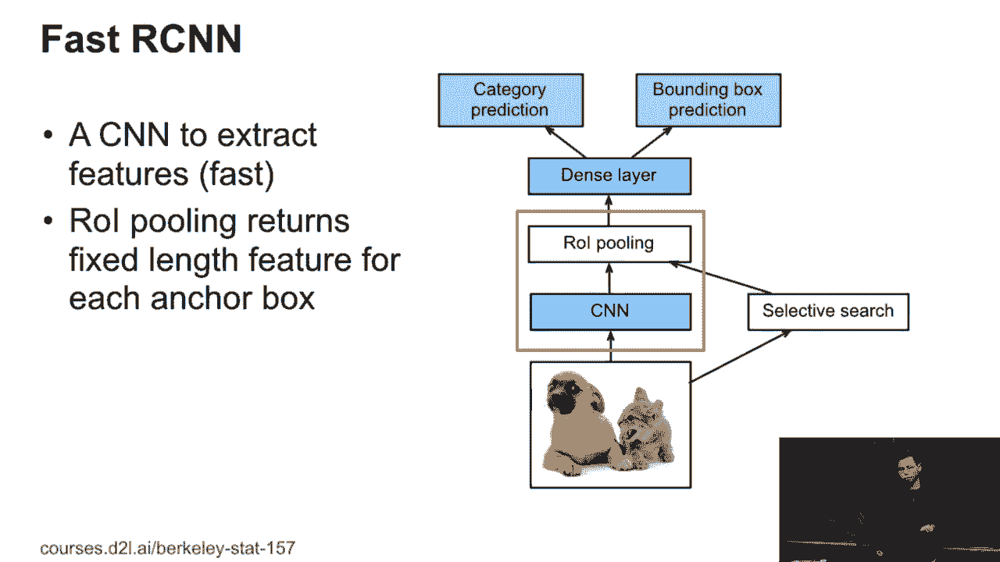

 So， here， I'm going to try a small network called the regional， proposal network， RPN。

 to select the anchor boxes。 So， what we do here is actually small -- you run a small。

 detection algorithm here， but you don't -- you less care about， accuracy。 So， what do you do here？

 I just get the feature instructions fitting the， conclusion neural network and propose some cheaper -- a lot of。

 random anchor boxes。 And then， do you have a small classifier to classify if it。

 contains an object or not？ If it doesn't， I just throw it away。 If yes， I just predict the offset。

 And so， then， I'm using the anchor box with objects plus the。

 offset and the RMS to remove the duplications and fit into the， training。 Okay， so basically。

 we run a small detection algorithm here to， generate high -- not of bound box predictions and use them as。

 high quality anchor boxes here。 And why we can make it faster？ Because we can run a small。

 very small convolutional neural， here to on a small scale， the input。 So， we can make it faster。

 And at the end -- so， the backbone here， we can get less， anchor boxes and also the quality is high。

 which means we， also improve the accuracy a lot。 Okay？ Questions？ Question？

 >> Can you mention the performance of the region for the， work of the -- >> Well。

 it's also have the label as well。 It's joined together。 It's joined。 So， this one。

 where you propose anchor boxes， so you also， have the label in you do training。 You join -- join。

 join， telly。 Okay？ The rest of the work of the RCM family is called the master。

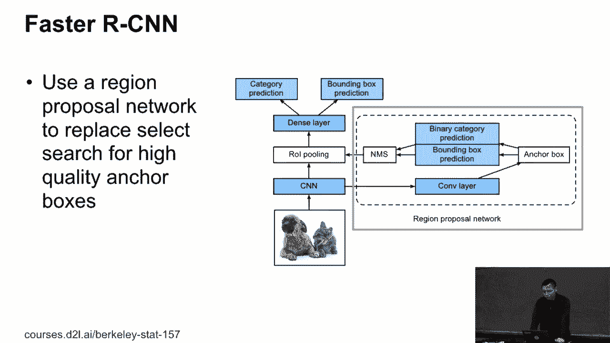

 RCM。 Well， nothing has been changed except that if you talk about， the code dataset。

 we not just have a bound boxes。 We do have pixel level in labeling information。 So， here。

 you can see that I can label each pixel if it's a， background or map to a real object。 So。

 the bundling is much clearer。 So， we have much more information here。 Well。

 then what do you do here？ That if I do have the mask， it's called the mask， like， it's a。

 mask placed on image， if we have this pixel level in， label information。

 I can add a separate loss into my network to， help to predict the bound box。 So。

 the yellow one is called fully convolutional neural network。

 is actually used in the by-circamentations。 And you can just add in here as a separate loss。 So。

 if you have additional features information， I use another， loss to help to this detection。 So。

 master CACN is actually going to help to improve the， bound box accuracy。 So， that's all。

 They actually get the best paper for CEPR。 All these RCM family get a lot of best papers from CEPR。

 necessary。 Any questions？ Question？ >> I want to take a train test for RCM。 >> Well。

 faster RCM is pretty slow， and I'll take a few days on， cocoa。

 You should take maybe a week on cocoa。

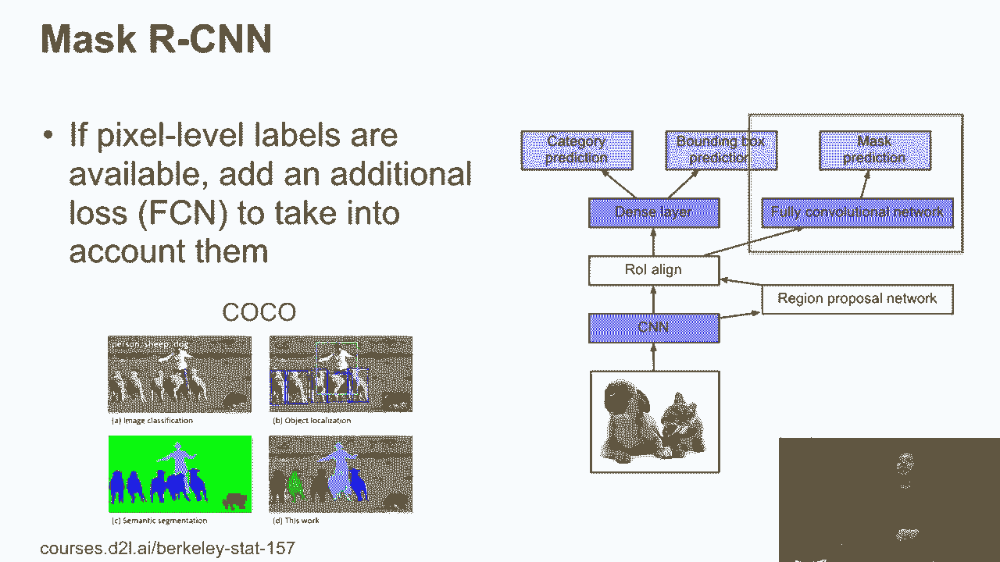

 So， at the end， so what I'll show the model to here， the x， axis is the number of images per second。

 It's a frame first。 So， it's a log scale。 It's like it's pretty -- how to see by this small scale here。

 The y is M-A-P。 You can think about the accuracy。 You can see we do have three models here。

 We're going to talk about three models。 So， we talk about the first RCM here。 The blue noise。

 The yellow one is called the SSD。 The green one is called the yellow V3。 You can see that first RCM。

 even faster， is still like the， slowest one in the network。 The network cannot talk about。

 And it's log scale， which means comparing to the second the， slowest one。

 comparing the slowest yellow or SSD， faster， ACM is kind of 8 to 10 times slower。

 But it's usually have high accuracy。 Okay？ But it's maybe not so true for if we actually improve the。

 battery。 So， it's the slowest one but have the highest accuracy。 So。

 this is kind of several driving car companies use a lot， of fast RCMs。 So。

 because having some pace and actual money to buy the。

 GP box to choose an expensive algorithm is much better than， a heater， actually a human。 So。

 that's the cause I wear to pay。 But in practice， fast RCM， well， it's too small。

 If you really care about the accuracy， you can choose fast， RCM， even more scale。

 if you have additional labels。 But in practice， if you less care about that， you care about。

 the cost， you should pick up maybe yellow V3 at this stage。 And also like SSD also。

 SSD may be not choice anymore。 But that yellow V3 is a good choice。 You can balance those things。

 But the thing changed a lot。 This is detection algorithm is pretty hard topic。

 Every year we have new accuracy coming out， maybe， comparing to the， for example， comparing to。

 you can check。

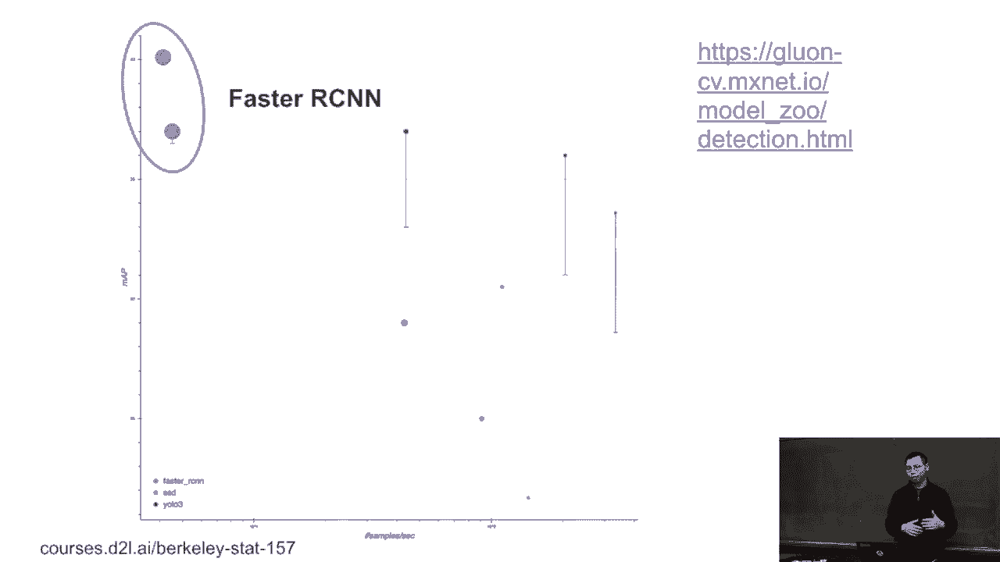

 good on CV。

 Complying to classifications， there are so many models in the。

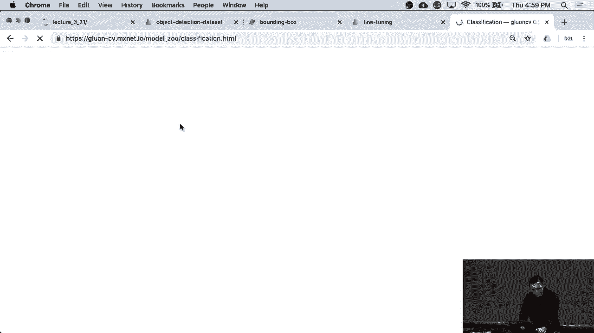

 classifications， and now this is the classifications of， hundreds of models。

 like 10 different new networks we talk， about at least eight。 But detection only have much smaller。

 So only have three families here。 But research is pretty popular this day。

 The reason we have less models because much harder to， train is invent a new one is much harder。

 Imagine I take a few hours to train。 I take a few days to train。

 That's why research community has less models here， but still。

 I can change a lot of these days。