# 【AI 】伯克利深度学习Deep Learning UC Berkeley STAT-李沐 & Alex - P95：95. L18_3 Markov Assumption & Autoregressive Models - Python小能 - BV1CB4y1U7P6

 Let's start with something simple namely the Markov assumption。

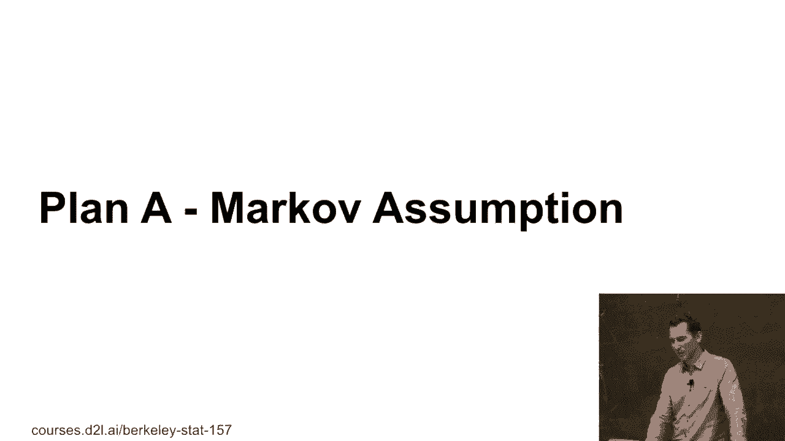

 So remember in the Markov assumption， the idea was that we have that x hat of t is some。

 function of x t minus tau after x t minus 1。 You could then just go and train a regression model。

 use it to predict the next step in， the， Okay， so let's see how that works in practice。 Okay。

 so let's see。 I'm going to generate some data。

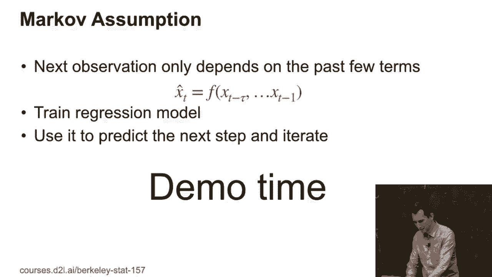

 Let me just quickly run this。 So i'm doing my usually import， Virtual， right？

 This is just to make sure every single thing is， Nicely。

 I'm going to pick a four-dimensional embedding， so tau equals four， so i'm going。

 To look at the previous observations， going to generate a thousand points in total， you， Know。

 nicely evenly spaced。 And the data is going to be utterly boring， namely， it's just。

 Going to be a sine curve plus some noise added。 Okay， so it's pretty boring。

 Let's actually see what this looks like because that's a lot easier to grok rather。

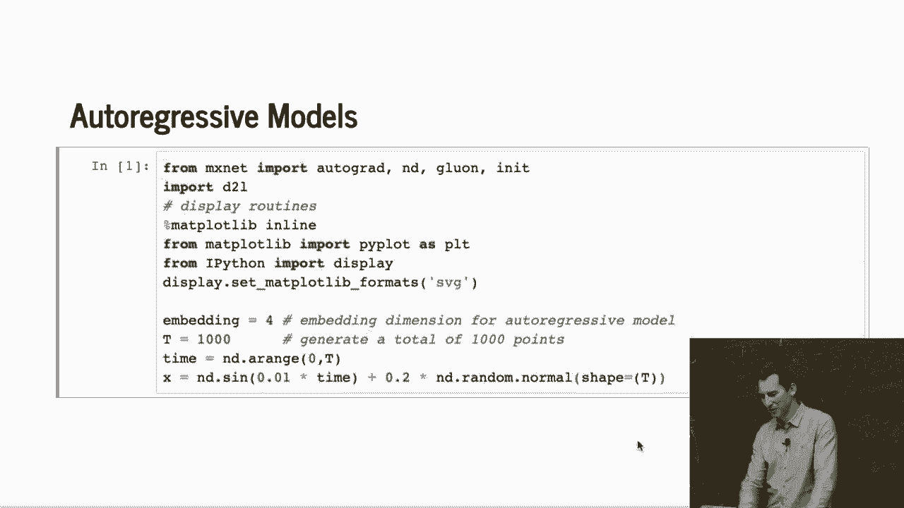

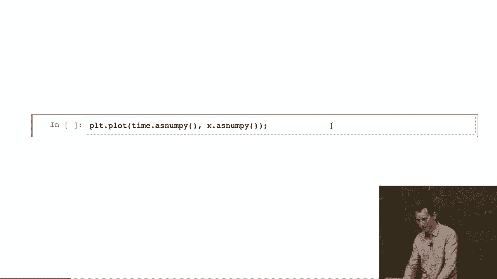

 Than just looking at code。 Well， it's a sine curve。 It's a very noisy sign。 Okay， nothing special。

 You could easily assume that you can， you know， regress on， That。

 It's not that easy because there's a lot of noise added to it。 Right。

 so if you only have four adjacent points， you may not be able to predict， Quite that well。 But。

 okay， anyway， let's see。

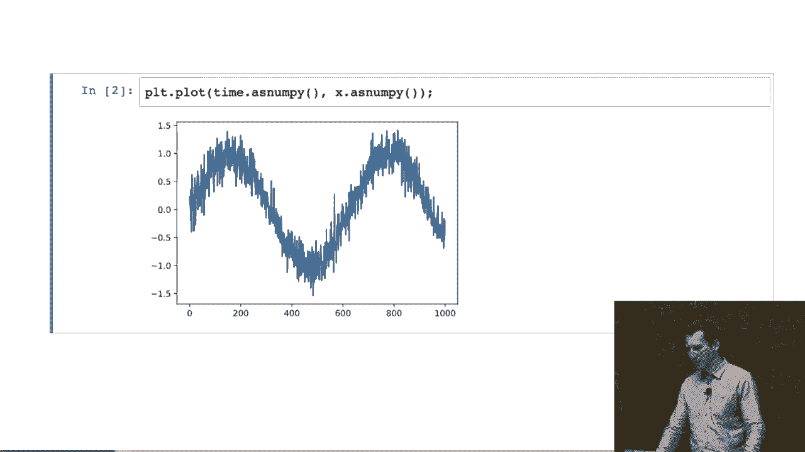

 So the first thing i need to do is i need to actually generate the data set and， well。

 Define a model。 So i'm going to first generate a data set。 So i'm going to use， well。

 if i have embedding of four and have， you know， One thousand observations， then， you know。

 since i have now， Vectures of， you know， the length of five。

 so i basically need to make a small object， Right。

 t minus embedding and then also embedding dimension。 Right， because i have four dimensions times。

 you know， that length。 And then， what i do is i just now assign the values into this feature vector。

 The only slightly more convenient thing that i'm doing is i'm not assigning it， You know， one time。

 set it at a time。 But if you think about it， right， so here's， My vector。 You know。

 this is embedding dimension one， two， three， four。 I'm going to take this vector here。

 And i'm going to shift it by one。 I'm going to shift it by two。 One more。 Right， oops。 Okay。

 I'm going to shift it by， you know， one， two， three， four。 And in doing so， of course。

 any slice that i pick out here has exactly the data， You know。

 in the times you're shifted by one step each relative to each other in that， Vector。

 That's just a lot faster because now my， Four loop goes over four entries as opposed to over one thousand。

 Not that it matters because the data set is tiny， but still。 And labels are just， you know。

 that embedding。 Now， the training data set is the first 600 observations。

 And so now i have a training data set and a test data set， so i perform exactly。

 The operations that you would。 I just， you know， call the glue on data set constructor。

 And call it an array data set。 And i picked， you know， the first and。

 Train observations for training。 And i'm going to pick the rest for testing。 Okay。 And then， okay。

 i'm going to define， A very boring， deep network。 I'm going to start with， you know， whatever input。

 Dimension they have。 A map into ten hidden dimensions。 Another layer of ten hiddens with a relu。

 Then output one， because we're going to do regression。 And i pick， saviour initialization。

 So this is about as boring as you could imagine。 The last thing i need to do is i need to define a loss。

 So i'll just pick the L2 loss。 This is essentially state of the art。 You know。

 the first lecture when we introduced multi-layer perceptrons。

 None of this should be even in the remotest surprising to you。 Any questions so far？ Okay。

 Everybody cool with it？

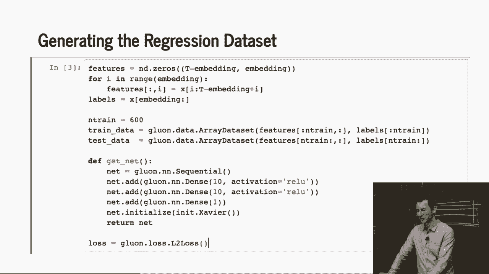

 Good。 So， okay， here's the trainer。 Again， very straightforward。 Mini batch size of 16。 Why 16？

 Because it's a nice number。 It's 2 to the 4。 Could have picked 32 if i wanted to。 All right。 I take。

 you know， a trainer。 Just i pick Adam here。 Why？ Because Adam kind of rocks。

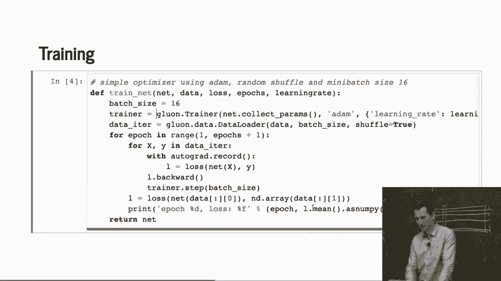

 Could have probably picked five other solvers and it wouldn't have mattered。

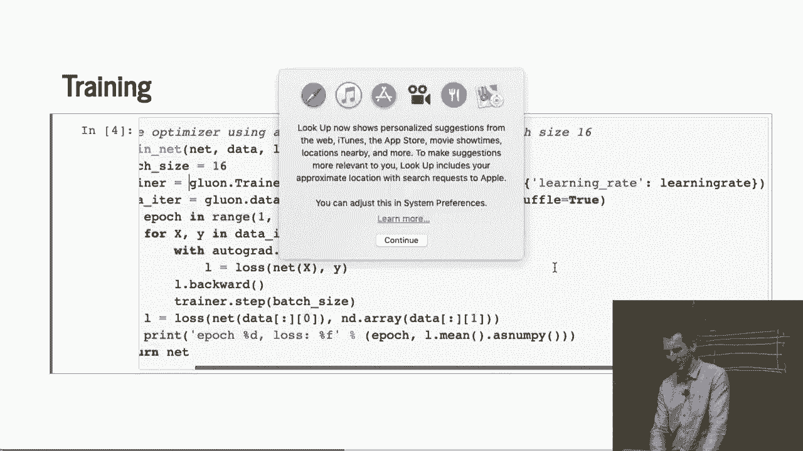

 But i need to pick a solver。 I pick my iterator on， you know， the training data。

 And then i just perform， you know， training where i go with the data。 Epox many times。

 And i just pick， you know， the xy pairs from the data， iterator。 Compute， you know。

 turn on autograd。 Compute the loss。 Compute the gradient of that。 And i perform the update。

 And in the end， while i go and compute the loss， all right， after the end of， every epoch。

 and i print that loss。 All right。 L。Dop mean。 That gives me the average loss。

 And as numpizers i can print it。 In the end， when i'm done i return the network。 Okay。

 Is there anything that you want me to， cover again about this？ Okay。 Don't be shy。 Okay， good。 Well。

 then let's train it， right？

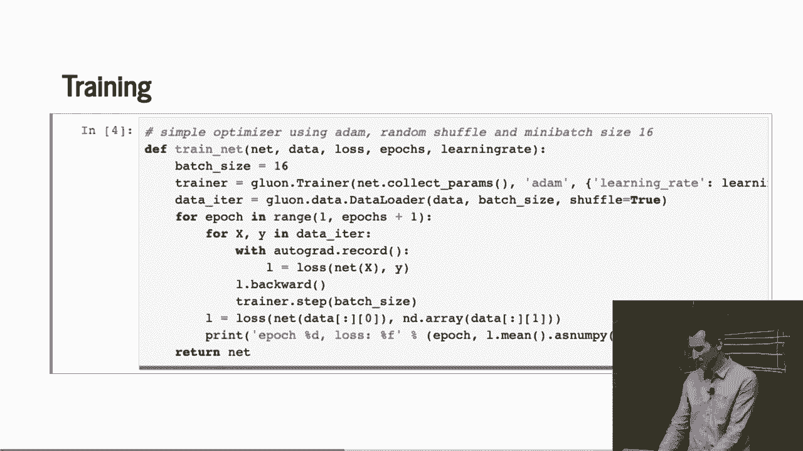

 We can do that。 That was quick。 And it works fairly well and we get， like， you know， 2。8% error。

 Right？ Okay。 Well， it's a regression problem。 So that's a regression loss。 And yeah， that's it。

 And basically i could have stopped after four iterations of whatever it doesn't， Matter。 Okay。

 So now comes the moment of truth。 Let's actually see how this behaves。

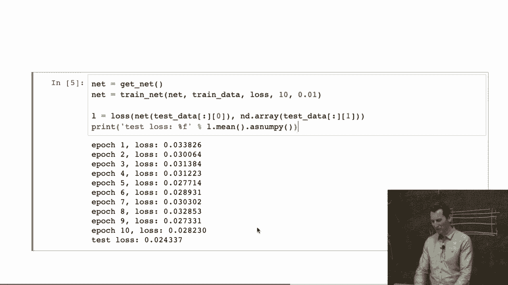

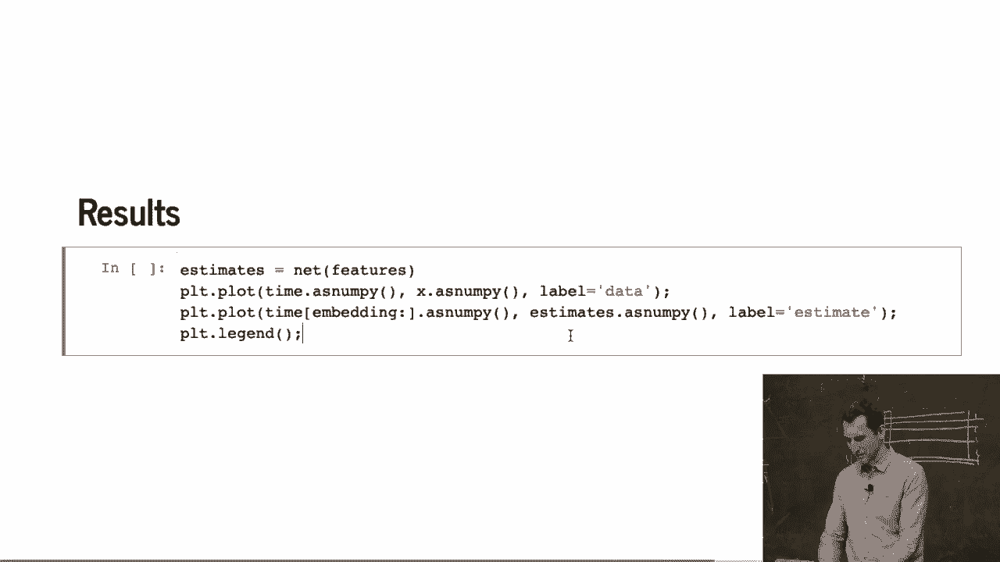

 Okay。 So the blue curve is， you know， The data。 And the orange curve is the estimate。

 I think that works pretty well， right？ Right。 So that looks like we just solved the， Problem， right？

 You know， perfect error， right？ And it nicely reconstructs things。 And so now we can all go home。

 Okay。 Can somebody see something that， Wasn't so bright about what i just did？

 There is something really wrong with this curve。 Or with this approach rather。

 Any ideas of what's really stupid here？ Okay。 So the question is what happens at test time？

 So do we have the correct data？ You're on absolutely the right track。 So the question was， you know。

 at test time do we have， you know， The past tall observations， right？ And the answer is no。

 obviously we don't， right？ So you're spot on。 This is exactly the issue。

 We right now pretended that at test time we still have those。

 Past observations and then we just want to predict for the next day。 So if that were the task。

 we would do exceedingly well。 So what are we supposed to do then？ Any suggestions？

 What could you do？ You could basically take one observation， you know， Predict， you know。

 for the first unknown day。 Then use that prediction of what i have so far plus the first。

 Unknown day to predict the second unknown day and then the， Third and keep on going， right？

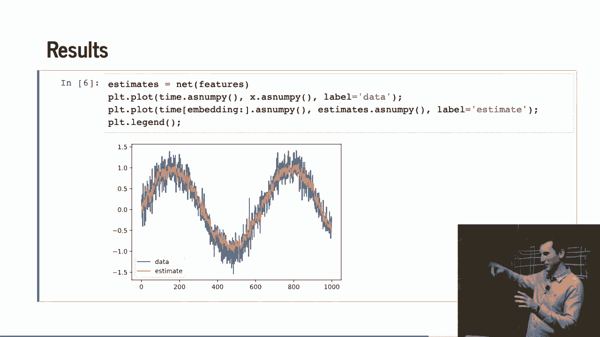

 Okay。 Let's see how that goes。 This is exactly what I'm doing here。 So predictions， right？

 So for the first， you know， A few steps， we have the same thing。

 And then you go and essentially prediction at step i。

 You could take the network off the predictions that I have used so far。 And fill that in。 Okay。

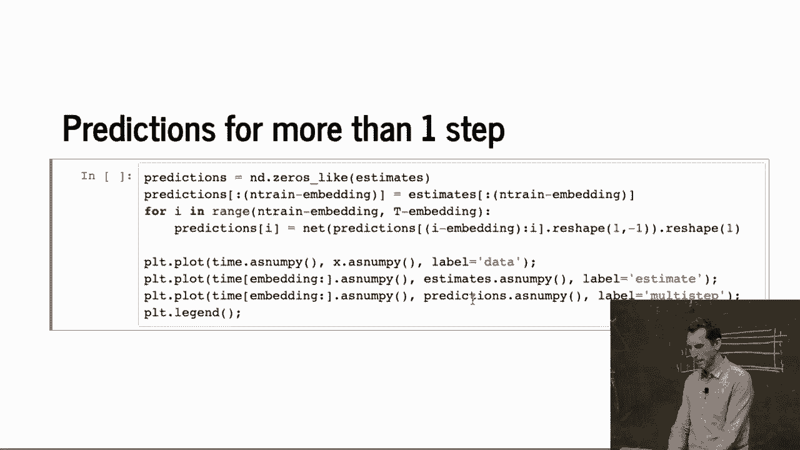

 Let's see how that goes。 Right？ That's basically all this code does。

 And it goes spectacularly wrong。 So the green curve are the predictions and basically what i've。

 Done is after， you know， step 600 where we no longer have any， Data which is around here。

 And just kept on letting you predict forward。 And you can see basically just very quickly converges to the。

 Constant function and stops doing anything meaningful。 However， this model is exceedingly dumb。

 right？ So in other words， if i want to predict forward by more than one step。

 Is that autoregressive model， often things go badly wrong。 Okay。 So you might wonder， well， okay。

 That's kind of obvious。 Everybody knows that。 Well， actually。

 if you talk to customers and you talk to them， About time series forecasting。

 sometimes you need to point that， Out。 Right？ It's very， very easy to get trapped by this yourself。

 So make sure that if you're dealing with time series dot and。

 You want to forecast over a entire sequence， did they actually go， And do that？ Okay。

 It's a mistake that's very， very easy to make。

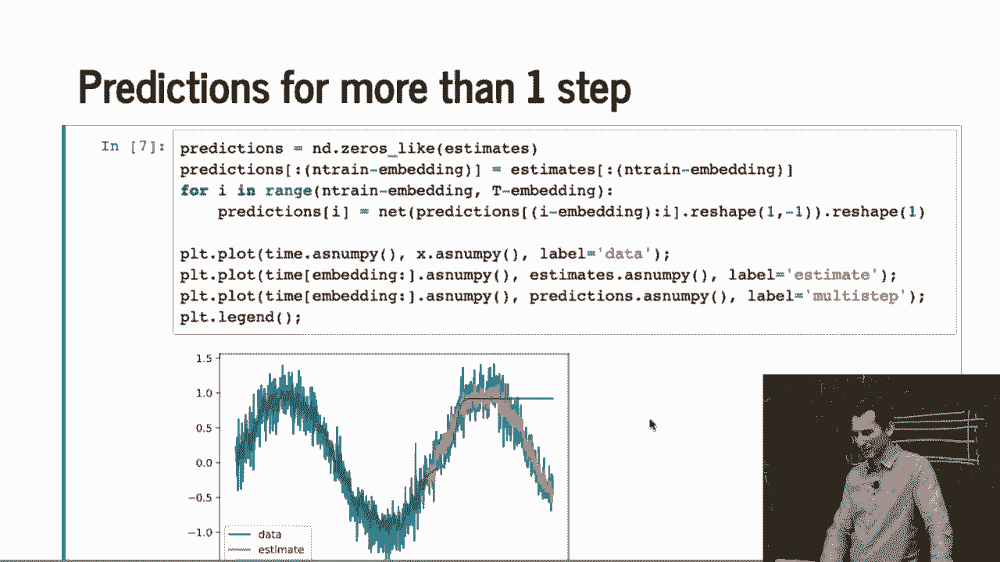

 Okay。 So let's see how well this actually works。 So what i did here is i basically ran the same thing as。

 Before just that i looked at， you know， four， eight， 16 and 32 steps。

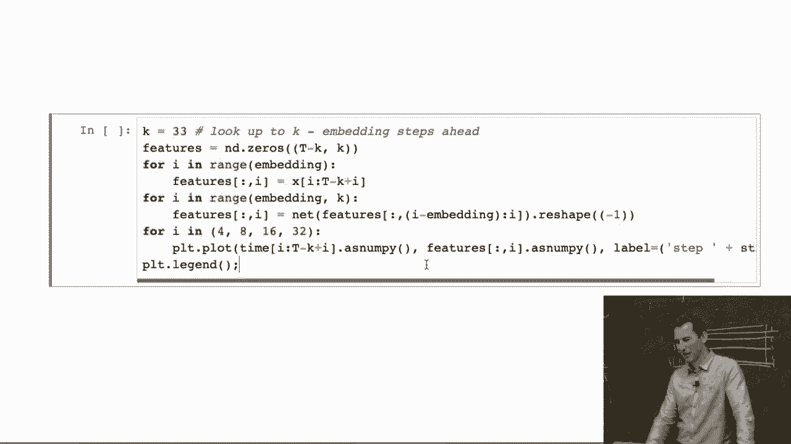

 And this graph here shows what happens if i have， you know， the， Four step， eight step。

 16 and 32 step， you know， prediction error。 And you can see the model kind of works at four to eight steps and it。

 Fours down at 16 and 32 it's very useless。 Right？ Sorry。 In other words。

 this model is quite useful for very short-term， Forecasts。

 but for long-term forecasts i would not want to put， Any money into it。 Okay。

 So this is the story of autoregressive models。 Any questions so far？ Right。 Okay。 Good。

 Then what's the point？

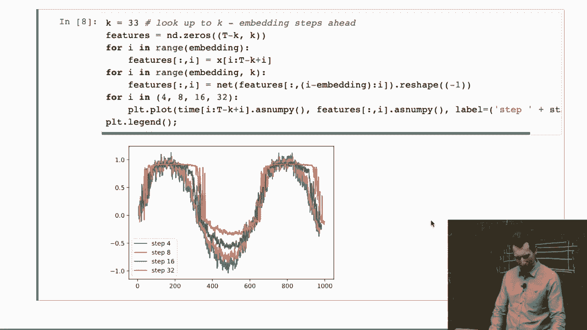