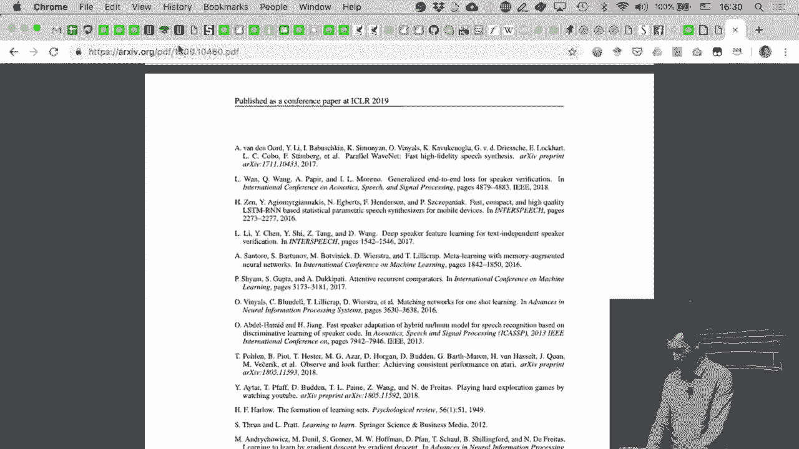
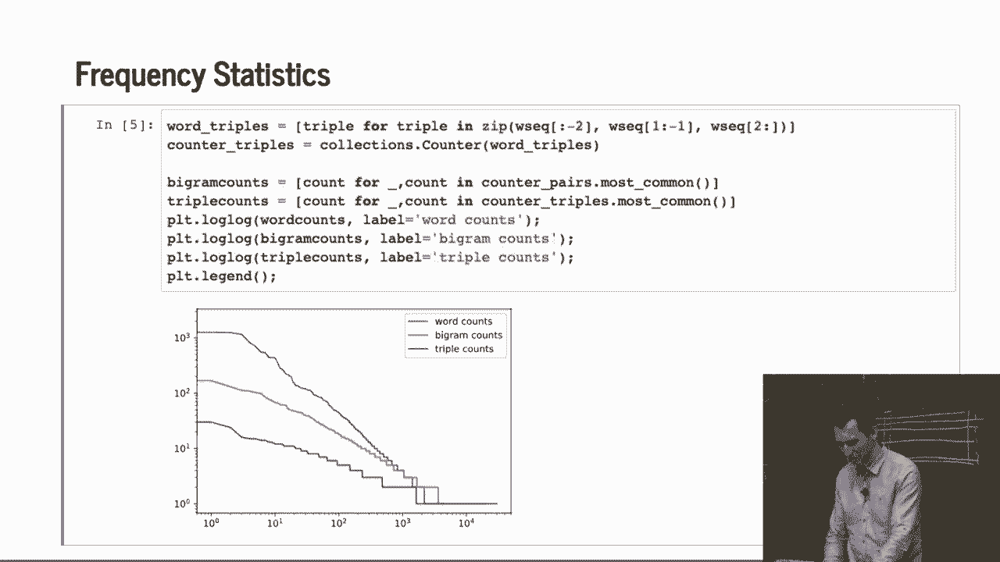

# 【AI 】伯克利深度学习Deep Learning UC Berkeley STAT-李沐 & Alex - P96：96. L18_4 Language Modeling Basics - Python小能 - BV1CB4y1U7P6

 So far we looked mostly at， you know， sequence data with numbers。

 Now we're going to look at sequence data with characters， because this is a very。

 very common application， and it requires a little bit of， you know， special processing。

 So we'll have to look at， you know， how you actually， you know， deal with this data。

 how you load it， how you map it into things。 So that's a bit of work that needs to be done。 And so。

 you know， tokens are not real values， and the domain is countably finite。

 at least under the assumption， that， you know， you have finite universe of words。

 that is not necessarily true。 For instance， the English language constantly keeps on acquiring new words。

 because， well， people make up words， or people import words from other languages， and whatever。

 so there's always new stuff。 Now， if I do that， still I can， you know， try modeling things。 So。

 for instance， if I have， you know， the sequence of tokens， statistics is fun。

 I can model that by p of statistics times p of is， given statistics times p of fun。

 given statistics and is， and p of， you know， colon given statistics is fun。 Right？ And so then。

 if I wanted， you know， get something meaningful there， I could model， you know。

 p hat of is given statistics。 I just count， you know， the number of times I see statistics is。

 and I divide by the number of times I see statistics。 And that gives me kind of a hacky estimate。

 Okay？ So this is very， very sloppy by， you know， statistics standards。 Likewise。

 if I have long engrams， what I could do is， I could basically， so first of all。

 I probably have to smooth anyway。 So we already saw that when we did native base， right？

 So when we did our native base classifier， we added pseudocounts。

 And you need to do that for the word probability。 So you might have some spare probability mass epsilon set aside。

 And you just divide that evenly over all the classes。

 So p hat of w is maybe the number of currencies of that word， plus some epsilon over m， where m is。

 you know， your total vocabulary size， divided by n plus epsilon 1。

 And then I could deal with p of w prime， given w， and I make a fallback smoother to， you know。

 the singletons and， like， for， you know， a triplet， I make a fallback to the pairs。

 And this is hacky。 There are a couple of things that aren't quite right in what I wrote。

 but the spirit persists。 So if you want to know how to do this really in the right way。

 you should take a class of Tom Griffiths or maybe Mike Jordan's。

 If they teach a basic non-parametrics class， or if Jim Miffitman teaches a class。

 then there would also be a really awesome course to take。

 So we're not going to go into this in detail， but this is the spirit of how。

 in classical statistics， you would go and model engrams。

 So you basically take the count and then you have some back off smoother。

 You can see that this doesn't go very well as soon as I have a large vocabulary， and as long as I。

 as soon as I have longer sequences。 Because most of those counts are just going to be empty。

 So to make a long story short， let's actually look at how this works in practice。

 So to make things a little bit more concrete， we're going to use a small data set。

 We're going to use the time machine。 The first thing we do is we load it。

 So I'm going to open a file， I read some lines from that file。 So it's the time machine。

 I downloaded from Project Gutenberg。 And then the raw data set。

 all I'm doing is I'm just splitting it up into individual tokens。 And I'm turning everything into。

 well， basically just as， just， you know， letters。 And I'm throwing away all the punctuation and everything else。

 So if I look at， you know， the first few lines， then I can， you know， the first line。

 So the time to have a look for it will be convenient to speak of him。

 was expounding a record-type matter to us， his gray eyes shown and so on。 Okay。

 So that's how the time travel starts。 This is like Python 101， basically first semester， right？

 Or maybe if you learned Python before， you will keep bored。

 So now what I'm going to do is I'm going to count the words。

 So I'm going to use a simple collection， namely the counter。

 And I'm going to go through every token in the data set。

 So token for string in raw data set for token in string， right？ So that's the double-full loop。

 And in Python you can write this quite so beautifully in here。 This is just being cute in Python。

 And it just then， you know， counts all those things。 This is why people like Python， right？

 Because a lot of complex code has already been written by somebody else。

 and you just need to call it。 And then I'm going to just look up counter of traveler。

 And that gives me the counts。 And counter even has like is one of its functions most common。

 And so the 10 most， first of all， the time traveler， the word traveler， occurs 61 times。

 And if I look at the 10 most common words， there are absolutely no surprises there。 Well。

 the word the an i and an of a two was in that and my。 All those occur very frequently。

 And that is totally to be expected because that's common with the English language。

 that these are some of the most common words。 Does somebody have an idea how those words are often called？

 They're a very specific name。 They're called stop words。 Yes， very good。 So， yeah。

 and what people used to do in NLP is they would throw out all those。

 stop words because they are so frequent。 That's not the case anymore。

 By now people keep them in because they actually didn't have tools like， you know。

 transformers or LSTMs or other things to deal with them directly。 So。

 don't drop the stop words anymore but be aware of the fact that they exist。 Okay。

 so then let's see how the frequency plot goes。 So。

 what I'm going to do is I'm going to plot the order of the word， versus its occurrence count。

 Does somebody have an idea what this curve will look like？ Hint， I'm plotting this log log。

 That should be a huge hint as to what to expect。 Any idea？ Okay， who's heard of SIP's law before？

 Power laws。 Yeah， so this is what we get。 It's actually very beautiful if you think about it。

 This is pretty much a straight line。 I mean， except for the most frequent words here。 So。

 the log number of occurrences versus the log position is a straight line。

 Even out here for the least frequent words and where we have just single， occurrences on， this is。

 you know， textbook quality。 All right， so this is SIP's law。

 And what it says is that the count in of X is proportional to X plus C to the， minus alpha。 So。

 basically， I have some offset and I have a minus alpha。 And of course， if I take logs on both sides。

 I get that log in is log X plus C times， alpha plus some constant。 Okay。

 almost always when you have large discrete sets， will you have power， laws of some sort？

 Do pretty much assume that you have that by default。 Also， take advantage of that。 If you don't。

 your code will be slow， your model will be wrong and stuff like this。 Really take advantage of it。

 If nobody's done that yet in your domain， you can write a paper and it'll be a， paper。 So。

 for instance， in systems， right， I mean， if you build a recommended system， it turns。

 out that there's a small number of movies that's really popular and most。

 movies are very unpopular and some people rate a lot of movies and most people don't， rate many。

 If you use that， you can build an implementation that's way faster than something。

 that doesn't exploit this and you can write the paper about it。

 It's whack-ret and faster and everything， right？ In any case。

 let's see whether that works also on pairs。 So， again， this is， you know， quite Pythonic。

 so I'm basically generating a sequence of， words， so word sequence。

 And then I'm turning this into pairs by just zipping together W sequence of， well， minus one to one。

 right？ I'm basically taking two arrays。 You know， it's exactly this trick again and now zip will。

 you know， take one of the， first one of the second and， you know， generate those pairs。 In any case。

 if we do this， so beginning of the book， well， the time and time machine。

 and then machine by and by H and Hg and so on， that's what happens。 And the most common words are。

 well， not very surprisingly， mostly combinations of， the stop words。 It's one exception。

 namely the time because probably the time machine， right？ That occurs 102 times。 So。

 a couple of things based on that。 As you can see， it's ridiculously easy with a few lines of code to get fairly。

 meaningful text statistics。 So， if I can do it， you guys can definitely do that。 And， you know。

 it's quick and it's probably a good thing to eyeball the data before you， do anything else。 And。

 yeah， it shouldn't be locking my screen。 Okay， good。 Now。

 what we can do is we can also look at triples and we can now look at， you know， unigrams。

 biograms and trigrams。 And let's plot them。 So， what happens is， you know， very beautifully。

 Zips law holds for unigrams， biograms and trigrams。

 You probably want to take advantage of that in your model somehow。 Okay， any questions so far？

 This is like really basic， you know， text processing and analysis trying to get you， some idea of。

 you know， how those algorithms work in practice。 Okay。 Well， ten， let's。

